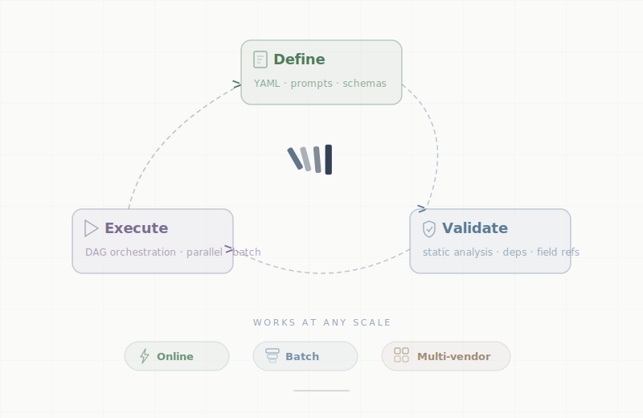

<p align="center">
  <a href="https://docs.runagac.com">
    <picture>
      <source media="(prefers-color-scheme: dark)" srcset=".github/images/logo-text-dark.svg">
      <source media="(prefers-color-scheme: light)" srcset=".github/images/logo-text-light.svg">
      
    </picture>
  </a>
</p>

<p align="center">
  <a href="LICENSE"></a>
  <a href="https://pypi.org/project/agent-actions/"></a>
  <a href="https://pypistats.org/packages/agent-actions"></a>
  <a href="https://www.python.org/downloads/"></a>
</p>

Declarative LLM orchestration. Define workflows in YAML — each action gets its own model, context window, schema, and pre-check gate. The framework handles DAG resolution, parallel execution, batch processing, and output validation.

> [!WARNING]
> **Experimental** — Under active development. Expect breaking changes. [Open an issue](https://github.com/Muizzkolapo/agent-actions/issues) with feedback.

<p align="center">
  <picture>
    <source media="(prefers-color-scheme: dark)" srcset=".github/images/lifecycle-dark.svg">
    <source media="(prefers-color-scheme: light)" srcset=".github/images/lifecycle-light.svg">
    
  </picture>
</p>

```yaml
actions:
  - name: extract_features
    intent: "Extract key product features from listing"
    model_vendor: anthropic              # Each action picks its own model
    model_name: claude-sonnet-4-20250514

  - name: generate_description
    dependencies: [extract_features]
    model_vendor: openai                 # Mix vendors in one pipeline
    model_name: gpt-4o-mini
    context_scope:
      observe:
        - extract_features.features      # See only what it needs
      drop:
        - source.raw_html                # Don't waste tokens on noise
```

## Install

```bash
pip install agent-actions
```

## Quick start

```bash
agac init my-project && cd my-project                # scaffold a project
agac init --example contract_reviewer my-project     # or start from an example
agac run -a my_workflow                              # execute
```

## Why not just write Python?

You will, until you have 15 steps, 3 models, batch retry, and a teammate asks what your pipeline does.

| Capability | Agent Actions | Python script | n8n / Make |
|---|---|---|---|
| Per-step model selection | YAML field | Manual wiring | Per-node config |
| Context isolation per step | `observe` / `drop` | You build it | Not available |
| Pre-check guards (skip before LLM call) | `guard:` | If-statements | Post-hoc branching |
| Parallel consensus (3 voters + merge) | 2 lines of YAML | Custom code | Many nodes + JS |
| Schema validation + auto-reprompt | Built in | DIY | Not available |
| Batch processing (1000s of records) | Built in | For-loops | Loop nodes |
| The YAML *is* the documentation | Yes | No | Visual graph |

## Examples

| Example | Pattern | Key Features |
|---|---|---|
| [Review Analyzer](examples/review_analyzer) | Parallel consensus | 3 independent scorers, vote aggregation, guard on quality threshold |
| [Contract Reviewer](examples/contract_reviewer) | Map-reduce | Split clauses, analyze each, aggregate risk summary |
| [Product Listing Enrichment](examples/product_listing_enrichment) | Tool + LLM hybrid | LLM generates copy, tool fetches pricing, LLM optimizes |
| [Book Catalog Enrichment](examples/book_catalog_enrichment) | Multi-step enrichment | BISAC classification, marketing copy, SEO metadata, reading level |
| [Incident Triage](examples/incident_triage) | Parallel consensus | Severity classification, impact assessment, team assignment, response plan |

## Providers

| Provider | Batch | Provider | Batch |
|----------|-------|----------|-------|
| OpenAI | Yes | Groq | Yes |
| Anthropic | Yes | Mistral | Yes |
| Google Gemini | Yes | Cohere | Online only |
| Ollama (local) | Online only | | |

Switch providers per-action by changing `model_vendor`.

## Key capabilities

- **Pre-flight validation** — schemas, dependencies, templates, and credentials checked before any LLM call
- **Batch processing** — route thousands of records through provider batch APIs
- **User-defined functions** — Python tools for pre/post-processing and custom logic
- **Reprompting** — auto-retry when LLM output doesn't match schema
- **Observability** — per-action timing, token counts, and structured event logs
- **Interactive docs** — `agac docs` builds and serves a visual workflow dashboard

## Documentation

- [Full docs](https://docs.runagac.com) — guides, tutorials, reference
- [Configuration](https://docs.runagac.com/docs/reference/configuration/) — YAML schema reference
- [CLI](https://docs.runagac.com/docs/reference/cli/) — all commands and options

## Contributing

```bash
git clone https://github.com/Muizzkolapo/agent-actions.git && cd agent-actions
pip install -e ".[dev]"
pytest
```

See [CONTRIBUTING.md](CONTRIBUTING.md). Report bugs via [Issues](https://github.com/Muizzkolapo/agent-actions/issues).

## License

[Apache License 2.0](LICENSE)
