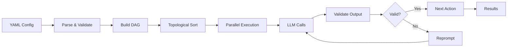

<h1 align="center">agent-actions</h1>

<p align="center">
  <strong>Declarative YAML-based framework for orchestrating LLM workflows</strong>
</p>

<p align="center">
  <a href="https://pypi.org/project/agent-actions/"></a>
  <a href="https://pypi.org/project/agent-actions/"></a>
  <a href="https://www.python.org/downloads/"></a>
  <a href="https://github.com/Muizzkolapo/agent-actions/actions"></a>
  <a href="LICENSE"></a>
</p>

<p align="center">
  <a href="https://muizzkolapo.github.io/docs.agent-actions">Documentation</a> •
  <a href="https://muizzkolapo.github.io/docs.agent-actions/getting-started">Getting Started</a> •
  <a href="https://github.com/Muizzkolapo/agent-actions/issues">Issues</a> •
  <a href="#community">Community</a>
</p>

---

## What is agent-actions?

Define multi-step LLM workflows in YAML. Execute with one command. **agent-actions** handles dependency resolution, parallel execution, batch processing, and multi-vendor LLM support.

```yaml
# workflow.yml
name: product-analysis
version: "1.0"

actions:
  - name: extract_features
    intent: Extract key product features from description
    model_vendor: openai
    model_name: gpt-4o-mini
    schema:
      features: array
      sentiment: string

  - name: generate_summary
    intent: Generate marketing summary from features
    dependencies: [extract_features]
    observe: [extract_features.features]
```

```bash
agac run
```

> ⭐ If you find agent-actions useful, please consider giving it a star! It helps others discover the project.

---

## Observability Dashboard

Generate interactive documentation for your workflows with `agac docs serve`:

<p align="center">
  
</p>

**Features:**
- Visual DAG representation of workflow dependencies
- Browse all actions, prompts, and schemas
- Track workflow run history
- Search across your entire project

---

## Features

- **✅ Pre-flight validation** — Catch errors before wasting LLM calls
- **🔌 Multi-vendor LLM support** — Switch between providers with a single config change
- **📝 Declarative YAML configuration** — Define complex workflows without writing code
- **🔀 DAG-based execution** — Automatic dependency resolution with parallel execution
- **📦 Batch processing** — Process thousands of records with automatic retries
- **🔄 Reprompting & validation** — Built-in output validation with LLM retry
- **🛠️ User-defined functions (UDFs)** — Extend with custom Python functions
- **📚 Documentation generation** — Auto-generate interactive workflow docs

---

## Pre-Flight Validation

**Never waste LLM calls on broken configs.** agent-actions validates everything before execution:

```bash
$ agac validate

Pre-Flight Validation
━━━━━━━━━━━━━━━━━━━━━━━━━━━━━━━━━━━━━━━━━━━━━━━━━━━━━━
✅ Schema validation passed
✅ Dependency graph valid (3 actions, 2 levels)
❌ Template error in 'fact_extractor':
   → 'referenced_in' not in context
   → Available: source, seed
   → Fix: Add to 'observe' or check variable name
✅ Input data valid (500 records)
✅ UDFs available (12/12)
✅ API keys configured

1 error found. Fix before running.
```

| Check | What It Catches |
|-------|-----------------|
| **Schema** | Missing fields, invalid YAML structure |
| **Dependencies** | Circular dependencies, missing action refs |
| **Templates** | Undefined variables, Jinja2 syntax errors |
| **Input Data** | Missing columns, wrong data types |
| **UDFs** | Missing functions, import errors |
| **Credentials** | Missing or invalid API keys |

**Result:** 30-50% fewer failed runs, zero wasted LLM calls on config errors

---

## Supported LLM Providers

| Provider | Models | Batch API |
|----------|--------|-----------|
|  | GPT-4o, GPT-4o-mini, GPT-4-turbo | ✅ |
|  | Claude 3.5 Sonnet, Claude 3 Haiku/Opus | ✅ |
|  | Gemini 1.5 Pro, Gemini 1.5 Flash | ✅ |
|  | Llama 3.1, Mixtral | ✅ |
|  | Mistral Large, Mistral Small | ✅ |
|  | Command R, Command R+ | ❌ Realtime only |
|  | Llama, Mistral, Phi (local) | ❌ Realtime only |

---

## Installation

```bash
pip install agent-actions
```

### Quick Start

```bash
# Initialize a new project
agac init my-project
cd my-project

# Run the workflow
agac run
```

---

## How It Works


```mermaid
flowchart LR
    A[YAML Config] --> B[Parse & Validate]
    B --> C[Build DAG]
    C --> D[Topological Sort]
    D --> E[Parallel Execution]
    E --> F[LLM Calls]
    F --> G[Validate Output]
    G --> H{Valid?}
    H -->|Yes| I[Next Action]
    H -->|No| J[Reprompt]
    J --> F
    I --> K[Results]
```

1. **Define** your workflow in YAML with actions, dependencies, and schemas
2. **Execute** with `agac run` — dependencies are resolved automatically
3. **Scale** with batch processing for thousands of records

---

## CLI Commands

| Command | Description |
|---------|-------------|
| `agac init <name>` | Initialize a new project |
| `agac validate` | Pre-flight validation (catch errors before LLM calls) |
| `agac run` | Execute workflow |
| `agac batch status` | Check batch job status |
| `agac batch retrieve` | Retrieve batch results |
| `agac status` | Show workflow execution status |
| `agac docs serve` | Serve interactive documentation |
| `agac list-udfs` | List available UDFs |
| `agac validate-udfs` | Validate UDF implementations |

---

## Example: E-commerce Product Analysis

```yaml
name: ecommerce-pipeline
version: "1.0"

input:
  source: products.csv
  columns: [product_id, title, description]

actions:
  # Step 1: Extract features from product descriptions
  - name: feature_extraction
    intent: Extract key features, benefits, and target audience
    model_vendor: anthropic
    model_name: claude-3-haiku
    schema:
      features: array
      benefits: array
      target_audience: string

  # Step 2: Generate SEO descriptions (depends on step 1)
  - name: seo_description
    intent: Generate SEO-optimized product description
    dependencies: [feature_extraction]
    observe: [feature_extraction.features, feature_extraction.benefits]
    model_vendor: openai
    model_name: gpt-4o-mini
    schema:
      seo_title: string
      meta_description: string
      keywords: array

  # Step 3: Sentiment analysis (runs in parallel with step 2)
  - name: sentiment_analysis
    intent: Analyze sentiment of original description
    dependencies: [feature_extraction]
    model_vendor: groq
    model_name: llama-3.1-8b-instant
    schema:
      sentiment: string
      confidence: number
```

---

## Documentation

| Resource | Description |
|----------|-------------|
| [Getting Started](https://muizzkolapo.github.io/docs.agent-actions) | Installation and first workflow |
| [Configuration Reference](https://muizzkolapo.github.io/docs.agent-actions/reference/configuration-schema) | Full YAML schema documentation |
| [CLI Reference](https://muizzkolapo.github.io/docs.agent-actions/reference/cli) | All CLI commands and options |
| [Reprompting Guide](https://muizzkolapo.github.io/docs.agent-actions/guides/reprompting) | Output validation and retry |
| [UDF Guide](https://muizzkolapo.github.io/docs.agent-actions/guides/udfs) | Custom Python functions |

---

## Community

- **GitHub Issues** — [Report bugs or request features](https://github.com/Muizzkolapo/agent-actions/issues)
- **Discussions** — [Ask questions and share ideas](https://github.com/Muizzkolapo/agent-actions/discussions)

### Contributing

We welcome contributions! See our [Contributing Guide](CONTRIBUTING.md) for details.

```bash
# Clone the repo
git clone https://github.com/Muizzkolapo/agent-actions.git
cd agent-actions

# Install dev dependencies
pip install -e ".[dev]"

# Run tests
pytest
```

---

## License

This project is licensed under the [Elastic License 2.0](LICENSE).

| You CAN | You CANNOT |
|---------|------------|
| ✅ Use for internal business purposes | ❌ Provide as a hosted/managed service |
| ✅ Modify and create derivative works | ❌ Circumvent license key functionality |
| ✅ Distribute copies | |

See [LICENSE](LICENSE) for the full license text.
