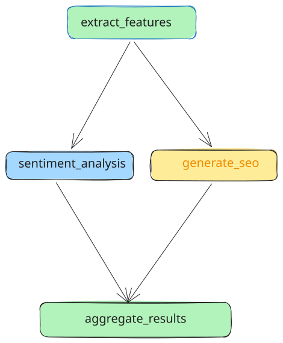

<p align="center">
  <a href="https://muizzkolapo.github.io/docs.agent-actions">
    <picture>
      <source media="(prefers-color-scheme: dark)" srcset=".github/images/logo-text-dark.svg">
      <source media="(prefers-color-scheme: light)" srcset=".github/images/logo-text-light.svg">
      
    </picture>
  </a>
</p>

<p align="center">
  <a href="LICENSE"></a>
  <a href="https://pypi.org/project/agent-actions/"></a>
  <a href="https://pypistats.org/packages/agent-actions"></a>
  <a href="https://www.python.org/downloads/"></a>
  <a href="https://github.com/Muizzkolapo/agent-actions/actions"></a>
</p>

Define LLM workflows in YAML. Run them with one command. Agent Actions handles dependency resolution, parallel execution, batch processing, and multi-vendor LLM support.

```yaml
actions:
  - name: extract_features
    intent: Extract key product features and target audience
    model_vendor: anthropic
    model_name: claude-3-haiku

  - name: generate_seo
    intent: Write an SEO-optimized product description
    dependencies: [extract_features]
    observe: [extract_features.features]
    model_vendor: openai
    model_name: gpt-4o-mini
```

```bash
pip install agent-actions
agac run -a my_workflow
```

## Get started

```bash
agac init my-project && cd my-project    # scaffold a project
agac validate-udfs                       # check tool references
agac run                                 # execute the workflow
```

Read the [Installation Guide](https://muizzkolapo.github.io/docs.agent-actions/installation) or jump to the [Configuration Reference](https://muizzkolapo.github.io/docs.agent-actions/reference/configuration).

## How it works

Write a YAML file describing your actions, their dependencies, and which LLM to use. Agent Actions builds a DAG, resolves execution order, runs independent actions in parallel, and writes structured output.



- **Actions** are individual LLM calls with an intent, model, and output schema.
- **Dependencies** declare data flow — an action can `observe` fields from upstream actions.
- **Execution** is automatic: the framework figures out what can run in parallel.
- **Validation** catches broken configs, missing deps, and bad templates before any LLM call.

## Providers

| Provider | Batch API | Provider | Batch API |
|----------|-----------|----------|-----------|
| OpenAI | Yes | Groq | Yes |
| Anthropic | Yes | Mistral | Yes |
| Google Gemini | Yes | Cohere | Online only |
| Ollama (local) | Online only | | |

Switch providers by changing `model_vendor` — no code changes needed.

## Key capabilities

**Pre-flight validation** — `agac run` automatically validates schemas, dependencies, templates, and credentials before any LLM call. Use `agac validate-udfs` to check tool references independently.

**Batch processing** — Route thousands of records through provider batch APIs for bulk enrichment, classification, and extraction.

**User-defined functions** — Drop Python functions into your project to pre-process inputs, post-process outputs, or add custom tool logic. [Guide](https://muizzkolapo.github.io/docs.agent-actions/guides/custom-tools)

**Reprompting** — Define output schemas and let the framework auto-retry when LLM responses don't match. [Guide](https://muizzkolapo.github.io/docs.agent-actions/reference/validation/reprompting)

**Observability** — Every run produces `run_results.json` with per-action status, timing, and token counts. Structured event logs for debugging and analytics. [Architecture](https://muizzkolapo.github.io/docs.agent-actions/reference/architecture/logging)

**Interactive docs** — `agac docs serve` generates a visual dashboard of your workflow DAG, action details, and schemas. [Guide](https://muizzkolapo.github.io/docs.agent-actions/guides/docs-site)

## Documentation

| | |
|---|---|
| [docs.agent-actions](https://muizzkolapo.github.io/docs.agent-actions) | Guides, tutorials, conceptual overviews |
| [Configuration Reference](https://muizzkolapo.github.io/docs.agent-actions/reference/configuration) | Full YAML schema docs |
| [CLI Reference](https://muizzkolapo.github.io/docs.agent-actions/reference/cli) | All commands and options |
| [API Reference](https://muizzkolapo.github.io/docs.agent-actions/api/logging) | Internal API docs |

## Contributing

```bash
git clone https://github.com/Muizzkolapo/agent-actions.git && cd agent-actions
pip install -e ".[dev]"
pytest
```

See [CONTRIBUTING.md](CONTRIBUTING.md) for details. Report bugs or request features via [GitHub Issues](https://github.com/Muizzkolapo/agent-actions/issues). Questions and ideas welcome in [Discussions](https://github.com/Muizzkolapo/agent-actions/discussions).

## License

[Apache License 2.0](LICENSE)
