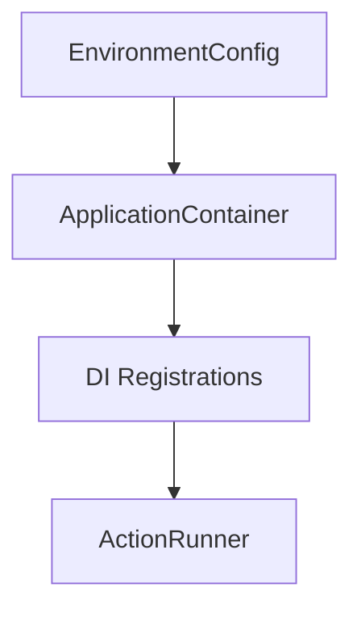
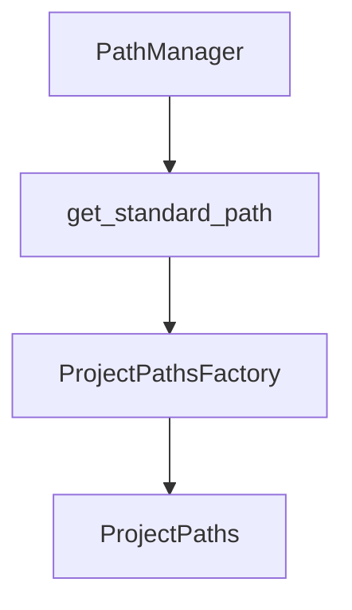

# Config Manifest

## Overview

What: Configuration and initialization surfaces for Agent Actions—schema models, environment
settings, DI container wiring, project initialization, and path management.

Why: Provides a single, consistent source of truth for how workflows are defined, validated,
and wired at runtime.

How: Models (schema + env) define inputs, path resolution anchors IO, and DI wiring connects
orchestration, prompts, and processing to concrete implementations.

## Sub-Modules

| Sub-Module | Description |
|------------|-------------|
| [di](di/_MANIFEST.md) | Dependency injection container, registry, and application wiring. |

## Modules

| Name | Type | Description | Signals |
|------|------|-------------|---------|
| `__init__.py` | Module | Direct import of `WorkflowConfig` from `schema` (backward-compat alias `WorkflowConfigV2`). | `configuration` |
| `schema.py` | Module | Workflow configuration schema (Pydantic models) with `extra="forbid"` on `ActionConfig` and `DefaultsConfig`, cross-validation (tool `impl` required, duplicate/dangling dep checks, circular dependency detection). | `configuration`, `validation` |
| `environment.py` | Module | Environment settings with validation (validators raise `ValueError` for Pydantic compatibility). | `configuration`, `validation` |
| `paths.py` | Module | `PathManager` with project-boundary-guarded `clean_path()`, scoped root cache, and fallback heuristic warning. | `paths`, `configuration` |
| `path_config.py` | Module | Path configuration: `load_project_config`, `resolve_project_root` (cwd fallback), `get_tool_dirs` (tool dir resolution), `get_schema_path`. | `paths`, `configuration` |
| `factory.py` | Module | DI-aware factory helpers for `ActionRunner`. | `di`, `configuration` |
| `init.py` | Module | `ProjectInitializer` for scaffolding new projects (atomic `create_file`, `yaml.safe_dump`). | `configuration`, `filesystem` |
| `interfaces.py` | Module | Loader/processor/generator interfaces and async mixins. | `configuration`, `interfaces` |
| `defaults.py` | Module | Centralized default constants grouped by domain (`StorageDefaults`, `LockDefaults`, `OllamaDefaults`, `ApiDefaults`, `SeedDataDefaults`, `PromptDefaults`, `DocsDefaults`). Zero imports—safe to import anywhere. | `config`, `defaults` |
| `types.py` | Module | Typed dictionaries (`ActionConfigDict`, `ActionEntryDict`, `ActionConfigMap`, `ContextScopeDict`, `GuardConfigDict`, `WhereClauseDict`, `HitlConfigDict`) and enums (`Granularity`, `RunMode`) for config structures. | `config`, `workflow`, `processing` |
| `project_paths.py` | Module | `ProjectPathsFactory` and `ProjectPaths` for project directory resolution. Moved from `cli/`. | `paths`, `validation`, `output` |
| `manager.py` | Module | `ConfigManager` for workflow config assembly: YAML loading, template rendering, schema validation, config merging, dependency inference, and execution order determination. | `configuration`, `workflow` |

## Flows

### Configuration Bootstrap

Key Functions

| Module | Symbol | Type | Description |
|--------|--------|------|-------------|
| `environment.py` | `EnvironmentConfig` | Class | Environment settings with validation helpers. |
| `factory.py` | `application_container_context` | Function | Context-managed DI lifecycle for container. |
| `factory.py` | `create_action_runner` | Function | Create `ActionRunner` via DI container. |

### Project Path Resolution

Key Functions

| Module | Symbol | Type | Description |
|--------|--------|------|-------------|
| `paths.py` | `PathManager.get_standard_path` | Method | Resolve standard project/agent paths. |
| `paths.py` | `PathManager.get_project_root` | Method | Locate the project root (caches only for CWD lookups). |
| `paths.py` | `PathManager.get_agent_paths` | Method | Resolve per-agent config/io/source paths. |
| `paths.py` | `PathManager.clean_path` | Method | Remove files/dirs with project-boundary guard. |
| `path_config.py` | `load_project_config` | Function | Load project-level config from YAML. |
| `path_config.py` | `resolve_project_root` | Function | Resolve project root, defaulting to `Path.cwd()`. |
| `path_config.py` | `get_project_name` | Function | Return `project_name` from project config, or `None` with warning if absent. |
| `path_config.py` | `get_tool_dirs` | Function | Resolve tool directory names from project config, defaulting to `["tools"]`. |

## Cross-Module Touchpoints

| Package | Why it matters |
|---------|----------------|
| `agent_actions/workflow` | Consumes `WorkflowConfig` (schema) and DI-provisioned runners. Uses `WorkflowRuntimeConfig` for execution context. |
| `agent_actions/validation` | Uses config models and environment settings for startup checks. |
| `agent_actions/prompt` | Relies on resolved paths and DI wiring for prompt preparation. |
| `agent_actions/output` | Uses path resolution to locate IO and schema artifacts. |
| `agent_actions/cli` | Reads config and project paths to render/run workflows. |

## Project Surface

> How this module interacts with the user's project files.

| Symbol | User File | Interaction | Config Key |
|--------|-----------|-------------|------------|
| `load_project_config()` | `agent_actions.yml` | Reads | `default_agent_config`, `schema_path`, `tool_path`, `seed_data_path`, `project_name` |
| `get_schema_path()` | `agent_actions.yml` | Reads | `schema_path` |
| `get_tool_dirs()` | `agent_actions.yml` | Reads | `tool_path` |
| `get_seed_data_path()` | `agent_actions.yml` | Reads | `seed_data_path` |
| `get_project_name()` | `agent_actions.yml` | Reads | `project_name` |
| `ConfigManager._load_single_config()` | `agent_config/{workflow}/{workflow}.yml` | Reads | entire workflow YAML |
| `ConfigManager.load_configs()` | `agent_config/{workflow}/{workflow}.yml` | Reads | `tool_path`, `actions[]`, `defaults` |
| `WorkflowConfig.model_validate()` | `agent_config/{workflow}/{workflow}.yml` | Validates | `name`, `actions[]`, `defaults` |
| `ActionConfig` (schema.py) | `agent_config/{workflow}/{workflow}.yml` | Validates | `actions[].name`, `actions[].kind`, `actions[].impl`, `actions[].schema`, `actions[].guard`, `actions[].dependencies`, `actions[].reprompt`, `actions[].retry`, `actions[].context_scope`, `actions[].versions` |
| `DefaultsConfig` (schema.py) | `agent_config/{workflow}/{workflow}.yml` | Validates | `defaults.model_vendor`, `defaults.model_name`, `defaults.granularity`, `defaults.run_mode`, `defaults.data_source`, `defaults.context_scope` |
| `EnvironmentConfig` | `.env` | Reads | `OPENAI_API_KEY`, `ANTHROPIC_API_KEY`, `GEMINI_API_KEY`, `AGENT_ACTIONS_ENV` |
| `PathManager.get_standard_path()` | `{workflow}/agent_io/target/{action}/` | Resolves | — |
| `PathManager.get_standard_path()` | `schema/{workflow}/` | Resolves | — |
| `PathManager.get_standard_path()` | `prompt_store/` | Resolves | — |
| `PathManager.clean_path()` | `{workflow}/agent_io/target/{action}/` | Writes | — |
| `ProjectInitializer.init_project()` | `agent_actions.yml` | Writes | `project_name`, `default_agent_config`, `schema_path`, `tool_path`, `seed_data_path` |
| `ProjectInitializer.init_project()` | `agent_workflow/`, `prompt_store/`, `schema/`, `templates/`, `tools/`, `seed_data/` | Writes | — |
| `ProjectPathsFactory.create_project_paths()` | `agent_actions.yml`, `{workflow}/agent_config/`, `{workflow}/agent_io/` | Reads | — |
| `find_config_file()` | `agent_config/{workflow}/{workflow}.yml` | Reads | — |

**Internal only**: `defaults.py` constants, `types.py` type definitions, `interfaces.py` abstract bases, `factory.py` DI wiring -- no direct project file surface.

**Examples** -- see this module in action:
- [`examples/book_catalog_enrichment/agent_actions.yml`](../../examples/book_catalog_enrichment/agent_actions.yml) -- project config read by `load_project_config()`, keys: `schema_path`, `tool_path`, `seed_data_path`, `default_agent_config`
- [`examples/book_catalog_enrichment/agent_workflow/book_catalog_enrichment/agent_config/book_catalog_enrichment.yml`](../../examples/book_catalog_enrichment/agent_workflow/book_catalog_enrichment/agent_config/book_catalog_enrichment.yml) -- workflow config parsed by `ConfigManager` and validated by `WorkflowConfig`; exercises `defaults`, `actions[].schema`, `actions[].guard`, `actions[].reprompt`, `actions[].versions`, `actions[].kind`, `actions[].impl`, `actions[].context_scope`
- [`examples/incident_triage/agent_actions.yml`](../../examples/incident_triage/agent_actions.yml) -- project config with `seed_data_path` read by `get_seed_data_path()`
- [`examples/incident_triage/agent_workflow/incident_triage/agent_config/incident_triage.yml`](../../examples/incident_triage/agent_workflow/incident_triage/agent_config/incident_triage.yml) -- workflow with `actions[].guard.condition` (SEV1/SEV2 filter), `actions[].versions` (parallel severity classifiers), `actions[].version_consumption`
- [`examples/review_analyzer/agent_workflow/review_analyzer/agent_config/review_analyzer.yml`](../../examples/review_analyzer/agent_workflow/review_analyzer/agent_config/review_analyzer.yml) -- workflow with `defaults.data_source`, multi-vendor model selection, guard pre-check gates, version consumption with merge pattern
- [`examples/book_catalog_enrichment/.env.example`](../../examples/book_catalog_enrichment/.env.example) -- `.env` file loaded by `EnvironmentConfig` via `ConfigManager._resolve_dotenv()`
