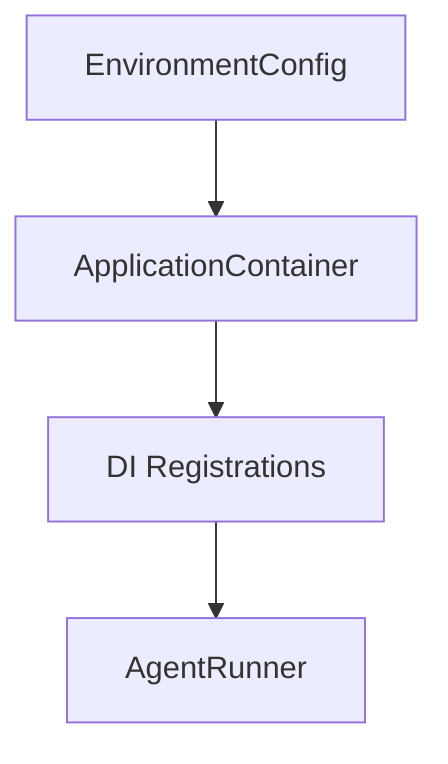
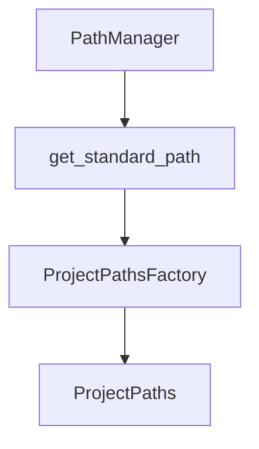

# Config Manifest

## Overview

What: Configuration and initialization surfaces for Agent Actions—schema models, environment
settings, DI container wiring, project initialization, and path management.

Why: Provides a single, consistent source of truth for how workflows are defined, validated,
and wired at runtime.

How: Models (schema + env) define inputs, path resolution anchors IO, and DI wiring connects
orchestration, prompts, and processing to concrete implementations.

## Sub-Modules

| Sub-Module | Description |
|------------|-------------|
| [di](di/_MANIFEST.md) | Dependency injection container, registry, and application wiring. |

## Modules

| Name | Type | Description | Signals |
|------|------|-------------|---------|
| `__init__.py` | Module | Package exports for configuration models. | `configuration` |
| `schema.py` | Module | Workflow configuration schema (Pydantic models). | `configuration`, `validation` |
| `environment.py` | Module | Environment settings with validation and API/perf adapters. | `configuration`, `validation` |
| `paths.py` | Module | PathManager and standard path resolution. | `paths`, `configuration` |
| `path_config.py` | Module | Path configuration models and defaults. | `paths`, `configuration` |
| `factory.py` | Module | DI-aware factory helpers for `AgentRunner`. | `di`, `configuration` |
| `init.py` | Module | ProjectInitializer for scaffolding new projects. | `configuration`, `filesystem` |
| `interfaces.py` | Module | Loader/processor/generator interfaces and async mixins. | `configuration`, `interfaces` |
| `defaults.py` | Module | Centralized default constants grouped by domain (`StorageDefaults`, `LockDefaults`, `OllamaDefaults`, `ApiDefaults`, `SeedDataDefaults`, `PromptDefaults`, `DocsDefaults`). Zero imports—safe to import anywhere. | `config`, `defaults` |
| `types.py` | Module | Typed dictionaries (`AgentConfigDict`, `AgentEntryDict`, `AgentConfigMap`, `ContextScopeDict`, `GuardConfigDict`, `WhereClauseDict`, `HitlConfigDict`) for config structures. | `config`, `workflow`, `processing` |

## Flows

### Configuration Bootstrap

```mermaid
flowchart TD
    A[EnvironmentConfig] --> B[ApplicationContainer]
    B --> C[DI Registrations]
    C --> D[AgentRunner]
```

Key Functions

| Module | Symbol | Type | Description |
|--------|--------|------|-------------|
| `environment.py` | `EnvironmentConfig` | Class | Environment settings with validation helpers. |
| `factory.py` | `application_container_context` | Function | Context-managed DI lifecycle for container. |
| `factory.py` | `create_agent_runner` | Function | Create `AgentRunner` via DI container. |

### Project Path Resolution

```mermaid
flowchart TD
    A[PathManager] --> B[get_standard_path]
    B --> C[ProjectPathsFactory]
    C --> D[ProjectPaths]
```

Key Functions

| Module | Symbol | Type | Description |
|--------|--------|------|-------------|
| `paths.py` | `PathManager.get_standard_path` | Method | Resolve standard project/agent paths. |
| `paths.py` | `PathManager.get_project_root` | Method | Locate the project root for path resolution. |
| `paths.py` | `PathManager.get_agent_paths` | Method | Resolve per-agent config/io/source paths. |
| `path_config.py` | `load_project_config` | Function | Load project-level config from YAML. |

## Cross-Module Touchpoints

| Package | Why it matters |
|---------|----------------|
| `agent_actions/workflow` | Consumes `WorkflowConfigV2` and DI-provisioned runners. |
| `agent_actions/validation` | Uses config models and environment settings for startup checks. |
| `agent_actions/prompt` | Relies on resolved paths and DI wiring for prompt preparation. |
| `agent_actions/output` | Uses path resolution to locate IO and schema artifacts. |
| `agent_actions/cli` | Reads config and project paths to render/run workflows. |
