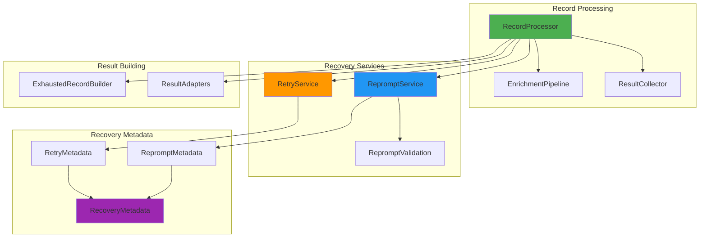
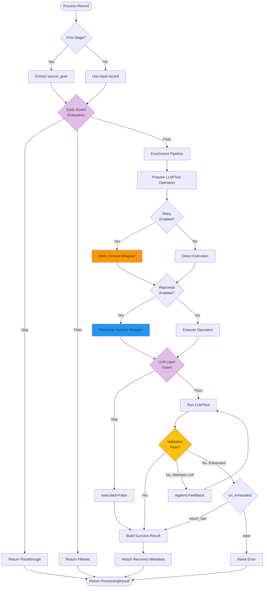
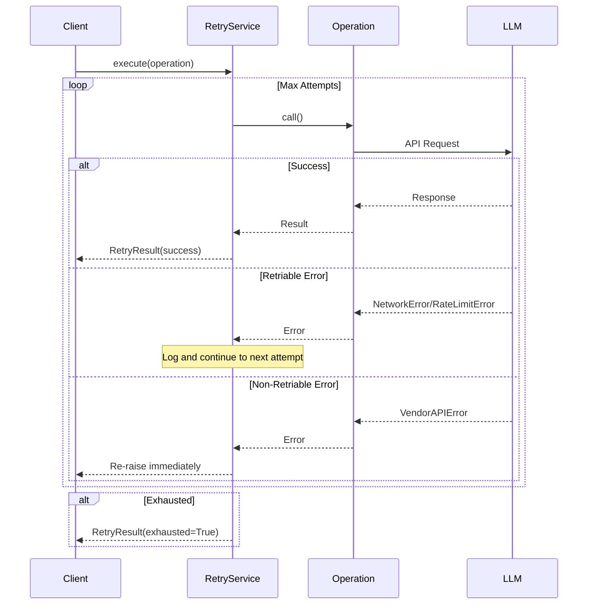
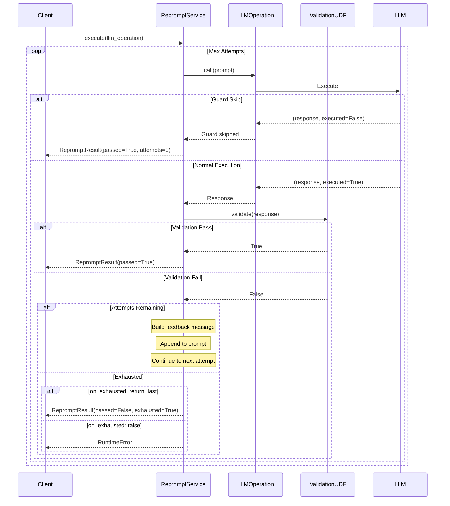
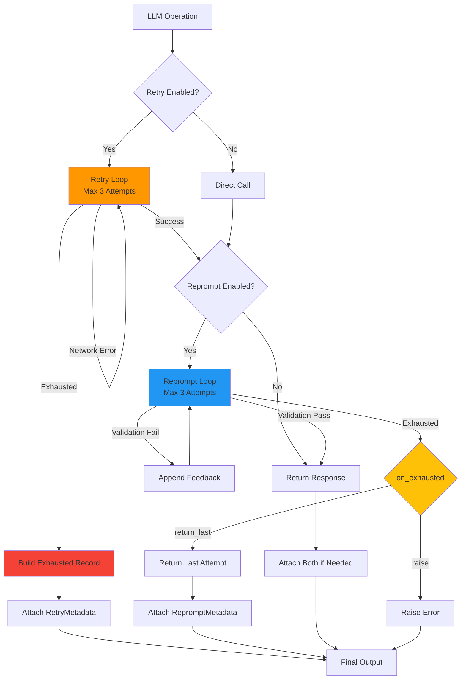

# Core Processing Manifest

## Overview

The core processing layer provides the foundational record processing, recovery, and validation services for agent-actions workflows. This layer implements retry (transport-layer recovery) and reprompt (validation-based recovery) mechanisms that work in both online and batch modes.

## Architecture



## Record Processing Lifecycle

### Overview Flow



### Processing Steps Explained

1. **Stage Detection**: Determine if first-stage (raw input) or subsequent-stage (structured input)
2. **Early Guard Evaluation**: Check guards on input content (before LLM call)
   - Guards: `guard.clause`, `conditional_clause`
   - Context: Input content only
   - Actions: Skip (passthrough), Filter (exclude), Pass (continue)
3. **Enrichment Pipeline**: Resolve dependencies, passthrough fields, source lookups
4. **Operation Preparation**: Build LLM/Tool operation with enriched context
5. **Retry Wrapper**: Wrap operation with transport-layer retry logic (network failures, rate limits)
6. **Reprompt Wrapper**: Wrap operation with validation-based reprompt logic
7. **LLM Layer Guard**: Final guard evaluation with full enriched context
   - Guards can reference `{source.*}` and passthrough fields
   - Returns `(response, executed)` tuple
8. **Validation Loop**: Validate response, provide feedback, retry if failed
9. **Result Building**: Construct `ProcessingResult` with recovery metadata
10. **Metadata Attachment**: Attach `_recovery` field with retry/reprompt metadata

## Retry Service (Transport-Layer Recovery)

### Purpose
Handle transient failures that prevent successful communication with LLM providers:
- Network errors
- Timeout errors
- Rate limit errors
- API errors

### Retry Flow



### RetryResult Structure

```python
@dataclass
class RetryResult:
    response: Any              # Successful response or None
    attempts: int              # Number of attempts made
    reason: Optional[str]      # "timeout", "rate_limit", "network_error", "api_error"
    exhausted: bool            # Whether max attempts exhausted
    last_error: Optional[str]  # Last error message (if any)
```

### RetryMetadata Output

When retry occurs, the `_recovery.retry` field is added to output records:

```json
{
  "source_guid": "...",
  "content": {...},
  "_recovery": {
    "retry": {
      "attempts": 3,
      "failures": 2,
      "succeeded": true,
      "reason": "rate_limit",
      "timestamp": "2025-01-18T12:30:45Z"
    }
  }
}
```

### Configuration

```yaml
retry:
  enabled: true
  max_attempts: 3
  on_exhausted: "return_last"  # or "raise"
```

## Reprompt Service (Validation-Based Recovery)

### Purpose
Ensure LLM responses meet quality/business requirements through validation:
- Content validation (word count, required fields, format)
- Business rule validation (valid codes, categories, ranges)
- Quality checks (sentiment, clarity, completeness)

### Reprompt Flow



### RepromptResult Structure

```python
@dataclass
class RepromptResult:
    response: Any           # Final LLM response
    executed: bool          # Whether LLM was executed (False if guard skipped)
    attempts: int           # Number of validation attempts
    passed: bool            # Whether validation ultimately passed
    validation_name: str    # Name of validation UDF
    exhausted: bool         # Whether max attempts exhausted
```

### Validation Feedback Message

When validation fails, feedback is automatically appended to the prompt:

```
---
Your response failed validation: Response must have at least 50 words

Your response: {
  "description": "This is too short"
}

Please correct and respond again.
```

### RepromptMetadata Output

When reprompt occurs, the `_recovery.reprompt` field is added to output records:

```json
{
  "source_guid": "...",
  "content": {...},
  "_recovery": {
    "reprompt": {
      "attempts": 3,
      "passed": false,
      "validation": "check_description_word_count"
    }
  }
}
```

### Configuration

```yaml
reprompt:
  validation: "check_description_word_count"  # Name of validation UDF
  max_attempts: 3
  on_exhausted: "return_last"  # or "raise"
```

### Validation UDF Registration

Validation functions are registered using the `@reprompt_validation` decorator:

```python
from agent_actions.core.reprompt_validation import reprompt_validation

@reprompt_validation(
    name="check_description_word_count",
    feedback_message="Response must have at least 50 words"
)
def check_word_count(response: dict) -> bool:
    """Validate marketing description has minimum word count."""
    description = response.get("marketing_description", "")
    word_count = len(description.split())
    return word_count >= 50
```

**Key Points:**
- Validation UDFs must return `bool` (True = pass, False = fail)
- `feedback_message` is shown to LLM when validation fails
- UDFs are discovered automatically from user code directories
- Validation happens AFTER guard evaluation (guards can skip validation)

## Recovery Metadata Structure

### Combined Recovery

Both retry and reprompt metadata can coexist in the same record:

```json
{
  "source_guid": "abc123",
  "content": {
    "marketing_description": "..."
  },
  "_recovery": {
    "retry": {
      "attempts": 2,
      "failures": 1,
      "succeeded": true,
      "reason": "rate_limit",
      "timestamp": "2025-01-18T12:30:45Z"
    },
    "reprompt": {
      "attempts": 3,
      "passed": false,
      "validation": "check_description_word_count"
    }
  }
}
```

### Recovery Flow Hierarchy



### Exhausted Record Building

When recovery is exhausted, `ExhaustedRecordBuilder` creates a record with:
- Empty content fields (null, [], {}, 0, false based on schema)
- `metadata.retry_exhausted: true`
- Full `_recovery` metadata
- Preserved lineage and target_id fields

```python
exhausted_item = {
    "source_guid": "abc123",
    "content": {
        "description": None,
        "keywords": [],
        "score": 0
    },
    "metadata": {
        "retry_exhausted": True
    },
    "_recovery": {
        "retry": {
            "attempts": 3,
            "failures": 3,
            "succeeded": False,
            "reason": "timeout"
        }
    },
    "node_id": "action_xyz",
    "lineage": ["previous_action", "action_xyz"]
}
```

## Guard Evaluation (Two-Phase Approach)

### Why Two Phases?

Guards are evaluated at TWO different points for optimization and flexibility:

### Phase 1: Early Guard Evaluation

**When:** Before LLM call (Step 2 in processing flow)
**Context:** Input content only (no passthrough fields yet)
**Guards:** `guard.clause`, `conditional_clause`
**Benefit:** Avoid expensive LLM calls (~100ms+ saved)

```yaml
guard:
  clause: "status == 'active'"
  behavior: "skip"
# → Evaluated on raw input, skipped before LLM call
```

### Phase 2: LLM Layer Guard

**When:** After prompt preparation, inside LLM operation (Step 7)
**Context:** Full enriched context with passthrough fields and source lookups
**Guards:** Same guards, but with access to `{source.*}` and enriched fields
**Benefit:** Guards can reference prepared passthrough fields

```yaml
guard:
  clause: "{source.priority} == 'high' and length > 100"
  behavior: "skip"
# → Evaluated after enrichment, with source lookups resolved
```

### Guard Behaviors

- **skip**: Return input as-is (passthrough), mark `executed=False`
- **filter**: Exclude record entirely, return empty result
- **If no guard or guard passes**: Continue to execution

**Important:** When guard skips execution (`executed=False`), validation is bypassed entirely.

## Processing Result Types

### ProcessingStatus Enum

```python
class ProcessingStatus(Enum):
    SUCCESS = "success"      # Processed successfully
    SKIPPED = "skipped"      # Skipped by guard (passthrough)
    FILTERED = "filtered"    # Filtered out by guard (excluded)
    FAILED = "failed"        # Processing failed
    EXHAUSTED = "exhausted"  # Retry exhausted
```

### ProcessingResult Structure

```python
@dataclass
class ProcessingResult:
    status: ProcessingStatus
    data: List[Dict[str, Any]]

    # Identity
    source_guid: Optional[str]
    node_id: Optional[str]

    # Execution state
    executed: bool
    skip_reason: Optional[str]

    # Passthrough
    passthrough_fields: Dict[str, Any]

    # Error handling
    error: Optional[str]
    retry_state: RetryState

    # Recovery metadata
    recovery_metadata: Optional[RecoveryMetadata]

    # LLM response
    raw_response: Optional[Any]
```

## Integration with Batch Mode

### Online Mode
- Retry: Per-record, immediate feedback
- Reprompt: Per-record, immediate validation loop

### Batch Mode
- **Phase 1 (Retry)**: Check for missing records after batch completion, resubmit as new batch
- **Phase 2 (Validate)**: Run validation on all records, resubmit failed records as reprompt batch
- Recovery metadata preserved across batch submissions
- Context map required for reprompt (stores original record data)

See [Batch Infrastructure Manifest](../llm_invocation/batch/infrastructure/_MANIFEST.md) for detailed batch processing flow.

## Core Types

### RetryMetadata

```python
@dataclass
class RetryMetadata:
    attempts: int      # Total attempts made
    failures: int      # Failed attempts
    succeeded: bool    # Whether ultimately succeeded
    reason: str        # "timeout", "rate_limit", "network_error", "api_error"
    timestamp: str     # ISO format
```

### RepromptMetadata

```python
@dataclass
class RepromptMetadata:
    attempts: int       # Reprompt attempts made
    passed: bool        # Whether validation passed
    validation: str     # Validation UDF name
```

### RecoveryMetadata

```python
@dataclass
class RecoveryMetadata:
    retry: Optional[RetryMetadata]
    reprompt: Optional[RepromptMetadata]

    def to_dict(self) -> Optional[Dict[str, Any]]:
        """Returns None if no recovery occurred."""
```

## Error Classification

### Retriable Errors
- `NetworkError`: Network connectivity issues
- `RateLimitError`: Provider rate limit exceeded
- Action: Retry with exponential backoff

### Non-Retriable Errors
- `VendorAPIError`: Invalid request, auth failure, etc.
- `ConfigurationError`: Invalid configuration
- Action: Fail immediately, no retry

### Error Reasons
- `"timeout"`: Request timeout
- `"rate_limit"`: Rate limit exceeded
- `"network_error"`: Network connectivity issue
- `"api_error"`: Vendor API error
- `"unknown"`: Unclassified error

## Design Principles

1. **Separation of Concerns**: Retry handles transport, reprompt handles content quality
2. **Composability**: Retry and reprompt work independently or together
3. **Metadata Transparency**: All recovery attempts tracked in `_recovery` field
4. **Fail-Safe Defaults**: `return_last` behavior prevents workflow failures
5. **Validation Isolation**: Validation UDFs are pure functions with clear contracts
6. **Guard Optimization**: Two-phase evaluation balances performance and flexibility
7. **Type Safety**: Typed results replace fragile tuple returns

## Usage Examples

### Retry Only

```yaml
actions:
  - name: call_api
    retry:
      enabled: true
      max_attempts: 3
      on_exhausted: "return_last"
```

### Reprompt Only

```yaml
actions:
  - name: write_description
    reprompt:
      validation: "check_word_count"
      max_attempts: 2
      on_exhausted: "raise"
```

### Both Retry and Reprompt

```yaml
actions:
  - name: classify_content
    retry:
      enabled: true
      max_attempts: 3
      on_exhausted: "return_last"
    reprompt:
      validation: "check_valid_category"
      max_attempts: 2
      on_exhausted: "return_last"
```

### Guard with Skip Behavior

```yaml
actions:
  - name: enrich_data
    guard:
      clause: "status == 'pending'"
      behavior: "skip"
    reprompt:
      validation: "check_completeness"
      max_attempts: 2
```

**Result:** Records with `status != 'pending'` are skipped (passthrough), validation bypassed.

---

## Module Reference

| Name | Type | Description |
|------|------|-------------|
| `record_processor.py` | Module | Unified record processor for online and batch modes |
| `RecordProcessor` | Class | Main orchestrator for record processing with retry and reprompt |
| &nbsp;&nbsp;&nbsp;&nbsp;└─ `process_record` | Method | Process a single record through the full pipeline |
| `retry_service.py` | Module | Transport-layer retry service |
| `RetryService` | Class | Wraps operations with retry logic for transient failures |
| &nbsp;&nbsp;&nbsp;&nbsp;└─ `execute` | Method | Execute operation with retry loop |
| &nbsp;&nbsp;&nbsp;&nbsp;└─ `execute_with_fallback` | Method | Execute with fallback value if exhausted |
| `RetryResult` | Class | Result of retry-wrapped operation |
| `reprompt_service.py` | Module | Validation-based reprompt service |
| `RepromptService` | Class | Wraps LLM execution with validation loop |
| &nbsp;&nbsp;&nbsp;&nbsp;└─ `execute` | Method | Execute LLM operation with reprompt loop |
| &nbsp;&nbsp;&nbsp;&nbsp;└─ `_build_feedback_message` | Method | Build feedback message for failed validation |
| `RepromptResult` | Class | Result of reprompt execution |
| `reprompt_validation.py` | Module | Validation UDF registry and decorator |
| &nbsp;&nbsp;&nbsp;&nbsp;└─ `@reprompt_validation` | Decorator | Register validation UDF with name and feedback |
| &nbsp;&nbsp;&nbsp;&nbsp;└─ `get_validation_function` | Function | Retrieve validation UDF from registry |
| `types.py` | Module | Core type definitions |
| `ProcessingResult` | Class | Unified result type for record processing |
| `ProcessingStatus` | Enum | Status of record processing |
| `RecoveryMetadata` | Class | Container for retry and reprompt metadata |
| `RetryMetadata` | Class | Metadata for retry recovery |
| `RepromptMetadata` | Class | Metadata for reprompt recovery |
| `ProcessingContext` | Class | Context object flowing through processing pipeline |
| `exhausted_record_builder.py` | Module | Utilities for constructing exhausted retry records |
| `ExhaustedRecordBuilder` | Class | Build exhausted records with empty content |
| &nbsp;&nbsp;&nbsp;&nbsp;└─ `build_exhausted_item` | Method | Build exhausted record with recovery metadata |
| `enrichment.py` | Module | Data enrichment pipeline |
| `EnrichmentPipeline` | Class | Resolve dependencies, passthrough fields, source lookups |
| `result_collector.py` | Module | Result collection and aggregation |
| `ResultCollector` | Class | Collect and aggregate processing results |
| `result_adapters.py` | Module | Adapters for converting between result formats |
| `recovery_stats.py` | Module | Recovery statistics tracking |
