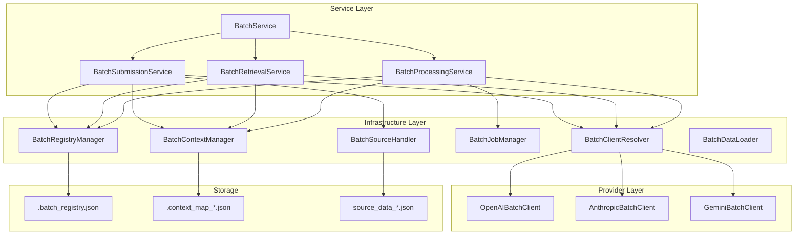
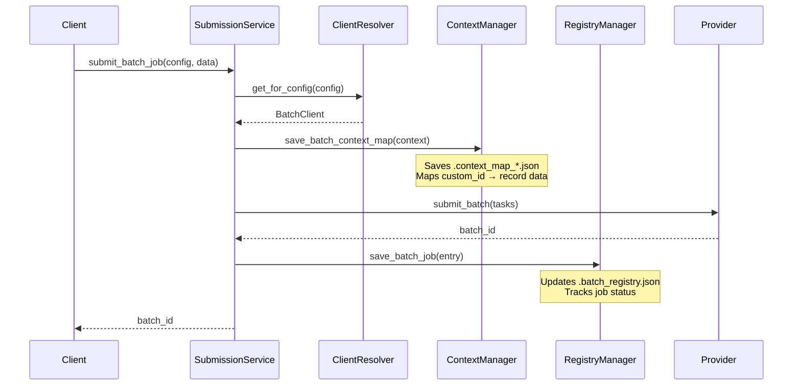
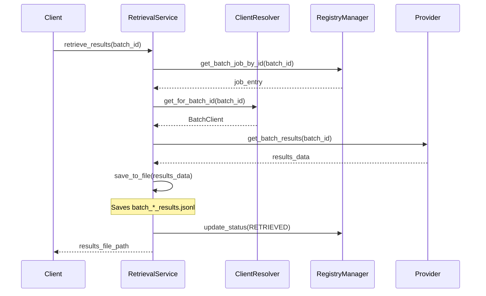
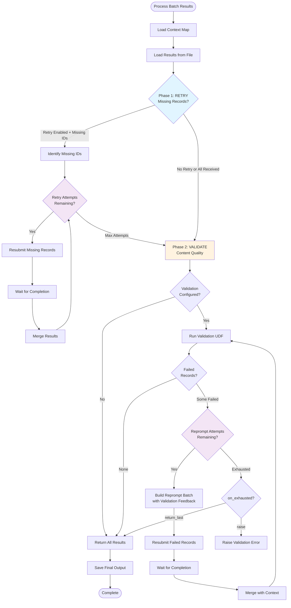
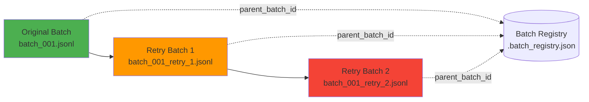

# Batch Infrastructure Manifest

## Overview

The batch infrastructure layer provides core utilities for managing LLM batch job lifecycle, state persistence, and provider resolution. This layer sits between the high-level batch service and the low-level provider clients.

## Architecture



## Batch Processing Lifecycle

### 1. Submission Phase



**Key Components:**
- **ClientResolver**: Selects appropriate provider client (OpenAI, Anthropic, Gemini)
- **ContextManager**: Persists record context for reprompt/retry with full original data
- **RegistryManager**: Maintains job status registry for monitoring and coordination

### 2. Retrieval Phase



### 3. Processing Phase (Two-Phase Approach)



**Phase 1: Retry - Ensure All Records Retrieved**
- **Purpose**: Handle network failures, rate limits, provider errors
- **Check**: Compare expected IDs vs received IDs
- **Action**: Resubmit missing records up to `max_retry_attempts`
- **Outcome**: Best-effort record recovery before validation

**Phase 2: Validate - Ensure Content Quality**
- **Purpose**: Verify records meet business/quality requirements
- **Check**: Run validation UDF on all record contents
- **Action**: Resubmit failed records with validation feedback
- **Outcome**: Quality-assured results or controlled failure handling

**Key Distinction:**
- **Retry**: "Did I get all my records?"
- **Reprompt**: "Do all my records meet the requirements?"

### 4. Retry Chain Management



**BatchJobManager** tracks batch lineage:
- `get_batch_children()`: Find all retry batches for a parent
- `get_batch_lineage()`: Get full chain from original → retries
- `get_retry_chain_status()`: Aggregated status across chain

## Core Components

### BatchClientResolver

**Purpose**: Centralized provider client management with caching.

**Key Methods:**
- `get_for_config(agent_config)`: Resolve client based on `model_vendor` in config
- `get_for_batch_id(batch_id, registry_manager)`: Retrieve client that submitted batch

**Implementation:**
```python
# Maintains client cache to avoid re-initialization
_client_cache: Dict[str, BaseBatchClient]

# Supports: openai, anthropic, gemini
# Falls back to default_client if vendor unknown
```

### BatchContextManager

**Purpose**: Persist and retrieve context maps for retry/reprompt operations.

**Context Map Structure:**
```json
{
  "custom_id_123": {
    "record_data": {...},      // Original input record
    "dependency_data": {...},  // Resolved dependencies
    "metadata": {...}          // Passthrough fields
  }
}
```

**Key Methods:**
- `save_batch_context_map(context_map, output_dir, file_name)`
  - Saves to: `{output_dir}/batch/.context_map_{file_name}.json`
- `load_batch_context_map(output_dir, file_name)`
  - Required for: Reprompt resubmission with original context
- `batch_context_exists(output_dir, file_name)`
- `delete_batch_context_map(output_dir, file_name)`

**Usage in Reprompt:**
When validation fails, the context map provides the original record data needed to rebuild the batch task with updated prompts/feedback.

### BatchRegistryManager

**Purpose**: Thread-safe registry for tracking all batch jobs in a workflow.

**Registry Structure:**
```json
{
  "batch_001.jsonl": {
    "batch_id": "batch_abc123",
    "status": "succeeded",
    "provider": "openai",
    "submitted_at": "2025-01-18T12:00:00",
    "completed_at": "2025-01-18T12:05:00",
    "parent_batch_id": null,
    "retry_count": 0
  },
  "batch_001_retry_1.jsonl": {
    "batch_id": "batch_def456",
    "status": "succeeded",
    "provider": "openai",
    "parent_batch_id": "batch_abc123",
    "retry_count": 1
  }
}
```

**Key Methods:**
- `save_batch_job(file_name, batch_id, status, provider, ...)`
- `get_batch_job(file_name)`: Lookup by file name
- `get_batch_job_by_id(batch_id)`: Lookup by batch ID
- `update_status(file_name, status)`: Update job status
- `get_all_jobs()`: Get all jobs in registry
- `get_registry_stats()`: Aggregated statistics
- `are_all_jobs_completed()`: Check if workflow can proceed

**Caching:**
- In-memory cache invalidated only on writes
- Thread-safe with file locking (via `portalocker`)

### BatchJobManager

**Purpose**: High-level batch lifecycle and status queries.

**Key Methods:**
- `are_all_jobs_completed(output_directory)`: Check if workflow can proceed
- `get_registry_status(output_directory)`: Human-readable status summary
- `get_batch_children(batch_id)`: Find retry batches
- `get_batch_lineage(batch_id)`: Full retry chain
- `get_retry_chain_status(batch_id)`: Aggregated chain status

**RetryChainStatus:**
```python
@dataclass
class RetryChainStatus:
    total_batches: int
    statuses: Dict[str, int]       # Status → count
    original_batch_id: str
    latest_batch_id: str
    retry_count: int
```

### BatchSourceHandler

**Purpose**: Persist source data alongside batch results for audit/debugging.

**Key Methods:**
- `save_task_source(source_data, output_directory, file_name)`
  - Saves to: `{output_dir}/batch/source_data_{file_name}.json`

**Usage:**
Preserves the original input data before transformation, enabling:
- Audit trails for compliance
- Debugging batch processing issues
- Reprocessing with different configs

### BatchDataLoader

**Purpose**: Load data from JSON/JSONL files for batch processing.

**Key Methods:**
- `load_data(file_path)`: Load records from file
- `supports_async()`: Returns `True` (supports async loading)
- `get_processing_mode()`: Returns `AUTO` (system chooses mode)

**Supported Formats:**
- `.json`: Array of records
- `.jsonl`: Newline-delimited JSON records

## File Artifacts

### .batch_registry.json
- **Location**: `{workflow_output}/batch/.batch_registry.json`
- **Purpose**: Central registry for all batch jobs in workflow
- **Persistence**: Updated on submission, status changes, completion
- **Usage**: Workflow coordination, status monitoring, retry chain tracking

### .context_map_*.json
- **Location**: `{workflow_output}/batch/.context_map_{file_name}.json`
- **Purpose**: Store record context for retry/reprompt operations
- **Persistence**: Created on batch submission, deleted after successful processing
- **Usage**: Required for reprompt to rebuild tasks with original data

### source_data_*.json
- **Location**: `{workflow_output}/batch/source_data_{file_name}.json`
- **Purpose**: Preserve original input data before transformation
- **Persistence**: Created on batch submission, retained for audit
- **Usage**: Debugging, audit trails, reprocessing

## Design Principles

1. **Separation of Concerns**: Each component has a single, well-defined responsibility
2. **Idempotency**: Operations can be safely retried without side effects
3. **Caching**: Minimize I/O with thread-safe in-memory caching
4. **Provider Agnostic**: Abstract provider differences behind uniform interface
5. **Auditability**: Persist artifacts for debugging and compliance
6. **Two-Phase Processing**: Separate "get all records" from "validate all records"

## Integration Points

### With Services Layer
- `BatchSubmissionService` uses: ClientResolver, ContextManager, RegistryManager
- `BatchRetrievalService` uses: ClientResolver, ContextManager, RegistryManager
- `BatchProcessingService` uses: All infrastructure components

### With Provider Layer
- All provider interactions go through `BatchClientResolver`
- Providers implement `BaseBatchClient` interface
- Infrastructure layer abstracts provider-specific details

### With File System
- All batch artifacts stored under `{workflow_output}/batch/`
- Thread-safe file operations with locking
- Graceful handling of missing files

## Error Handling

1. **Client Resolution Errors**: Fall back to default client
2. **Registry Lock Timeout**: Wait with configurable timeout
3. **Missing Context Map**: Reprompt operations fail gracefully
4. **Provider Failures**: Captured in registry status with error details

## Testing Considerations

1. **Mock Infrastructure**: All components accept dependency injection
2. **Isolated Testing**: Each component can be tested independently
3. **Registry Isolation**: Use temporary registry files for tests
4. **Provider Mocking**: Mock BatchClientResolver for service tests

---

## Modules Reference

| Name | Type | Description | Signals |
|------|------|-------------|---------|
| `batch_client_resolver.py` | Module | Batch Client Resolver. | `errors`, `llm_invocation` |
| `BatchClientResolver` | Class | Resolves and caches batch clients. | - |
| &nbsp;&nbsp;&nbsp;&nbsp;└─ `get_for_config` | Method | Get the appropriate client based on agent configuration. | - |
| &nbsp;&nbsp;&nbsp;&nbsp;└─ `get_for_batch_id` | Method | Get the client that was used for a specific batch ID. | - |
| `batch_context_manager.py` | Module | Batch Context Manager. | `errors`, `utilities` |
| `BatchContextManager` | Class | Manages batch context map lifecycle. | - |
| &nbsp;&nbsp;&nbsp;&nbsp;└─ `save_batch_context_map` | Method | Save batch processing context map to batch directory. | - |
| &nbsp;&nbsp;&nbsp;&nbsp;└─ `load_batch_context_map` | Method | Load batch processing context map from batch directory. | - |
| &nbsp;&nbsp;&nbsp;&nbsp;└─ `batch_context_exists` | Method | Check if batch context map file exists. | - |
| &nbsp;&nbsp;&nbsp;&nbsp;└─ `delete_batch_context_map` | Method | Delete batch context map file if it exists. | - |
| `batch_data_loader.py` | Module | Data loader for batch processing from JSON and JSONL files. | `configuration` |
| `BatchDataLoader` | Class | Loads data for batch processing from a specified file path. | - |
| &nbsp;&nbsp;&nbsp;&nbsp;└─ `supports_async` | Method | Return True as this loader supports async operations. | - |
| &nbsp;&nbsp;&nbsp;&nbsp;└─ `get_processing_mode` | Method | Return AUTO processing mode to let system choose. | - |
| &nbsp;&nbsp;&nbsp;&nbsp;└─ `load_data` | Method | Loads data from the given file path. | - |
| `batch_job_manager.py` | Module | Batch job lifecycle and registry status management. | `llm_invocation` |
| `RetryChainStatus` | Class | Status summary for a batch retry chain. | - |
| &nbsp;&nbsp;&nbsp;&nbsp;└─ `is_complete` | Method | Check if the retry chain is fully complete. | - |
| &nbsp;&nbsp;&nbsp;&nbsp;└─ `has_retries` | Method | Check if any retries were performed. | - |
| `BatchJobManager` | Class | Manages batch job lifecycle and registry status. | - |
| &nbsp;&nbsp;&nbsp;&nbsp;└─ `set_registry_manager` | Method | Set the registry manager (for lazy initialization). | - |
| &nbsp;&nbsp;&nbsp;&nbsp;└─ `are_all_jobs_completed` | Method | Check if all batch jobs in the registry are completed. | - |
| &nbsp;&nbsp;&nbsp;&nbsp;└─ `get_registry_status` | Method | Get the overall status of all batch jobs in the registry. | - |
| &nbsp;&nbsp;&nbsp;&nbsp;└─ `get_batch_children` | Method | Get all retry batches for a parent batch. | - |
| &nbsp;&nbsp;&nbsp;&nbsp;└─ `get_batch_lineage` | Method | Get full chain from original batch to all retries. | - |
| &nbsp;&nbsp;&nbsp;&nbsp;└─ `get_retry_chain_status` | Method | Get aggregated status for a batch retry chain. | - |
| `batch_registry_manager.py` | Module | Batch Registry Manager. | `llm_invocation`, `utilities` |
| `BatchRegistryManager` | Class | Manages batch job registry with caching and thread-safe operations. | - |
| &nbsp;&nbsp;&nbsp;&nbsp;└─ `save_batch_job` | Method | Save or update a batch job entry. | - |
| &nbsp;&nbsp;&nbsp;&nbsp;└─ `get_batch_job` | Method | Retrieve batch job entry by file name. | - |
| &nbsp;&nbsp;&nbsp;&nbsp;└─ `get_batch_job_by_id` | Method | Retrieve batch job entry by batch ID. | - |
| &nbsp;&nbsp;&nbsp;&nbsp;└─ `update_status` | Method | Update status for a batch job. | - |
| &nbsp;&nbsp;&nbsp;&nbsp;└─ `get_all_jobs` | Method | Get all batch jobs in registry. | - |
| &nbsp;&nbsp;&nbsp;&nbsp;└─ `get_registry_stats` | Method | Get aggregated statistics for all batches. | - |
| &nbsp;&nbsp;&nbsp;&nbsp;└─ `get_overall_status` | Method | Get overall status across all batches. | - |
| &nbsp;&nbsp;&nbsp;&nbsp;└─ `are_all_jobs_completed` | Method | Check if all batch jobs are in terminal state. | - |
| &nbsp;&nbsp;&nbsp;&nbsp;└─ `invalidate_cache` | Method | Force cache reload on next access. | - |
| `batch_source_handler.py` | Module | Batch source data persistence handler. | `file_io` |
| `BatchSourceHandler` | Class | Handles batch source data persistence. | - |
| &nbsp;&nbsp;&nbsp;&nbsp;└─ `save_task_source` | Method | Save task source data using unified source saver. | - |
