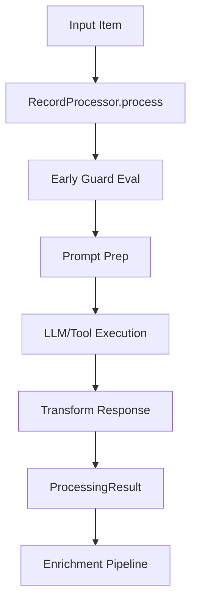
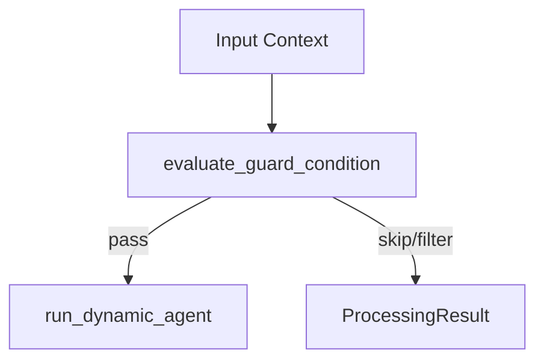
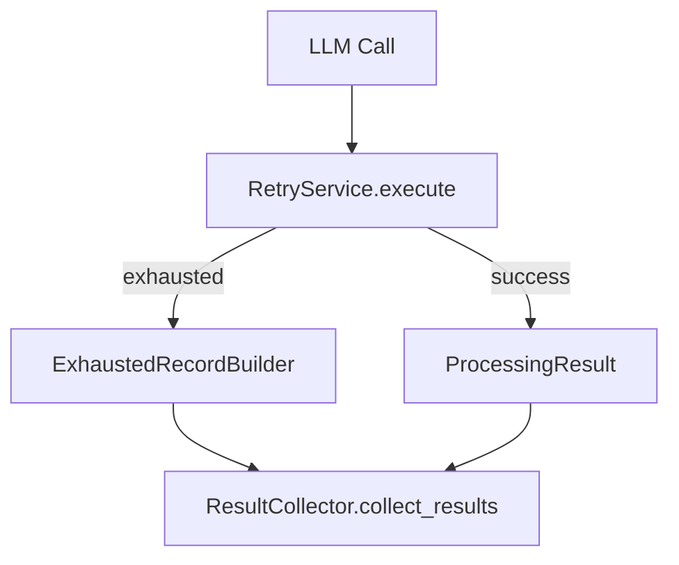

# Processing Manifest

## Overview

What: Unified processing pipeline that turns inputs into `ProcessingResult` records, handling
prompt execution, guards, retries, enrichment, and legacy adapters.

Why: Centralizes record-level behavior (skips, filters, retries, lineage, metadata) so downstream
modules can rely on consistent outputs.

How: `RecordProcessor` drives a stepwise pipeline, helpers evaluate guards and run the agent,
recovery services wrap failures, and enrichers decorate results before collection/adaptation.

## Sub-Modules

| Sub-Module | Description |
|------------|-------------|
| [recovery](recovery) | Retry/reprompt recovery services and stats. |
| [transform](transform) | Processing transforms namespace (thin wrapper). |

## Modules

| Name | Type | Description | Signals |
|------|------|-------------|---------|
| `processor.py` | Module | Unified record processing pipeline (`RecordProcessor`). | `processing`, `guards`, `recovery` |
| `helpers.py` | Module | Guard evaluation + dynamic agent execution helpers. | `guards`, `llm` |
| `types.py` | Module | Processing data types and result containers. | `types`, `results` |
| `enrichment.py` | Module | Enrichment pipeline (lineage, metadata, version IDs, passthrough). | `enrichment`, `lineage` |
| `result_collector.py` | Module | Aggregate `ProcessingResult` into output records. | `results` |
| `result_adapters.py` | Module | Backward-compatible adapters for legacy return shapes. | `compat` |
| `exhausted_builder.py` | Module | Build records for retry-exhausted outputs. | `recovery` |
| `error_handling.py` | Module | Standardized processor error handling mixin. | `errors` |
| `lineage_mixin.py` | Module | Lineage tracking mixin utilities. | `lineage` |
| `processor_init.py` | Module | Processor infra exports (error handling mixin). | `errors` |
| `__init__.py` | Module | Package exports. | `processing` |

## Flows

### Record Processing Pipeline

Key Functions

| Module | Symbol | Type | Description |
|--------|--------|------|-------------|
| `processor.py` | `RecordProcessor.process` | Method | Execute the 9-step per-record pipeline. |
| `processor.py` | `RecordProcessor.process_batch` | Method | Batch wrapper with per-item context. |
| `types.py` | `ProcessingResult` | Dataclass | Standard result container for downstream consumers. |
| `enrichment.py` | `EnrichmentPipeline.enrich` | Method | Apply lineage/metadata/passthrough enrichment. |

### Guard + Execution

Key Functions

| Module | Symbol | Type | Description |
|--------|--------|------|-------------|
| `helpers.py` | `evaluate_guard_condition` | Function | Evaluate guard and conditional clauses. |
| `helpers.py` | `run_dynamic_agent` | Function | Execute LLM/tool with guard-aware behavior. |
| `processor.py` | `RecordProcessor._evaluate_guard` | Method | Early guard eval to avoid prompt/LLM work. |

### Recovery + Result Collection

Key Functions

| Module | Symbol | Type | Description |
|--------|--------|------|-------------|
| `recovery/retry.py` | `RetryService.execute` | Method | Retry wrapper for transient failures. |
| `result_collector.py` | `ResultCollector.collect_results` | Method | Flatten results and enforce on_exhausted policy. |
| `exhausted_builder.py` | `ExhaustedRecordBuilder.build_exhausted_item` | Method | Build placeholder records for exhausted retries. |

## Cross-Module Touchpoints

| Package | Why it matters |
|---------|----------------|
| `agent_actions/prompt` | Prompt preparation and templating feed RecordProcessor. |
| `agent_actions/llm` | LLM/tool execution occurs via dynamic agent builder. |
| `agent_actions/input` | Guard filters and source content lookup depend on preprocessing. |
| `agent_actions/output` | Result collection feeds output records and schema handling. |
| `agent_actions/utils` | Lineage, metadata, ids, and transformation helpers. |
