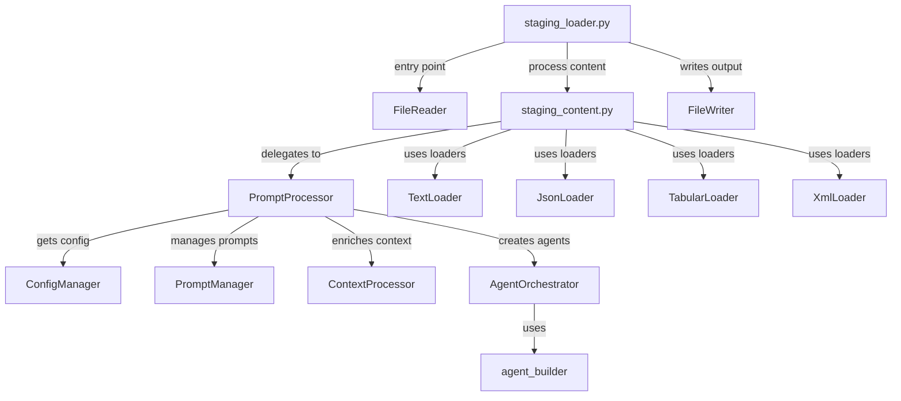

# Staging Module - Technical Documentation

## Overview

The Staging Module is the entry point for document processing in our agent-based pipeline architecture. It transforms raw documents into structured, processed chunks that can be analyzed and enriched by AI agents, preparing content for downstream systems.

## Core Functionality

This module performs several critical functions:

1. **Content Ingestion**: Handles multiple file formats (JSON, XML, CSV, Excel, text-based)
2. **Content Transformation**: Processes content based on type-specific requirements
3. **Chunking & Tokenization**: Intelligently segments documents for optimal agent processing
4. **Context Enrichment**: Adds few-shot examples and context for improved agent performance
5. **Agent Orchestration**: Manages agent lifecycle and response handling
6. **Lineage Tracking**: Maintains document provenance through GUIDs

## Technical Architecture

### Module Structure

```
processors/
├── staging/
│   ├── __init__.py               # Exports key components
│   ├── config/
│   │   ├── __init__.py
│   │   └── config_manager.py     # Type-safe configuration access
│   ├── prompt/
│   │   ├── __init__.py
│   │   ├── prompt_manager.py     # Prompt loading & formatting
│   │   ├── context_processor.py  # Context enrichment & few-shot handling
│   │   └── prompt_processor.py   # Core orchestration logic
│   ├── agents/
│   │   ├── __init__.py
│   │   └── agent_orchestrator.py # Agent creation & response processing
│   └── loaders/
│       ├── __init__.py
│       ├── base_loader.py        # Abstract loader interface
│       ├── json_loader.py        # JSON document handling
│       ├── tabular_loader.py     # CSV/Excel document handling
│       ├── text_loader.py        # Text document handling
│       └── xml_loader.py         # XML document handling
├── staging_content.py            # API compatibility layer for content processing
└── staging_loader.py             # Main entry point for document processing
```

### Component Interactions



### Key Classes

#### ConfigManager

Handles configuration access with proper type conversion and default values:

```python
# Example usage
config_manager = ConfigManager(agent_config)
chunk_size = config_manager.get_int("chunk_size", 1000)
models = config_manager.get_list("models", ["gpt-4"])
```

#### PromptProcessor

Central orchestration component that:
1. Loads and enriches context
2. Formats prompts with placeholders
3. Creates agents and processes responses
4. Maintains document lineage

```python
# Example usage
processor = PromptProcessor(agent_config, agent_name)
transformed_response, source_text = processor.staging_dynamic_creator(
    context_data=document_content,
    source_path="path/to/source.json"
)
```

#### BaseLoader & Specialized Loaders

Format-specific content processors that implement a common interface:

```python
# Interface definition
def process(self, content, file_path=None):
    """Process content specific to the loader implementation."""
    pass
```

## Integration Details

### System Context

The Staging Module sits between file I/O operations and downstream processing:

```
[Input Files] → [File Reader] → [Staging Module] → [Target Processing] → [Output Files]
```

### Dependencies

| Component | Role | Integration Point |
|-----------|------|-------------------|
| `agent_builder` | Creates dynamic agents | Called by `AgentOrchestrator` |
| `DataTransformer` | Handles schema operations | Used for filtering and enrichment |
| `FileHandler` | File path resolution | Used by context processors |
| `StringProcessor` | String manipulation | Used for prompt formatting |
| `PromptLoader` | External prompt loading | Used by `PromptManager` |
| `Tokenizer` | Text chunking | Used for document segmentation |
| `FileReader/FileWriter` | I/O operations | Used by `staging_loader.py` |

### Configuration Schema

The module uses a configuration object with these key parameters:

```javascript
{
  // Core configuration
  "agent_type": "string",         // Type of agent to create
  "prompt": "string",             // Prompt template or reference
  
  // Chunking configuration
  "chunk_config": {
    "chunk_size": 1000,           // Token limit per chunk
    "overlap": 200                // Overlap between chunks
  },
  "tokenizer_model": "cl100k_base", // Tokenization model
  "split_method": "tiktoken",     // Chunking algorithm
  
  // Enhancement options
  "use_few_shot_samples": 3,      // Number of examples to include
  "remove_collection": ["field1"], // Fields to exclude
  "side_collection": ["field2"]   // Fields to preserve
}
```

## Workflow Details

### Document Processing Flow

1. **Initialization**:
   - File path and type determination
   - Configuration validation
   - Loader selection

2. **Content Extraction**:
   - Format-specific parsing
   - Schema extraction
   - Metadata preservation

3. **Content Segmentation** (for text documents):
   - Tokenization
   - Chunk creation with appropriate overlap
   - Chunk metadata enrichment

4. **Agent Processing**:
   - Context preparation
   - Few-shot example inclusion
   - Prompt formatting
   - Agent creation and invocation
   - Response collection

5. **Output Generation**:
   - Response transformation
   - Document lineage recording
   - Output formatting and storage

### File Type Handling

| File Type | Handler | Specialization |
|-----------|---------|----------------|
| Text (.txt, .md) | `TextLoader` | Line-based processing, semantic chunking |
| PDF, DOCX, HTML | `TextLoader` | Extraction, structure preservation |
| JSON | `JsonLoader` | Hierarchical traversal, schema preservation |
| CSV, Excel | `TabularLoader` | Row-based processing, header handling |
| XML | `XmlLoader` | DOM traversal, element extraction |

## Error Handling & Resilience

The module implements a comprehensive error handling strategy:

1. **Granular Exception Handling**:
   - Type-specific exceptions
   - Context-rich error messages
   - Stack trace preservation

2. **Graceful Degradation**:
   - Partial results returned when possible
   - Failed chunks identified but don't halt processing
   - Default values for missing configuration

3. **Comprehensive Logging**:
   - Structured, level-appropriate logging
   - Operation timing and performance metrics
   - Processing statistics for monitoring

## Performance Optimizations

1. **Memory Management**:
   - Streaming-based processing for large files
   - Chunk-based processing to limit memory usage
   - Efficient data structures for intermediate results

2. **Caching**:
   - Prompt template caching
   - Few-shot example caching
   - Configuration access optimization

3. **Processing Efficiency**:
   - Single-pass document traversal
   - Minimized data copying
   - Efficient string operations

## Usage Examples

### Basic Document Processing

```python
from agent_actions.processors.staging_loader import generate_staging

# Process a document
generate_staging(
    agent_config={
        "agent_type": "content_analyzer",
        "prompt": "Analyze this content: {content}",
        "chunk_config": {"chunk_size": 2000, "overlap": 300}
    },
    agent_name="content_analyzer",
    file_path="documents/report.pdf",
    base_directory="project/",
    output_directory="output/"
)
```

### Custom Loader Integration

```python
from agent_actions.processors.staging_content import StagingContentLoader
from agent_actions.processors.staging_processor.loaders.base_loader import BaseLoader

# Create a custom loader
class CustomLoader(BaseLoader):
    def process(self, content, file_path=None):
        # Custom processing logic
        # ...
        return data_chunks, source_text

# Integrate the custom loader
loader = StagingContentLoader(agent_config, agent_name)
loader.custom_loader = CustomLoader(agent_config, agent_name, loader.prompt_processor)

# Use the custom loader
data_chunks, source_text = loader.custom_loader.process(content)
```

## Maintenance & Extension

### Adding New File Types

1. Create a new loader class inheriting from `BaseLoader`
2. Implement the `process()` method for your file type
3. Update `StagingContentLoader` to use your loader for the new file type
4. Add corresponding file extension handling in `staging_loader.py`

### Modifying Prompt Handling

1. Extend the `PromptManager` class for new functionality
2. Update prompt loading in `get_prompt()` method
3. Add new placeholder handling in `format_prompt()` method

### Adding New Agent Types

1. Update the `AgentOrchestrator` class to handle new agent types
2. Implement specific processing in `create_agent()` method
3. Add response handling in `process_response()` method

## Security Considerations

1. **Input Validation**:
   - File type checking before processing
   - Size limits to prevent DoS
   - Content validation before agent submission

2. **Data Protection**:
   - No persistent storage of sensitive content
   - Proper error handling to avoid data leakage
   - Scrubbing of sensitive information in logs

3. **Agent Safety**:
   - Prompt sanitization
   - Response validation
   - Appropriate content filtering

## Troubleshooting

### Common Issues

1. **Missing Configuration**:
   - Check agent configuration for required fields
   - Verify prompt templates are accessible
   - Ensure few-shot examples are available

2. **Processing Errors**:
   - Validate file format matches expected type
   - Check file encoding (UTF-8 recommended)
   - Verify file permissions and accessibility

3. **Performance Issues**:
   - Adjust chunk size for large documents
   - Monitor memory usage during processing
   - Implement batching for large file sets

### Logging

The module uses structured logging with context:

```python
logger.info(f"Processing file {file_path} with agent {agent_name}")
logger.error(f"Error in {operation}: {str(error)}", extra={"context": context_data})
```

Log locations and rotation policies are configured in `logging_setup.py`.

## Future Enhancements

1. **Performance**:
   - Parallel chunk processing
   - Improved caching strategies
   - Memory-optimized large file handling

2. **Functionality**:
   - Additional file format support
   - Enhanced chunking algorithms
   - More sophisticated prompt engineering

3. **Integration**:
   - Event-based processing
   - Streaming response handling
   - Progress tracking and reporting

---

## Appendix A: Class Reference

### ConfigManager

```python
class ConfigManager:
    """Manages configuration access with proper type conversion and defaults."""
    
    def __init__(self, config: Dict[str, Any])
    def get_value(self, key: str, default: Any = None) -> Any
    def get_int(self, key: str, default: int = 0) -> int
    def get_list(self, key: str, default: Optional[List[Any]] = None) -> List[Any]
```

### PromptManager

```python
class PromptManager:
    """Handles loading and formatting of prompts."""
    
    def __init__(self, config_manager: ConfigManager)
    def get_prompt(self) -> str
    def format_prompt(self, raw_prompt: str, source_content: Optional[Any], 
                     context_data: Union[str, Dict[str, Any]]) -> str
```

### ContextProcessor

```python
class ContextProcessor:
    """Processes context data including few-shot samples."""
    
    def __init__(self, config_manager: ConfigManager, agent_name: str)
    def append_few_shot_samples(self, context_data: Union[str, Dict[str, Any]]) -> Union[str, Dict[str, Any]]
    @staticmethod
    def load_source_content(source_path: str, context_data: Dict[str, Any]) -> Optional[Any]
```

### AgentOrchestrator

```python
class AgentOrchestrator:
    """Orchestrates agent creation and response processing."""
    
    def __init__(self, config_manager: ConfigManager, agent_name: str)
    def create_agent(self, context_data: Union[str, Dict[str, Any]], formatted_prompt: str) -> List[Any]
    def process_response(self, response: List[Any], context_data: Union[str, Dict[str, Any]], 
                        guid: str) -> List[Dict[str, Any]]
```

### PromptProcessor

```python
class PromptProcessor:
    """Processes prompts and creates dynamic agents."""
    
    def __init__(self, agent_config: Dict[str, Any], agent_name: str)
    def staging_dynamic_creator(self, context_data: Union[str, Dict[str, Any]], 
                              source_path: Optional[str] = None, 
                              formatted_prompt: Optional[str] = None) -> Tuple[List[Dict[str, Any]], List[Dict[str, Any]]]
```

### BaseLoader

```python
class BaseLoader:
    """Abstract base class for all content loaders."""
    
    def __init__(self, agent_config: Dict[str, Any], agent_name: str, prompt_processor: PromptProcessor)
    def process(self, content: Any, file_path: Optional[str] = None) -> Tuple[List[Dict[str, Any]], List[Dict[str, Any]]]
    def handle_processing_error(self, error: Exception, error_context: str) -> None
```

## Appendix B: API Documentation

### generate_staging

```python
def generate_staging(
    agent_config: Dict[str, Any], 
    agent_name: str, 
    file_path: str, 
    base_directory: str, 
    output_directory: str
) -> None:
    """Process a file and generate staged output for agent processing.
    
    Args:
        agent_config: Configuration for the agent
        agent_name: Name of the agent
        file_path: Path to the input file
        base_directory: Base directory for relative path calculation
        output_directory: Directory for output files
    """
```

## Appendix C: Testing Strategy

### Unit Testing

- Test each component in isolation with mocked dependencies
- Cover core functionality and edge cases
- Verify error handling and recovery

### Integration Testing

- Test end-to-end processing with sample files
- Verify correct file type detection and processing
- Test with various configuration options

### Performance Testing

- Measure processing time for different file sizes
- Benchmark memory usage during large file processing
- Test concurrent processing capabilities