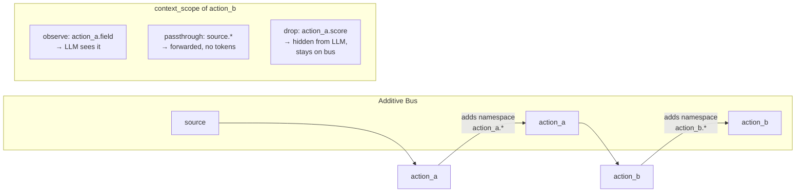

# Context Scoping

## The bus

Every record carries an additive bus. Each action appends its namespace — nothing is removed. `context_scope` controls what any given action sees and forwards.



## The three directives

| Directive | LLM sees? | On bus? | Use for |
|-----------|:---------:|:-------:|---------|
| `observe` | Yes | Yes (already there) | Fields the action needs to read and reason over |
| `passthrough` | No | Yes | Fields needed downstream but not by this action — zero token cost |
| `drop` | No | No (temporarily hidden) | Remove a field from the LLM's view while keeping it on the bus |

The bus is append-only. `observe` and `passthrough` don't add fields — they select and forward what's already there. `drop` hides a field from this action's context without deleting it.

## Dependency anchor rule

Every dependency must have at least one field in `observe`. The framework needs this to resolve record matching. Even a guard-only dependency requires an anchor:

```yaml
- name: next_action
  dependencies: [gate_action, data_action]
  guard: { condition: 'gate_action.passed == true', on_false: "filter" }
  context_scope:
    observe:
      - gate_action.passed        # anchor for gate_action dependency
      - data_action.result        # anchor for data_action dependency
```

## Wildcard vs explicit fields

Use `.*` when the action needs everything from a namespace — typically for merge/aggregate tools and consolidation actions:

```yaml
observe: [upstream_action.*]
```

Use explicit fields when the action needs only a subset. This reduces token cost and prevents context pollution from large upstream fields:

```yaml
observe:
  - upstream_action.key_field
  - upstream_action.score
```

Never observe `source.raw_content` or other large fields in downstream actions. Distil first (extract the relevant passage), then observe the distilled field.

## Passthrough pattern

Use `passthrough` when an action needs to forward upstream fields to downstream consumers without the current LLM seeing them. Common in enrichment steps where the action adds new fields but the original fields are needed later:

```yaml
- name: enrich_record
  dependencies: [extract_data]
  context_scope:
    observe:
      - extract_data.key_field       # what this action needs
    passthrough:
      - extract_data.*               # everything else forwarded without tokens
```

Downstream actions can then observe any field from `extract_data` without `enrich_record` having paid tokens for it.

## Drop for bias prevention

Use `drop` when a field should be on the bus (for downstream) but must not influence the current LLM — for example, user ratings or prior scores that could bias an independent evaluation:

```yaml
- name: independent_scorer
  dependencies: [upstream_action]
  context_scope:
    observe:
      - upstream_action.*
    drop:
      - upstream_action.prior_score   # scorer shouldn't see previous scores
      - upstream_action.user_rating
```

The fields remain on the bus after this action completes. Downstream actions can still observe them.

## Common mistakes

**Guard field not in observe:** The framework can't resolve a guard condition against a field that isn't anchored. Always include the guard field in observe:
```yaml
guard: { condition: 'checker.passed == true', on_false: "filter" }
context_scope:
  observe:
    - checker.passed    # required — guard uses this field
```

**Observing a large field in downstream actions:** If `source.raw_content` is in the observe list of an action that only needs a quote or summary, the full content goes into every LLM call. Extract it to a distilled field first.

**Missing passthrough at fan-in points:** When multiple parallel branches merge into one action, each branch carries its own namespace. If an earlier upstream namespace isn't in `observe` or `passthrough` on the merge action, it drops off the bus at that point.
