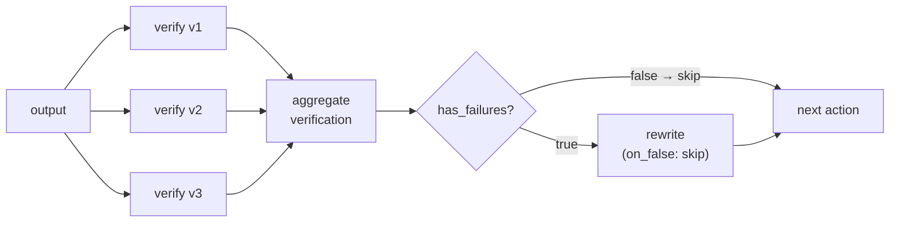
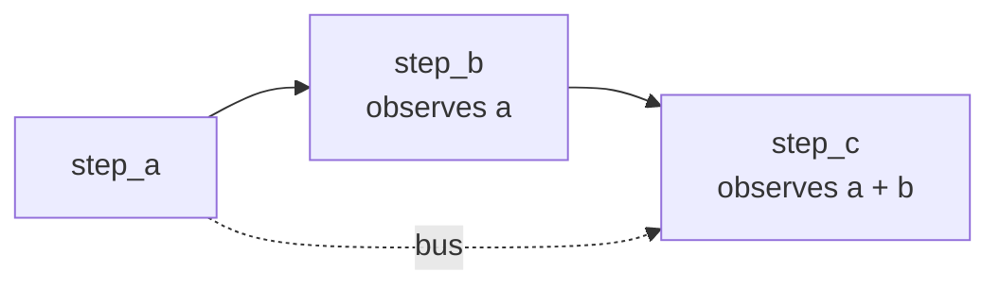
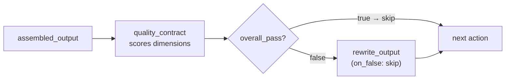

# Loop Patterns

Loops in agent-actions are not literal loops — they are chains of actions where the output of one feeds the next, with guards controlling whether the chain continues or short-circuits. Three main shapes.

## Verify → Rewrite loop

The most common loop. N verifiers run in parallel, a tool aggregates their verdicts, and the rewrite action only fires for records that failed. Clean records skip the rewrite with `on_false: skip` (not filter — the record continues downstream either way).



```yaml
- name: verify
  versions: { param: verifier_id, range: [1, 2, 3], mode: parallel }
  schema:
    selected_answer: string
    reasoning: string

- name: aggregate_verification
  kind: tool
  version_consumption: { source: verify, pattern: merge }
  schema:
    answer_matches: boolean
    has_failures: boolean
    failure_summary: string

- name: rewrite
  guard: { condition: 'aggregate_verification.has_failures == true', on_false: "skip" }
  context_scope:
    observe:
      - aggregate_verification.failure_summary
      - aggregate_verification.has_failures   # dependency anchor
      - original_output.*
```

The rewrite action observes `failure_summary` so the LLM knows exactly what to fix. After rewriting, a downstream action that needs the final output should observe both the original output and the rewrite, using `` to pick whichever is non-null:

```

{{ rewrite.corrected_output }}

{{ original_output.output }}

```

## Aggregate threshold patterns

The aggregate tool decides pass/fail. Three common threshold approaches:

**Majority (2 of 3):** Pass if at least 2 verifiers agree.
```python
votes = [data[f"verify_{i}"][f"verify_{i}"]["selected_answer"] for i in [1,2,3]]
majority = Counter(votes).most_common(1)[0]
answer_matches = majority[1] >= 2
```

**Unanimous:** Fail if any verifier disagrees. Use for high-stakes checks.
```python
answer_matches = len(set(votes)) == 1
```

**Any failure:** Fail if any verifier flagged an issue. Use when false negatives are costly.
```python
has_failures = any(data[f"verify_{i}"][f"verify_{i}"]["passed"] == False for i in [1,2,3])
```

## Sequential enrichment loop

Each step adds context the next step uses. Unlike the verify loop, these actions don't share a parallel structure — they form a straight chain where each action enriches what the next observes. Because the bus accumulates, later actions can still reach earlier namespaces directly.



```yaml
- name: step_a
  schema: { output_a: string }

- name: step_b
  dependencies: [step_a]
  schema: { output_b: string }
  context_scope:
    observe: [step_a.*]

- name: step_c
  dependencies: [step_b]
  schema: { output_c: string }
  context_scope:
    observe:
      - step_a.output_a   # still accessible — bus is cumulative
      - step_b.output_b
```

Because the bus accumulates, `step_c` can still observe `step_a.output_a` even though `step_b` is the declared dependency. The dependency sets execution order; observe controls what data the LLM receives.

## Contract check loop

A quality contract action scores the output against a rubric. If it fails, the rewrite fires. The contract and the rewrite together form a bounded correction gate — not an unbounded retry.



```yaml
- name: quality_contract
  schema:
    dimension_a_pass: boolean
    dimension_b_pass: boolean
    overall_pass: boolean
    total_score: integer
    failure_notes: string

- name: rewrite_output
  guard: { condition: 'quality_contract.overall_pass == false', on_false: "skip" }
  context_scope:
    observe:
      - quality_contract.failure_notes
      - quality_contract.overall_pass   # anchor
      - assembled_output.*
```

The contract action explicitly scores multiple dimensions (each as a boolean + score), making the failure reason structured and actionable for the rewrite.
