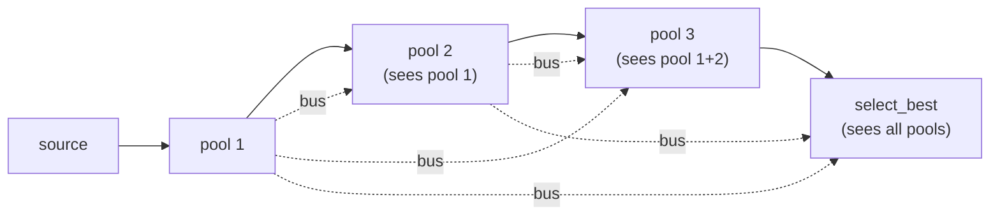
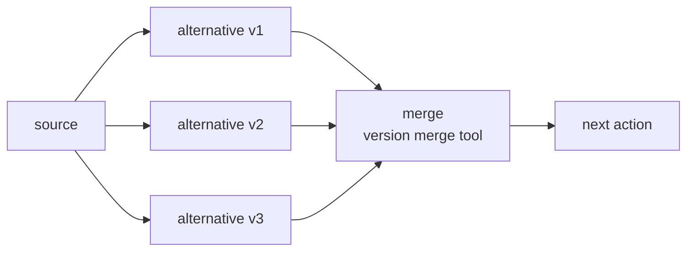

# Pooling Approach

The pooling pattern generates a set of candidates before selecting. A single generation action produces one output and hopes it's good; a pool of N gives a selector real options to evaluate, and selection quality compounds with pool diversity.

## Sequential pooling

Each pool action sees the output of all prior pools and is explicitly instructed to explore different territory. By the time pool 3 runs, it knows what pools 1 and 2 already produced and can avoid repeating them.



```yaml
- name: generate_pool_1
  schema:
    candidate_a: string
    candidate_b: string
    candidate_c: string

- name: generate_pool_2
  dependencies: [generate_pool_1]
  schema:
    candidate_a: string
    candidate_b: string
    candidate_c: string
  context_scope:
    observe:
      - generate_pool_1.*   # sees pool 1 — prompt instructs: explore different angles

- name: generate_pool_3
  dependencies: [generate_pool_2]
  schema:
    candidate_a: string
    candidate_b: string
    candidate_c: string
  context_scope:
    observe:
      - generate_pool_1.*   # sees pools 1 and 2
      - generate_pool_2.*

- name: select_best
  dependencies: [generate_pool_3]
  context_scope:
    observe:
      - generate_pool_1.*   # selector sees the full pool
      - generate_pool_2.*
      - generate_pool_3.*
```

The prompt for pool 2 must include an explicit instruction like: "The following candidates already exist — do not repeat them. Explore different mechanisms or angles." The prompt for pool 3 does the same for both prior pools.

## Parallel pooling

When the pools are independent (no need for diversity constraint), run them in parallel using versions. The selector still sees all of them.



```yaml
- name: generate_alternative
  dependencies: [source_action]
  versions: { param: variant_id, range: [1, 2, 3], mode: parallel }
  schema:
    alternative_code: string
    issue_description: string
  context_scope:
    observe:
      - source_action.primary_output

- name: merge_alternatives
  dependencies: [generate_alternative]
  kind: tool
  version_consumption: { source: generate_alternative, pattern: merge }
  schema: merge_alternatives   # suffixes fields: alternative_code_1, alternative_code_2, ...
```

The merge tool receives double-nested data:
```python
alt_1 = data["generate_alternative_1"]["generate_alternative_1"]["alternative_code"]
alt_2 = data["generate_alternative_2"]["generate_alternative_2"]["alternative_code"]
```

## Selection action design

The selector observes all pools and the original context needed to judge them. Its schema should capture not just the selection but the reasoning, so the rationale is available downstream.

```yaml
- name: select_best
  context_scope:
    observe:
      - generate_pool_1.*
      - generate_pool_2.*
      - generate_pool_3.*
      - source_context.key_criterion   # what selection should optimise for
  schema:
    selected_candidate: string
    selection_reasoning: string
    runner_up: string
```

The selector prompt should state the selection criterion explicitly rather than leaving it implicit — "select the candidate that is most plausible to a reader who misunderstood X" is better than "select the best one."

## Pooling vs versioning

| | Pooling | Versioning |
|---|---|---|
| **Structure** | N sequential or parallel actions | One action definition, N parallel instances |
| **Data access** | Each pool action can observe prior pools | All versions are independent (same prompt) |
| **Use when** | Candidates need to be diverse and non-overlapping | Multiple independent perspectives on the same input |
| **Merge** | `select_best` action reads all namespaces | Version merge tool with `version_consumption` |

Use sequential pooling when diversity matters — candidates, alternatives, or variations that must not repeat across pools. Use versioning when independence matters — voters, verifiers, or extractors that should each produce an unbiased result from the same input.
