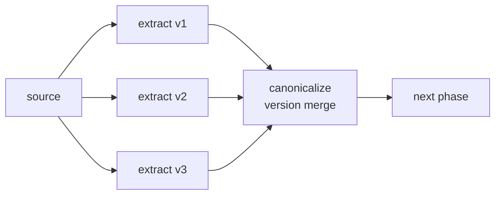
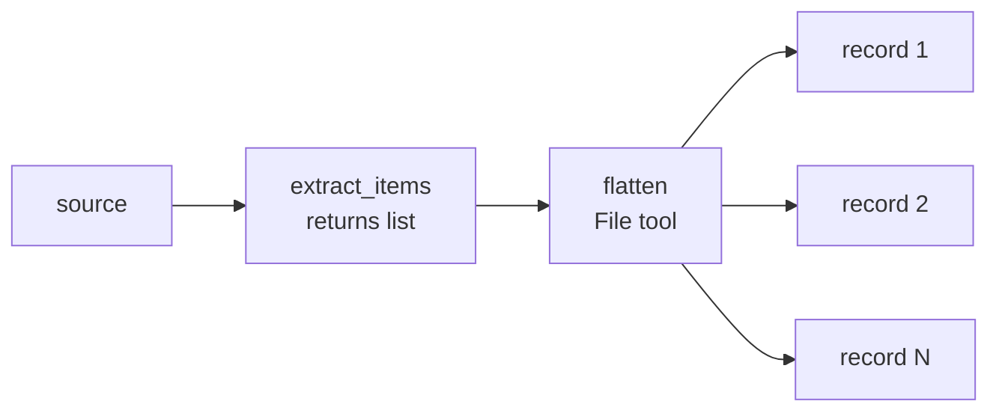
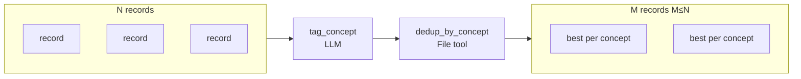
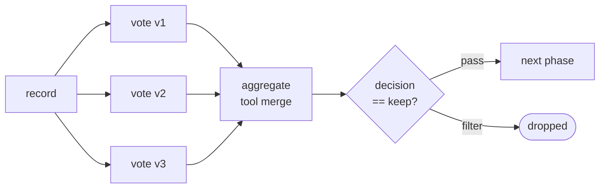
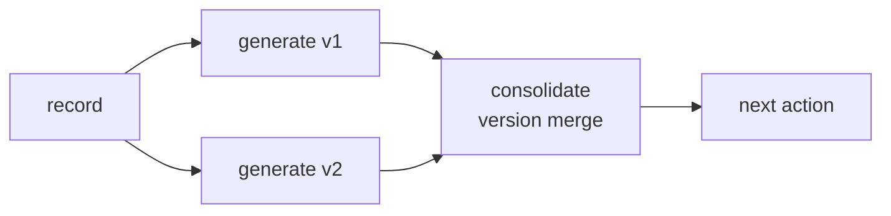
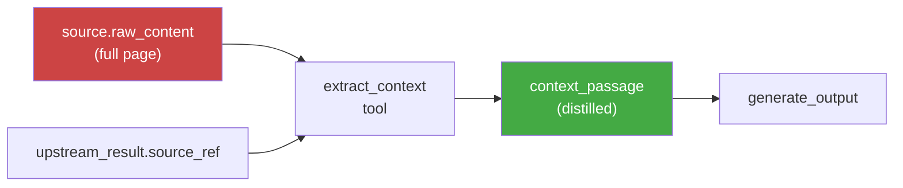
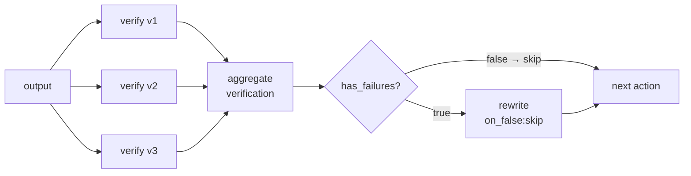
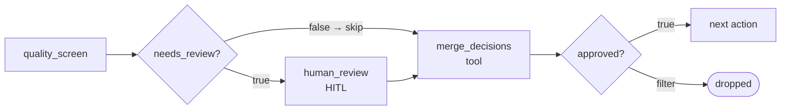

# Workflow Design Patterns

These are the building blocks of high-quality workflows. Compose them in phases — each phase narrows, enriches, or validates the record set before the next.

## Diversity Extraction

Run the same extraction action N times with different iteration parameters so each pass surfaces what others missed. Merge into a single canonical set.



```yaml
- name: extract_raw
  versions: { param: iteration, range: [1, 2, 3], mode: parallel }
  schema: { items: array }

- name: canonicalize
  version_consumption: { source: extract_raw, pattern: merge }
  intent: "Deduplicate and canonicalize across extraction versions"
  context_scope:
    observe: [extract_raw.*]
```

## 1→N Expand

When an LLM returns a list, flatten it into individual records. Each item becomes its own record carrying the full upstream bus.



```yaml
- name: extract_items      # LLM returns: { items: [...] }

- name: flatten_items
  kind: tool
  impl: flatten_items
  granularity: File         # receives all records; returns one record per item
```

## Semantic Dedup

After expansion, remove near-duplicates before expensive downstream generation. Tag each record with a concept label, then keep the best per concept using a file-mode tool.



```yaml
- name: tag_concept         # LLM: assigns a coarse concept_label
  schema: { concept_label: string }

- name: dedup_by_concept    # File tool: FileUDFResult, keeps best-scoring per concept
  kind: tool
  granularity: File
```

The `dedup_by_concept` tool must return `FileUDFResult` (not `list[dict]`) so its output namespace carries the fields downstream actions need to observe.

## Quality Voting

Run N independent voters. Aggregate by majority. Guard the next phase on the aggregate verdict.



```yaml
- name: vote
  versions: { param: voter_id, range: [1, 2, 3], mode: parallel }
  schema: { vote: string, reasoning: string }

- name: aggregate_votes
  kind: tool
  version_consumption: { source: vote, pattern: merge }
  schema: { decision: string, vote_summary: string }

- name: next_phase
  guard: { condition: 'aggregate_votes.decision == "keep"', on_false: "filter" }
  context_scope:
    observe:
      - aggregate_votes.decision   # dependency anchor
```

## Parallel Generate → Consolidate

Generate N independent outputs, then consolidate — pick the best or synthesise across them. Reduces the risk of a single-model pass hallucinating.



```yaml
- name: generate_output
  versions: { param: variant_id, range: [1, 2], mode: parallel }

- name: consolidate_outputs
  version_consumption: { source: generate_output, pattern: merge }
  intent: "Select and ground the best result across independent generations"
  context_scope:
    observe: [generate_output.*]
```

## Distil Before Generating

Extract a tight context window before any generation action observes it. Never pass the full source page to a downstream action — always observe the distilled version.



```yaml
- name: extract_context     # tool: extracts the relevant passage from the source
  context_scope:
    observe:
      - upstream_result.source_ref
      - source.raw_content

- name: generate_output
  context_scope:
    observe:
      - extract_context.context_passage   # distilled passage, not source.raw_content
      - upstream_result.output_text
```

## Verify → Rewrite-if-Failed

Run N verifiers in parallel. Aggregate their verdicts. The rewrite action only fires when failures are confirmed — clean records skip it entirely with `on_false: skip`.



```yaml
- name: verify
  versions: { param: verifier_id, range: [1, 2, 3], mode: parallel }
  schema: { passed: boolean, failure_reasons: string }

- name: aggregate_verification
  kind: tool
  version_consumption: { source: verify, pattern: merge }
  schema: { has_failures: boolean, combined_issues: string }

- name: rewrite
  guard: { condition: 'aggregate_verification.has_failures == true', on_false: "skip" }
  context_scope:
    observe:
      - aggregate_verification.combined_issues
      - original_output.*
```

## HITL as Conditional Gate

Route only uncertain records to human review — clear passes skip it. Use `on_false: skip` (not filter) before the HITL action, then a normalize tool merges auto-pass and human-approve into a single boolean.



```yaml
- name: quality_screen
  schema: { passed: boolean, needs_review: boolean, reason: string }

- name: human_review
  kind: hitl
  granularity: file
  guard: { condition: 'quality_screen.needs_review == true', on_false: "skip" }

- name: merge_decisions      # tool: merges auto-pass + human-approve → approved: boolean
  dependencies: [human_review, quality_screen]
  guard: { condition: 'merge_decisions.approved == true', on_false: "filter" }
```
