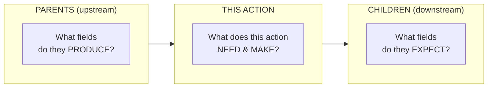
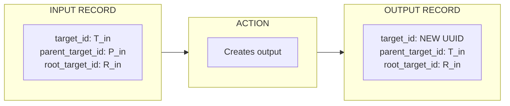
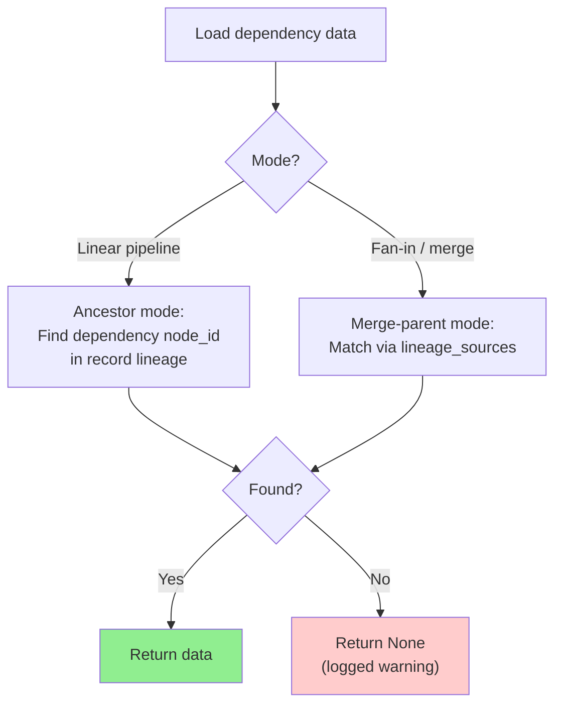

# Action Anatomy Reference

Complete guide to understanding and creating workflow actions.

## Table of Contents

- [Action Structure Diagram](#action-structure-diagram)
- [LLM Action Anatomy](#llm-action-anatomy)
- [Tool Action (UDF) Anatomy](#tool-action-udf-anatomy)
- [Component Deep Dive](#component-deep-dive)
- [Pre-Creation Checklist](#pre-creation-checklist)
- [Data Flow Verification](#data-flow-verification)
- [Common Patterns](#common-patterns)
- [Data Lineage](#data-lineage)
- [Record Matching](#record-matching)

## Action Structure Diagram



**ASCII Version:**
```
┌──────────────┐     ┌──────────────┐     ┌──────────────┐
│   PARENTS    │────▶│  THIS ACTION │────▶│   CHILDREN   │
│ (upstream)   │     │              │     │ (downstream) │
└──────────────┘     └──────────────┘     └──────────────┘
       │                    │                    │
       ▼                    ▼                    ▼
 What fields do      What does this       What fields do
 they PRODUCE?       action NEED & MAKE?  they EXPECT?
```

## LLM Action Anatomy

```yaml
- name: generate_explanation              # IDENTITY
  dependencies: [validate_data]           # PARENTS - what runs before
  intent: "Generate educational content"  # PURPOSE - human description
  
  # EXECUTION CONFIG
  model_vendor: openai
  model_name: gpt-4o-mini
  api_key: OPENAI_API_KEY
  json_mode: true
  
  # OUTPUT DEFINITION
  schema:                                 # What this action PRODUCES
    explanation: string                   # Only LLM-computed fields!
    key_points: array
  
  # INPUT DEFINITION  
  context_scope:                          # What this action can ACCESS
    observe:
      - validate_data.*                   # From parent
      - source.page_content               # From lineage
  
  # CONDITIONAL EXECUTION
  guard:                                  # When to run/skip
    condition: 'validation_status == "PASS"'
    on_false: "filter"
  
  # INSTRUCTIONS
  prompt: $workflow.Generate_Explanation  # LLM instructions
```

## Tool Action (UDF) Anatomy

```yaml
- name: process_data                      # IDENTITY
  dependencies: [extract_content]         # PARENTS
  kind: tool                              # Marks as UDF
  impl: process_data_function             # Python function name
  intent: "Transform and enrich data"     # PURPOSE
  
  # EXECUTION CONFIG
  granularity: Record                     # Record (default) | File
  
  # INPUT DEFINITION
  context_scope:
    observe:
      - extract_content.*                 # From parent
      - source.metadata                   # From lineage
  
  # CONDITIONAL EXECUTION  
  guard:
    condition: 'status == "valid"'
    on_false: "filter"
```

**Note:** UDFs don't have `schema` - their output is defined by their return value.

## Component Deep Dive

### name (Required)
- Unique identifier for the action
- Used in `dependencies` by other actions
- Used in `context_scope.observe` references
- Creates output folder: `target/<name>/`

### dependencies (Required)
- List of actions that must complete BEFORE this one runs
- Controls EXECUTION ORDER only
- ALL dependencies must also appear in `context_scope.observe`

```yaml
# Single dependency
dependencies: [parent_action]

# Multiple dependencies (merge pattern)
dependencies: [action_a, action_b, action_c]

# Cross-workflow dependency
dependencies:
  - workflow: other_workflow
    action: final_action
```

### context_scope.observe (Required)
- Controls WHAT DATA this action can access
- Can access ANY ancestor via lineage, not just direct parents
- Use wildcards for all fields: `action.*`
- Use specific fields: `action.field_name`

```yaml
context_scope:
  observe:
    - parent_action.*              # All fields from parent
    - grandparent.specific_field   # Specific field via lineage
    - source.page_content          # Original input data
```

### schema (LLM Actions Only)
- Defines fields the LLM will PRODUCE
- Should ONLY contain computed fields, NOT forwarded fields
- Downstream actions access forwarded fields via lineage

```yaml
# CORRECT: Only computed fields
schema:
  explanation: string
  confidence: number

# WRONG: Including forwarded fields
schema:
  explanation: string
  original_text: string    # This is forwarded, not computed!
```

### impl (Tool Actions Only)
- Name of the Python function with @udf_tool decorator
- Must match exactly (case-sensitive)
- Function must be in a file under `tools/` directory

```yaml
impl: my_processing_function

# Corresponding Python:
@udf_tool()
def my_processing_function(data):
    ...
```

### guard (Optional)
- Conditional execution based on INPUT data
- `on_false: "filter"` - Remove record from pipeline
- `on_false: "skip"` - Skip this action, pass data through

```yaml
guard:
  condition: 'status == "PASS" and score >= 8'
  on_false: "filter"
```

**CRITICAL:** Guards check INPUT, not OUTPUT. To filter based on an action's output, place the guard on the NEXT action.

### prompt (LLM Actions Only)
- Reference to prompt template in `prompt_store/`
- Format: `$workflow_name.Prompt_Name`

```yaml
prompt: $code_quiz.Generate_Explanation
```

## Pre-Creation Checklist

Before creating ANY action:

```
□ 1. Read the full workflow YAML
□ 2. Identify parent actions (dependencies)
□ 3. Check what fields parents produce
     └─ cat target/<parent>/sample.json | jq '.[] | .content | keys'
□ 4. Identify child actions (who depends on this)
□ 5. Check what fields children expect
     └─ grep -A5 "dependencies:.*<this_action>" workflow.yml
□ 6. Design the action with clear inputs and outputs
□ 7. If UDF: ensure content wrapper handling
□ 8. If UDF: ensure return is a list
□ 9. Verify guard placement (INPUT not OUTPUT)
```

## Data Flow Verification

### Check Parent Output
```bash
cat agent_io/target/<parent>/sample.json | python3 -c "
import json, sys
data = json.load(sys.stdin)
if data:
    content = data[0].get('content', data[0])
    print('Fields:', list(content.keys()))
    print('Sample values:')
    for k, v in list(content.items())[:5]:
        print(f'  {k}: {str(v)[:50]}...')
"
```

### Check What Children Expect
```bash
# Find all actions that depend on this one
grep -B2 -A10 "dependencies:.*\[.*my_action" agent_config/*.yml
```

### Verify Field Flow
```bash
# Check if a specific field flows through
grep "observe:" -A20 agent_config/*.yml | grep "my_field"
```

## Common Patterns

### Validation Pattern
```yaml
# 1. Action produces status
- name: validate_data
  schema:
    validation_status: string
    
# 2. Guard on NEXT action
- name: use_validated
  dependencies: [validate_data]
  guard:
    condition: 'validation_status == "PASS"'
```

### Merge Pattern
```yaml
# Multiple parents, single child
- name: merge_results
  dependencies: [action_a, action_b, action_c]
  context_scope:
    observe:
      - action_a.*
      - action_b.*
      - action_c.*
```

### Version Merge Pattern
```yaml
# Parallel versions merged
- name: aggregate
  dependencies: [versioned_action]
  version_consumption:
    source: versioned_action
    pattern: merge
  context_scope:
    observe:
      - versioned_action.*  # Captures ALL versions
```

## Data Lineage

Every record carries ancestry metadata for tracking through parallel branches and merges:



**Propagation Rules:**
1. `target_id` = new UUID (unique for each output)
2. `parent_target_id` = input's `target_id` (links to immediate parent)
3. `root_target_id` = input's `root_target_id` (preserves original ancestor)

## Record Matching

When loading historical data, Agent Actions uses **deterministic node_id matching** with two modes:



| Mode | Purpose | Use Case |
|------|---------|----------|
| **Ancestor** | Exact node_id match in lineage chain | Sequential pipelines |
| **Merge-parent** | Match via `lineage_sources` (merge-parent node_ids) | Fan-in / aggregate patterns |

There are no fallback tiers. If the exact node_id is not found, the record returns `None` and a warning is logged. This prevents silent data corruption from fuzzy matching.
