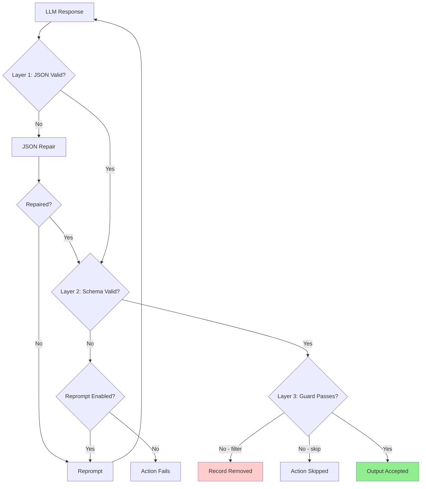
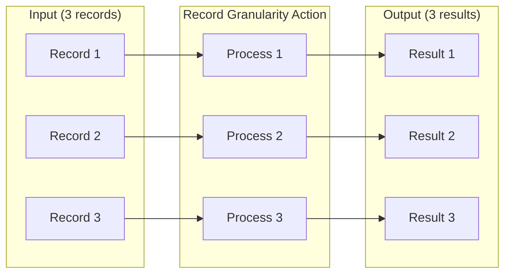
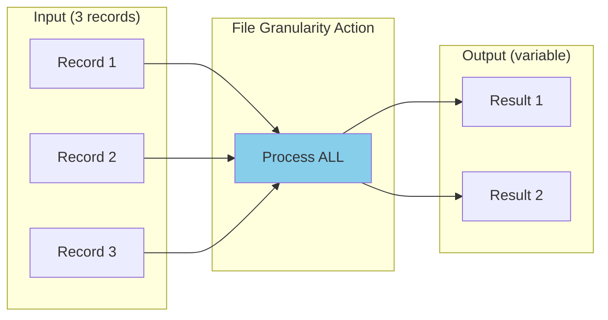
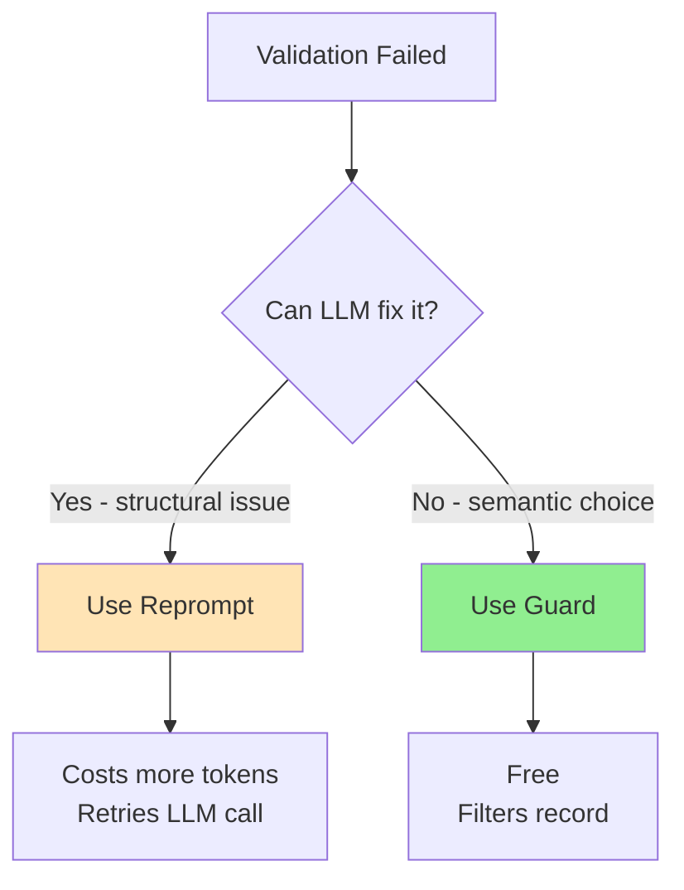

# Debugging Guide

Comprehensive troubleshooting for agent-actions workflows.

## Triage Checklist

When investigating `agac run` output, follow this checklist in order. Each step catches a specific category of bug.

### 1. Tally vs Reality

Compare the tally line against what's in the storage backend. Check the workflow config for `storage_backend` type, then query accordingly:

```bash
# Check .agent_status.json for action states
cat agent_workflow/<workflow>/agent_io/.agent_status.json | python3 -m json.tool

# Check target data — look at output files per action
for dir in agent_workflow/<workflow>/agent_io/target/*/; do
  echo "=== $(basename $dir) ==="
  cat "$dir"/*.json 2>/dev/null | python3 -c "
import json, sys
data = json.load(sys.stdin)
print(f'  Records: {len(data)}')
if data:
    print(f'  Fields: {list(data[0].get(\"content\", data[0]).keys())[:8]}')
" 2>/dev/null || echo "  No data"
done
```

- Action marked OK with 0 records → false positive (InitialStrategy bug)
- Action missing from target but "completed" in `.agent_status.json` → stale state

### 2. Guard Evaluation

If you see unexpected skips, verify the guard condition against actual upstream data:

```bash
# Check what field values the upstream action actually produced
cat agent_workflow/<workflow>/agent_io/target/<upstream>/*.json | python3 -c "
import json, sys
data = json.load(sys.stdin)
for r in data:
    content = r.get('content', r)
    print({k: v for k, v in content.items() if not k.startswith('_')})" 2>/dev/null
```

**Known bug:** `!=` and `>` operators silently evaluate as `==`. Test directly:
```python
from agent_actions.input.preprocessing.filtering.guard_filter import GuardFilter, FilterItemRequest
gf = GuardFilter()
r = gf.filter_item(FilterItemRequest(data={"field": "value"}, condition='field != "x"'))
print(r.matched)  # False = BUG
```

### 3. First Action Failures

If the first action's API call fails (401, network error), check whether the failure was caught:
- `record_count=0` + `failed` dispositions = bug (InitialStrategy missing failure check)
- The action completes as OK, circuit breaker doesn't fire, downstream runs on empty data

### 4. CLI Status Message

"Workflow paused - batch job(s) submitted" for non-batch workflows means the CLI uses a binary check: `is_workflow_complete()` → SUCCESS, else → "batch submitted". Any failure, skip, or partial completion triggers this misleading message.

### 5. Tool UDF Data Access

If a tool action produces zero/default values:
- Fields arrive FLAT in content: `content["consensus_score"]`
- NOT namespaced: `content["aggregate_scores"]["consensus_score"]` → always returns `{}`
- Check the tool code for `content.get("<action_name>", {})` patterns

### 6. Schema Field Drift

If downstream actions fail with "declared fields not found":
- The LLM may produce different field names than the schema defines
- Check DB: `SELECT data FROM target_data WHERE action_name='<action>';`
- Compare actual keys against schema `id:` values

---

## Validation Pipeline Overview

LLM outputs pass through three validation layers:



| Layer | Purpose | Mechanism |
|-------|---------|-----------|
| **1. JSON** | Structural integrity | JSON repair + reprompt |
| **2. Schema** | Type/field validation | Schema constraints + reprompt |
| **3. Guard** | Semantic validation | Condition expressions |

## Pre-Run Verification

Before running a workflow, check these common blockers:

```bash
# 1. API keys exist for all vendors used
env | grep -E "OPENAI_API_KEY|ANTHROPIC_API_KEY|GROQ_API_KEY" | cut -d= -f1

# 2. Seed files referenced in config actually exist
ls agent_workflow/<workflow>/seed_data/

# 3. Clear stale cache from failed prior runs
rm -rf agent_workflow/<workflow>/agent_io/target/*
rm -rf agent_workflow/<workflow>/agent_io/source/
```

## Stale Cache Diagnosis

**Symptom:** Re-running after a failure completes in 0.03s. Actions show "completed" with empty output.

**Cause:** Failed runs cache empty results. The framework sees "completed" status and skips re-execution, serving cached empties.

**Diagnosis:**
```bash
# Check for suspiciously fast completions and empty outputs
for dir in agent_workflow/<workflow>/agent_io/target/*/; do
  size=$(wc -c < "$dir/sample.json" 2>/dev/null || echo "0")
  if [ "$size" -le 2 ]; then
    echo "EMPTY: $dir"
  fi
done
```

**Fix:** Clear target and source directories, then re-run:
```bash
rm -rf agent_workflow/<workflow>/agent_io/target/*
rm -rf agent_workflow/<workflow>/agent_io/source/
agac run -a <workflow>
```

## Quick Diagnostics

### Check Record Counts Per Stage

```bash
cd agent_workflow/my_workflow/agent_io/target
for dir in */; do
  count=$(cat "$dir/sample.json" 2>/dev/null | python3 -c "import json,sys; print(len(json.load(sys.stdin)))" 2>/dev/null || echo "0")
  echo "$count records - $dir"
done
```

### Check File Sizes for Empty Outputs

```bash
# 2 bytes = empty array []
ls -lh */sample.json | awk '{print $5 " - " $9}'
```

### Analyze Validation Results

```bash
cat validate_code_quality/sample.json | python3 -c "
import json, sys
data = json.load(sys.stdin)
print(f'Total: {len(data)} records')
for i, record in enumerate(data, 1):
    content = record.get('content', {})
    status = content.get('validation_status', 'unknown')
    print(f'  Record {i}: {status}')
    if status != 'PASS':
        reasoning = content.get('validation_reasoning', '')[:150]
        print(f'    Reason: {reasoning}...')
"
```

## Common Error Messages

| Error | Cause | Fix |
|-------|-------|-----|
| "X was unexpected" | Field in data not in TypedDict | Add field to TypedDict |
| "X is not of type Y" | Type mismatch | Use correct type or `Any` |
| "Duplicate UDF function name" | Same name in multiple dirs | Remove duplicate or rename |
| "Dependency not in context_scope" | Missing reference | Add `action.*` to observe |
| "declared fields not found" | Schema field name doesn't match LLM output | Rename schema `id:` to match actual output |
| "None is not of type 'object'" | Guard-filtered upstream, schema expects non-null | Remove from schema or handle None in tool |
| "Additional properties are not allowed" | Tool returns fields not in schema | Add fields to schema (outside `required`) |
| "batch job(s) submitted" (no batch) | CLI catch-all for non-complete state | Check actual errors in tally/DB |
| "Drop directive matched zero fields" | Drop targets unreachable namespace | Remove the drop or ignore the warning |

## Filtered Pipeline Debugging

When guards filter records and downstream actions have 0 output:

### Symptom
```
validate_code_quality: 5 records
generate_explanation:  0 records  ← All filtered!
```

### Debugging Steps

1. Check upstream output for field values
2. Verify guard condition matches data exactly (case-sensitive)
3. Temporarily disable guard to test flow

### Fix Options

- Fix upstream prompts to produce passing values
- Lower threshold: `>= 7` instead of `>= 8`
- Allow multiple statuses: `'status == "PASS" or status == "NEEDS_REVIEW"'`

## Known Tool Limitations

| Issue | Workaround |
|-------|------------|
| Manifest shows "pending" after completion | Count records from sample.json |
| run_results.json empty | Check individual action outputs |
| Validation at runtime only | Check events.json on "success" |

## Debug Commands

```bash
# See compiled workflow (schemas inlined, versions expanded)
agac render -a my_workflow

# Run with debug output
AGENT_ACTIONS_LOG_LEVEL=DEBUG agac run -a my_workflow

# Execute with upstream dependencies
agac run -a my_workflow --upstream
```

### Debugging Schema Issues

Use `agac render` to verify schemas are compiled correctly:

```bash
agac render -a my_workflow | grep -A 10 "schema:"
```

This shows inlined schemas - if you see `schema_name:` still present, the schema file may be missing.

## Granularity Visualization

### Record Granularity (default)
Each record processed independently:



### File Granularity
All records processed at once (for aggregation/dedup):



**Note:** Guards are NOT supported with File granularity - implement filtering in your UDF.

## Reprompt vs Guard Decision



| Use Reprompt | Use Guard |
|--------------|-----------|
| Malformed JSON | Valid but unwanted value |
| Schema violation | Score below threshold |
| Missing required field | Wrong category |
| LLM can learn from error | Business logic decision |
