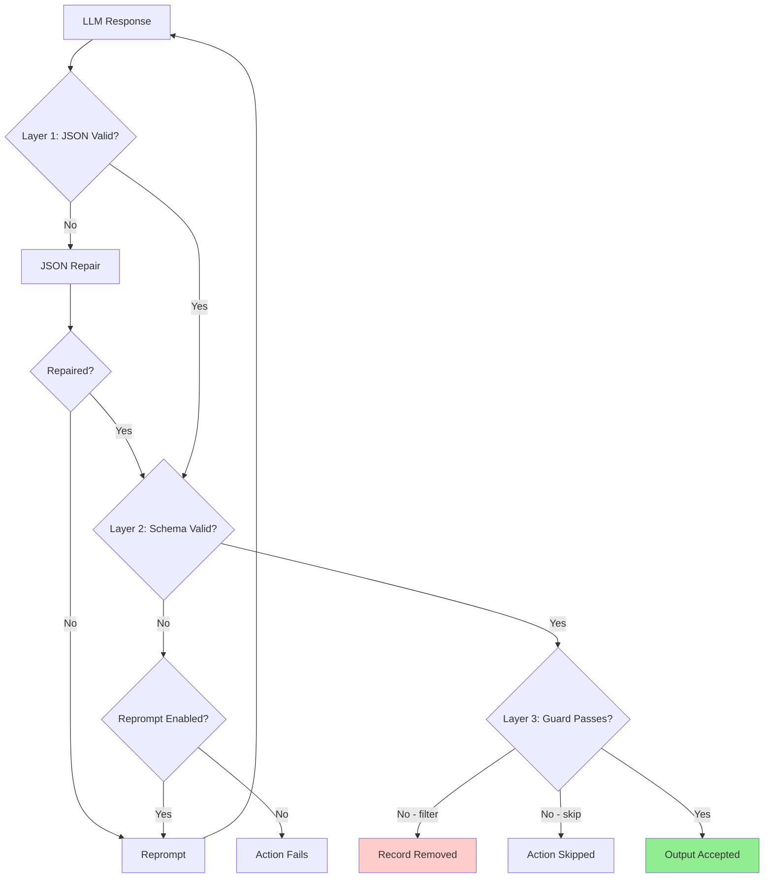
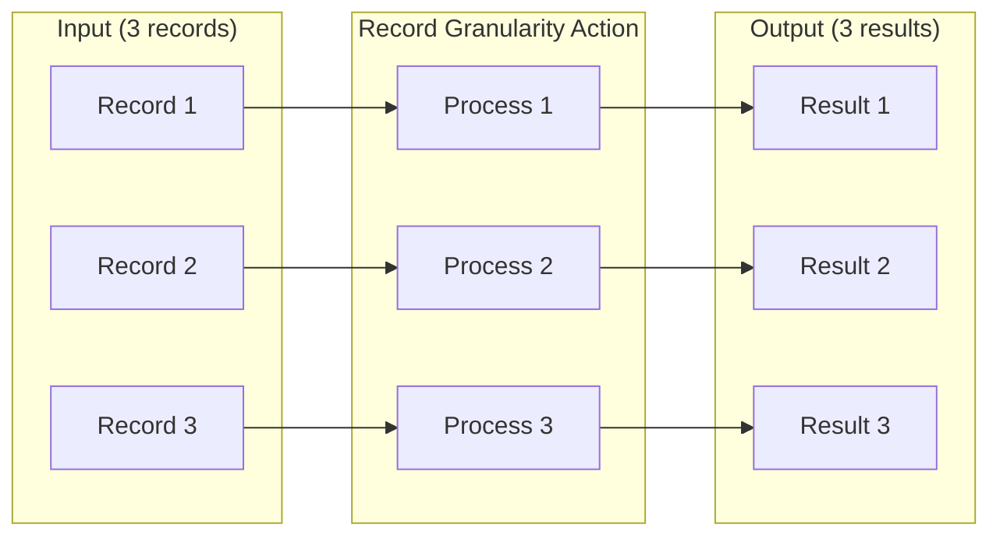
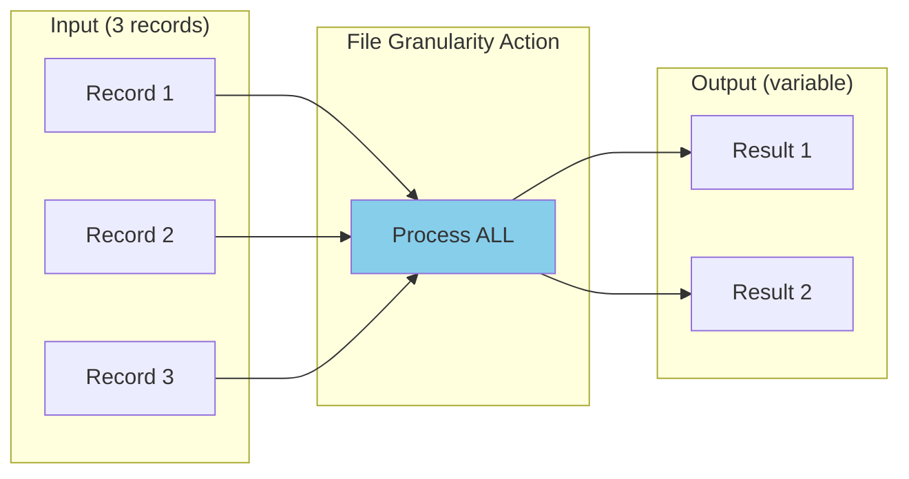
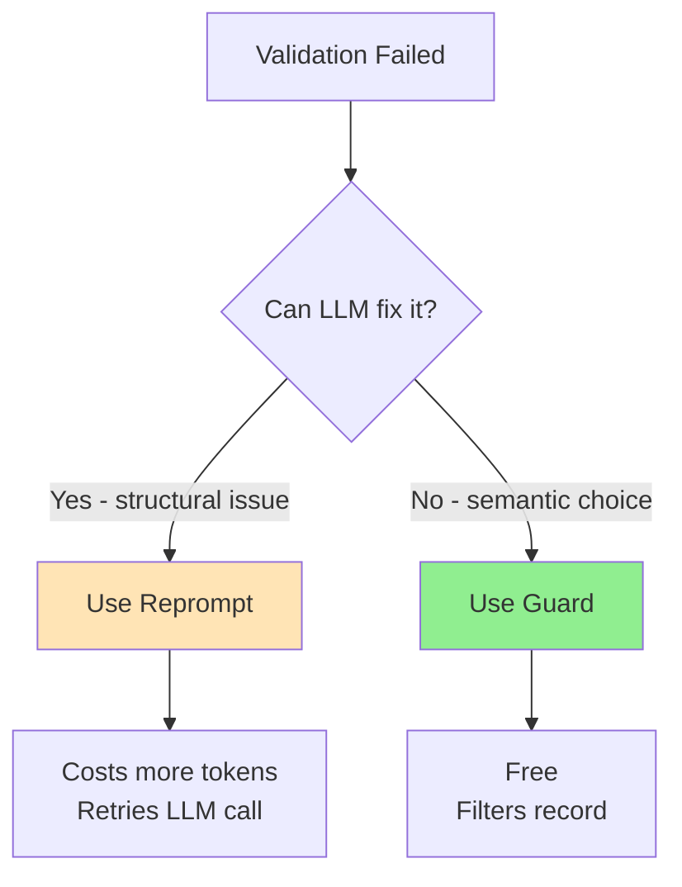

# Debugging Guide

Comprehensive troubleshooting for agent-actions workflows.

## Validation Pipeline Overview

LLM outputs pass through three validation layers:



| Layer | Purpose | Mechanism |
|-------|---------|-----------|
| **1. JSON** | Structural integrity | JSON repair + reprompt |
| **2. Schema** | Type/field validation | Schema constraints + reprompt |
| **3. Guard** | Semantic validation | Condition expressions |

## Pre-Run Verification

Before running a workflow, check these common blockers:

```bash
# 1. API keys exist for all vendors used
env | grep -E "OPENAI_API_KEY|ANTHROPIC_API_KEY|GROQ_API_KEY" | cut -d= -f1

# 2. Seed files referenced in config actually exist
ls agent_workflow/<workflow>/seed_data/

# 3. Clear stale cache from failed prior runs
rm -rf agent_workflow/<workflow>/agent_io/target/*
rm -rf agent_workflow/<workflow>/agent_io/source/
```

## Stale Cache Diagnosis

**Symptom:** Re-running after a failure completes in 0.03s. Actions show "completed" with empty output.

**Cause:** Failed runs cache empty results. The framework sees "completed" status and skips re-execution, serving cached empties.

**Diagnosis:**
```bash
# Check for suspiciously fast completions and empty outputs
for dir in agent_workflow/<workflow>/agent_io/target/*/; do
  size=$(stat -f%z "$dir/sample.json" 2>/dev/null || echo "0")
  if [ "$size" -le 2 ]; then
    echo "EMPTY: $dir"
  fi
done
```

**Fix:** Clear target and source directories, then re-run:
```bash
rm -rf agent_workflow/<workflow>/agent_io/target/*
rm -rf agent_workflow/<workflow>/agent_io/source/
agac run -a <workflow>
```

## Quick Diagnostics

### Check Record Counts Per Stage

```bash
cd agent_workflow/my_workflow/agent_io/target
for dir in */; do
  count=$(cat "$dir/sample.json" 2>/dev/null | python3 -c "import json,sys; print(len(json.load(sys.stdin)))" 2>/dev/null || echo "0")
  echo "$count records - $dir"
done
```

### Check File Sizes for Empty Outputs

```bash
# 2 bytes = empty array []
ls -lh */sample.json | awk '{print $5 " - " $9}'
```

### Analyze Validation Results

```bash
cat validate_code_quality/sample.json | python3 -c "
import json, sys
data = json.load(sys.stdin)
print(f'Total: {len(data)} records')
for i, record in enumerate(data, 1):
    content = record.get('content', {})
    status = content.get('validation_status', 'unknown')
    print(f'  Record {i}: {status}')
    if status != 'PASS':
        reasoning = content.get('validation_reasoning', '')[:150]
        print(f'    Reason: {reasoning}...')
"
```

## Common Error Messages

| Error | Cause | Fix |
|-------|-------|-----|
| "X was unexpected" | Field in data not in TypedDict | Add field to TypedDict |
| "X is not of type Y" | Type mismatch | Use correct type or `Any` |
| "Duplicate UDF function name" | Same name in multiple dirs | Remove duplicate or rename |
| "Dependency not in context_scope" | Missing reference | Add `action.*` to observe |

## Filtered Pipeline Debugging

When guards filter records and downstream actions have 0 output:

### Symptom
```
validate_code_quality: 5 records
generate_explanation:  0 records  ← All filtered!
```

### Debugging Steps

1. Check upstream output for field values
2. Verify guard condition matches data exactly (case-sensitive)
3. Temporarily disable guard to test flow

### Fix Options

- Fix upstream prompts to produce passing values
- Lower threshold: `>= 7` instead of `>= 8`
- Allow multiple statuses: `'status == "PASS" or status == "NEEDS_REVIEW"'`

## Known Tool Limitations

| Issue | Workaround |
|-------|------------|
| Manifest shows "pending" after completion | Count records from sample.json |
| run_results.json empty | Check individual action outputs |
| Validation at runtime only | Check events.json on "success" |

## Debug Commands

```bash
# See compiled workflow (schemas inlined, versions expanded)
agac render -a my_workflow

# Run with debug output
AGENT_ACTIONS_LOG_LEVEL=DEBUG agac run -a my_workflow

# Execute with upstream dependencies
agac run -a my_workflow --upstream
```

### Debugging Schema Issues

Use `agac render` to verify schemas are compiled correctly:

```bash
agac render -a my_workflow | grep -A 10 "schema:"
```

This shows inlined schemas - if you see `schema_name:` still present, the schema file may be missing.

## Granularity Visualization

### Record Granularity (default)
Each record processed independently:



### File Granularity
All records processed at once (for aggregation/dedup):



**Note:** Guards are NOT supported with File granularity - implement filtering in your UDF.

## Reprompt vs Guard Decision



| Use Reprompt | Use Guard |
|--------------|-----------|
| Malformed JSON | Valid but unwanted value |
| Schema violation | Score below threshold |
| Missing required field | Wrong category |
| LLM can learn from error | Business logic decision |
