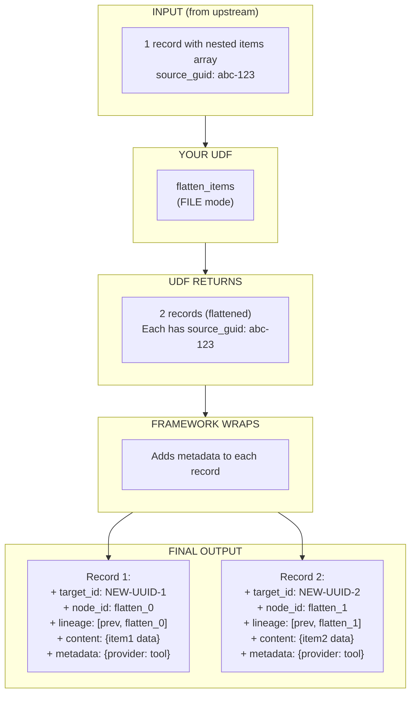
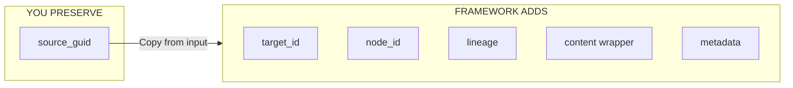

# UDF + Schema Pattern Guide

Quick reference for creating UDFs and their schemas.

## Schema File

Location: `schemas/MySchema.yml`

```yaml
name: MySchema                    # Schema name (referenced in workflow)
fields:
  - id: field_name                # Field identifier
    type: string                  # Types: string, integer, number, boolean, array, object

  - id: optional_field
    type: string
    required: false               # Optional field (default: true/required)

  - id: array_field
    type: array
    items:
      type: string                # Array element type
    required: false
```

### Supported Types

| Type | Example Value |
|------|---------------|
| `string` | `"text"` |
| `integer` | `42` |
| `number` | `3.14` |
| `boolean` | `true` / `false` |
| `array` | `[...]` |
| `object` | `{...}` |

## UDF File

Location: `tools/my_workflow/my_tool.py`

```python
from typing import Any, Dict, List, Union
from agent_actions import udf_tool


@udf_tool()                       # No input_type needed!
def my_function(data: ...) -> ...:
    """
    Docstring describing what this tool does.

    Input: Defined by context_scope in workflow YAML
    Output: Validated against schema in workflow YAML
    """
    # Implementation
    return result
```

## Granularity Determines Input/Output Types

### RECORD Granularity (default)

- **Input:** `Dict[str, Any]` (single record)
- **Output:** `Dict[str, Any]` (single record)

```python
@udf_tool()
def process_single(data: Dict[str, Any]) -> Dict[str, Any]:
    # data = {"field1": "value1", "field2": "value2", ...}
    result = data.copy()
    result["new_field"] = "computed"
    return result
```

### FILE Granularity

- **Input:** `List[Dict[str, Any]]` (all records)
- **Output:** `List[Dict[str, Any]]` (can be different count!)

```python
from agent_actions.configuration.new_format_schema import Granularity

@udf_tool(granularity=Granularity.FILE)
def process_all(data: List[Dict[str, Any]]) -> List[Dict[str, Any]]:
    # data = [{"field1": "a", ...}, {"field1": "b", ...}, ...]
    # Can return different number of records (N->M transformation)
    return filtered_or_transformed_list
```

## Workflow YAML

```yaml
- name: my_action
  kind: tool                      # Required for UDFs
  impl: my_function               # Function name (case-insensitive)
  schema: MySchema                # Output validation schema
  granularity: record             # or: file
  context_scope:                  # Defines what data the UDF receives
    include:
      - upstream.field1
      - upstream.field2
```

---

## Complete Example: Flatten Nested Items

A common pattern: flatten nested arrays into individual records.

### Schema

`schemas/FlattenedItem.yml`:

```yaml
name: FlattenedItem
fields:
  - id: item_name
    type: string
  - id: item_value
    type: number
  - id: category
    type: string
    required: false
  - id: description
    type: string
    required: false
  - id: tags
    type: array
    items:
      type: string
    required: false
```

### UDF

`tools/flatten_items.py`:

```python
from typing import Any, Dict, List, Union
from agent_actions import udf_tool

@udf_tool()
def flatten_items(data: Union[str, Dict, List]) -> List[Dict[str, Any]]:
    """
    Flatten nested items into individual records.

    Input: Record with nested "items" array
    Output: Multiple records, one per item

    Example:
      Input:  [{"source_guid": "abc", "content": {"items": [i1, i2]}}]
      Output: [{"source_guid": "abc", ...i1}, {"source_guid": "abc", ...i2}]
    """
    # Handle content wrapper
    if isinstance(data, dict):
        records = [data]
    elif isinstance(data, list):
        records = data

    flattened = []
    for rec in records:
        content = rec.get("content", rec)
        shared_keys = {k: v for k, v in rec.items() if k != "content"}
        items = content.get("items", [])

        for item in items:
            flattened.append({**shared_keys, **item})

    return flattened
```

### Workflow YAML

```yaml
- name: flatten_nested_items
  dependencies: extract_data
  kind: tool
  impl: flatten_items
  schema: FlattenedItem
  granularity: file               # Process all at once (N->M transformation)
  intent: "Flatten items array for individual processing"
```

---

## Data Flow Visualization



### What Gets Added at Each Stage



### Input (from upstream action)

```json
[
  {
    "source_guid": "abc-123",
    "target_id": "xyz-456",
    "node_id": "extract_data_0",
    "lineage": ["extract_data_0"],
    "content": {
      "category": "electronics",
      "items": [
        {"item_name": "Widget A", "item_value": 29.99},
        {"item_name": "Widget B", "item_value": 49.99}
      ]
    }
  }
]
```

### Your UDF Returns

```json
[
  {"source_guid": "abc-123", "category": "electronics", "item_name": "Widget A", "item_value": 29.99},
  {"source_guid": "abc-123", "category": "electronics", "item_name": "Widget B", "item_value": 49.99}
]
```

### Final Output (framework wraps with metadata)

```json
[
  {
    "source_guid": "abc-123",
    "target_id": "NEW-UUID-1",
    "node_id": "flatten_items_0",
    "lineage": ["extract_data_0", "flatten_items_0"],
    "content": {
      "category": "electronics",
      "item_name": "Widget A",
      "item_value": 29.99
    },
    "metadata": {"model": "flatten_items", "provider": "tool"}
  },
  {
    "source_guid": "abc-123",
    "target_id": "NEW-UUID-2",
    "node_id": "flatten_items_1",
    "lineage": ["extract_data_0", "flatten_items_1"],
    "content": {
      "category": "electronics",
      "item_name": "Widget B",
      "item_value": 49.99
    },
    "metadata": {"model": "flatten_items", "provider": "tool"}
  }
]
```

### What the Framework Adds

| Field | Source | Description |
|-------|--------|-------------|
| `source_guid` | **You preserve it** | Copy from input for lineage chaining |
| `target_id` | Framework | New unique ID for each output |
| `node_id` | Framework | Current action identifier |
| `lineage` | Framework | Processing chain (previous + current) |
| `content` | Framework | Your data wrapped |
| `metadata` | Framework | Provider and model info |

---

## Key Rules

1. **PRESERVE `source_guid`** - Copy from input to output for lineage chaining
2. **NO `input_type` needed** - Input defined by `context_scope` in YAML
3. **`schema` validates OUTPUT** - Not input
4. **FILE mode** = `List` in, `List` out
5. **RECORD mode** = `Dict` in, `Dict` out
6. **Framework adds metadata** - You just return raw data

## See Also

- [UDF Decorator Reference](./udf-decorator.md) - Full decorator documentation
- [Data Flow Patterns](./data-flow-patterns.md) - Context scope and dependencies
