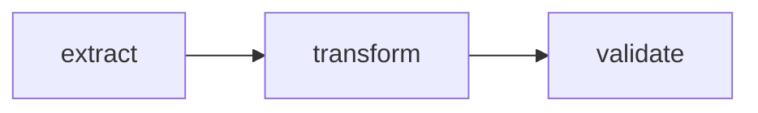
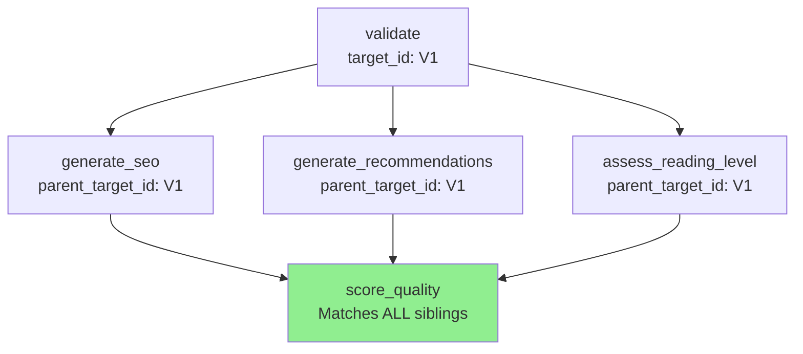
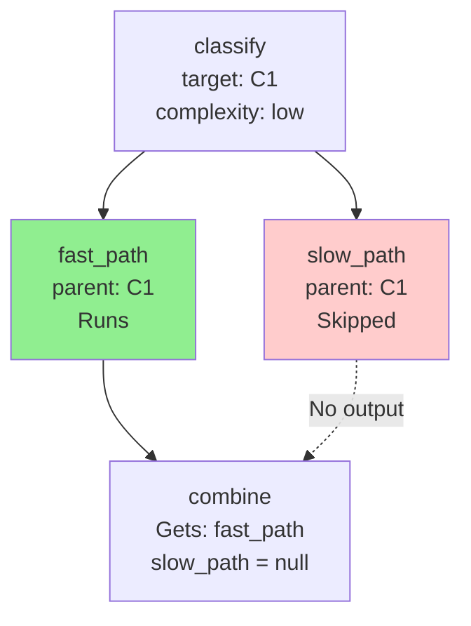
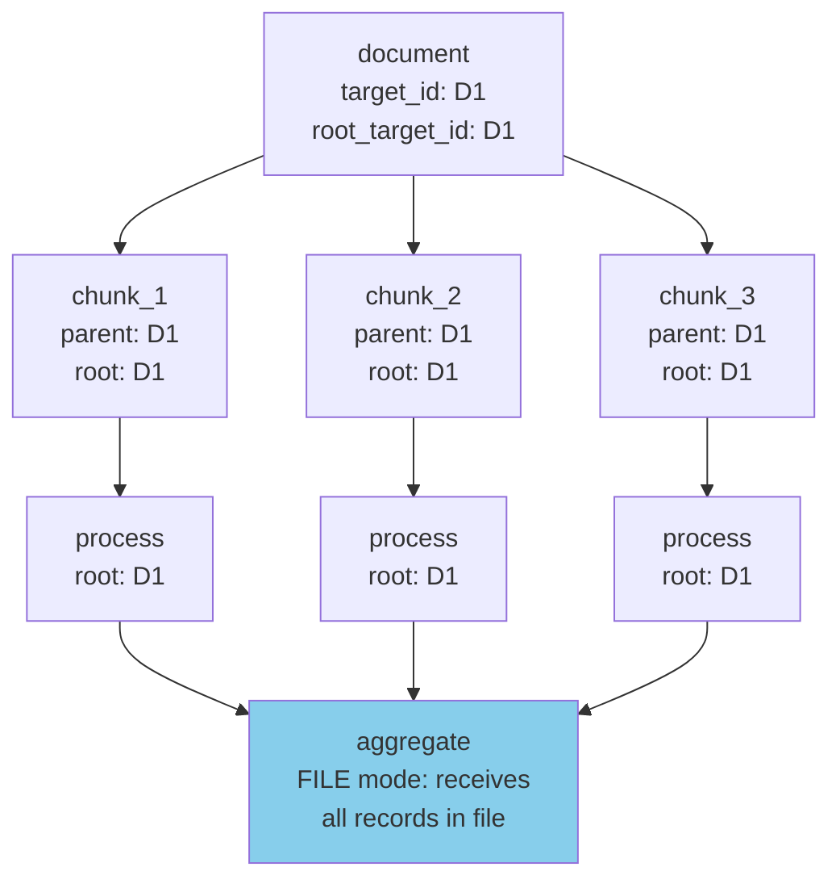
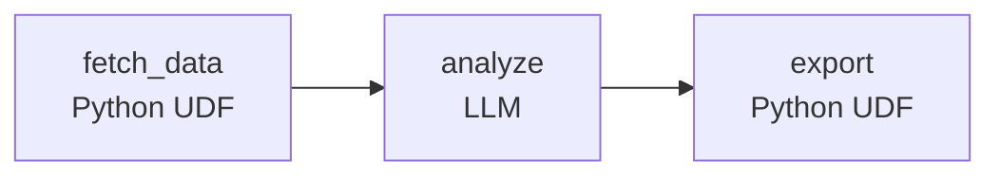
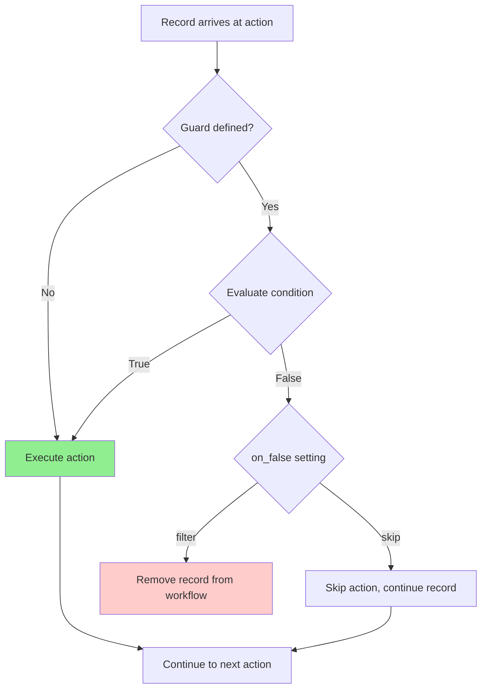
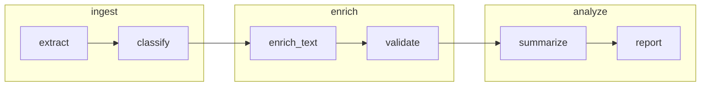

# Workflow Patterns Reference

Detailed patterns for common parallel and merge scenarios.

## Table of Contents

- [Pattern Overview](#pattern-overview)
- [Sequential Pipeline](#sequential-pipeline)
- [Diamond/Fan-in Pattern](#diamondfan-in-pattern)
- [Multi-enrichment Pattern](#multi-enrichment-pattern)
- [Ensemble/Voting Pattern](#ensemblevoting-pattern)
- [Conditional Merge Pattern](#conditional-merge-pattern)
- [Conditional Downstream Processing Pattern](#conditional-downstream-processing-pattern)
- [Versioned Parallel Actions](#versioned-parallel-actions)
- [Map-Reduce Pattern](#map-reduce-pattern)
- [Tool + LLM Hybrid Pattern](#tool--llm-hybrid-pattern)
- [Guard Decision Flow](#guard-decision-flow)

## Pattern Overview

| Pattern | Structure | Use Case |
|---------|-----------|----------|
| **Sequential Pipeline** | linear chain | ETL, document processing |
| **Diamond/Fan-in** | split → parallel branches → merge | Enrich from multiple angles |
| **Multi-enrichment** | single source → parallel specialists | Extract different aspects |
| **Ensemble/Voting** | same input → multiple LLMs → consensus | Compare model outputs |
| **Conditional Merge** | parallel with guards → merge available | Only merge branches that ran |
| **Map-Reduce** | split → parallel process → aggregate | Document chunking |
| **Tool + LLM Hybrid** | Python ↔ LLM ↔ Python | API integration |
| **Cross-Workflow Chain** | workflow A → workflow B → workflow C | Multi-stage pipelines |

## Sequential Pipeline

The simplest pattern: a linear chain where each action depends on the previous.



```yaml
actions:
  - name: extract
    # No dependencies - reads from source

  - name: transform
    dependencies: extract

  - name: validate
    dependencies: transform
```

**Use cases:** ETL pipelines, document processing, data enrichment

## Diamond/Fan-in Pattern

Split to parallel branches, merge all results:



```yaml
actions:
  - name: validate
    schema: { title: string, content: string }

  - name: generate_seo
    dependencies: validate
    schema: { primary_keywords: list }

  - name: generate_recommendations
    dependencies: validate
    schema: { similar_books: list }

  - name: assess_reading_level
    dependencies: validate
    schema: { reading_level: string }

  - name: score_quality
    dependencies: [generate_seo, generate_recommendations, assess_reading_level]
    context_scope:
      observe:
        - generate_seo.*
        - generate_recommendations.*
        - assess_reading_level.*
    prompt: |
      SEO: {{ generate_seo.primary_keywords }}
      Similar: {{ generate_recommendations.similar_books }}
      Level: {{ assess_reading_level.reading_level }}
```

**How matching works:** This is a **fan-in pattern** - `generate_seo` (first in list) is the primary input. The other two are matched via lineage, ensuring all three come from the same parent record. Each action's output is available under its namespace.

## Multi-enrichment Pattern

Multiple specialists extract different aspects:

```yaml
actions:
  - name: extract_entities
    dependencies: prepare
    schema: { entities: list, count: integer }

  - name: extract_sentiment
    dependencies: prepare
    schema: { sentiment: string, confidence: number }

  - name: extract_topics
    dependencies: prepare
    schema: { topics: list, count: integer }

  - name: unified_analysis
    dependencies: [extract_entities, extract_sentiment, extract_topics]
    prompt: |
      Entities: {{ extract_entities.entities }}
      Sentiment: {{ extract_sentiment.sentiment }}
      Topics: {{ extract_topics.topics }}
```

## Ensemble/Voting Pattern

Multiple LLMs, pick best answer:

```yaml
actions:
  - name: gpt4_answer
    dependencies: prepare
    model_vendor: openai
    model_name: gpt-4o

  - name: claude_answer
    dependencies: prepare
    model_vendor: anthropic
    model_name: claude-sonnet-4-20250514

  - name: best_answer
    dependencies: [gpt4_answer, claude_answer]
    prompt: |
      Compare and select the best answer:
      GPT-4: {{ gpt4_answer.response }}
      Claude: {{ claude_answer.response }}
```

## Conditional Merge Pattern

Merge only branches that ran (using guards):



```yaml
actions:
  - name: classify
    schema: { complexity: string }

  - name: fast_path
    dependencies: classify
    guard:
      condition: 'classify.complexity == "low"'
      on_false: "skip"
    schema: { result: string }

  - name: slow_path
    dependencies: classify
    guard:
      condition: 'classify.complexity == "high"'
      on_false: "skip"
    schema: { result: string }

  - name: combine
    dependencies: [fast_path, slow_path]
    prompt: |
      Fast result: {{ fast_path.result }}
      Slow result: {{ slow_path.result }}
```

**Handling missing branches:** The merge action receives `null` for skipped branches. Handle gracefully with conditionals.

## Conditional Downstream Processing Pattern

Write workflows that consume from multiple different upstream workflows by detecting input format:

```python
@udf_tool()
def format_options(data: dict[str, Any]) -> list[dict[str, Any]]:
    """Format options differently based on input type."""
    # RECORD mode: fields are namespaced by upstream action
    options = data["upstream_action"]["options"]
    formatted = []

    for option in options:
        if option.strip().startswith('<div') and 'style=' in option:
            # Preserve existing formatting (e.g., VS Code mockup)
            formatted.append(f"<html><body>{option}</body></html>")
        else:
            # Apply standard formatting for plain text
            formatted.append(format_plain_option(option))

    result = {'options': formatted}
    return [result]
```

## Versioned Parallel Actions

Run same action multiple times in parallel, then consume all results:

```yaml
# Step 1: Run parallel actions
- name: process_data
  dependencies: [prepare_input]
  versions:
    param: worker_id
    range: [1, 2, 3, 4, 5]
    mode: parallel
  schema:
    result: string
    score: float
  prompt: $workflow.Process_Data

# Step 2: Consume all parallel results
- name: aggregate_results
  dependencies: [process_data]
  kind: tool
  impl: combine_parallel_results
  version_consumption:
    source: process_data
    pattern: merge
  context_scope:
    observe:
      - process_data.*
```

**RECORD mode — each version is a separate namespace:**
```json
{
  "process_data_1": {"result": "output 1", "score": 0.85},
  "process_data_2": {"result": "output 2", "score": 0.92},
  "process_data_3": {"result": "output 3", "score": 0.88}
}
```

**UDF to process merged results:**
```python
@udf_tool()
def combine_parallel_results(data: dict[str, Any]) -> list[dict[str, Any]]:
    # Each version is a namespace — access via action name
    results = []
    for i in range(1, 6):
        version_ns = data.get(f'process_data_{i}', {})
        result = version_ns.get('result')
        score = version_ns.get('score', 0)
        if result is not None:
            results.append({'worker_id': i, 'result': result, 'score': score})

    avg_score = sum(r['score'] for r in results) / len(results) if results else 0
    return [{
        'all_results': results,
        'average_score': avg_score,
        'total_workers': len(results),
    }]
```

## Map-Reduce Pattern

For splitting documents into chunks, processing each, then aggregating:



```yaml
actions:
  - name: chunk_document
    kind: tool
    impl: chunk_document       # UDF that splits input into chunks
    granularity: file           # Receives all records, returns N chunks

  - name: process_chunk
    dependencies: [chunk_document]
    granularity: record         # LLM processes each chunk individually

  - name: aggregate_results
    dependencies: [process_chunk]
    kind: tool
    impl: aggregate_results     # UDF that collects all chunks
    granularity: file           # Receives all processed chunks
```

**Critical: preserve `source_guid` in the splitter.** The framework populates `root_target_id` via LineageEnricher only when `source_guid` is present on each output record. A splitter that returns plain dicts without `source_guid` produces chunks with no ancestry, breaking the aggregate step.

```python
@udf_tool(granularity=Granularity.FILE)
def chunk_document(data: list[dict[str, Any]]) -> list[dict[str, Any]]:
    chunks = []
    for record in data:
        source_guid = record.get("source_guid")
        text = record["content"]["source"]["text"]
        for i, part in enumerate(split_text(text)):
            chunks.append({
                "source_guid": source_guid,  # Required for lineage
                "chunk_index": i,
                "chunk_text": part,
            })
    return chunks
```

**How it works:** Map-reduce is achieved via `kind: tool` UDFs with file-level granularity for the split and aggregate steps. The chunking UDF receives all records in the current file and returns N chunks; the aggregation UDF receives all processed chunks in the file. FILE-mode invokes the tool once per file on the full record array — it does **not** automatically group by `root_target_id`. If one input file contains chunks from multiple root documents, the aggregation UDF must group by `root_target_id` itself.

## Tool + LLM Hybrid Pattern

Mix Python UDFs with LLM calls—use Python for deterministic operations, LLMs for language understanding:



```yaml
actions:
  - name: fetch_data
    kind: tool
    impl: fetch_from_api

  - name: analyze
    dependencies: fetch_data
    prompt: |
      Analyze this data: {{ fetch_data.results }}
    schema: analysis

  - name: export
    kind: tool
    impl: export_to_excel
    dependencies: analyze
```

**Use cases:** API integration, file exports, data validation

## Guard Decision Flow

How guards evaluate records:



**Key distinction:**
- `skip` → Record continues, action just doesn't run
- `filter` → Record removed entirely, no downstream processing

## Cross-Workflow Chaining

Link separate workflows into a multi-stage pipeline. Each workflow is a self-contained unit that can run independently, but declares which upstream workflows it depends on.



```yaml
# agent_config/ingest.yml
name: ingest
description: "Extract and classify raw data"
actions:
  - name: extract
    intent: "Extract structured data"
  - name: classify
    dependencies: [extract]
    intent: "Classify extracted items"

# agent_config/enrich.yml
name: enrich
description: "Enrich classified data"
upstream:
  - workflow: ingest
    actions: [extract, classify]
actions:
  - name: enrich_text
    dependencies: [extract]
    intent: "Add contextual enrichment"
    context_scope:
      observe: [extract.*, classify.category]
  - name: validate
    dependencies: [enrich_text]
    intent: "Validate enriched output"

# agent_config/analyze.yml
name: analyze
description: "Analyze enriched data"
upstream:
  - workflow: enrich
    actions: [validate]
actions:
  - name: summarize
    dependencies: [validate]
    intent: "Summarize validated data"
    context_scope:
      observe: [validate.*]
  - name: report
    dependencies: [summarize]
    intent: "Generate final report"
```

**Running the chain:**

```bash
# Run one workflow at a time
agac run -a ingest
agac run -a enrich       # reads ingest's outputs
agac run -a analyze      # reads enrich's outputs

# Or chain automatically
agac run -a ingest --downstream     # ingest → enrich → analyze
agac run -a analyze --upstream      # ingest → enrich → analyze
```

**Key rules:**
- Upstream action names must not collide with local action names
- Upstream actions appear in the namespace using the same syntax as local actions
- Each workflow maintains its own state — completed actions are skipped on re-run
- If an upstream workflow hasn't run, you get a clear error directing you to run it or use `--upstream`
