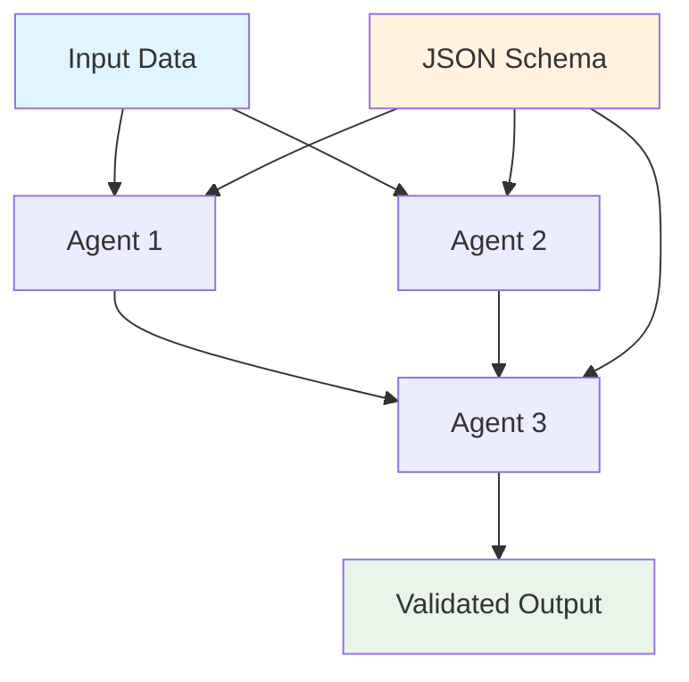
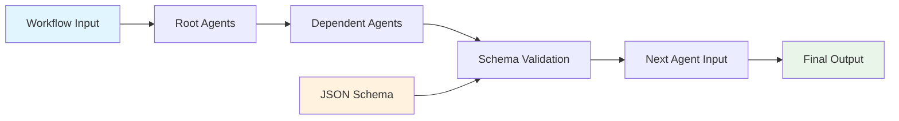

# Core Concepts

Agent Actions is built around **DAG-based multi-agent workflows** with **schema-first validation**. Understanding these concepts is essential for building deterministic, production-ready AI systems.

## Architecture Overview



## Core Components

### 1. DAG (Directed Acyclic Graph)

**DAGs** define the workflow structure with explicit dependencies:

- **Nodes**: Individual agents performing transformations
- **Edges**: Data dependencies between agents
- **Execution Order**: Automatically determined by dependencies
- **Parallelization**: Independent agents run concurrently

```yaml
# DAG structure example
agents:
  - name: "input_processor"
    depends_on: []                    # Root node
  - name: "analyzer"
    depends_on: ["input_processor"]   # Sequential dependency
  - name: "enricher"
    depends_on: ["input_processor"]   # Parallel with analyzer
  - name: "combiner"
    depends_on: ["analyzer", "enricher"]  # Merge point
```

### 2. Agents

**Agents** are deterministic transformation nodes that:

- **Transform Data**: Convert inputs to structured outputs
- **Follow Schemas**: All outputs must conform to JSON schemas
- **Have Dependencies**: Explicit requirements on other agents
- **Are Stateless**: No memory between executions

```yaml
agents:
  - name: "data_transformer"
    model_vendor: "openai"
    model_name: "gpt-4"
    prompt: "Transform this data: {input}"
    output_schema: "result_schema"
    depends_on: ["data_extractor"]
```

### 3. JSON Schemas

**Schemas** enforce structure and validation:

- **Output Validation**: Every agent output is validated
- **Type Safety**: Ensures correct data types
- **Required Fields**: Prevents missing critical data
- **Constraints**: Length limits, value ranges, format validation

```json
{
  "type": "object",
  "properties": {
    "summary": {"type": "string", "maxLength": 100},
    "score": {"type": "number", "minimum": 0, "maximum": 1},
    "categories": {
      "type": "array",
      "items": {"type": "string"},
      "minItems": 1
    }
  },
  "required": ["summary", "score"]
}
```

### 4. Workflows

**Workflows** orchestrate the entire DAG execution:

- **Input Management**: Define workflow-level inputs
- **Agent Coordination**: Manage dependencies and data flow
- **Output Aggregation**: Collect and structure final results
- **Error Handling**: Manage schema validation failures

```yaml
workflow:
  name: "document_analysis"
  input_data:
    document: "content to analyze"
  agents: ["extractor", "analyzer", "summarizer"]
  output_format: "structured_report"
```

### 5. Deterministic Execution

**Determinism** ensures predictable, repeatable results:

- **Same Inputs → Same Outputs**: No randomness in execution
- **Fixed Dependencies**: Agent order never varies
- **No Hidden State**: No memory between runs
- **Schema Validation**: Prevents output drift

## Design Principles

### 1. Schema-First Development

Every component is designed around structured data:

- **Agent Outputs**: Must conform to predefined JSON schemas
- **Type Safety**: Eliminates runtime data type errors
- **Validation**: Built-in at every transformation step
- **Documentation**: Schemas serve as API contracts

### 2. DAG-Native Architecture

Workflows are directed acyclic graphs by design:

- **Explicit Dependencies**: No hidden relationships
- **Parallel Execution**: Independent agents run concurrently
- **Deterministic Order**: Execution sequence is predictable
- **Visual Clarity**: Easy to understand and debug

### 3. Transformation-Focused

Agents perform data transformations, not autonomous actions:

- **Input → Output**: Clear data flow through each agent
- **Stateless**: No memory or side effects
- **Composable**: Agents can be reused in different workflows
- **Testable**: Predictable inputs and outputs

### 4. Lightweight & Focused

Minimal dependencies and focused scope:

- **Single Purpose**: Multi-agent DAG workflows only
- **No Bloat**: No unnecessary features or abstractions
- **Fast Setup**: Quick to learn and deploy
- **Production Ready**: Reliable and maintainable

## Data Flow Through DAGs

Understanding how data flows in Agent Actions:



1. **Input Data**: Workflow receives structured input
2. **Root Agents**: Agents with no dependencies execute first
3. **Dependency Resolution**: Agents wait for required inputs
4. **Schema Validation**: Every output is validated against its schema
5. **Data Propagation**: Validated outputs become inputs for dependent agents
6. **Final Aggregation**: All agent outputs form the workflow result

## Common DAG Patterns

### Linear Pipeline
```yaml
# Sequential data processing
agents:
  - name: "extract"
    depends_on: []
  - name: "transform"
    depends_on: ["extract"]
  - name: "load"
    depends_on: ["transform"]
```

### Fan-Out/Fan-In
```yaml
# Parallel processing with merge
agents:
  - name: "splitter"
    depends_on: []
  - name: "process_a"
    depends_on: ["splitter"]
  - name: "process_b"
    depends_on: ["splitter"]
  - name: "merger"
    depends_on: ["process_a", "process_b"]
```

### Diamond Pattern
```yaml
# Complex dependency relationships
agents:
  - name: "root"
    depends_on: []
  - name: "left_branch"
    depends_on: ["root"]
  - name: "right_branch"
    depends_on: ["root"]
  - name: "convergence"
    depends_on: ["left_branch", "right_branch"]
```

## Schema Design Patterns

### Progressive Enrichment
Start with simple data and progressively add structure:

```json
// Input schema (simple)
{"type": "object", "properties": {"text": {"type": "string"}}}

// Intermediate schema (analyzed)
{
  "type": "object",
  "properties": {
    "text": {"type": "string"},
    "sentiment": {"type": "string", "enum": ["positive", "negative", "neutral"]},
    "entities": {"type": "array", "items": {"type": "string"}}
  }
}

// Final schema (enriched)
{
  "type": "object",
  "properties": {
    "text": {"type": "string"},
    "sentiment": {"type": "string"},
    "entities": {"type": "array"},
    "summary": {"type": "string", "maxLength": 200},
    "metadata": {"type": "object"}
  }
}
```

## Next Steps

Dive deeper into specific concepts:

- **[Agents Guide](./agents.md)** - Learn about agent configuration and best practices
- **[Workflow Design](./workflows.md)** - Master DAG patterns and execution
- **[Schema Validation](./schemas.md)** - Design effective JSON schemas

Or explore practical applications:

- **Examples** (coming soon) - Real-world DAG workflow patterns
- **API Reference** (coming soon) - Detailed technical documentation