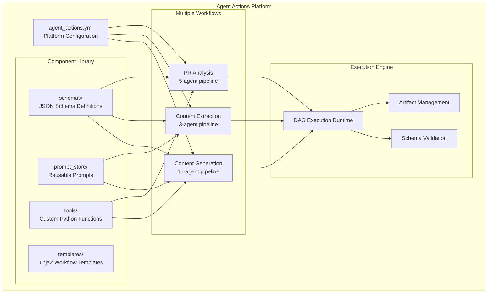

# Agent Actions Platform

**Agent Actions is infrastructure for building AI agent workflows** — not a single-use tool, but a platform that teams use to create multiple, production-ready AI pipelines.

**Stop fighting scattered scripts and broken agent coordination.** Build complex multi-agent workflows in hours, not weeks, with YAML-based configuration, schema validation, and reusable components.

## The Multi-Agent Coordination Problem

Building one AI agent is straightforward. Coordinating multiple agents is where complexity explodes:

- **Scattered Python scripts** become unmaintainable
- **No output validation** leads to unpredictable failures
- **Cannot reuse components** across different workflows
- **Debugging multi-agent interactions** is nearly impossible

Agent Actions solves these coordination challenges with purpose-built infrastructure.

## Platform Approach vs. Ad-Hoc Scripts

| **Typical Approach** | **Agent Actions Platform** |
|----------------------|---------------------|
| Scattered Python scripts | Unified YAML workflows |
| Manual agent coordination | Declarative dependencies |
| No output validation | Schema-enforced structure |
| Copy-paste components | Reusable schemas/prompts/tools |

## Real-World Platform Usage

**A production customer** uses Agent Actions as their content generation platform, demonstrating the platform approach:

```
enterprise-platform/
├── agent_actions.yml          # Platform configuration
├── agent_workflow/            # Multiple workflow types
│   ├── content_extraction/
│   ├── document_analysis/
│   └── content_generation/    # 15-agent pipeline
├── schema/                    # Shared schemas across workflows
├── prompt_store/              # Reusable prompts
├── tools/                     # Custom Python extensions
└── templates/                 # Jinja2 workflow templates
```

**One platform → Multiple AI workflows** with shared components and infrastructure.

## Core Platform Principles

### 1. **YAML-Native Workflows**
Define complex AI pipelines declaratively without Python abstractions:

```yaml
content_generation:
- agent_type: content_extractor
  dependencies: []
  schema_name: extracted_content

- agent_type: content_validator
  dependencies: [content_extractor]
  schema_name: validation_results

- agent_type: content_generator
  dependencies: [content_validator]
  schema_name: generated_content
```

### 2. **Deterministic Execution**
Same inputs → same outputs, always:
- **Fixed dependency graphs** (DAGs)
- **Schema-validated outputs** at every step
- **No autonomous negotiation** between agents
- **Reproducible pipelines** for production use

### 3. **Component Reusability**
Build once, use everywhere:
- **Shared schemas** across workflows
- **Prompt templates** in centralized store
- **Custom tools** available to all workflows
- **Workflow templates** for common patterns

### 4. **Enterprise-Ready Infrastructure**
Production features built-in:
- **Batch processing** for high-throughput
- **Custom tool integration** with Python
- **Monitoring and debugging** capabilities
- **Extensible architecture** for growing needs

## Platform Architecture



## Key Technical Advantages

### **YAML-Native Configuration**
Define multi-agent workflows declaratively without complex Python abstractions:

```yaml
content_generation:
- agent_type: content_extractor
  dependencies: []
  schema_name: extracted_content

- agent_type: content_generator
  dependencies: [content_extractor]
  schema_name: generated_content
```

### **Schema-Enforced Validation**
Every agent output is validated against JSON schemas, preventing downstream failures:

```yaml
schema_name: extracted_content
# Ensures structured, predictable data flow
```

### **Component Reusability**
Build once, use across multiple workflows:
- Shared schemas across different pipelines
- Prompt templates in centralized store
- Custom Python tools available everywhere

## Platform Benefits

### **For AI Engineers**
- Focus on workflow logic, not infrastructure
- Reuse components across multiple projects
- Predictable, debuggable agent behavior

### **For Data Scientists**
- YAML configuration, minimal Python required
- Schema validation prevents output drift
- Reproducible results for model evaluation

### **For MLOps Teams**
- Standardized deployment patterns
- Built-in monitoring and artifact management
- Batch processing for production scale

### **For Platform Teams**
- One infrastructure supports multiple AI use cases
- Extensible with custom tools and providers
- Enterprise-ready monitoring and security

## Getting Started with the Platform

1. **[Project Structure](./project-structure.md)** - Organize for platform approach
2. **[Component Library](../components/index.md)** - Build reusable pieces
3. **[Multiple Workflows](../workflows/creating-workflows.md)** - Create different pipeline types
4. **[Examples](../examples/content-generation-platform.md)** - Learn from real implementations

## Platform Examples

### Complex Production Pipeline
**15-agent content generation platform** with extraction, validation, transformation, and output generation.

[→ See full implementation](../examples/content-generation-platform.md)

### Multi-Workflow Project
**Single platform supporting**:
- Content extraction workflows
- Data validation pipelines
- Quality assurance processes
- Batch processing systems

[→ Learn the patterns](../examples/multi-workflow-project.md)

---

**If you're building more than 2 agents that need to work together, you need Agent Actions.** Transform chaotic multi-agent development into structured, reusable workflows with predictable results at production scale.