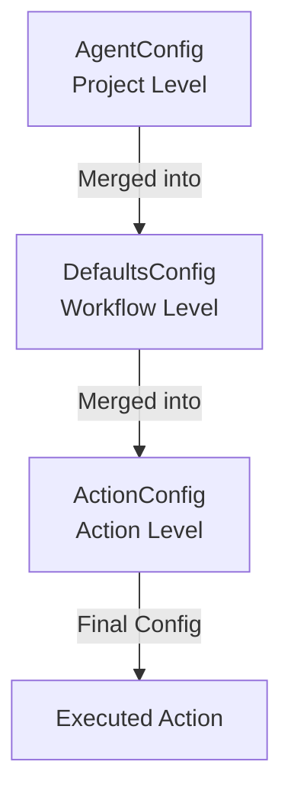

# Configuration Schema Reference

This guide explains how Agent Actions uses **Pydantic models** to validate your YAML configuration files. Understanding this relationship helps you write valid configurations and interpret validation errors.

## Overview

Agent Actions uses [Pydantic](https://docs.pydantic.dev/) for configuration validation. Your YAML files are parsed and validated against Pydantic models that define:

- Required and optional fields
- Field types (string, number, boolean, etc.)
- Validation rules (enums, min/max values, patterns)
- Default values

## Configuration Levels and Their Schemas

Agent Actions has a 3-level configuration hierarchy:

| Level | File | Primary Schema | Purpose |
|-------|------|---------------|---------|
| **Project** | `agent_actions.yml` | `AgentConfig`, `DefaultAgentConfig` | Organization-wide defaults |
| **Workflow** | `workflows/*.yml` | `WorkflowConfigV2`, `DefaultsConfig` | Workflow-level defaults and structure |
| **Action** | Within workflow file | `ActionConfig` | Individual action settings |

### Schema Inheritance



## YAML to Pydantic Mapping

### Project-Level Configuration (agent_actions.yml)

**Pydantic Model**: `AgentConfig` (agent_actions/core/parser/config_schema.py:157-224)

```yaml
# agent_actions.yml
default_agent_config:
  model_vendor: anthropic        # → AgentConfig.model_vendor (Optional[str])
  model_name: claude-3-5-sonnet  # → AgentConfig.model_name (Optional[str])
  api_key: ${ANTHROPIC_API_KEY}  # → AgentConfig.api_key (Optional[str])
  run_mode: online               # → AgentConfig.run_mode (str, default='online')
  is_operational: true           # → AgentConfig.is_operational (bool, default=True)
```

**Key Fields**:
- `agent_type` (str) - Required agent type identifier
- `model_vendor` (Optional[str]) - Vendor name: 'openai', 'anthropic', 'gemini', 'groq', 'tool'
- `model_name` (Optional[str]) - Model identifier
- `api_key` (Optional[str]) - API key or env var reference
- `run_mode` (str) - Execution mode: 'online' or 'batch'
- `is_operational` (bool) - Whether action is enabled
- `chunk_config` (Dict[str, Any]) - Chunking configuration
- `few_shot` (int) - Number of few-shot examples (≥0)

### Workflow-Level Configuration

**Pydantic Model**: `WorkflowConfigV2` (agent_actions/core/migration/new_format_schema.py:119-172)

```yaml
# workflows/my_workflow.yml
name: my_workflow                     # → WorkflowConfigV2.name (str, required)
description: Process documents        # → WorkflowConfigV2.description (str, required)
version: "1.0"                        # → WorkflowConfigV2.version (str, required)

defaults:                             # → WorkflowConfigV2.defaults (Optional[DefaultsConfig])
  model_vendor: openai                # → DefaultsConfig.model_vendor (Optional[str])
  model_name: gpt-4o-mini             # → DefaultsConfig.model_name (Optional[str])
  json_mode: true                     # → DefaultsConfig.json_mode (Optional[bool])
  granularity: record                 # → DefaultsConfig.granularity (Optional[Granularity])
  run_mode: online                    # → DefaultsConfig.run_mode (Optional[str])
  drops: [_metadata]                  # → DefaultsConfig.drops (Optional[List[str]])
  observe: [original_text]            # → DefaultsConfig.observe (Optional[List[str]])

actions:                              # → WorkflowConfigV2.actions (List[ActionConfig])
  - name: extract                     # See ActionConfig below
    intent: Extract key information

plan:                                 # → WorkflowConfigV2.plan (List[str])
  - extract                           # Execution order with dependencies
```

### Action-Level Configuration

**Pydantic Model**: `ActionConfig` (agent_actions/core/migration/new_format_schema.py:37-97)

```yaml
actions:
  - name: analyze                     # → ActionConfig.name (str, required)
    intent: Analyze sentiment         # → ActionConfig.intent (str, required)
    kind: llm                         # → ActionConfig.kind (ActionKind, default='llm')

    # Implementation
    impl: null                        # → ActionConfig.impl (Optional[str])
    model_vendor: anthropic           # → ActionConfig.model_vendor (Optional[str])
    model_name: claude-3-5-sonnet     # → ActionConfig.model_name (Optional[str])

    # Schema and data handling
    schema: sentiment_schema          # → ActionConfig.output_schema (Union[str, Dict])
    drops: [raw_html]                 # → ActionConfig.drops (List[str])
    observe: [url, timestamp]         # → ActionConfig.observe (List[str])

    # Execution settings
    granularity: record               # → ActionConfig.granularity (Optional[Granularity])
    guard: "len(items) > 0"           # → ActionConfig.guard (Union[str, Dict])
    policy: retry                     # → ActionConfig.policy (Optional[str])
    few_shot: 3                       # → ActionConfig.few_shot (Optional[int])

    # Advanced features
    loop:                             # → ActionConfig.loop (Optional[LoopConfig])
      param: iteration
      range: [1, 5]
    idempotency_key: "analyze_{id}"   # → ActionConfig.idempotency_key (Optional[str])

    prompt: |                         # → ActionConfig.prompt (Optional[str])
      Analyze the sentiment of this text.
```

## Field Validators

Pydantic validators enforce additional constraints beyond basic types:

### Model Validators

Agent Actions validates model names for each vendor:

#### OpenAI Models
**Validator**: `validate_openai_model` (vendor_config.py:59-78)

```python
# Valid prefixes: "gpt-4", "gpt-3.5", "o1"
model_name: gpt-4o-mini  # ✅ Valid
model_name: gpt-5        # ❌ Invalid - ConfigValidationError
```

#### Anthropic Models
**Validator**: `validate_claude_model` (vendor_config.py:92-105)

```python
# Valid prefixes: "claude-3", "claude-2", "claude-instant"
model_name: claude-3-5-sonnet-20241022  # ✅ Valid
model_name: gpt-4                       # ❌ Invalid - ConfigValidationError
```

#### Google Gemini Models
**Validator**: `validate_gemini_model` (vendor_config.py:118-131)

```python
# Valid prefixes: "gemini-", "models/gemini"
model_name: gemini-1.5-flash  # ✅ Valid
model_name: palm-2            # ❌ Invalid - ConfigValidationError
```

#### Groq Models
**Validator**: `validate_groq_model` (vendor_config.py:140-158)

```python
# Valid keywords: "llama", "mixtral", "gemma"
model_name: llama-3.1-70b-versatile  # ✅ Valid
model_name: gpt-4                    # ❌ Invalid - ConfigValidationError
```

### Guard Expression Validator

**Validator**: `validate_guard` (new_format_schema.py:68-97)

Validates guard expressions for safety and syntax:

```yaml
# String format (legacy)
guard: "len(items) > 0"  # ✅ Valid - uses GuardParser

# Dict format (new consolidated format)
guard:                   # ✅ Valid - uses parse_guard_config
  condition: "has_data"
  field: "items"

# Invalid type
guard: 123               # ❌ ConfigValidationError - must be string or dict
```

**Blocked patterns** (for security):
- `__import__`, `exec`, `eval`, `compile`
- `open`, `file`, `input`, `raw_input`
- `reload`, `vars`, `globals`, `locals`
- `dir`, `hasattr`, `getattr`, `setattr`, `delattr`

### Workflow Plan Validator

**Validator**: `validate_plan` (new_format_schema.py:130-151)

Ensures all actions referenced in the plan are defined:

```yaml
actions:
  - name: extract
  - name: analyze

plan:
  - extract                      # ✅ Valid - action exists
  - analyze <- extract           # ✅ Valid - action exists with dependency
  - undefined_action             # ❌ ConfigValidationError - action not defined
```

### WHERE Clause Validator

**Validator**: `validate_clause` (config_schema.py:47-75)

Validates SQL-like WHERE clause syntax for safety:

```yaml
where_clause:
  clause: "confidence > 0.8"     # ✅ Valid
  scope: item
  behavior: filter

where_clause:
  clause: ""                     # ❌ ValidationError - empty clause

where_clause:
  clause: "exec('code')"         # ❌ ValidationError - dangerous pattern
```

## Understanding Validation Errors

### Type Mismatch

```python
# Error message:
ValidationError: 1 validation error for ActionConfig
model_vendor
  Input should be a valid string [type=string_type, input_value=123, input_type=int]
```

**YAML fix**:
```yaml
# ❌ Wrong
model_vendor: 123

# ✅ Correct
model_vendor: "openai"
```

### Missing Required Field

```python
# Error message:
ValidationError: 1 validation error for ActionConfig
name
  Field required [type=missing, input_value={'intent': 'Analyze...'}, input_type=dict]
```

**YAML fix**:
```yaml
# ❌ Wrong
actions:
  - intent: Analyze sentiment

# ✅ Correct
actions:
  - name: analyze
    intent: Analyze sentiment
```

### Invalid Enum Value

```python
# Error message:
ValidationError: 1 validation error for ActionConfig
kind
  Input should be 'llm' or 'tool' [type=enum, input_value='invalid', input_type=str]
```

**YAML fix**:
```yaml
# ❌ Wrong
kind: invalid

# ✅ Correct
kind: llm  # or 'tool'
```

### Custom Validator Failure

```python
# Error message:
ConfigValidationError: Unsupported OpenAI model: gpt-5
Context: {'model_name': 'gpt-5', 'valid_prefixes': ['gpt-4', 'gpt-3.5', 'o1'], 'vendor': 'openai'}
```

**YAML fix**:
```yaml
# ❌ Wrong
model_vendor: openai
model_name: gpt-5

# ✅ Correct
model_vendor: openai
model_name: gpt-4o-mini
```

## Type Reference

### Enum Types

Agent Actions uses enums for constrained string values:

#### ActionKind
```python
class ActionKind(str, Enum):
    LLM = "llm"    # Language model agent
    TOOL = "tool"  # Tool/function execution
```

```yaml
kind: llm   # ✅ Valid
kind: tool  # ✅ Valid
kind: api   # ❌ Invalid
```

#### Granularity
```python
class Granularity(str, Enum):
    RECORD = "record"  # Process each record individually
    FILE = "file"      # Process entire file at once
```

```yaml
granularity: record  # ✅ Valid
granularity: file    # ✅ Valid
granularity: batch   # ❌ Invalid
```

#### VendorType
```python
class VendorType(str, Enum):
    OPENAI = "openai"
    ANTHROPIC = "anthropic"
    GOOGLE = "google"
    GEMINI = "gemini"
    GROQ = "groq"
    COHERE = "cohere"
    MISTRAL = "mistral"
    DEEPSEEK = "deepseek"
    OLLAMA = "ollama"
    TOOL = "tool"
```

```yaml
model_vendor: anthropic  # ✅ Valid
model_vendor: claude     # ❌ Invalid - use 'anthropic'
```

#### FilterScope
```python
class FilterScope(str, Enum):
    ITEM = "item"    # Filter individual items
    AGENT = "agent"  # Filter entire agent execution
```

#### WhereClauseBehavior
```python
class WhereClauseBehavior(str, Enum):
    SKIP = "skip"      # Records pass through with metadata
    FILTER = "filter"  # Records are removed entirely
```

### Complex Types

#### LoopConfig
```python
class LoopConfig(BaseModel):
    param: str              # Parameter name for loop variable
    range: List[int]        # Range of values [start, end]
```

```yaml
loop:
  param: iteration
  range: [1, 10]
```

#### WhereClauseConfig
```python
class WhereClauseConfig(BaseModel):
    clause: str                                     # SQL-like WHERE clause
    scope: FilterScope = FilterScope.ITEM           # Filtering scope
    passthrough_on_empty: bool = True               # Pass data if no matches
    passthrough_on_error: bool = True               # Pass data on error
    cache_enabled: bool = True                      # Enable clause caching
    behavior: WhereClauseBehavior = WhereClauseBehavior.FILTER
```

```yaml
where_clause:
  clause: "confidence > 0.8"
  scope: item
  behavior: filter
```

#### SkipConditionConfig
```python
class SkipConditionConfig(BaseModel):
    condition_type: Literal["previous_outputs_empty", "previous_outputs_count",
                            "field_condition", "custom"]
    agent_name: Optional[str] = None
    threshold: Optional[int] = None
    comparison: Optional[Literal["==", "!=", "<", "<=", ">", ">="]] = "=="
    field_path: Optional[str] = None
    expected_value: Optional[Any] = None
    expression: Optional[str] = None
```

```yaml
skip_condition:
  condition_type: previous_outputs_empty
  agent_name: extract
```

## Schema Files Location

The Pydantic models are defined in:

- **`agent_actions/core/parser/config_schema.py`** - Project-level schemas
  - `AgentConfig` - Individual agent configuration
  - `DefaultAgentConfig` - Default settings
  - `WhereClauseConfig` - Filtering configuration
  - `SkipConditionConfig` - Skip conditions

- **`agent_actions/core/migration/new_format_schema.py`** - Workflow schemas
  - `WorkflowConfigV2` - Workflow structure
  - `ActionConfig` - Action configuration
  - `DefaultsConfig` - Workflow defaults
  - `LoopConfig` - Loop configuration

- **`agent_actions/core/parser/vendor_config.py`** - Vendor-specific schemas
  - `VendorType` - Vendor enum
  - `OpenAIConfig`, `AnthropicConfig`, `GoogleConfig`, etc.
  - `VendorRegistry` - Centralized vendor management

## Best Practices

### 1. Use Type Hints from Schema

Check the Pydantic model to understand expected types:

```python
# From ActionConfig
name: str                           # Required string
intent: str                         # Required string
model_vendor: Optional[str]         # Optional string
few_shot: Optional[int]             # Optional integer
drops: List[str] = []               # List of strings
```

### 2. Check Default Values

Many fields have defaults - you don't need to specify them unless overriding:

```python
# ActionConfig defaults
kind: ActionKind = ActionKind.LLM   # Defaults to 'llm'
drops: List[str] = []               # Defaults to empty list
observe: List[str] = []             # Defaults to empty list
```

### 3. Understand Field Aliases

Some fields have aliases for backward compatibility:

```python
output_schema: Optional[Union[str, Dict[str, Any]]] = Field(
    default=None,
    description="Output schema",
    alias="schema"
)
```

Both work in YAML:
```yaml
schema: my_schema          # ✅ Using alias
output_schema: my_schema   # ✅ Using field name
```

### 4. Leverage Validation for Safety

Validators prevent common mistakes:

```yaml
# Validator catches vendor mismatch
model_vendor: openai
model_name: claude-3-5-sonnet  # ❌ ConfigValidationError - Claude is Anthropic

# Validator blocks dangerous expressions
guard: "exec('rm -rf /')"      # ❌ ValidationError - dangerous pattern
```

## Related Documentation

- [Configuration Hierarchy](../core-concepts/configuration-hierarchy.md) - How the 3-level hierarchy works
- [Configuration Fields Reference](./configuration-fields.md) - Complete field documentation
- [Workflows](../core-concepts/workflows.md) - Workflow structure and execution
- [Error Handling](../core-concepts/error-handling.md) - Understanding and debugging errors
