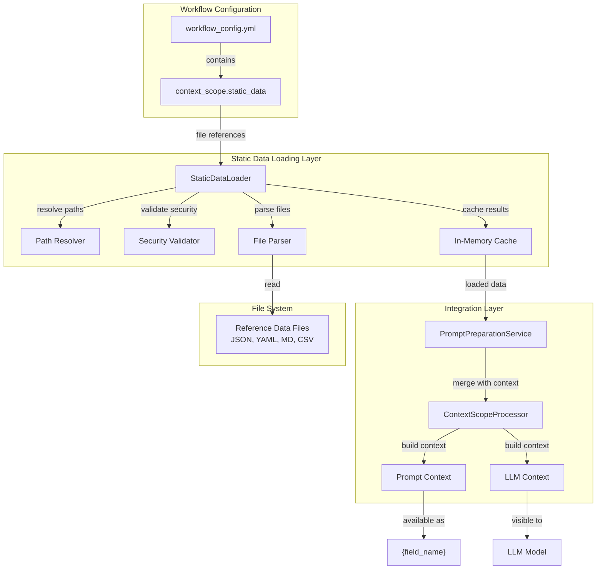

# Design Document: Context Scope Static Data Loading

## Overview

The Static Data Loading feature introduces the ability to load external reference files (JSON, YAML, Markdown, CSV) in workflow configurations through the `context_scope.static_data` directive. This enables workflows to reference large or frequently-updated data without embedding it in every input record, improving efficiency and maintainability.

The feature integrates seamlessly with the existing `PromptPreparationService` and `ContextScopeProcessor`, adding file loading capabilities while maintaining backward compatibility with workflows that don't use static data.

## Architecture

### High-Level Architecture



### Component Architecture

The implementation consists of three main components:

1. **StaticDataLoader**: Core file loading and caching logic
2. **PromptPreparationService Integration**: Orchestrates static data loading in the prompt preparation pipeline
3. **ContextScopeProcessor Integration**: Merges static data into prompt and LLM contexts

## Components and Interfaces

### 1. StaticDataLoader

**Purpose**: Load, parse, cache, and validate static data files referenced in `context_scope.static_data`.

**Location**: `agent_actions/utilities/static_data_loader.py`

**Class Definition**:

```python
from pathlib import Path
from typing import Dict, Any, Optional
from agent_actions.shared.exceptions import AgentActionsException

class StaticDataLoader:
    """
    Loads static/seed data files from designated static_data/ or seed/ folder.

    Features:
    - Parses $file: prefix syntax
    - Loads files from static_data/ or seed/ folder only
    - Supports JSON, YAML, Markdown, CSV, and plain text
    - Caches loaded data per workflow run
    - Prevents path traversal outside static data folder
    """

    # File size limit: 10MB to prevent memory issues
    MAX_FILE_SIZE_BYTES = 10 * 1024 * 1024

    def __init__(self, static_data_dir: Path):
        """
        Initialize StaticDataLoader.

        Args:
            static_data_dir: Path to the static_data/ or seed/ folder
                            containing static data files

        Raises:
            ValueError: If static_data_dir doesn't exist or is not a directory
        """
        if not static_data_dir.exists():
            raise ValueError(f"Static data directory does not exist: {static_data_dir}")
        if not static_data_dir.is_dir():
            raise ValueError(f"Static data path is not a directory: {static_data_dir}")

        self.static_data_dir = static_data_dir
        self._cache: Dict[str, Any] = {}

    def load_static_data(
        self,
        static_data_config: Dict[str, str]
    ) -> Dict[str, Any]:
        """
        Load all static data files specified in context_scope.static_data.

        Args:
            static_data_config: Dictionary mapping field names to file paths
                               (e.g., {'exam_syllabus': '$file:schema/syllabus.json'})

        Returns:
            Dictionary mapping field names to loaded data

        Raises:
            AgentActionsException: If file not found, invalid format, or security violation
        """
        pass

    def _parse_file_path(self, file_spec: str, field_name: str) -> str:
        """Parse file path from $file: prefix syntax."""
        pass

    def _resolve_path(self, file_path: str, field_name: str) -> Path:
        """Resolve file path relative to static_data_dir."""
        pass

    def _validate_path_security(self, resolved_path: Path, field_name: str) -> None:
        """Validate path doesn't escape static_data_dir."""
        pass

    def _load_file(self, file_path: Path, field_name: str) -> Any:
        """Load file content based on file extension."""
        pass

    def _load_json(self, file_path: Path) -> Any:
        """Load JSON file."""
        pass

    def _load_yaml(self, file_path: Path) -> Any:
        """Load YAML file."""
        pass

    def _load_text(self, file_path: Path) -> str:
        """Load plain text or Markdown file."""
        pass

    def _load_csv(self, file_path: Path) -> list:
        """Load CSV file as list of dictionaries."""
        pass

    def clear_cache(self) -> None:
        """Clear the file cache (typically called between workflow runs)."""
        pass

    def get_cache_stats(self) -> Dict[str, Any]:
        """Get cache statistics for debugging."""
        pass
```

**Interfaces**:

```python
# Usage example
from agent_actions.utilities.static_data_loader import StaticDataLoader

# Initialize with static_data directory
loader = StaticDataLoader(static_data_dir=Path("/path/to/workflow/static_data"))

# Load static data
static_data_config = {
    'exam_syllabus': '$file:azure_ds_associate_syllabus.json',
    'scoring_rubric': '$file:quality_rubric.yml',
    'taxonomy': '$file:reference/taxonomy.json'  # Subdirectory within static_data/
}

loaded_data = loader.load_static_data(static_data_config)
# Result: {
#   'exam_syllabus': {...parsed JSON object...},
#   'scoring_rubric': {...parsed YAML object...},
#   'taxonomy': {...parsed JSON object...}
# }
```

---

### 2. PromptPreparationService Integration

**Purpose**: Integrate static data loading into the prompt preparation pipeline.

**Location**: `agent_actions/prompt_generation/prompt_preparation_service.py`

**Modified Method**:

```python
@staticmethod
def prepare_prompt_with_context(
    agent_config: Dict[str, Any],
    agent_name: str,
    contents: Dict[str, Any],
    *,
    mode: Literal['batch', 'realtime'] = 'realtime',
    agent_indices: Optional[Dict[str, int]] = None,
    dependency_configs: Optional[Dict[str, Dict]] = None,
    source_content: Optional[Any] = None,
    loop_context: Optional[Dict] = None,
    workflow_metadata: Optional[Dict] = None,
    current_item: Optional[Dict] = None,
    file_path: Optional[str] = None,
    tools_path: Optional[str] = None
) -> PromptPreparationResult:
    """
    Prepare prompt with all transformations applied.

    Pipeline steps:
    1. Load raw prompt template
    2. Build field context with historical node loading
    3. **[NEW] Load static data files if configured**
    4. Apply context_scope transformations (observe/drop/passthrough/static_data)
    5. Build LLM context (mode-specific)
    6. Replace field references ({action.field})
    7. Inject function outputs (batch mode only)
    8. Append few-shot samples
    """

    # ... existing steps 1-2 ...

    # Step 2.5: Load static data files if configured
    context_scope = agent_config.get('context_scope', {})
    static_data = {}

    if context_scope and context_scope.get('static_data'):
        # Determine static_data directory from workflow config path
        static_data_dir = PromptPreparationService._determine_static_data_dir(
            agent_config.get('workflow_config_path')
        )

        # Load static data
        static_data_loader = StaticDataLoader(static_data_dir=static_data_dir)
        try:
            static_data = static_data_loader.load_static_data(
                context_scope.get('static_data', {})
            )
            logger.debug(
                f"Loaded {len(static_data)} static data files: "
                f"{list(static_data.keys())}"
            )
        except Exception as e:
            logger.error(f"Failed to load static data: {e}")
            raise

    # Step 3: Apply context_scope transformations
    if context_scope:
        prompt_context, llm_additional_context, passthrough_fields = \
            ContextScopeProcessor.apply_context_scope(
                field_context,
                context_scope,
                static_data=static_data  # Pass static data to processor
            )

    # ... continue with remaining steps ...

@staticmethod
def _determine_static_data_dir(workflow_config_path: Optional[str]) -> Path:
    """
    Determine static_data/ or seed/ directory for loading static data files.

    Args:
        workflow_config_path: Path to workflow config file (or None)

    Returns:
        Path to static_data/ or seed/ directory

    Raises:
        StaticDataLoadError: If neither static_data/ nor seed/ folder exists
    """
    # Determine workflow root directory
    if not workflow_config_path:
        base_dir = Path.cwd()
    else:
        file_path_obj = Path(workflow_config_path)

        # If config file is in agent_config/ subdirectory, go up one level
        if file_path_obj.parent.name == 'agent_config':
            base_dir = file_path_obj.parent.parent
        else:
            base_dir = file_path_obj.parent

    # Check for static_data/ folder (preferred)
    static_data_dir = base_dir / 'static_data'
    if static_data_dir.exists() and static_data_dir.is_dir():
        return static_data_dir

    # Check for seed/ folder (alternative)
    seed_dir = base_dir / 'seed'
    if seed_dir.exists() and seed_dir.is_dir():
        return seed_dir

    # Neither exists - raise error
    raise StaticDataLoadError(
        f"Static data directory not found. Create '{base_dir / 'static_data'}' "
        f"or '{base_dir / 'seed'}' folder to store static data files.",
        context={
            'workflow_dir': str(base_dir),
            'checked_paths': [str(static_data_dir), str(seed_dir)],
            'error_type': 'missing_static_data_directory'
        }
    )
```

---

### 3. ContextScopeProcessor Integration

**Purpose**: Merge static data into prompt and LLM contexts.

**Location**: `agent_actions/utilities/context_scope_processor.py`

**Modified Method**:

```python
@staticmethod
def apply_context_scope(
    field_context: Dict,
    context_scope: Dict,
    static_data: Optional[Dict] = None  # NEW parameter
) -> Tuple[Dict, Dict, Dict]:
    """
    Apply context_scope rules to split field_context into 3 streams.

    Args:
        field_context: Complete field context with all upstream action data
        context_scope: Context scope configuration with directives
        static_data: Pre-loaded static data (if any)

    Returns:
        Tuple of (prompt_context, llm_context, passthrough_fields)
    """
    prompt_context = deepcopy(field_context)
    llm_context = {}
    passthrough_fields = {}

    # Process STATIC_DATA: Add to both prompt_context and llm_context
    if static_data:
        llm_context.update(static_data)
        # Add as top-level fields in prompt_context for field reference replacement
        for field_name, field_value in static_data.items():
            prompt_context[field_name] = field_value

    # Process DROP: Remove from prompt_context
    for field_ref in context_scope.get('drop', []):
        # ... existing drop logic ...

    # Process OBSERVE: Extract to llm_context, remove from prompt_context
    for field_ref in context_scope.get('observe', []):
        # ... existing observe logic ...

    # Process PASSTHROUGH: Extract to passthrough_fields, remove from prompt_context
    for field_ref in context_scope.get('passthrough', []):
        # ... existing passthrough logic ...

    return (prompt_context, llm_context, passthrough_fields)
```

---

## Data Models

### Static Data Configuration Schema

```python
from typing import Dict, Any
from pydantic import BaseModel, Field

class StaticDataConfig(BaseModel):
    """Configuration for static data in context_scope."""

    # Field name -> file reference mapping
    # Example: {'exam_syllabus': '$file:schema/syllabus.json'}
    __root__: Dict[str, str] = Field(
        description="Mapping of field names to file references"
    )
```

### Static Data Cache Structure

```python
@dataclass
class CachedFileData:
    """Cached file data with metadata."""

    file_path: str
    loaded_at: datetime
    content: Any
    file_size: int
    file_type: str

# Cache structure
_cache: Dict[str, CachedFileData] = {}
```

### File Reference Format

**Supported formats**:

1. **With `$file:` prefix** (recommended):
   ```yaml
   static_data:
     field_name: $file:relative/path/to/file.json
   ```

2. **Without prefix** (auto-detected):
   ```yaml
   static_data:
     field_name: relative/path/to/file.json
   ```

**File extension mapping**:
- `.json` → JSON parser
- `.yml`, `.yaml` → YAML parser
- `.md`, `.txt` → Plain text
- `.csv` → CSV parser (DictReader)

---

## Error Handling

### Error Classification

1. **File Not Found Error**: Static data file doesn't exist
2. **File Size Error**: File exceeds MAX_FILE_SIZE_BYTES limit
3. **Parse Error**: File content parsing fails
4. **Security Error**: Path traversal attempt detected
5. **Format Error**: Unsupported file extension

### Error Handling Strategy

**Custom Exception Class**:

```python
class StaticDataLoadError(AgentActionsException):
    """Exception raised during static data loading."""

    def __init__(
        self,
        message: str,
        field_name: str,
        file_path: str,
        error_type: str,
        **context
    ):
        super().__init__(
            message,
            context={
                'field_name': field_name,
                'file_path': file_path,
                'error_type': error_type,
                'operation': 'load_static_data',
                **context
            }
        )
```

**Error Handling Examples**:

```python
# File not found
if not file_path.exists():
    raise StaticDataLoadError(
        f"Static data field '{field_name}': File not found",
        field_name=field_name,
        file_path=str(file_path),
        error_type='file_not_found'
    )

# File too large
if file_size > self.MAX_FILE_SIZE_BYTES:
    raise StaticDataLoadError(
        f"Static data field '{field_name}': File too large "
        f"(max {self.MAX_FILE_SIZE_BYTES / 1024 / 1024}MB)",
        field_name=field_name,
        file_path=str(file_path),
        file_size_bytes=file_size,
        max_size_bytes=self.MAX_FILE_SIZE_BYTES,
        error_type='file_too_large'
    )

# Security violation
try:
    resolved_path.relative_to(self.config_dir.resolve())
except ValueError:
    raise StaticDataLoadError(
        f"Static data field '{field_name}': File path outside project directory",
        field_name=field_name,
        resolved_path=str(resolved_path),
        config_dir=str(self.config_dir.resolve()),
        error_type='security_violation'
    )

# Unsupported format
if suffix not in ['.json', '.yml', '.yaml', '.md', '.txt', '.csv']:
    raise StaticDataLoadError(
        f"Static data field '{field_name}': Unsupported file type '{suffix}'",
        field_name=field_name,
        file_path=str(file_path),
        file_type=suffix,
        supported_types=['.json', '.yml', '.yaml', '.md', '.txt', '.csv'],
        error_type='unsupported_format'
    )
```

**Fail-Fast Strategy**:
- All static data errors occur before processing any records
- Workflow stops immediately on first error
- Clear error messages with actionable context

---

## Path Resolution Algorithm

### Algorithm Steps

1. **Parse file specification**:
   ```python
   if file_spec.startswith('$file:'):
       file_path = file_spec[6:]  # Remove '$file:' prefix
   else:
       file_path = file_spec  # Use as-is
   ```

2. **Reject absolute paths**:
   ```python
   path = Path(file_path)

   if path.is_absolute():
       raise StaticDataLoadError(
           f"Absolute paths not allowed for static data files",
           field_name=field_name,
           file_path=file_path,
           error_type='absolute_path_not_allowed'
       )
   ```

3. **Resolve relative to static_data_dir**:
   ```python
   # Resolve relative to static_data/ or seed/ folder
   resolved = (self.static_data_dir / path).resolve()
   ```

4. **Validate security**:
   ```python
   try:
       # Check if resolved path is within static_data_dir tree
       resolved.relative_to(self.static_data_dir.resolve())
   except ValueError:
       # Path escaped static_data_dir - security violation
       raise StaticDataLoadError(
           f"File path escapes static data directory",
           field_name=field_name,
           resolved_path=str(resolved),
           static_data_dir=str(self.static_data_dir.resolve()),
           error_type='path_traversal_attempt'
       )
   ```

### Workflow Directory Structure

**Standard Structure**:

```
agent_workflow/my_workflow/
├── agent_config/
│   └── config.yml          # Workflow config file
├── static_data/            # Static data folder (required)
│   ├── syllabus.json
│   ├── rubric.yml
│   └── reference/          # Subdirectories allowed
│       └── taxonomy.json
├── schema/                 # Output schemas (separate)
│   └── output_schema.yml
└── prompts/
    └── prompt_template.md
```

**Alternative with seed/ folder**:

```
agent_workflow/my_workflow/
├── agent_config/
│   └── config.yml
└── seed/                   # Alternative name for static data
    ├── syllabus.json
    └── rubric.yml
```

### Static Data Directory Resolution

The `_determine_static_data_dir()` helper resolves the static data folder:

1. **Determine workflow root** from `workflow_config_path`
2. **Check for `static_data/` folder** (preferred)
3. **Check for `seed/` folder** (alternative)
4. **Raise error** if neither exists

**Example Resolution**:

```python
# Config path: /path/to/my_workflow/agent_config/config.yml
workflow_config_path = "/path/to/my_workflow/agent_config/config.yml"

# Step 1: Determine base directory
base_dir = Path(workflow_config_path).parent.parent  # /path/to/my_workflow

# Step 2: Check for static_data/
static_data_dir = base_dir / "static_data"  # /path/to/my_workflow/static_data ✅

# Step 3: File resolution
file_path = "syllabus.json"
resolved = static_data_dir / file_path  # /path/to/my_workflow/static_data/syllabus.json
```

---

## Caching Strategy

### Cache Lifecycle

1. **Initialization**: Cache created when StaticDataLoader is instantiated
2. **Loading**: First access loads file and caches parsed content
3. **Reuse**: Subsequent accesses return cached content
4. **Clearing**: Cache cleared between workflow runs

### Cache Implementation

```python
class StaticDataLoader:
    def __init__(self, config_dir: Optional[Path] = None):
        self.config_dir = Path(config_dir) if config_dir else Path.cwd()
        self._cache: Dict[str, Any] = {}

    def load_static_data(self, static_data_config: Dict[str, str]) -> Dict[str, Any]:
        loaded_data = {}

        for field_name, file_spec in static_data_config.items():
            file_path = self._parse_file_path(file_spec, field_name)
            resolved_path = self._resolve_path(file_path, field_name)

            # Check cache
            cache_key = str(resolved_path)
            if cache_key in self._cache:
                loaded_data[field_name] = self._cache[cache_key]
            else:
                # Load and cache
                data = self._load_file(resolved_path, field_name)
                self._cache[cache_key] = data
                loaded_data[field_name] = data

        return loaded_data

    def clear_cache(self) -> None:
        """Clear cache between workflow runs."""
        self._cache.clear()
```

### Cache Key Strategy

**Cache key**: Absolute resolved file path string
- Ensures same file referenced multiple times uses same cache entry
- Works across different field names referencing same file

**Example**:
```python
# Both reference same file, share cache
static_data_config = {
    'primary_syllabus': '$file:schema/syllabus.json',
    'backup_syllabus': '$file:schema/syllabus.json'
}
# Only loads file once, caches by path
```

---

## Testing Strategy

### Testing Pyramid

1. **Unit Tests**: Individual component testing
2. **Integration Tests**: Component interaction testing
3. **End-to-End Tests**: Full workflow testing
4. **Security Tests**: Path traversal prevention

### Test Implementation

**Unit Testing Framework**:

```python
import pytest
from pathlib import Path
from agent_actions.utilities.static_data_loader import StaticDataLoader

class TestStaticDataLoader:
    @pytest.fixture
    def temp_config_dir(self, tmp_path):
        """Create temporary config directory structure."""
        config_dir = tmp_path / "config"
        config_dir.mkdir()

        schema_dir = config_dir / "schema"
        schema_dir.mkdir()

        # Create test files
        (schema_dir / "test.json").write_text('{"key": "value"}')
        (schema_dir / "test.yml").write_text('key: value')
        (schema_dir / "test.txt").write_text('plain text')

        return config_dir

    def test_load_json_file(self, temp_config_dir):
        loader = StaticDataLoader(config_dir=temp_config_dir)
        result = loader.load_static_data({
            'test_data': '$file:schema/test.json'
        })
        assert result['test_data'] == {'key': 'value'}

    def test_load_yaml_file(self, temp_config_dir):
        loader = StaticDataLoader(config_dir=temp_config_dir)
        result = loader.load_static_data({
            'test_data': '$file:schema/test.yml'
        })
        assert result['test_data'] == {'key': 'value'}

    def test_file_not_found_error(self, temp_config_dir):
        loader = StaticDataLoader(config_dir=temp_config_dir)
        with pytest.raises(Exception) as exc_info:
            loader.load_static_data({
                'missing': '$file:schema/missing.json'
            })
        assert 'File not found' in str(exc_info.value)

    def test_path_traversal_security(self, temp_config_dir):
        loader = StaticDataLoader(config_dir=temp_config_dir)
        with pytest.raises(Exception) as exc_info:
            loader.load_static_data({
                'evil': '$file:../../../etc/passwd'
            })
        assert 'security' in str(exc_info.value).lower()

    def test_caching_behavior(self, temp_config_dir):
        loader = StaticDataLoader(config_dir=temp_config_dir)

        # First load
        result1 = loader.load_static_data({'data': '$file:schema/test.json'})

        # Second load (should use cache)
        result2 = loader.load_static_data({'data': '$file:schema/test.json'})

        # Should be same object (cached)
        assert result1['data'] is result2['data']

        # Verify cache stats
        stats = loader.get_cache_stats()
        assert stats['cached_files'] == 1
```

**Integration Testing**:

```python
class TestPromptPreparationWithStaticData:
    def test_static_data_in_prompt_context(self, temp_workflow):
        """Test that static data is available in prompt field references."""
        agent_config = {
            'prompt': 'Syllabus: {exam_syllabus}',
            'context_scope': {
                'static_data': {
                    'exam_syllabus': '$file:schema/syllabus.json'
                }
            }
        }

        result = PromptPreparationService.prepare_prompt_with_context(
            agent_config=agent_config,
            agent_name='test_agent',
            contents={},
            file_path=str(temp_workflow / 'config.yml')
        )

        assert 'syllabus content' in result.formatted_prompt

    def test_static_data_in_llm_context(self, temp_workflow):
        """Test that static data is available in LLM context."""
        agent_config = {
            'context_scope': {
                'static_data': {
                    'reference_data': '$file:schema/reference.json'
                }
            }
        }

        result = PromptPreparationService.prepare_prompt_with_context(
            agent_config=agent_config,
            agent_name='test_agent',
            contents={},
            file_path=str(temp_workflow / 'config.yml')
        )

        assert 'reference_data' in result.llm_context
```

**End-to-End Testing**:

```python
def test_workflow_with_static_data(test_workflow_dir):
    """Test complete workflow execution with static data."""
    # Create workflow config with static_data
    config = {
        'name': 'test_workflow',
        'actions': [{
            'name': 'reviewer',
            'model_vendor': 'openai',
            'context_scope': {
                'static_data': {
                    'guidelines': '$file:schema/guidelines.md'
                }
            },
            'prompt': 'Review using: {guidelines}'
        }]
    }

    # Run workflow
    workflow = AgentWorkflow(...)
    workflow.run()

    # Verify static data was loaded and used
    assert workflow completed successfully
```

---

## Performance Considerations

### Optimization Strategies

1. **Lazy Loading**: Only load files when `static_data` is configured
2. **Caching**: Load each file once per workflow run, reuse for all records
3. **File Size Limits**: Prevent loading files >10MB to protect memory
4. **Fast Path**: Skip static data processing when not configured (zero overhead)

### Performance Metrics

| Metric | Target | Measurement |
|--------|--------|-------------|
| File load time | <50ms per file | Time to load and parse file |
| Cache lookup time | <1ms | Time to retrieve from cache |
| Memory overhead | <file size * 1.5 | In-memory cache size |
| Workflow startup | <100ms added | Additional time with static data |

### Memory Management

**Cache size estimation**:
```python
def get_cache_stats(self) -> Dict[str, Any]:
    """Get cache statistics including memory usage."""
    import sys

    total_size = sum(
        sys.getsizeof(value)
        for value in self._cache.values()
    )

    return {
        'cached_files': len(self._cache),
        'cached_file_paths': list(self._cache.keys()),
        'total_size_bytes': total_size,
        'total_size_mb': total_size / 1024 / 1024
    }
```

---

## Security Considerations

### Path Traversal Prevention

**Validation Algorithm**:
1. Reject absolute paths immediately
2. Resolve path to absolute normalized path (relative to `static_data_dir`)
3. Check if resolved path is within `static_data_dir` tree
4. Reject if path escapes static data folder

**Implementation**:
```python
def _resolve_path(self, file_path: str, field_name: str) -> Path:
    path = Path(file_path)

    # Reject absolute paths
    if path.is_absolute():
        raise StaticDataLoadError(
            f"Absolute paths not allowed",
            field_name=field_name,
            file_path=file_path,
            error_type='absolute_path_not_allowed'
        )

    # Resolve relative to static_data_dir
    resolved = (self.static_data_dir / path).resolve()

    # Validate security
    self._validate_path_security(resolved, field_name)

    return resolved

def _validate_path_security(self, resolved_path: Path, field_name: str) -> None:
    try:
        # This will raise ValueError if path is outside static_data_dir
        resolved_path.relative_to(self.static_data_dir.resolve())
    except ValueError:
        raise StaticDataLoadError(
            f"File path escapes static data directory",
            field_name=field_name,
            resolved_path=str(resolved_path),
            static_data_dir=str(self.static_data_dir.resolve()),
            error_type='path_traversal_attempt'
        )
```

**Attack Vectors Protected**:
- `../../etc/passwd` - Path traversal (blocked by relative_to check)
- `/etc/passwd` - Absolute paths (rejected immediately)
- `../../../schema/data.json` - Escaping to sibling folders (blocked)
- Symlink attacks (if symlink points outside static_data_dir, blocked)

**Security Benefits of static_data/ Folder**:
- Files MUST be in designated folder
- Cannot access arbitrary files in project
- Clear security boundary
- Easy to audit what data is available

### File Access Controls

**Permissions**: Use standard Python file I/O (respects OS permissions)
**No privilege escalation**: Runs with workflow user's permissions
**Read-only**: Only reads files, never writes

---

## Backward Compatibility

### No Breaking Changes

1. **Optional feature**: Workflows without `static_data` work unchanged
2. **New field**: `static_data` is a new context_scope field, doesn't conflict
3. **Graceful degradation**: Empty/null static_data is silently skipped

### Migration Path

**From embedded data**:
```yaml
# Before: Data embedded in source records
# (In staging data JSON)
{"record": "data", "reference": {"large": "data"}}

# After: Data loaded from file
actions:
  - name: processor
    context_scope:
      static_data:
        reference: $file:schema/reference.json
```

**Benefits of migration**:
- Reduce input file size by 90%+
- Update reference data without regenerating staging
- Share reference data across workflows

---

## Documentation Requirements

1. **User Guide**: How to use `static_data` in workflows
2. **Reference Documentation**: API docs for StaticDataLoader
3. **Migration Guide**: Converting embedded data to static files
4. **Security Best Practices**: Safe file organization
5. **Troubleshooting**: Common errors and solutions

---

This design provides a robust, secure, and performant static data loading system that integrates seamlessly with existing agent-actions infrastructure while maintaining backward compatibility.
