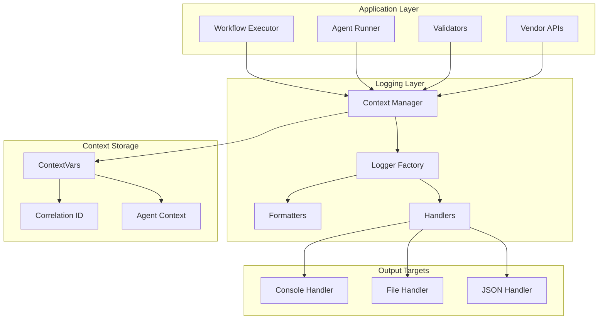

# Design Document

## Overview

The Logging Improvement System is a comprehensive overhaul of Agent Actions' logging infrastructure. It introduces structured logging with correlation IDs, consistent formatting, proper exception handling, and centralized configuration. The design follows patterns established by industry tools like Prefect, Airflow, and Celery.

## Architecture

### High-Level Architecture



### Technology Stack

**Core:**
- Python `logging` module (standard library)
- `contextvars` for thread-safe correlation context
- `structlog` for structured logging (optional enhancement)
- `rich` for console formatting (existing dependency)

**Integration:**
- Custom `logging.Filter` for context injection
- Custom `logging.Formatter` for JSON/human-readable output
- `QueueHandler` for async logging in high-throughput scenarios

## Components and Interfaces

### Core Components

#### 1. LoggingConfig Class

```python
from dataclasses import dataclass, field
from typing import Dict, List, Optional, Literal
from pathlib import Path

LogLevel = Literal['DEBUG', 'INFO', 'WARNING', 'ERROR', 'CRITICAL']

@dataclass
class HandlerConfig:
    """Configuration for a single log handler."""
    type: Literal['console', 'file', 'json']
    level: LogLevel = 'INFO'
    format: str = 'human'  # 'human' or 'json'
    file_path: Optional[Path] = None
    max_bytes: int = 10_000_000  # 10MB
    backup_count: int = 5

@dataclass
class LoggingConfig:
    """Central logging configuration."""
    default_level: LogLevel = 'INFO'
    handlers: List[HandlerConfig] = field(default_factory=list)
    module_levels: Dict[str, LogLevel] = field(default_factory=dict)
    include_timestamps: bool = True
    include_source_location: bool = True
    redact_patterns: List[str] = field(default_factory=lambda: [
        r'api[_-]?key',
        r'secret',
        r'token',
        r'password',
        r'credential'
    ])

    @classmethod
    def from_project_config(cls, config: dict) -> 'LoggingConfig':
        """Create LoggingConfig from project configuration."""
        pass

    @classmethod
    def from_environment(cls) -> 'LoggingConfig':
        """Create LoggingConfig from environment variables."""
        pass
```

#### 2. CorrelationContext Class

```python
from contextvars import ContextVar
from dataclasses import dataclass
from typing import Optional
from uuid import uuid4

@dataclass
class ExecutionContext:
    """Context information for a single execution."""
    correlation_id: str
    workflow_name: Optional[str] = None
    agent_name: Optional[str] = None
    agent_index: Optional[int] = None
    batch_id: Optional[str] = None
    item_id: Optional[str] = None

# Thread-safe context storage
_execution_context: ContextVar[Optional[ExecutionContext]] = ContextVar(
    'execution_context',
    default=None
)

class CorrelationContext:
    """Manages execution context for logging correlation."""

    @staticmethod
    def generate_correlation_id() -> str:
        """Generate a unique correlation ID."""
        return str(uuid4())[:8]  # Short form for readability

    @staticmethod
    def get_context() -> Optional[ExecutionContext]:
        """Get current execution context."""
        return _execution_context.get()

    @staticmethod
    def set_context(ctx: ExecutionContext) -> None:
        """Set execution context for current thread/coroutine."""
        _execution_context.set(ctx)

    @staticmethod
    def clear_context() -> None:
        """Clear execution context."""
        _execution_context.set(None)

    @classmethod
    def start_workflow(cls, workflow_name: str) -> ExecutionContext:
        """Initialize context for workflow execution."""
        ctx = ExecutionContext(
            correlation_id=cls.generate_correlation_id(),
            workflow_name=workflow_name
        )
        cls.set_context(ctx)
        return ctx

    @classmethod
    def set_agent(cls, agent_name: str, agent_index: int) -> None:
        """Update context with current agent information."""
        ctx = cls.get_context()
        if ctx:
            ctx.agent_name = agent_name
            ctx.agent_index = agent_index
```

#### 3. ContextInjectingFilter Class

```python
import logging
from typing import Any, Dict

class ContextInjectingFilter(logging.Filter):
    """Injects execution context into log records."""

    def filter(self, record: logging.LogRecord) -> bool:
        """Add context fields to log record."""
        ctx = CorrelationContext.get_context()

        if ctx:
            record.correlation_id = ctx.correlation_id
            record.workflow_name = ctx.workflow_name or ''
            record.agent_name = ctx.agent_name or ''
            record.agent_index = ctx.agent_index if ctx.agent_index is not None else -1
            record.batch_id = ctx.batch_id or ''
            record.item_id = ctx.item_id or ''
        else:
            record.correlation_id = ''
            record.workflow_name = ''
            record.agent_name = ''
            record.agent_index = -1
            record.batch_id = ''
            record.item_id = ''

        return True
```

#### 4. Formatter Classes

```python
import json
import logging
from datetime import datetime
from typing import Any, Dict

class JSONFormatter(logging.Formatter):
    """Formats log records as single-line JSON."""

    STANDARD_FIELDS = {
        'timestamp', 'level', 'logger', 'message',
        'correlation_id', 'workflow_name', 'agent_name',
        'agent_index', 'source_file', 'source_line'
    }

    def format(self, record: logging.LogRecord) -> str:
        """Format record as JSON string."""
        log_dict: Dict[str, Any] = {
            'timestamp': datetime.utcnow().isoformat() + 'Z',
            'level': record.levelname,
            'logger': record.name,
            'message': record.getMessage(),
        }

        # Add correlation context
        if hasattr(record, 'correlation_id') and record.correlation_id:
            log_dict['correlation_id'] = record.correlation_id
        if hasattr(record, 'workflow_name') and record.workflow_name:
            log_dict['workflow_name'] = record.workflow_name
        if hasattr(record, 'agent_name') and record.agent_name:
            log_dict['agent_name'] = record.agent_name
        if hasattr(record, 'agent_index') and record.agent_index >= 0:
            log_dict['agent_index'] = record.agent_index

        # Add source location
        log_dict['source_file'] = record.pathname
        log_dict['source_line'] = record.lineno

        # Add exception info
        if record.exc_info:
            log_dict['exception'] = self.formatException(record.exc_info)

        # Add any extra fields
        for key, value in record.__dict__.items():
            if key not in self.STANDARD_FIELDS and not key.startswith('_'):
                if key not in ('args', 'exc_info', 'exc_text', 'stack_info',
                              'msg', 'levelno', 'pathname', 'filename',
                              'module', 'lineno', 'funcName', 'created',
                              'msecs', 'relativeCreated', 'thread', 'threadName',
                              'processName', 'process', 'name', 'levelname'):
                    log_dict[key] = value

        return json.dumps(log_dict, default=str)


class HumanFormatter(logging.Formatter):
    """Formats log records for human readability."""

    LEVEL_COLORS = {
        'DEBUG': '\033[36m',     # Cyan
        'INFO': '\033[32m',      # Green
        'WARNING': '\033[33m',   # Yellow
        'ERROR': '\033[31m',     # Red
        'CRITICAL': '\033[35m',  # Magenta
    }
    RESET = '\033[0m'

    def format(self, record: logging.LogRecord) -> str:
        """Format record with colors and context."""
        color = self.LEVEL_COLORS.get(record.levelname, '')

        # Build prefix with context
        prefix_parts = []
        if hasattr(record, 'correlation_id') and record.correlation_id:
            prefix_parts.append(f'[{record.correlation_id}]')
        if hasattr(record, 'agent_name') and record.agent_name:
            prefix_parts.append(f'[{record.agent_name}]')

        prefix = ' '.join(prefix_parts)
        if prefix:
            prefix = f'{prefix} '

        # Format message
        timestamp = datetime.now().strftime('%H:%M:%S.%f')[:-3]
        level = f'{color}{record.levelname:8}{self.RESET}'

        formatted = f'{timestamp} {level} {prefix}{record.getMessage()}'

        # Add exception if present
        if record.exc_info:
            formatted += '\n' + self.formatException(record.exc_info)

        return formatted
```

#### 5. LoggerFactory Class

```python
import logging
from typing import Optional

class LoggerFactory:
    """Factory for creating configured loggers."""

    _initialized: bool = False
    _config: Optional[LoggingConfig] = None

    @classmethod
    def initialize(cls, config: Optional[LoggingConfig] = None) -> None:
        """Initialize logging system with configuration."""
        if cls._initialized:
            return

        cls._config = config or LoggingConfig()

        # Get root logger for agent_actions
        root_logger = logging.getLogger('agent_actions')
        root_logger.setLevel(getattr(logging, cls._config.default_level))

        # Clear existing handlers
        root_logger.handlers.clear()

        # Add context filter
        context_filter = ContextInjectingFilter()
        root_logger.addFilter(context_filter)

        # Configure handlers
        for handler_config in cls._config.handlers:
            handler = cls._create_handler(handler_config)
            root_logger.addHandler(handler)

        # Add default console handler if none configured
        if not cls._config.handlers:
            handler = logging.StreamHandler()
            handler.setFormatter(HumanFormatter())
            root_logger.addHandler(handler)

        # Configure module-specific levels
        for module, level in cls._config.module_levels.items():
            logging.getLogger(module).setLevel(getattr(logging, level))

        cls._initialized = True

    @classmethod
    def _create_handler(cls, config: HandlerConfig) -> logging.Handler:
        """Create handler from configuration."""
        if config.type == 'console':
            handler = logging.StreamHandler()
        elif config.type == 'file':
            from logging.handlers import RotatingFileHandler
            handler = RotatingFileHandler(
                config.file_path,
                maxBytes=config.max_bytes,
                backupCount=config.backup_count
            )
        elif config.type == 'json':
            handler = logging.StreamHandler()
        else:
            raise ValueError(f'Unknown handler type: {config.type}')

        handler.setLevel(getattr(logging, config.level))

        if config.format == 'json' or config.type == 'json':
            handler.setFormatter(JSONFormatter())
        else:
            handler.setFormatter(HumanFormatter())

        return handler

    @classmethod
    def get_logger(cls, name: str) -> logging.Logger:
        """Get a logger with the given name."""
        if not cls._initialized:
            cls.initialize()

        # Ensure it's under agent_actions namespace
        if not name.startswith('agent_actions'):
            name = f'agent_actions.{name}'

        return logging.getLogger(name)
```

### Data Models

#### Log Record Schema

```python
from dataclasses import dataclass
from datetime import datetime
from typing import Optional, Dict, Any

@dataclass
class StructuredLogRecord:
    """Schema for structured log records."""

    # Required fields
    timestamp: datetime
    level: str
    logger: str
    message: str

    # Context fields
    correlation_id: Optional[str] = None
    workflow_name: Optional[str] = None
    agent_name: Optional[str] = None
    agent_index: Optional[int] = None
    batch_id: Optional[str] = None
    item_id: Optional[str] = None

    # Source location
    source_file: Optional[str] = None
    source_line: Optional[int] = None
    source_function: Optional[str] = None

    # Exception info
    exception_type: Optional[str] = None
    exception_message: Optional[str] = None
    exception_traceback: Optional[str] = None

    # Performance metrics
    duration_ms: Optional[float] = None

    # Extra fields
    extra: Dict[str, Any] = None
```

#### Exception Logging Interface

```python
from typing import Dict, Any, Optional
import logging

def log_exception(
    logger: logging.Logger,
    message: str,
    exception: Exception,
    context: Optional[Dict[str, Any]] = None,
    level: int = logging.ERROR,
    include_traceback: bool = True
) -> None:
    """
    Log an exception with full context.

    Args:
        logger: Logger instance to use
        message: Human-readable description
        exception: The exception to log
        context: Additional context dictionary
        level: Log level to use
        include_traceback: Whether to include full traceback
    """
    extra = context or {}
    extra['exception_type'] = type(exception).__name__
    extra['exception_message'] = str(exception)

    # Include cause chain
    causes = []
    current = exception.__cause__
    while current:
        causes.append({
            'type': type(current).__name__,
            'message': str(current)
        })
        current = current.__cause__
    if causes:
        extra['exception_causes'] = causes

    logger.log(
        level,
        message,
        exc_info=include_traceback,
        extra=extra
    )
```

### Integration Points

#### Workflow Executor Integration

```python
# In agent_workflow.py

class AgentWorkflow:
    def __init__(self, ...):
        self.logger = LoggerFactory.get_logger('orchestration.workflow')

    def run(self, workflow_name: str, ...) -> str:
        # Start correlation context
        ctx = CorrelationContext.start_workflow(workflow_name)

        self.logger.info(
            'Starting workflow execution',
            extra={
                'workflow_name': workflow_name,
                'agent_count': len(self.agents)
            }
        )

        try:
            result = self._execute_workflow(...)

            self.logger.info(
                'Workflow completed successfully',
                extra={
                    'duration_ms': duration * 1000,
                    'agents_executed': agent_count
                }
            )

            return result

        except Exception as e:
            log_exception(
                self.logger,
                'Workflow execution failed',
                e,
                context={'workflow_name': workflow_name}
            )
            raise

        finally:
            CorrelationContext.clear_context()
```

#### Agent Executor Integration

```python
# In agent_executor.py

class AgentExecutor:
    def __init__(self, ...):
        self.logger = LoggerFactory.get_logger('orchestration.executor')

    def execute_agent_sync(
        self,
        agent_name: str,
        agent_idx: int,
        agent_config: Dict[str, Any],
        is_last_agent: bool
    ) -> AgentExecutionResult:

        # Update correlation context
        CorrelationContext.set_agent(agent_name, agent_idx)

        self.logger.info(
            'Starting agent execution',
            extra={
                'agent_name': agent_name,
                'agent_index': agent_idx,
                'is_last': is_last_agent
            }
        )

        start_time = time.time()

        try:
            result = self._execute(...)

            duration = time.time() - start_time
            self.logger.info(
                'Agent execution completed',
                extra={
                    'agent_name': agent_name,
                    'duration_ms': duration * 1000,
                    'status': result.status
                }
            )

            return result

        except Exception as e:
            duration = time.time() - start_time
            log_exception(
                self.logger,
                'Agent execution failed',
                e,
                context={
                    'agent_name': agent_name,
                    'duration_ms': duration * 1000
                }
            )
            raise
```

## Error Handling Patterns

### Pattern 1: Replace Silent Exception Handlers

```python
# BEFORE (problematic)
try:
    result = risky_operation()
except Exception:
    pass  # Silent swallow

# AFTER (correct)
try:
    result = risky_operation()
except Exception as e:
    self.logger.warning(
        'Operation failed, using fallback',
        exc_info=True,
        extra={'operation': 'risky_operation'}
    )
    result = fallback_value
```

### Pattern 2: Preserve Exception Chains

```python
# BEFORE (breaks chain)
try:
    result = api_call()
except APIError as e:
    raise ProcessingError(f'API failed: {e}')  # Chain lost

# AFTER (preserves chain)
try:
    result = api_call()
except APIError as e:
    self.logger.error(
        'API call failed',
        exc_info=True,
        extra={'api_name': 'vendor'}
    )
    raise ProcessingError(
        'API failed',
        context={'api_name': 'vendor'},
        cause=e
    )
```

### Pattern 3: Replace Print Statements

```python
# BEFORE
print(f'Processing item {item_id}')
if debug:
    print(f'Debug: {data}')

# AFTER
self.logger.info('Processing item', extra={'item_id': item_id})
self.logger.debug('Item data', extra={'data': data})
```

## Testing Strategy

### Unit Testing

```python
import logging
import pytest
from unittest.mock import MagicMock

def test_context_injection():
    """Test that correlation context is injected into logs."""
    handler = MagicMock()
    logger = LoggerFactory.get_logger('test')
    logger.addHandler(handler)

    ctx = CorrelationContext.start_workflow('test-workflow')
    logger.info('Test message')

    record = handler.emit.call_args[0][0]
    assert record.correlation_id == ctx.correlation_id
    assert record.workflow_name == 'test-workflow'

def test_json_formatting():
    """Test JSON formatter output."""
    formatter = JSONFormatter()
    record = logging.LogRecord(
        name='test',
        level=logging.INFO,
        pathname='test.py',
        lineno=1,
        msg='Test message',
        args=(),
        exc_info=None
    )
    record.correlation_id = 'abc123'

    output = formatter.format(record)
    data = json.loads(output)

    assert data['message'] == 'Test message'
    assert data['correlation_id'] == 'abc123'
    assert 'timestamp' in data
```

### Integration Testing

```python
def test_workflow_logging_integration():
    """Test logging through full workflow execution."""
    log_capture = []

    handler = logging.Handler()
    handler.emit = lambda r: log_capture.append(r)

    LoggerFactory.initialize()
    logging.getLogger('agent_actions').addHandler(handler)

    workflow = AgentWorkflow(...)
    workflow.run('test-workflow', ...)

    # Verify correlation ID consistency
    correlation_ids = {r.correlation_id for r in log_capture}
    assert len(correlation_ids) == 1  # All logs have same ID

    # Verify agent context
    agent_logs = [r for r in log_capture if r.agent_name]
    assert all(r.agent_index >= 0 for r in agent_logs)
```

## Security Considerations

### Credential Redaction

```python
import re
from typing import Any

class RedactingFilter(logging.Filter):
    """Redacts sensitive information from log records."""

    PATTERNS = [
        (r'api[_-]?key["\']?\s*[:=]\s*["\']?[\w-]+', 'api_key=***'),
        (r'secret["\']?\s*[:=]\s*["\']?[\w-]+', 'secret=***'),
        (r'token["\']?\s*[:=]\s*["\']?[\w-]+', 'token=***'),
        (r'password["\']?\s*[:=]\s*["\']?[\w-]+', 'password=***'),
        (r'sk-[a-zA-Z0-9]{32,}', 'sk-***'),  # OpenAI keys
        (r'anthropic-[a-zA-Z0-9]{32,}', 'anthropic-***'),
    ]

    def filter(self, record: logging.LogRecord) -> bool:
        """Redact sensitive patterns from message."""
        msg = record.getMessage()
        for pattern, replacement in self.PATTERNS:
            msg = re.sub(pattern, replacement, msg, flags=re.IGNORECASE)
        record.msg = msg
        record.args = ()
        return True
```

## Performance Optimization

### Async Logging for High Throughput

```python
import logging
from logging.handlers import QueueHandler, QueueListener
from queue import Queue

def setup_async_logging():
    """Configure async logging for high-throughput scenarios."""
    log_queue = Queue()

    # Create actual handlers
    file_handler = logging.FileHandler('agent_actions.log')
    file_handler.setFormatter(JSONFormatter())

    console_handler = logging.StreamHandler()
    console_handler.setFormatter(HumanFormatter())

    # Create queue listener
    listener = QueueListener(
        log_queue,
        file_handler,
        console_handler,
        respect_handler_level=True
    )
    listener.start()

    # Configure root logger to use queue
    queue_handler = QueueHandler(log_queue)
    root_logger = logging.getLogger('agent_actions')
    root_logger.addHandler(queue_handler)

    return listener  # Call listener.stop() on shutdown
```

### Lazy Evaluation

```python
# Avoid expensive string formatting when log level is disabled
logger.debug('Processing data: %s', expensive_serialize(data))

# Use lazy evaluation for complex objects
class LazyStr:
    def __init__(self, func):
        self.func = func
    def __str__(self):
        return self.func()

logger.debug('Data: %s', LazyStr(lambda: json.dumps(data)))
```

## Migration Guide

### Phase 1: Infrastructure Setup
1. Create `agent_actions/logging/` module with core components
2. Add configuration schema for logging settings
3. Initialize logging in application entry points

### Phase 2: Silent Exception Fixes
1. Audit all `except:` and `except Exception:` blocks
2. Add appropriate logging to each handler
3. Ensure exception chains are preserved

### Phase 3: Print Statement Migration
1. Replace `print()` calls with logger calls
2. Convert `prompt_debug` flags to DEBUG level logging
3. Remove conditional debug output patterns

### Phase 4: Context Integration
1. Add correlation ID generation to workflow start
2. Inject context into all component loggers
3. Verify context propagation in async operations
