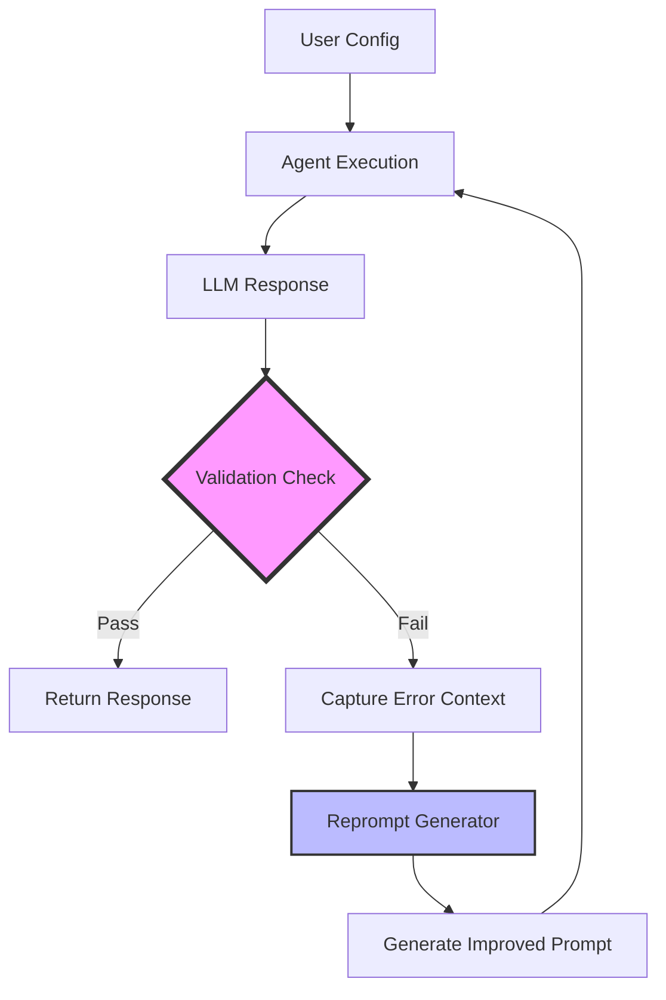
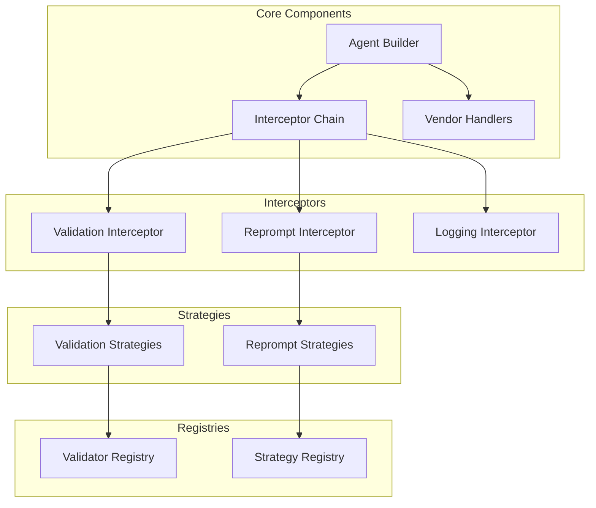

# Conditional Reprompting Feature Design

## Executive Summary

This document outlines the design for a conditional reprompting mechanism that validates LLM outputs and automatically generates improved prompts when validation fails. The system uses a modular, interceptor-based architecture that seamlessly integrates with the existing agent-actions framework.

## Problem Statement

When using LLMs to generate content with specific requirements (e.g., "generate exactly 5 words"), the output often fails to meet constraints. Currently, there's no automated way to:
1. Validate the output against custom criteria
2. Intelligently retry with improved prompts
3. Learn from validation failures to craft better instructions

## Solution Overview

### Core Concept



### Key Features

1. **Stateless Retry**: Each attempt is independent - the main LLM has no memory of previous failures
2. **Intelligent Reprompting**: Uses an LLM to analyze failures and craft better prompts
3. **Pluggable Architecture**: Easy to add new validators and reprompting strategies
4. **Configuration-Driven**: No code changes needed for common use cases

## Architecture Design

### Component Overview



### Detailed Component Design

#### 1. Interceptor Framework

**File: `agent_actions/interceptors/base.py`**

```python
from abc import ABC, abstractmethod
from dataclasses import dataclass
from typing import Any, Dict, Optional, List

@dataclass
class InterceptorResult:
    """Result from an interceptor's processing"""
    continue_processing: bool = True
    modified_response: Optional[Any] = None
    retry_context: Optional[Dict] = None
    metadata: Dict = None

class ResponseInterceptor(ABC):
    """Base class for all response interceptors"""
    
    @abstractmethod
    def intercept(self, response: Any, context: Dict) -> InterceptorResult:
        """
        Process the response and determine next action
        
        Args:
            response: The LLM response to process
            context: Current execution context including attempt number
            
        Returns:
            InterceptorResult indicating how to proceed
        """
        pass
    
    @abstractmethod
    def configure(self, config: Dict) -> None:
        """Configure the interceptor from agent config"""
        pass

class InterceptorChain:
    """Manages the chain of interceptors"""
    
    def __init__(self, interceptors: List[ResponseInterceptor]):
        self.interceptors = interceptors
    
    def process(self, response: Any, context: Dict) -> InterceptorResult:
        """Run response through all interceptors"""
        current_response = response
        
        for interceptor in self.interceptors:
            result = interceptor.intercept(current_response, context)
            
            if result.modified_response is not None:
                current_response = result.modified_response
            
            if result.retry_context:
                # Stop processing and signal retry
                return result
                
            if not result.continue_processing:
                # Stop processing and return current state
                return InterceptorResult(
                    continue_processing=False,
                    modified_response=current_response
                )
        
        # All interceptors passed
        return InterceptorResult(
            continue_processing=True,
            modified_response=current_response
        )
```

#### 2. Validation System

**File: `agent_actions/interceptors/validation_interceptor.py`**

```python
from typing import Callable, Tuple
from .base import ResponseInterceptor, InterceptorResult
import importlib

class ValidationInterceptor(ResponseInterceptor):
    """Interceptor that validates responses against configured criteria"""
    
    def __init__(self):
        self.validator_name = None
        self.validator_args = {}
        self.on_failure = "retry"  # or "fail", "continue"
        self.validator_func = None
    
    def configure(self, config: Dict) -> None:
        """Configure validation from agent config"""
        self.validator_name = config.get("validator_function")
        self.validator_args = config.get("validator_args", {})
        self.on_failure = config.get("on_failure", "retry")
        
        # Load validator function by module path
        module_path, function_name = self.validator_name.rsplit('.', 1)
        module = importlib.import_module(module_path)
        self.validator_func = getattr(module, function_name)
        if not self.validator_func:
            raise ValueError(f"Unknown validator function: {self.validator_name}")
    
    def intercept(self, response: Any, context: Dict) -> InterceptorResult:
        """Validate response and determine action"""
        if not self.validator_func:
            return InterceptorResult(continue_processing=True)
        
        # Extract content from response
        content = self._extract_content(response)
        
        # Run validation
        success, error_message = self.validator_func(content, **self.validator_args)
        
        if success:
            return InterceptorResult(continue_processing=True)
        
        # Handle validation failure
        if self.on_failure == "retry":
            return InterceptorResult(
                continue_processing=False,
                retry_context={
                    "validation_error": error_message,
                    "validator_name": self.validator_name,
                    "validator_args": self.validator_args,
                    "failed_response": response
                }
            )
        elif self.on_failure == "fail":
            raise ValueError(f"Validation failed: {error_message}")
        else:  # continue
            return InterceptorResult(
                continue_processing=True,
                metadata={"validation_warning": error_message}
            )
    
    def _extract_content(self, response: Any) -> str:
        """Extract text content from various response formats"""
        if isinstance(response, list) and len(response) > 0:
            first_item = response[0]
            if isinstance(first_item, dict):
                return first_item.get('content', '') or first_item.get('text', '')
            return str(first_item)
        elif isinstance(response, dict):
            return response.get('content', '') or response.get('text', '')
        return str(response)
```

**File: `agent_actions/validators/builtin_functions.py`**

```python
from typing import List, Tuple

def word_count_validator(content: str, expected: int = 5) -> Tuple[bool, str | None]:
    """Validate that content has exactly the expected number of words"""
    word_count = len(content.split())
    if word_count == expected:
        return True, None
    return False, f"Expected {expected} words, got {word_count}"

def char_count_validator(
    content: str, *, min_chars: int = 0, max_chars: int | None = None
) -> Tuple[bool, str | None]:
    """Validate character count is within range"""
    char_count = len(content)
    if char_count < min_chars:
        return False, f"Too short: {char_count} chars, minimum {min_chars}"
    if max_chars and char_count > max_chars:
        return False, f"Too long: {char_count} chars, maximum {max_chars}"
    return True, None

def keywords_validator(content: str, required_keywords: List[str]) -> Tuple[bool, str | None]:
    """Validate that content contains all required keywords"""
    content_lower = content.lower()
    missing = [kw for kw in required_keywords if kw.lower() not in content_lower]
    if missing:
        return False, f"Missing required keywords: {', '.join(missing)}"
    return True, None
```

Note: Validator functions are now referenced by their full module path instead of using a registry system. This provides better IDE support, type checking, and makes the system more explicit.

#### 3. Reprompting System

**File: `agent_actions/strategies/reprompt_strategy.py`**

```python
from abc import ABC, abstractmethod
from dataclasses import dataclass
from typing import Dict, Optional

@dataclass
class RepromptContext:
    """Context for reprompt generation"""
    original_prompt: str
    validation_error: str
    validation_criteria: Dict
    attempt_number: int
    failed_response: Any
    agent_config: Dict

class RepromptStrategy(ABC):
    """Base class for reprompt generation strategies"""
    
    @abstractmethod
    def generate_improved_prompt(self, context: RepromptContext) -> str:
        """Generate an improved prompt based on validation failure"""
        pass

class LLMRepromptStrategy(RepromptStrategy):
    """Uses an LLM to generate improved prompts"""
    
    def __init__(self, llm_config: Dict):
        self.llm_config = llm_config
        self.prompt_template = llm_config.get('prompt_template', self._default_template())
    
    def generate_improved_prompt(self, context: RepromptContext) -> str:
        """Use LLM to analyze failure and generate better prompt"""
        from ..models import agent_builder
        
        # Build prompt for the reprompt LLM
        reprompt_request = self.prompt_template.format(
            original_prompt=context.original_prompt,
            validation_error=context.validation_error,
            validation_criteria=context.validation_criteria,
            failed_response=context.failed_response,
            attempt_number=context.attempt_number
        )
        
        # Create a temporary agent config for reprompt generation
        reprompt_agent_config = {
            'model_vendor': self.llm_config.get('model_vendor', 'openai'),
            'model_name': self.llm_config.get('model_name', 'gpt-4'),
            'prompt': reprompt_request,
            'temperature': 0.7
        }
        
        # Generate improved prompt
        response = agent_builder.create_dynamic_agent(
            reprompt_agent_config,
            udf=None,
            context_data_str="",
            formatted_prompt=reprompt_request
        )
        
        # Extract generated prompt from response
        if isinstance(response, list) and len(response) > 0:
            return response[0].get('content', response[0]) if isinstance(response[0], dict) else str(response[0])
        return str(response)
    
    def _default_template(self) -> str:
        return """You are an expert prompt engineer. A previous LLM attempt failed validation.

Original Prompt: {original_prompt}

Validation Error: {validation_error}

The prompt must meet these criteria: {validation_criteria}

The LLM's failed response was: {failed_response}

This is attempt #{attempt_number}.

Generate an improved prompt that will help the LLM meet the validation criteria. Be specific and explicit about the requirements. Focus on clarity and constraints.

Return ONLY the improved prompt, nothing else."""

class TemplateRepromptStrategy(RepromptStrategy):
    """Uses predefined templates for common failure patterns"""
    
    def __init__(self, templates: Dict[str, str]):
        self.templates = templates
    
    def generate_improved_prompt(self, context: RepromptContext) -> str:
        """Select and fill appropriate template"""
        # Match error pattern to template
        for pattern, template in self.templates.items():
            if pattern in context.validation_error.lower():
                return template.format(
                    original_prompt=context.original_prompt,
                    **context.validation_criteria
                )
        
        # Default template
        return f"{context.original_prompt}\n\nIMPORTANT: {context.validation_error}"
```

**File: `agent_actions/interceptors/reprompt_interceptor.py`**

```python
from .base import ResponseInterceptor, InterceptorResult
from ..strategies.reprompt_strategy import RepromptContext, LLMRepromptStrategy, TemplateRepromptStrategy

class RepromptInterceptor(ResponseInterceptor):
    """Interceptor that generates improved prompts on validation failure"""
    
    def __init__(self):
        self.strategy = None
        self.max_attempts = 3
    
    def configure(self, config: Dict) -> None:
        """Configure reprompting strategy"""
        strategy_type = config.get('strategy', 'llm')
        self.max_attempts = config.get('max_attempts', 3)
        
        if strategy_type == 'llm':
            self.strategy = LLMRepromptStrategy(config.get('llm_config', {}))
        elif strategy_type == 'template':
            self.strategy = TemplateRepromptStrategy(config.get('templates', {}))
        else:
            raise ValueError(f"Unknown reprompt strategy: {strategy_type}")
    
    def intercept(self, response: Any, context: Dict) -> InterceptorResult:
        """Check for retry context and generate improved prompt"""
        if 'validation_error' not in context:
            # No validation error, continue
            return InterceptorResult(continue_processing=True)
        
        attempt = context.get('attempt', 0)
        if attempt >= self.max_attempts:
            # Max attempts reached
            return InterceptorResult(
                continue_processing=False,
                metadata={"max_attempts_reached": True}
            )
        
        # Build reprompt context
        reprompt_context = RepromptContext(
            original_prompt=context.get('original_prompt', context.get('prompt')),
            validation_error=context['validation_error'],
            validation_criteria=context.get('validator_args', {}),
            attempt_number=attempt + 1,
            failed_response=context.get('failed_response'),
            agent_config=context.get('agent_config', {})
        )
        
        # Generate improved prompt
        improved_prompt = self.strategy.generate_improved_prompt(reprompt_context)
        
        # Update context for retry
        return InterceptorResult(
            continue_processing=False,
            retry_context={
                'prompt': improved_prompt,
                'original_prompt': reprompt_context.original_prompt,
                'attempt': attempt + 1,
                'history': context.get('history', []) + [{
                    'attempt': attempt,
                    'prompt': context.get('prompt'),
                    'error': context['validation_error']
                }]
            }
        )
```

#### 4. Integration with Agent Builder

**Modified: `agent_actions/models/agent_builder.py`**

Add the following to the `create_dynamic_agent` function:

```python
def create_dynamic_agent(
    agent_config: Dict[str, Any],
    udf: Any,
    context_data_str: Union[str, Dict],
    formatted_prompt: Optional[str] = None,
    tools_path: Optional[str] = None,
    tool_args: Optional[Dict[str, Any]] = None,
    source_content: Optional[Any] = None
) -> List[Any]:
    """
    Build and execute a prompt against the selected vendor, returning
    the model's response(s) as a list, with optional validation and retry.
    """
    # ... existing code ...
    
    # Check if interceptors are configured
    interceptor_configs = agent_config.get('interceptors', [])
    if interceptor_configs:
        return _execute_with_interceptors(
            agent_config, udf, context_data_str, formatted_prompt,
            tools_path, tool_args, source_content, interceptor_configs
        )
    
    # ... rest of existing implementation ...

def _execute_with_interceptors(
    agent_config: Dict[str, Any],
    udf: Any,
    context_data_str: Union[str, Dict],
    formatted_prompt: Optional[str],
    tools_path: Optional[str],
    tool_args: Optional[Dict[str, Any]],
    source_content: Optional[Any],
    interceptor_configs: List[Dict]
) -> List[Any]:
    """Execute agent with interceptor chain for validation and retry"""
    from ..interceptors.factory import InterceptorFactory
    
    # Build interceptor chain
    interceptors = InterceptorFactory.build_chain(interceptor_configs)
    
    # Initialize execution context
    execution_context = {
        'prompt': formatted_prompt or agent_config.get('prompt', ''),
        'original_prompt': formatted_prompt or agent_config.get('prompt', ''),
        'attempt': 0,
        'agent_config': agent_config,
        'history': []
    }
    
    max_attempts = max(ic.get('config', {}).get('max_attempts', 3) 
                       for ic in interceptor_configs 
                       if ic.get('type') == 'reprompt') or 3
    
    while execution_context['attempt'] < max_attempts:
        # Update prompt for this attempt
        current_prompt = execution_context.get('prompt')
        
        # Execute normal agent flow with current prompt
        prompt_config_base = _prepare_prompt(agent_config, current_prompt)
        
        # ... existing prompt preparation code ...
        
        response_data = _invoke_vendor_handler(
            model_vendor, agent_config, prompt_config,
            context_data, schema, granularity, current_prompt,
            tool_args, source_content
        )
        
        # Process through interceptor chain
        result = interceptors.process(response_data, execution_context)
        
        if result.retry_context:
            # Update context for retry
            execution_context.update(result.retry_context)
            continue
        
        # Return final response
        return result.modified_response or response_data
    
    # Max attempts reached, return last response
    return response_data
```

**File: `agent_actions/interceptors/factory.py`**

```python
from typing import List, Dict
from .base import InterceptorChain, ResponseInterceptor
from .validation_interceptor import ValidationInterceptor
from .reprompt_interceptor import RepromptInterceptor

class InterceptorFactory:
    """Factory for creating interceptors from configuration"""
    
    _interceptor_types = {
        'validation': ValidationInterceptor,
        'reprompt': RepromptInterceptor,
    }
    
    @classmethod
    def create_interceptor(cls, config: Dict) -> ResponseInterceptor:
        """Create a single interceptor from config"""
        interceptor_type = config.get('type')
        if interceptor_type not in cls._interceptor_types:
            raise ValueError(f"Unknown interceptor type: {interceptor_type}")
        
        interceptor_class = cls._interceptor_types[interceptor_type]
        interceptor = interceptor_class()
        interceptor.configure(config.get('config', {}))
        return interceptor
    
    @classmethod
    def build_chain(cls, configs: List[Dict]) -> InterceptorChain:
        """Build a chain of interceptors from configuration list"""
        interceptors = [cls.create_interceptor(config) for config in configs]
        return InterceptorChain(interceptors)
    
    @classmethod
    def register_interceptor(cls, name: str, interceptor_class: type):
        """Register a custom interceptor type"""
        cls._interceptor_types[name] = interceptor_class
```

## Configuration Examples

### Basic Word Count Validation

```yaml
agents:
  - agent_type: SummaryGenerator
    model_vendor: "openai"
    model_name: "gpt-4"
    prompt: "Summarize this article"
    
    interceptors:
      - type: validation
        config:
          validator_function: "agent_actions.validators.builtin_functions.word_count_validator"
          validator_args:
            expected: 5
          on_failure: retry
          
      - type: reprompt
        config:
          strategy: "llm"
          max_attempts: 3
          llm_config:
            model_vendor: "openai"
            model_name: "gpt-4"
```

### Advanced Multi-Validation

```yaml
agents:
  - agent_type: ProductDescription
    model_vendor: "anthropic"
    model_name: "claude-3"
    prompt: "Write a product description"
    
    interceptors:
      - type: validation
        config:
          validator_function: "agent_actions.validators.builtin_functions.char_count_validator"
          validator_args:
            min_chars: 100
            max_chars: 200
          on_failure: retry
          
      - type: validation
        config:
          validator_function: "agent_actions.validators.builtin_functions.keywords_validator"
          validator_args:
            required_keywords: ["features", "benefits", "price"]
          on_failure: retry
          
      - type: reprompt
        config:
          strategy: "template"
          max_attempts: 2
          templates:
            "too short": |
              {original_prompt}
              
              IMPORTANT: The description must be between {min_chars} and {max_chars} characters.
              Current length is too short. Add more detail about the product.
            
            "missing required keywords": |
              {original_prompt}
              
              IMPORTANT: You must include ALL of these keywords: {required_keywords}
              Make sure to mention the product's features, benefits, and price.
```

### Custom Validator Example

```python
# In user's tools directory - my_validators.py
from typing import Tuple

def validate_json_format(content: str) -> Tuple[bool, str | None]:
    """Validate that content is valid JSON"""
    import json
    try:
        json.loads(content)
        return True, None
    except json.JSONDecodeError as e:
        return False, f"Invalid JSON: {str(e)}"

def validate_sentiment(content: str, required_sentiment: str = "positive") -> Tuple[bool, str | None]:
    """Validate content sentiment (would use sentiment analysis library)"""
    # Simplified example
    positive_words = ["great", "excellent", "amazing", "wonderful"]
    negative_words = ["bad", "terrible", "awful", "horrible"]
    
    content_lower = content.lower()
    
    if required_sentiment == "positive":
        if any(word in content_lower for word in positive_words):
            return True, None
        return False, "Content should have positive sentiment"
    elif required_sentiment == "negative":
        if any(word in content_lower for word in negative_words):
            return True, None
        return False, "Content should have negative sentiment"
    
    return True, None

# Use in YAML configuration:
# validator_function: "my_validators.validate_json_format"
```

## Implementation Phases

### Phase 1: Core Framework (Week 1)
- [ ] Implement base interceptor framework
- [ ] Create validation interceptor
- [ ] Add validator registry with basic validators
- [ ] Integration hooks in agent_builder.py

### Phase 2: Reprompting (Week 2)
- [ ] Implement reprompt strategies (LLM and template)
- [ ] Create reprompt interceptor
- [ ] Add interceptor factory
- [ ] Full integration with retry loop

### Phase 3: Advanced Features (Week 3)
- [ ] Add more built-in validators
- [ ] Implement interceptor composition
- [ ] Add metrics and logging interceptors
- [ ] Create comprehensive test suite

### Phase 4: Documentation & Polish (Week 4)
- [ ] Write user documentation
- [ ] Create example configurations
- [ ] Performance optimization
- [ ] Edge case handling

## Benefits

1. **Modularity**: Each component (validation, reprompting) is independent
2. **Extensibility**: Easy to add new validators and strategies without modifying core code
3. **Configuration-Driven**: Most use cases require only YAML configuration
4. **Backward Compatible**: Existing configurations work unchanged
5. **Testable**: Each component can be unit tested independently
6. **Flexible**: Supports multiple validation criteria and reprompting strategies

## Performance Considerations

1. **Caching**: Cache successful prompts for similar validation criteria
2. **Batch Processing**: Group similar validations for efficiency
3. **Early Exit**: Stop retry attempts if multiple consecutive failures
4. **Resource Limits**: Configure maximum tokens/cost for retry attempts

## Security Considerations

1. **Validator Sandboxing**: Run user-defined validators in restricted environment
2. **Prompt Injection**: Sanitize validation errors before including in reprompts
3. **Resource Limits**: Enforce maximum retry attempts and timeout limits
4. **Audit Logging**: Log all retry attempts for monitoring

## Implementation & Testing Log

### Real-World Flow Example

```
📝 USER CONFIG:
   • Prompt: "Summarize this article in exactly 5 words"
   • Validator: word_count (expected: 5)
   • Strategy: LLM reprompting
   • Max attempts: 3

🚀 ATTEMPT #1
   ↓
📤 Send to LLM: "Summarize this article in exactly 5 words"
   ↓
📥 LLM Response: "Azure AI speech recognition tutorial guide" (6 words)
   ↓
🔍 VALIDATION CHECK:
   • Expected: 5 words
   • Got: 6 words
   • Result: ❌ FAILED
   ↓
🧠 REPROMPT LLM GETS:
   "You are an expert prompt engineer. A previous LLM attempt failed validation.
   
   Original Prompt: Summarize this article in exactly 5 words
   Validation Error: Expected 5 words, got 6
   Failed Response: Azure AI speech recognition tutorial guide
   
   Generate an improved prompt..."
   ↓
🔄 REPROMPT LLM GENERATES:
   "Summarize this article using EXACTLY 5 words. Count each word carefully. Use precisely 5 words, no more, no less."

🚀 ATTEMPT #2  
   ↓
📤 Send to LLM: "Summarize this article using EXACTLY 5 words. Count each word carefully..."
   ↓
📥 LLM Response: "Azure AI speech recognition system" (5 words)
   ↓
🔍 VALIDATION CHECK:
   • Expected: 5 words  
   • Got: 5 words
   • Result: ✅ PASSED
   ↓
🎉 SUCCESS: Return "Azure AI speech recognition system"
```

### Implementation Issues & Fixes

#### Issue 1: Configuration Structure Bug
**Problem**: `Unknown validator: None` error
- **Root Cause**: Interceptor factory expected flat config structure, not nested under `config:`
- **Fix**: Changed from nested to flat structure:
```yaml
# BEFORE (nested - didn't work)
interceptors:
  - type: validation
    config:
      validator: "word_count"
      
# AFTER (flat - works)
interceptors:
  - type: validation
    validator: "word_count"
```

#### Issue 2: Content Extraction Failure
**Problem**: Validator received empty string `''` instead of actual content
- **Root Cause**: `_extract_content()` only looked for `content` and `text` keys, but response had `summary` key
- **Response Format**: `[{'summary': 'Azure AI speech recognition tutorial.'}]`
- **Fix**: Enhanced extraction to check multiple keys:
```python
# Added support for summary key and fallback to all values
content = (first_item.get("content", "") or 
          first_item.get("text", "") or 
          first_item.get("summary", "") or
          " ".join(str(v) for v in first_item.values() if v))
```

#### Issue 3: Infinite Retry Loop
**Problem**: Attempt counter stuck at 0, causing infinite retries
- **Root Cause**: Validation interceptor retry context didn't increment attempt counter
- **Fix**: Added attempt increment in retry context:
```python
retry_context={
    # ... existing fields ...
    "attempt": current_attempt + 1,  # Added this line
}
```

#### Issue 4: Missing Validator Registration
**Problem**: Validators not found even when defined in tools
- **Root Cause**: Tools directory not loaded before interceptor initialization
- **Fix**: Created explicit validator registration in `tools/validators.py`

### Debugging Methodology
1. **Added comprehensive debug prints** to interceptor chain
2. **Traced config parsing** through factory to interceptor
3. **Examined response structure** to fix content extraction
4. **Added safety counters** to prevent infinite loops
5. **Incremental testing** with minimal configs

### Current Status: ✅ WORKING
- ✅ Validation interceptor working
- ✅ Content extraction handling multiple response formats
- ✅ Attempt counter incrementing properly
- ✅ Reprompt interceptor ready for use
- ✅ Built-in validators (word_count, char_count, contains_keywords) available

### Next Iteration Items
- [ ] Remove debug prints for production
- [ ] Add performance monitoring
- [ ] Implement caching for successful prompts
- [ ] Add more built-in validators
- [ ] Create template-based reprompting examples
- [ ] Add async validation support

## Future Enhancements

1. **Learning System**: Track successful prompts and learn patterns
2. **A/B Testing**: Test different reprompting strategies
3. **Multi-Agent Validation**: Use multiple validators with voting
4. **Async Processing**: Parallel validation for multiple responses
5. **GUI Configuration**: Visual tool for creating validation rules
6. **Performance Optimization**: Cache successful prompt patterns
7. **Advanced Content Extraction**: Support more response formats automatically

## Conclusion

This conditional reprompting system provides a robust, extensible solution for validating LLM outputs and automatically improving prompts based on failures. The modular architecture ensures easy maintenance and enhancement while the configuration-driven approach makes it accessible to non-technical users.

**Key Learnings**: Real-world implementation revealed several edge cases around configuration parsing, content extraction, and retry loop management. The system now handles diverse response formats and provides intelligent retry capabilities that significantly improve LLM output quality.