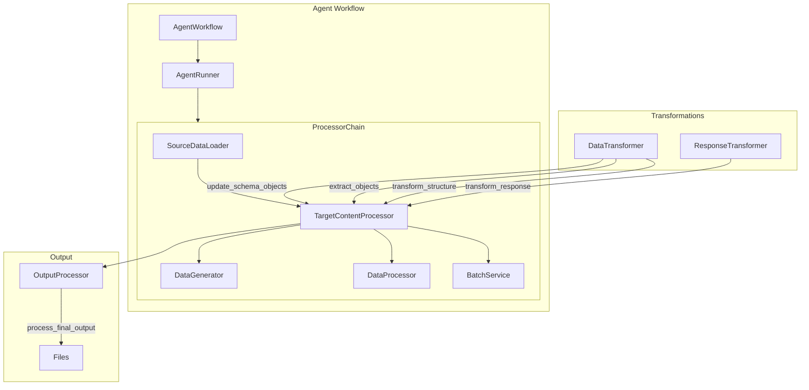
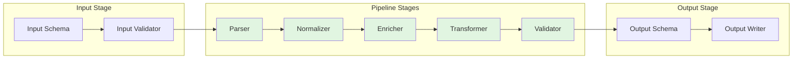

# Data Flow Architecture Documentation

## Current Data Flow Analysis

### Overview
The agent-actions system processes data through multiple transformation stages with complex interdependencies. The current flow has several areas that can be simplified:

1. **Multiple transformation steps with unclear purposes**
2. **Side effects in transformation methods**
3. **Unclear data flow between processors**

### Current Architecture

### Key Components

#### 1. **AgentWorkflow** (`agent_workflow.py`)
- Orchestrates the entire processing pipeline
- Manages agent execution order
- Handles batch job submission and monitoring
- Supports both sync and async execution modes

#### 2. **TargetContentProcessor** (`target_content_processor.py`)
- Central processing hub that coordinates:
  - Source data loading
  - Data generation
  - Data processing
  - Batch job handling
- Has side effects: modifies data during processing
- Mixes orchestration with transformation logic

#### 3. **DataTransformer** (`data_transformer.py`)
- Contains multiple transformation methods:
  - `update_schema_objects`: Merges old and new data based on type matching
  - `remove_schema_objects`: Removes specified keys from data
  - `extract_objects`: Extracts lists from nested structures
  - `flatten_to_list_of_dicts`: Flattens nested lists
  - `transform_structure`: Transforms dict structure to flat list
- Methods have side effects and unclear purposes

#### 4. **Data Flow Issues**

1. **Unclear Transformation Purpose**: Methods like `extract_objects` and `transform_structure` lack clear documentation about when/why to use them

2. **Side Effects**: 
   - Deep copying in transformers
   - In-place modifications in processors
   - State management scattered across components

3. **Complex Dependencies**:
   - Circular dependencies between processors
   - Tight coupling between transformation and processing logic

4. **Inconsistent Data Structures**:
   - Data transformed multiple times with different structures
   - No clear schema validation between stages

### Proposed Pipeline Architecture

### Benefits of Pipeline Pattern

1. **Clear Data Flow**: Each stage has a single responsibility
2. **Pure Functions**: No side effects, predictable transformations
3. **Composable**: Easy to add/remove/reorder stages
4. **Testable**: Each stage can be tested in isolation
5. **Type Safety**: Clear input/output contracts between stages

## Implementation Plan

### Phase 1: Document Current Flow (COMPLETED)
- ✅ Analyzed existing components
- ✅ Identified transformation patterns
- ✅ Documented issues and pain points

### Phase 2: Design Pipeline Pattern
- Define pipeline interfaces
- Create stage contracts
- Design error handling strategy

### Phase 3: Implement Core Pipeline
- Create pipeline orchestrator
- Implement pure transformation functions
- Add stage composition logic

### Phase 4: Migrate Existing Transformations
- Refactor DataTransformer methods to pure functions
- Extract transformation logic from processors
- Create adapter layer for backward compatibility

### Phase 5: Add Validation
- Implement schema validation between stages
- Add data flow monitoring
- Create debugging tools for pipeline inspection