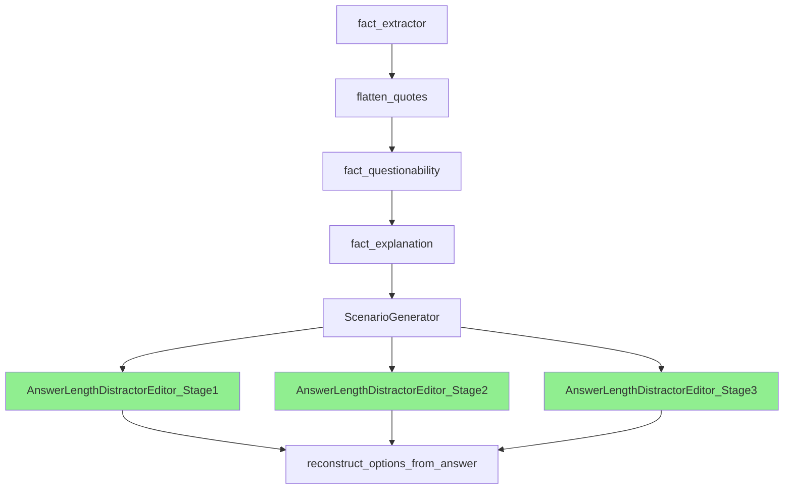

# Parallel Execution Implementation Specification

## Executive Summary

This document specifies the implementation of parallel execution capabilities for the agent-actions workflow system. Currently, agents execute sequentially even when they share the same dependencies. The new system will identify groups of agents that can run in parallel and execute them concurrently, significantly improving performance.

## Problem Statement

### Current Behavior
- Agents execute in strict sequential order based on topological sort
- Three AnswerLengthDistractorEditor stages (Stage1, Stage2, Stage3) all depend on ScenarioGenerator
- These three stages execute one after another despite having no interdependencies
- Total execution time is the sum of all agent execution times

### Desired Behavior
- Agents with the same dependencies should execute in parallel
- The three AnswerLengthDistractorEditor stages should run concurrently after ScenarioGenerator completes
- reconstruct_options_from_answer should wait for all three stages to complete
- Total execution time should be reduced by parallel execution

## Architecture Overview



## Technical Design

### 1. Dependency Graph Analysis Enhancement

#### Current Implementation
```python
# agent_actions/handlers/config_handler.py
def determine_execution_order(self, user_agents):
    dependency_graph = {}
    for agent_type, config in self.agent_configs.items():
        if config.get('is_operational', True):
            dependencies = [dep for dep in config.get('dependencies', [])]
            dependency_graph[agent_type] = dependencies
    self.execution_order = Utils.topological_sort(dependency_graph)
```

#### New Implementation Requirements

##### Add Execution Levels Detection
```python
def determine_parallel_execution_groups(self, user_agents):
    """
    Determines groups of agents that can execute in parallel.
    
    Returns:
        List[List[str]]: Each inner list contains agents that can run in parallel
        Example: [
            ['fact_extractor'],  # Level 0: No dependencies
            ['flatten_quotes'],  # Level 1: Depends on level 0
            ['fact_questionability'],  # Level 2
            ['fact_explanation'],  # Level 3
            ['ScenarioGenerator'],  # Level 4
            ['AnswerLengthDistractorEditor_Stage1',  # Level 5: All three can run in parallel
             'AnswerLengthDistractorEditor_Stage2',
             'AnswerLengthDistractorEditor_Stage3'],
            ['reconstruct_options_from_answer']  # Level 6: Waits for all level 5
        ]
    """
```

### 2. Parallel Execution Groups Algorithm

#### New Utility Function in utils.py
```python
@staticmethod
def compute_execution_levels(dependency_graph: Dict[str, List[str]]) -> List[List[str]]:
    """
    Compute execution levels where agents in the same level can run in parallel.
    
    Algorithm:
    1. Calculate the depth/level of each node in the dependency graph
    2. Group nodes by their level
    3. Return groups ordered by level
    
    Args:
        dependency_graph: Dict mapping agent_type to list of dependencies
        
    Returns:
        List of agent groups, where each group can execute in parallel
    """
    # Step 1: Calculate depth for each node
    depths = {}
    
    def calculate_depth(node, visited=None):
        if visited is None:
            visited = set()
        if node in visited:
            raise ValueError(f"Circular dependency detected: {node}")
        if node in depths:
            return depths[node]
        
        visited.add(node)
        deps = dependency_graph.get(node, [])
        if not deps:
            depth = 0
        else:
            depth = max(calculate_depth(dep, visited.copy()) for dep in deps) + 1
        depths[node] = depth
        return depth
    
    # Calculate depth for all nodes
    for node in dependency_graph:
        calculate_depth(node)
    
    # Step 2: Group by depth
    level_groups = {}
    for node, depth in depths.items():
        if depth not in level_groups:
            level_groups[depth] = []
        level_groups[depth].append(node)
    
    # Step 3: Return sorted groups
    return [level_groups[level] for level in sorted(level_groups.keys())]
```

### 3. Enhanced Async Workflow Execution

#### Modified async_run in agent_workflow.py
```python
async def async_run(self, parallel_groups=None, concurrency_limit=None):
    """
    Run agents in parallel groups using asyncio.
    
    Args:
        parallel_groups: List of agent groups to run in parallel (optional)
        concurrency_limit: Max concurrent agents within a group (optional)
    """
    if parallel_groups is None:
        # Fall back to computing groups if not provided
        parallel_groups = self.config_manager.determine_parallel_execution_groups()
    
    self.console.print(f"[bold]Executing {len(parallel_groups)} execution groups[/bold]")
    
    for group_idx, agent_group in enumerate(parallel_groups):
        start_time = datetime.now()
        group_size = len(agent_group)
        
        if group_size == 1:
            # Single agent in group - run normally
            agent_name = agent_group[0]
            self.console.print(f"[cyan]Group {group_idx + 1}: Running {agent_name}[/cyan]")
            await self._run_single_agent_async(agent_name)
        else:
            # Multiple agents - run in parallel
            self.console.print(f"[cyan]Group {group_idx + 1}: Running {group_size} agents in parallel[/cyan]")
            for agent in agent_group:
                self.console.print(f"  - {agent}")
            
            # Create tasks for parallel execution
            tasks = []
            for agent_name in agent_group:
                task = self._run_single_agent_async(agent_name)
                tasks.append(task)
            
            # Execute all tasks in parallel
            results = await asyncio.gather(*tasks, return_exceptions=True)
            
            # Check for failures
            for agent_name, result in zip(agent_group, results):
                if isinstance(result, Exception):
                    self.console.print(f"[red]Agent {agent_name} failed: {result}[/red]")
                    raise result
        
        duration = (datetime.now() - start_time).total_seconds()
        self.console.print(f"[green]Group {group_idx + 1} completed in {duration:.2f}s[/green]")
```

### 4. Thread-Safe Status Management

#### Key Considerations
- Multiple agents updating status concurrently
- File system operations must be atomic
- Status file must handle concurrent reads/writes

```python
import asyncio
import aiofiles
import json
from asyncio import Lock

class AsyncStatusManager:
    def __init__(self, status_file: Path):
        self.status_file = status_file
        self.status_lock = Lock()
        self.memory_cache = {}
    
    async def update_status(self, agent_name: str, status: str):
        """Thread-safe status update."""
        async with self.status_lock:
            self.memory_cache[agent_name] = {
                'status': status,
                'timestamp': datetime.now().isoformat()
            }
            # Write atomically
            temp_file = self.status_file.with_suffix('.tmp')
            async with aiofiles.open(temp_file, 'w') as f:
                await f.write(json.dumps(self.memory_cache, indent=2))
            temp_file.replace(self.status_file)
```

### 5. Directory Creation Synchronization

#### Problem
Multiple agents might try to create the same parent directories simultaneously.

#### Solution
```python
import asyncio
from pathlib import Path

class DirectoryManager:
    _locks = {}
    _lock_creation_lock = asyncio.Lock()
    
    @classmethod
    async def ensure_directory(cls, path: Path):
        """Thread-safe directory creation."""
        path_str = str(path)
        
        # Get or create lock for this path
        async with cls._lock_creation_lock:
            if path_str not in cls._locks:
                cls._locks[path_str] = asyncio.Lock()
            lock = cls._locks[path_str]
        
        # Create directory with path-specific lock
        async with lock:
            path.mkdir(parents=True, exist_ok=True)
```

### 6. CLI Integration

#### New Command Options
```python
# agent_actions/cli/commands/run_command.py
@click.command()
@click.option('--parallel', is_flag=True, 
              help="Enable parallel execution of independent agents")
@click.option('--max-concurrent', type=int, default=None,
              help="Maximum number of agents to run concurrently")
def run(agent: str, parallel: bool, max_concurrent: int, ...):
    """Run agents with optional parallel execution."""
    
    if parallel:
        # Use async execution path
        asyncio.run(run_parallel(agent, max_concurrent))
    else:
        # Use existing sequential execution
        workflow.run()
```

## Implementation Quirks and Edge Cases

### 1. Batch Mode Compatibility
- **Issue**: Batch mode agents submit jobs asynchronously to external services
- **Solution**: Parallel execution must respect batch job submission and checking
- **Implementation**: Keep batch status checking sequential within parallel groups

### 2. Memory Management
- **Issue**: Running multiple LLM agents in parallel may consume significant memory
- **Solution**: Implement concurrency limiting per group
- **Default**: Limit to 3 concurrent agents by default

### 3. Output Directory Conflicts
- **Issue**: Agents might write to shared directories
- **Solution**: Each agent has its own indexed output directory (node_X_agentname)
- **Verification**: Ensure no path collisions in parallel execution

### 4. Error Aggregation
- **Issue**: Multiple agents might fail simultaneously
- **Solution**: Collect all errors and report them together
```python
async def gather_with_errors(*tasks):
    results = await asyncio.gather(*tasks, return_exceptions=True)
    errors = [(i, r) for i, r in enumerate(results) if isinstance(r, Exception)]
    if errors:
        error_msg = "\n".join([f"Task {i}: {e}" for i, e in errors])
        raise RuntimeError(f"Multiple failures:\n{error_msg}")
    return results
```

### 5. Dependency Validation
- **Issue**: Circular dependencies would cause infinite loops
- **Solution**: Validate dependency graph before execution
- **Implementation**: Already handled by topological sort

### 6. Progress Reporting
- **Issue**: Parallel execution makes progress tracking complex
- **Solution**: Use rich.progress with multiple progress bars
```python
from rich.progress import Progress, SpinnerColumn, TextColumn

with Progress() as progress:
    tasks = {}
    for agent in agent_group:
        task_id = progress.add_task(f"[cyan]{agent}", total=100)
        tasks[agent] = task_id
```

## Testing Strategy

### Unit Tests
1. Test `compute_execution_levels` with various dependency graphs
2. Test parallel group detection with complex dependencies
3. Test thread-safe status updates
4. Test directory creation synchronization

### Integration Tests
1. Test full workflow with parallel execution enabled
2. Test error handling with failing agents in parallel groups
3. Test batch mode agents in parallel execution
4. Test resource limits and concurrency controls

### Performance Tests
1. Measure execution time improvement with parallel execution
2. Test memory usage with concurrent agents
3. Test I/O bottlenecks with multiple agents writing simultaneously

## Migration Plan

### Phase 1: Foundation (Week 1)
1. Implement `compute_execution_levels` utility
2. Add parallel group detection to ConfigManager
3. Create AsyncStatusManager for thread-safe updates

### Phase 2: Core Implementation (Week 2)
1. Enhance async_run method
2. Make AgentRunner async-compatible
3. Implement directory synchronization

### Phase 3: Integration (Week 3)
1. Update CLI with parallel options
2. Add progress reporting
3. Implement error aggregation

### Phase 4: Testing & Optimization (Week 4)
1. Run comprehensive tests
2. Performance tuning
3. Documentation updates

## Rollback Plan

1. Feature flag: `--parallel` option defaults to False
2. Existing sequential execution path remains unchanged
3. Config option to disable parallel execution globally
4. Monitoring to detect issues in production

## Performance Metrics

### Expected Improvements
- 3x speedup for three parallel AnswerLengthDistractorEditor stages
- Overall workflow time reduction of 30-40%
- Memory usage increase of ~2x during parallel execution

### Monitoring
- Track execution time per agent and per group
- Monitor memory usage during parallel execution
- Log any synchronization issues or conflicts

## Security Considerations

1. **File System Access**: Ensure proper file permissions during concurrent writes
2. **Resource Limits**: Implement maximum concurrency to prevent resource exhaustion
3. **API Rate Limiting**: Consider API rate limits when running parallel LLM calls
4. **Credential Management**: Ensure thread-safe access to API keys

## Configuration Examples

### Example 1: Three Parallel Distractor Editors
```yaml
- agent_type: AnswerLengthDistractorEditor_Stage1
  dependencies: ["ScenarioGenerator"]
  run_mode: "online"
  
- agent_type: AnswerLengthDistractorEditor_Stage2  
  dependencies: ["ScenarioGenerator"]  # Same dependency
  run_mode: "online"
  
- agent_type: AnswerLengthDistractorEditor_Stage3
  dependencies: ["ScenarioGenerator"]  # Same dependency
  run_mode: "online"

- agent_type: reconstruct_options_from_answer
  dependencies: ["AnswerLengthDistractorEditor_Stage1",
                 "AnswerLengthDistractorEditor_Stage2",
                 "AnswerLengthDistractorEditor_Stage3"]
```

### Example 2: Complex Parallel Graph
```yaml
# These will run in parallel after their common dependency
- agent_type: validator_1
  dependencies: ["preprocessor"]
  
- agent_type: validator_2
  dependencies: ["preprocessor"]
  
- agent_type: enricher
  dependencies: ["preprocessor"]
  
# This waits for all three above
- agent_type: aggregator
  dependencies: ["validator_1", "validator_2", "enricher"]
```

## Backward Compatibility

1. All existing configurations continue to work
2. Sequential execution remains the default
3. No changes required to existing agent implementations
4. Status file format remains compatible

## Future Enhancements

1. **Dynamic Parallelism**: Adjust concurrency based on system resources
2. **Priority Queues**: Prioritize certain agents within parallel groups
3. **Distributed Execution**: Run agents across multiple machines
4. **Smart Scheduling**: ML-based optimization of execution order
5. **Dependency Injection**: Async-first dependency injection framework