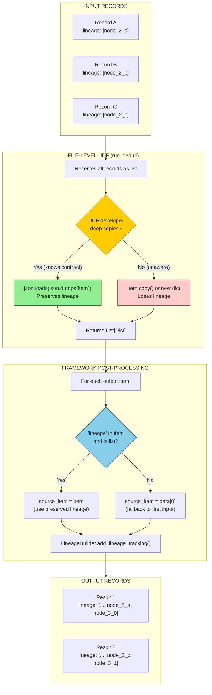
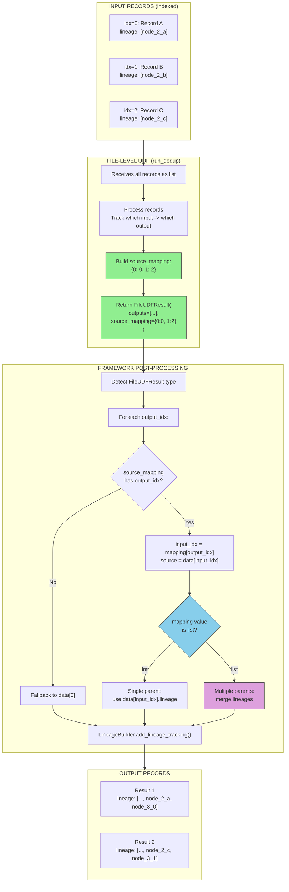
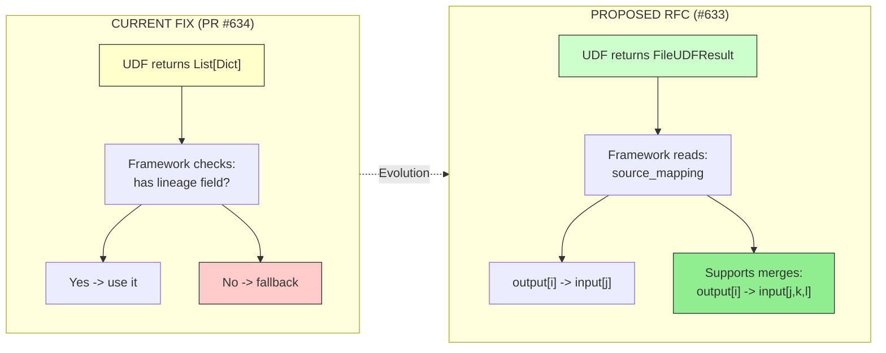
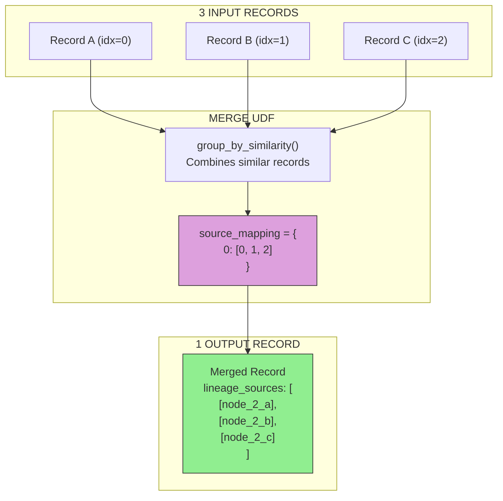
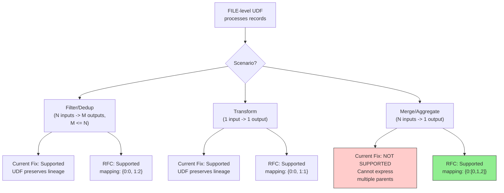

# FILE-Level Lineage Fix: Current vs Proposed RFC

This document compares the current fix (PR #634) with the proposed RFC (Issue #633) for handling lineage in FILE-level UDFs.

## Overview

| Aspect | Current Fix (PR #634) | Proposed RFC (#633) |
|--------|----------------------|---------------------|
| Contract | Implicit | Explicit |
| UDF Return Type | `List[Dict]` | `FileUDFResult` |
| Lineage Source | Preserved in output | Explicit mapping |
| Many-to-Many | Not supported | Supported |
| Breaking Change | No | No (optional) |
| Status | Done | Future work |

---

## Current Fix (PR #634) - Implicit Contract



### How It Works

1. **UDF receives all records** as a list
2. **UDF processes records** (filter, transform, etc.)
3. **If UDF developer deep-copies records**, lineage is preserved
4. **Framework checks** if output has `lineage` field
5. **If yes**, use preserved lineage; **if no**, fallback to first input

### Code Change

```python
# target_content_processor.py lines 349-354
if 'lineage' in item and isinstance(item['lineage'], list):
    source_item = item  # UDF preserved lineage - use it
else:
    source_item = fallback_source  # Legacy fallback
```

### Limitations

- UDF must "know" to preserve lineage via deep copy
- No explicit mapping - framework guesses from preserved lineage
- Cannot handle many-to-many (merging multiple inputs)

---

## Proposed RFC (#633) - Explicit Contract



### How It Works

1. **UDF receives all records** as a list with indices
2. **UDF processes records** and tracks input→output mapping
3. **UDF returns `FileUDFResult`** with explicit `source_mapping`
4. **Framework reads mapping** to determine lineage
5. **Supports single or multiple parents** per output

### Proposed Code

```python
@dataclass
class FileUDFResult:
    outputs: List[Dict]
    source_mapping: Optional[Dict[int, Union[int, List[int]]]] = None
    # {output_idx: input_idx} or {output_idx: [input_idx1, input_idx2]}

@udf_tool(granularity=Granularity.FILE)
def run_dedup(items: List[Dict]) -> FileUDFResult:
    seen = {}
    mapping = {}

    for input_idx, item in enumerate(items):
        key = item['content']['fact']
        if key not in seen:
            output_idx = len(seen)
            seen[key] = item
            mapping[output_idx] = input_idx

    return FileUDFResult(
        outputs=list(seen.values()),
        source_mapping=mapping
    )
```

### Benefits

- Explicit contract - UDF declares exactly where outputs came from
- No guessing - framework uses mapping directly
- Supports many-to-many (merge scenarios)

---

## Side-by-Side Comparison



---

## Many-to-Many Scenario (RFC Only)

This scenario is **not supported** by the current fix but **is supported** by the proposed RFC.



### Example: Merge UDF with RFC

```python
@udf_tool(granularity=Granularity.FILE)
def group_by_similarity(items: List[Dict]) -> FileUDFResult:
    groups = {}  # group_id -> (merged_item, input_indices)

    for input_idx, item in enumerate(items):
        group_id = item['content']['similarity_group_id']
        if group_id not in groups:
            groups[group_id] = (item.copy(), [input_idx])
        else:
            groups[group_id][1].append(input_idx)

    outputs = []
    mapping = {}
    for output_idx, (merged, input_indices) in enumerate(groups.values()):
        outputs.append(merged)
        mapping[output_idx] = input_indices  # Multiple parents!

    return FileUDFResult(outputs=outputs, source_mapping=mapping)
```

---

## Decision Flow: Which Approach Handles What?



---

## Summary

| Scenario | Current Fix | Proposed RFC |
|----------|-------------|--------------|
| Filter (N→M, M≤N) | ✅ Works (if lineage preserved) | ✅ Works (explicit mapping) |
| Transform (1→1) | ✅ Works (if lineage preserved) | ✅ Works (explicit mapping) |
| Dedup (N→M unique) | ✅ Works (if lineage preserved) | ✅ Works (explicit mapping) |
| Merge (N→1) | ❌ Cannot express multiple parents | ✅ Works ({0: [0,1,2]}) |
| Aggregate (N→1) | ❌ Cannot express multiple parents | ✅ Works ({0: [0,1,...,N-1]}) |

---

## References

- **Current Fix**: [PR #634](https://github.com/Muizzkolapo/agent-actions/pull/634)
- **Proposed RFC**: [Issue #633](https://github.com/Muizzkolapo/agent-actions/issues/633)
- **File Changed**: `agent_actions/prompt_generation/target_content_processor.py`
