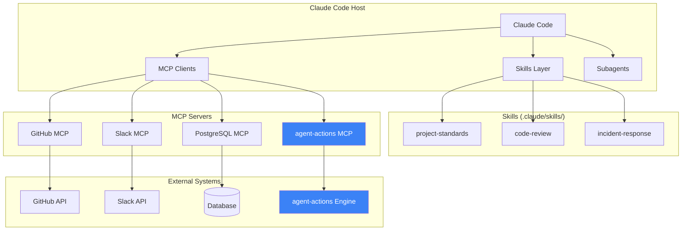
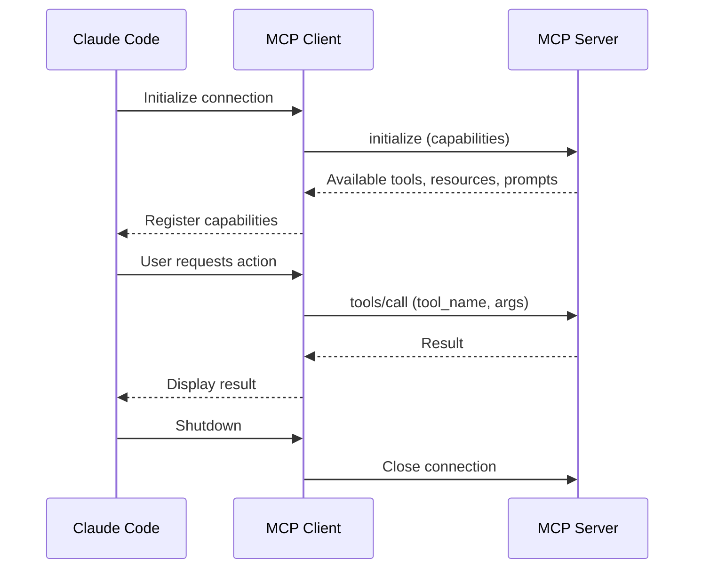
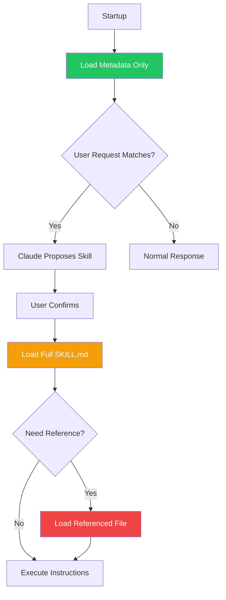
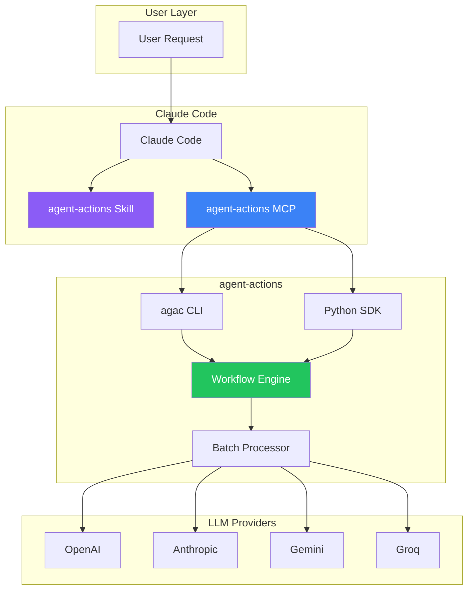
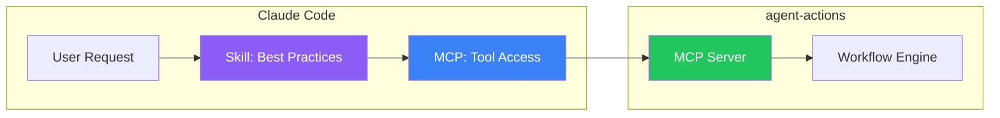
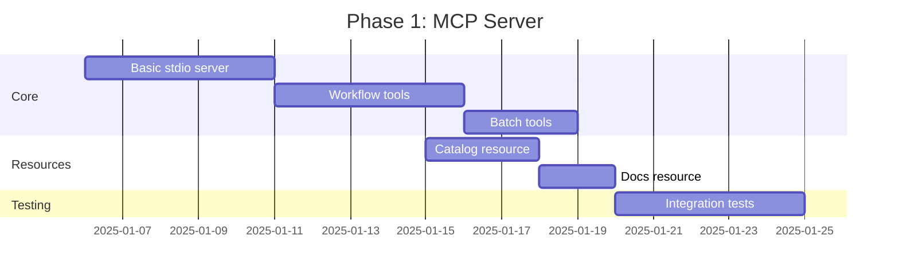
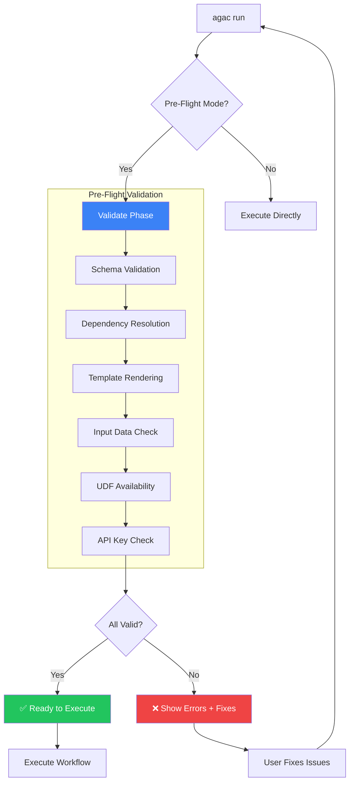

# Research: agent-actions in the Claude Code + MCP + Skills Ecosystem

| Field | Value |
|-------|-------|
| **Status** | Research |
| **Authors** | Engineering Team |
| **Created** | December 2024 |
| **Purpose** | Explore how agent-actions integrates with Claude Code's extensibility stack |

---

## Executive Summary

Claude Code has three extensibility mechanisms that work together:

| Layer | Purpose | What It Provides |
|-------|---------|------------------|
| **MCP Servers** | Tool & Data Access | The "what" — connects to external systems |
| **Skills** | Methodology & Process | The "how" — teaches Claude best practices |
| **Subagents** | Isolated Execution | Specialized contexts for complex tasks |

**agent-actions** can integrate at multiple levels to enhance this stack, providing:
- Declarative workflow orchestration across MCP tools
- Batch processing for high-volume LLM operations
- Observability and lineage tracking
- Multi-vendor LLM abstraction

---

## Table of Contents

1. [The Claude Code Extensibility Stack](#the-claude-code-extensibility-stack)
2. [Model Context Protocol (MCP) Deep Dive](#model-context-protocol-mcp-deep-dive)
3. [Skills System Architecture](#skills-system-architecture)
4. [Integration Opportunities for agent-actions](#integration-opportunities-for-agent-actions)
5. [Proposed Integration Architecture](#proposed-integration-architecture)
6. [Implementation Roadmap](#implementation-roadmap)
7. [References](#references)

---

## The Claude Code Extensibility Stack



### How They Work Together

| Component | Role | Example |
|-----------|------|---------|
| **Skill** | Defines the process | "When doing incident response, check Sentry first, then notify Slack" |
| **MCP Server** | Provides the tools | `sentry.get_errors()`, `slack.post_message()` |
| **Claude** | Orchestrates | Follows skill instructions, calls MCP tools |

**The Gap**: Claude orchestrates tools one-by-one in conversation. For complex, multi-step workflows with hundreds of records, this becomes:
- Token-expensive (full context per call)
- Slow (sequential execution)
- Error-prone (no automatic retry/validation)

**agent-actions fills this gap** by providing:
- Declarative workflow definition
- Batch execution with parallelism
- Built-in validation and reprompting
- Multi-vendor LLM support

---

## Model Context Protocol (MCP) Deep Dive

### Architecture

```mermaid
flowchart LR
    subgraph "MCP Host (Claude Code)"
        Host[Host Application]
        C1[MCP Client 1]
        C2[MCP Client 2]
        C3[MCP Client 3]
    end

    subgraph "MCP Servers"
        S1[GitHub Server]
        S2[Database Server]
        S3[agent-actions Server]
    end

    Host --> C1 --> S1
    Host --> C2 --> S2
    Host --> C3 --> S3

    S1 --> |Tools| T1[create_pr, review_pr]
    S1 --> |Resources| R1[repo://owner/name]

    S3 --> |Tools| T3[run_workflow, batch_process]
    S3 --> |Resources| R3[catalog://actions]
    S3 --> |Prompts| P3[/create_workflow]
```

### MCP Primitives

| Primitive | Control | Purpose | Example |
|-----------|---------|---------|---------|
| **Tools** | Model-controlled | Execute actions | `run_workflow(config)` |
| **Resources** | App-controlled | Read-only data | `@agent-actions:catalog://actions` |
| **Prompts** | User-controlled | Reusable templates | `/mcp__agent_actions__batch` |

### Transport Options

| Transport | Use Case | Performance | Security |
|-----------|----------|-------------|----------|
| **Stdio** | Local CLI tools | Best (no network) | Process isolation |
| **HTTP** | Remote services | Good | OAuth 2.1 required |

### MCP Server Lifecycle



---

## Skills System Architecture

### Skill File Structure

```
.claude/skills/
└── workflow-orchestration/
    ├── SKILL.md           # Main instructions (required)
    ├── PATTERNS.md        # Common workflow patterns
    ├── EXAMPLES.md        # Usage examples
    └── scripts/
        └── validate.py    # Validation utilities
```

### SKILL.md Format

```yaml
---
name: workflow-orchestration
description: |
  Orchestrates complex multi-step LLM workflows using agent-actions.
  Use when user needs to process data at scale, chain multiple LLM calls,
  or build data pipelines with AI transformations.
allowed-tools: Read, Write, Bash, mcp__agent_actions
---

# Workflow Orchestration with agent-actions

## When to Use
- Processing 100+ records through LLM
- Multi-step pipelines with dependencies
- Need for automatic validation and retry
- Multi-vendor LLM requirements

## Process
1. Define workflow in YAML
2. Use `agac run` or MCP tools
3. Monitor with `agac status`
4. Retrieve results with `agac batch retrieve`

## Integration with MCP
Use the agent-actions MCP server for:
- `agent_actions.run_workflow` - Execute workflows
- `agent_actions.batch_status` - Check batch jobs
- `@agent-actions:catalog://actions` - Browse available actions
```

### Progressive Loading



| Stage | Tokens | Content |
|-------|--------|---------|
| **Metadata** | ~100 | name, description only |
| **Instructions** | ~2-5k | Full SKILL.md body |
| **Resources** | On-demand | Referenced files, scripts |

---

## Integration Opportunities for agent-actions

### Current Stack Limitations

| Limitation | Impact | agent-actions Solution |
|------------|--------|------------------------|
| Sequential execution | Slow for batch operations | DAG-based parallel execution |
| No built-in retry | Failures require manual intervention | Automatic reprompting with validation |
| Single vendor | Locked to one LLM provider | Multi-vendor abstraction |
| No workflow state | Can't resume interrupted tasks | Checkpoint and state management |
| Token expensive | Full context per call | Batch API with 50% cost reduction |

### Integration Points



### Value Proposition by Integration Type

#### 1. MCP Server Integration

**What it enables:**
- Claude Code can trigger agent-actions workflows directly
- Browse action catalogs as resources
- Use batch processing without leaving Claude Code

```bash
# User in Claude Code
"Process all 500 product descriptions through our SEO pipeline"

# Claude uses agent-actions MCP
→ agent_actions.run_workflow(config="seo-pipeline.yml", input="products.csv")
→ agent_actions.batch_status(job_id="abc123")
→ agent_actions.batch_retrieve(job_id="abc123", output="./results")
```

#### 2. Skill Integration

**What it enables:**
- Teaches Claude when and how to use agent-actions
- Provides best practices for workflow design
- Integrates with team standards

```yaml
# .claude/skills/agent-actions-workflows/SKILL.md
---
name: agent-actions-workflows
description: |
  Design and execute LLM workflows for batch processing.
  Use when processing multiple records, chaining LLM calls,
  or needing multi-vendor LLM support.
---

## When to Use agent-actions

Use agent-actions instead of direct LLM calls when:
- Processing more than 10 records
- Need automatic retry on validation failure
- Require parallel execution
- Want to use batch APIs for cost savings
- Need workflow observability
```

#### 3. Hybrid Integration (Recommended)



---

## Proposed Integration Architecture

### Component Overview

```
agent-actions-mcp/
├── src/
│   ├── server.ts              # MCP server implementation
│   ├── tools/
│   │   ├── workflow.ts        # run, status, retrieve
│   │   ├── actions.ts         # list, validate, create
│   │   └── batch.ts           # batch operations
│   ├── resources/
│   │   ├── catalog.ts         # Action catalog
│   │   └── documentation.ts   # Docs as resources
│   └── prompts/
│       ├── create-workflow.ts # Workflow creation wizard
│       └── analyze-data.ts    # Data analysis template
├── package.json
└── README.md
```

### MCP Server Specification

#### Tools

| Tool | Description | Parameters |
|------|-------------|------------|
| `agent_actions.init` | Initialize new project | `name`, `template` |
| `agent_actions.run` | Execute workflow | `config`, `input`, `mode` |
| `agent_actions.batch_status` | Check batch job | `job_id` |
| `agent_actions.batch_retrieve` | Get batch results | `job_id`, `output_dir` |
| `agent_actions.list_actions` | List available actions | `workflow` |
| `agent_actions.validate` | Validate workflow config | `config` |

#### Resources

| Resource URI | Description |
|--------------|-------------|
| `agent-actions://catalog/actions` | All available actions |
| `agent-actions://catalog/workflows` | All workflows |
| `agent-actions://docs/schema` | Configuration schema |
| `agent-actions://runs/recent` | Recent workflow runs |

#### Prompts

| Prompt | Description |
|--------|-------------|
| `/create_workflow` | Interactive workflow builder |
| `/analyze_batch` | Batch data analysis |
| `/optimize_workflow` | Workflow optimization suggestions |

### Example: MCP Tool Implementation

```typescript
// src/tools/workflow.ts
import { Tool, CallToolResult } from "@modelcontextprotocol/sdk";
import { exec } from "child_process";

export const runWorkflowTool: Tool = {
  name: "agent_actions.run",
  description: "Execute an agent-actions workflow",
  inputSchema: {
    type: "object",
    properties: {
      config: {
        type: "string",
        description: "Path to workflow YAML file"
      },
      input: {
        type: "string",
        description: "Path to input data file"
      },
      mode: {
        type: "string",
        enum: ["realtime", "batch"],
        default: "realtime"
      }
    },
    required: ["config"]
  }
};

export async function handleRunWorkflow(
  args: { config: string; input?: string; mode?: string }
): Promise<CallToolResult> {
  const cmd = `agac run -c ${args.config}${args.input ? ` -i ${args.input}` : ""}`;

  return new Promise((resolve) => {
    exec(cmd, (error, stdout, stderr) => {
      if (error) {
        resolve({
          content: [{ type: "text", text: `Error: ${stderr}` }],
          isError: true
        });
      } else {
        resolve({
          content: [{ type: "text", text: stdout }]
        });
      }
    });
  });
}
```

### Example: Skill Definition

```yaml
# .claude/skills/agent-actions/SKILL.md
---
name: agent-actions
description: |
  Orchestrate complex LLM workflows with agent-actions. Use when:
  - Processing batches of data through LLMs
  - Need multi-step pipelines with dependencies
  - Want cost-efficient batch API processing
  - Require automatic validation and retry
  - Need observability and lineage tracking
allowed-tools: Read, Write, Bash, mcp__agent_actions
---

# agent-actions Workflow Orchestration

## Overview

agent-actions is a declarative framework for building LLM workflows.
Define your pipeline in YAML, execute with one command.

## When to Use

| Scenario | Use agent-actions? | Why |
|----------|-------------------|-----|
| Single LLM call | No | Overkill |
| 10+ records | Yes | Batch efficiency |
| Multi-step pipeline | Yes | Dependency management |
| Need retry/validation | Yes | Built-in reprompting |
| Multiple LLM vendors | Yes | Vendor abstraction |

## Quick Start

1. Create workflow YAML:
```yaml
name: my-workflow
actions:
  - name: extract
    intent: Extract key information
    model_vendor: openai
    model_name: gpt-4o-mini
```

2. Run via MCP or CLI:
```bash
# Via MCP tool
Use agent_actions.run with config="workflow.yml"

# Via CLI
agac run
```

## Best Practices

1. **Use schemas** - Define output structure for validation
2. **Add dependencies** - Chain actions with `dependencies: [prev_action]`
3. **Enable reprompting** - Add `reprompt: true` for auto-retry
4. **Use batch mode** - For 50%+ cost savings on large datasets

## See Also

- [PATTERNS.md](PATTERNS.md) - Common workflow patterns
- [EXAMPLES.md](EXAMPLES.md) - Real-world examples
- [TROUBLESHOOTING.md](TROUBLESHOOTING.md) - Common issues
```

---

## Implementation Roadmap

### Phase 1: MCP Server (Foundation)



**Deliverables:**
- `agent-actions-mcp` npm package
- Tools: `run`, `batch_status`, `batch_retrieve`, `list_actions`
- Resources: `catalog://actions`, `catalog://workflows`
- Installation: `claude mcp add agent-actions -- npx agent-actions-mcp`

### Phase 2: Skills Bundle

**Deliverables:**
- `.claude/skills/agent-actions/SKILL.md`
- Pattern library (PATTERNS.md)
- Examples (EXAMPLES.md)
- Troubleshooting guide

### Phase 3: HTTP Server (Cloud)

**Deliverables:**
- HTTP transport for remote access
- OAuth 2.1 authentication
- Multi-tenant support
- Usage analytics

### Phase 4: Advanced Integration

**Deliverables:**
- Streaming execution status
- Interactive workflow builder (prompts)
- Cross-MCP orchestration (GitHub + Slack + agent-actions)

---

## Pre-Flight Validation (Avoiding Wasted Calls)

A key differentiator for agent-actions: **validate everything before making expensive LLM calls**.

### The Problem

```
❌ Current: Run → Fail at step 5 → Wasted 4 LLM calls
✅ Better:  Validate → Catch error → Fix → Run → Success
```

**Real example from production:**

```
17:25:04 ERROR [fact_extractor] Error rendering prompt template:
  'dict object' has no attribute 'referenced_in'
  Available context references: source, seed
```

This error could have been caught **before any LLM calls** with pre-flight validation.

### Pre-Flight Validation Checks



### Validation Checks

| Check | What It Validates | Catches |
|-------|-------------------|---------|
| **Schema** | YAML structure, required fields | Missing fields, typos |
| **Dependencies** | Action dependency graph | Circular deps, missing refs |
| **Templates** | Jinja2 prompt templates | Missing variables, syntax errors |
| **Input Data** | CSV/JSON structure | Missing columns, wrong types |
| **UDFs** | Tool function availability | Missing imports, wrong signatures |
| **Credentials** | API keys for vendors | Missing/invalid API keys |
| **Quotas** | Rate limits, batch limits | Would exceed limits |

### CLI Experience

```bash
# Validate only (no execution)
$ agac validate

Pre-Flight Validation
━━━━━━━━━━━━━━━━━━━━━━━━━━━━━━━━━━━━━━━━━━━━━━━━━━━━━━
✅ Schema validation passed
✅ Dependency graph valid (3 actions, 2 levels)
❌ Template error in 'fact_extractor':
   → 'referenced_in' not in context
   → Available: source, seed
   → Fix: Use {{ source.referenced_in }} or add to observe
✅ Input data valid (500 records)
✅ UDFs available (12/12)
✅ API keys configured

1 error found. Fix before running.
```

```bash
# Run with pre-flight (default behavior)
$ agac run --preflight

Pre-Flight Validation... ✅ All checks passed

Executing workflow...
```

```bash
# Skip pre-flight (for debugging)
$ agac run --no-preflight
```

### Implementation

```python
# agent_actions/validation/preflight.py
from dataclasses import dataclass
from typing import List, Optional

@dataclass
class ValidationResult:
    check: str
    passed: bool
    message: str
    fix: Optional[str] = None

@dataclass
class PreflightReport:
    results: List[ValidationResult]
    can_proceed: bool

    def __str__(self) -> str:
        lines = ["Pre-Flight Validation", "=" * 50]
        for r in self.results:
            icon = "✅" if r.passed else "❌"
            lines.append(f"{icon} {r.check}: {r.message}")
            if r.fix:
                lines.append(f"   → Fix: {r.fix}")
        return "\n".join(lines)

class PreflightValidator:
    """Validates workflow before execution to avoid wasted LLM calls."""

    def validate(self, config: WorkflowConfig) -> PreflightReport:
        results = []

        # 1. Schema validation
        results.append(self._validate_schema(config))

        # 2. Dependency resolution
        results.append(self._validate_dependencies(config))

        # 3. Template rendering (dry run)
        results.extend(self._validate_templates(config))

        # 4. Input data
        results.append(self._validate_input(config))

        # 5. UDF availability
        results.append(self._validate_udfs(config))

        # 6. API credentials
        results.extend(self._validate_credentials(config))

        return PreflightReport(
            results=results,
            can_proceed=all(r.passed for r in results)
        )

    def _validate_templates(self, config: WorkflowConfig) -> List[ValidationResult]:
        """Dry-run all Jinja2 templates with sample data."""
        results = []
        for action in config.actions:
            try:
                # Render with mock context to catch variable errors
                mock_context = self._build_mock_context(action)
                template = Template(action.prompt)
                template.render(**mock_context)
                results.append(ValidationResult(
                    check=f"Template: {action.name}",
                    passed=True,
                    message="Valid"
                ))
            except UndefinedError as e:
                missing_var = str(e).split("'")[1]
                results.append(ValidationResult(
                    check=f"Template: {action.name}",
                    passed=False,
                    message=f"Missing variable: {missing_var}",
                    fix=f"Add '{missing_var}' to observe or check spelling"
                ))
        return results
```

### MCP Integration

Expose pre-flight validation as an MCP tool:

```typescript
{
  name: "agent_actions.validate",
  description: "Pre-flight validation for workflow config",
  inputSchema: {
    type: "object",
    properties: {
      config: { type: "string", description: "Workflow YAML path" },
      input: { type: "string", description: "Input data path" }
    },
    required: ["config"]
  }
}
```

**Claude Code usage:**

```
User: "Check if my workflow is ready to run"

Claude: [Calls agent_actions.validate]
→ Returns validation report
→ Shows errors with fixes
→ User fixes issues
→ Claude confirms ready to execute
```

### Cost Savings

| Scenario | Without Pre-flight | With Pre-flight |
|----------|-------------------|-----------------|
| Template error at action 5/10 | 4 wasted LLM calls | 0 wasted calls |
| Missing API key | Full workflow fails | Caught before start |
| Input data mismatch | Partial results | No execution |
| **Estimated savings** | — | **30-50% fewer failed runs** |

---

## Use Cases

### Use Case 1: Batch Data Processing

```
User: "Analyze sentiment for all 1000 customer reviews in reviews.csv"

Claude (with agent-actions):
1. Creates workflow YAML with sentiment action
2. Calls agent_actions.run(config, input="reviews.csv", mode="batch")
3. Monitors with agent_actions.batch_status
4. Retrieves results with agent_actions.batch_retrieve

Result: 1000 reviews processed in parallel, 50% cost savings via batch API
```

### Use Case 2: Multi-Step Pipeline

```
User: "Build a content pipeline that extracts topics, generates summaries, and creates tweets"

Claude (with agent-actions skill):
1. Follows skill guidance for multi-step workflows
2. Creates workflow with 3 chained actions
3. Adds proper dependencies and schemas
4. Executes via MCP tools

Result: Declarative pipeline with automatic dependency resolution
```

### Use Case 3: Cross-Tool Orchestration

```
User: "For each GitHub issue labeled 'needs-analysis', run sentiment analysis and post summary to Slack"

Claude (with multiple MCP servers):
1. Uses GitHub MCP to fetch issues
2. Creates agent-actions workflow for sentiment
3. Uses Slack MCP to post results

Result: Seamless integration across GitHub, agent-actions, and Slack
```

---

## Competitive Landscape

| Tool | MCP Support | Batch Processing | Multi-Vendor | Declarative Config |
|------|-------------|------------------|--------------|-------------------|
| LangChain | ❌ | ❌ | ✅ | ❌ |
| LangGraph | ❌ | ❌ | ✅ | ❌ |
| CrewAI | ❌ | ❌ | ✅ | Partial |
| AutoGen | ❌ | ❌ | ✅ | ❌ |
| **agent-actions** | ✅ Planned | ✅ | ✅ | ✅ |

**Unique Value Proposition:**
- Only framework with planned native MCP integration
- Only framework with true batch API support across vendors
- Declarative YAML vs imperative Python code

---

## References

### MCP Documentation
- [Model Context Protocol - Architecture](https://modelcontextprotocol.io/docs/learn/architecture)
- [Claude Code MCP Integration](https://code.claude.com/docs/en/mcp)
- [Anthropic MCP Announcement](https://www.anthropic.com/news/model-context-protocol)

### Skills Documentation
- [Claude Code Skills](https://code.claude.com/docs/en/skills)
- [Skills Deep Dive](https://leehanchung.github.io/blogs/2025/10/26/claude-skills-deep-dive/)

### MCP Server Examples
- [Official MCP Servers](https://github.com/modelcontextprotocol/servers)
- [MCP TypeScript SDK](https://github.com/modelcontextprotocol/typescript-sdk)

### Industry Context
- [Wikipedia: Model Context Protocol](https://en.wikipedia.org/wiki/Model_Context_Protocol)
- [IBM: What is MCP?](https://www.ibm.com/think/topics/model-context-protocol)

---

## Appendix A: MCP Server Code Template

```typescript
// src/index.ts
import { Server } from "@modelcontextprotocol/sdk/server/index.js";
import { StdioServerTransport } from "@modelcontextprotocol/sdk/server/stdio.js";
import {
  ListToolsRequestSchema,
  CallToolRequestSchema,
  ListResourcesRequestSchema,
  ReadResourceRequestSchema,
} from "@modelcontextprotocol/sdk/types.js";

const server = new Server(
  { name: "agent-actions", version: "1.0.0" },
  { capabilities: { tools: {}, resources: {} } }
);

// Register tools
server.setRequestHandler(ListToolsRequestSchema, async () => ({
  tools: [
    {
      name: "agent_actions.run",
      description: "Execute an agent-actions workflow",
      inputSchema: {
        type: "object",
        properties: {
          config: { type: "string", description: "Workflow YAML path" },
          input: { type: "string", description: "Input data path" },
        },
        required: ["config"],
      },
    },
    // ... more tools
  ],
}));

// Handle tool calls
server.setRequestHandler(CallToolRequestSchema, async (request) => {
  const { name, arguments: args } = request.params;

  switch (name) {
    case "agent_actions.run":
      return handleRunWorkflow(args);
    // ... more handlers
  }
});

// Start server
const transport = new StdioServerTransport();
await server.connect(transport);
```

---

## Appendix B: Installation Commands

```bash
# Install agent-actions MCP server (future)
claude mcp add agent-actions -- npx -y @agent-actions/mcp-server

# Or with environment variables
claude mcp add agent-actions \
  --env AGENT_ACTIONS_API_KEY=xxx \
  -- npx -y @agent-actions/mcp-server

# Install agent-actions skill (copy to project)
mkdir -p .claude/skills
cp -r examples/skills/agent-actions .claude/skills/

# Verify installation
claude mcp list
# Should show: agent-actions (stdio)
```
