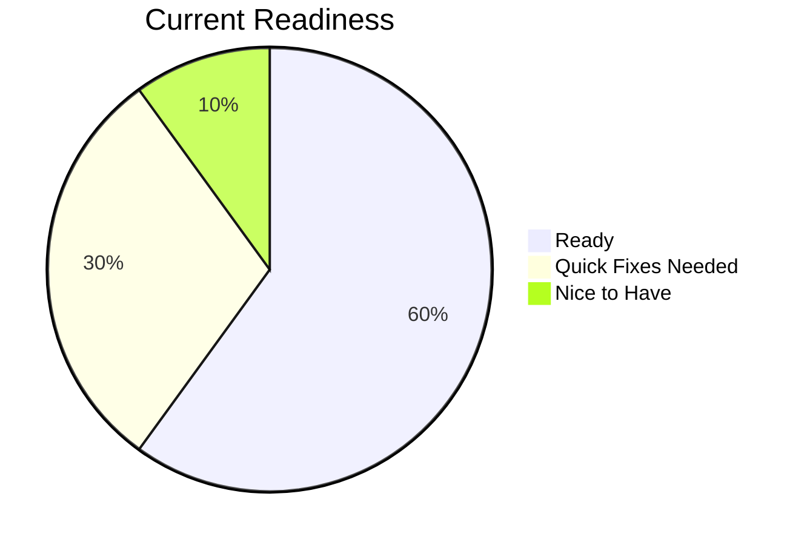
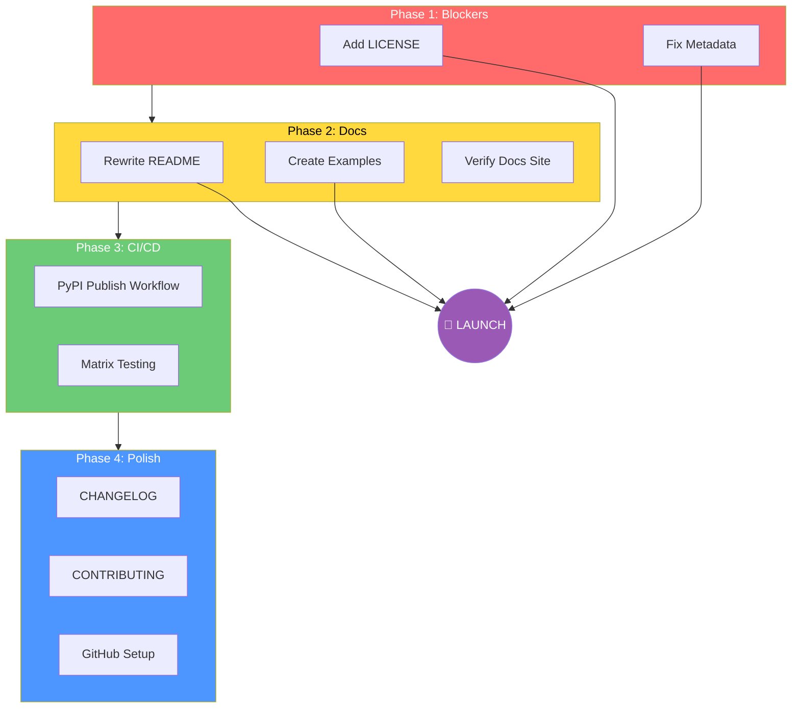

# Open-Source Launch Checklist

| Field | Value |
|-------|-------|
| **Status** | In Progress |
| **Target** | PyPI + GitHub Public |
| **Package Name** | `agent-actions` |
| **CLI Command** | `agac` |

---

## Launch Readiness Overview



---

## Phase 1: Blockers (Must Fix Before Launch)

### 1.1 Add LICENSE File
- [ ] Choose license (MIT recommended for maximum adoption)
- [ ] Create `LICENSE` file in repo root
- [ ] Add `license` field to `pyproject.toml`

**Why:** PyPI requires a license. No license = no publish.

### 1.2 Fix Package Metadata
- [ ] Update `pyproject.toml` description (currently empty)
- [ ] Update author/maintainer info
- [ ] Add project URLs (homepage, documentation, repository)
- [ ] Add classifiers for PyPI discovery

```toml
# Example fixes for pyproject.toml
[project]
description = "Declarative YAML-based framework for orchestrating LLM workflows with batch processing"
authors = [{ name = "Your Name", email = "you@example.com" }]
license = { text = "MIT" }
classifiers = [
    "Development Status :: 4 - Beta",
    "Intended Audience :: Developers",
    "License :: OSI Approved :: MIT License",
    "Programming Language :: Python :: 3.11",
    "Programming Language :: Python :: 3.12",
    "Topic :: Scientific/Engineering :: Artificial Intelligence",
]

[project.urls]
Homepage = "https://github.com/Muizzkolapo/agent-actions"
Documentation = "https://muizzkolapo.github.io/docs.agent-actions"
Repository = "https://github.com/Muizzkolapo/agent-actions"
Issues = "https://github.com/Muizzkolapo/agent-actions/issues"
```

---

## Phase 2: Documentation (High Impact)

### 2.1 Rewrite README.md
- [ ] Add project logo/banner
- [ ] Write compelling tagline
- [ ] Add badges (Python version, PyPI, CI status, license)
- [ ] Write "What is agent-actions?" section
- [ ] Add "Installation" section with `pip install agent-actions`
- [ ] Add "Quick Start" with 30-second example
- [ ] Add "Features" list
- [ ] Add "Documentation" link
- [ ] Add "Contributing" section
- [ ] Add "License" section

**README Structure:**
```markdown
# agent-actions

> Declarative YAML-based framework for orchestrating LLM workflows

[](link)
[](link)
[](link)

## What is agent-actions?

Define complex LLM workflows in YAML. Execute with one command.

## Installation

pip install agent-actions

## Quick Start

# Initialize a new project
agac init my-project
cd my-project

# Run the workflow
agac run

## Features

- Declarative YAML configuration
- Multi-vendor support (OpenAI, Anthropic, Gemini, Groq, Mistral, Cohere)
- Batch processing with automatic retries
- DAG-based dependency resolution
- Built-in reprompting and validation
- User-defined functions (UDFs)
```

### 2.2 Create Examples Directory
- [ ] Create `/examples/` directory
- [ ] Add `hello-world/` - simplest possible workflow
- [ ] Add `product-reviews/` - batch analysis example
- [ ] Add `data-extraction/` - structured output example
- [ ] Add `multi-agent/` - dependency chain example
- [ ] Add README in examples directory explaining each

**Example Structure:**
```
examples/
├── README.md
├── hello-world/
│   ├── workflow.yml
│   ├── input.csv
│   └── README.md
├── product-reviews/
│   ├── workflow.yml
│   ├── reviews.csv
│   └── README.md
└── data-extraction/
    ├── workflow.yml
    └── README.md
```

### 2.3 Verify Documentation Site
- [ ] Ensure docs.agent-actions builds correctly
- [ ] Add "Getting Started" tutorial
- [ ] Add CLI reference documentation
- [ ] Add link from README to docs site

---

## Phase 3: CI/CD & Publishing

### 3.1 Enable PyPI Publishing
- [ ] Uncomment/fix build job in `.github/workflows/ci.yml`
- [ ] Create PyPI account (if not exists)
- [ ] Create PyPI API token
- [ ] Add `PYPI_API_TOKEN` to GitHub secrets
- [ ] Create publish workflow for releases

**Publish Workflow:**
```yaml
# .github/workflows/publish.yml
name: Publish to PyPI

on:
  release:
    types: [published]

jobs:
  publish:
    runs-on: ubuntu-latest
    steps:
      - uses: actions/checkout@v4
      - uses: actions/setup-python@v5
        with:
          python-version: "3.11"
      - run: pip install build twine
      - run: python -m build
      - run: twine upload dist/*
        env:
          TWINE_USERNAME: __token__
          TWINE_PASSWORD: ${{ secrets.PYPI_API_TOKEN }}
```

### 3.2 Add Matrix Testing
- [ ] Test on Python 3.11, 3.12, 3.13
- [ ] Test on ubuntu, macos (optional: windows)

### 3.3 Add Test Coverage
- [ ] Enable coverage reporting in CI
- [ ] Add coverage badge to README
- [ ] Set minimum coverage threshold

---

## Phase 4: Polish (Nice to Have)

### 4.1 Add Supporting Files
- [ ] `CHANGELOG.md` - track version history
- [ ] `CONTRIBUTING.md` - how to contribute
- [ ] `SECURITY.md` - security policy
- [ ] `CODE_OF_CONDUCT.md` - community guidelines

### 4.2 Version Alignment
- [ ] Sync `__version__.py` (2.0.0) with CLI version (1.0.0)
- [ ] Decide on semantic versioning strategy

### 4.3 GitHub Repository Setup
- [ ] Write compelling repo description
- [ ] Add topics: `llm`, `ai`, `workflow`, `yaml`, `cli`, `openai`, `anthropic`
- [ ] Enable Discussions
- [ ] Create issue templates
- [ ] Create PR template
- [ ] Add branch protection for `main`

### 4.4 Social/Marketing
- [ ] Create announcement tweet/post
- [ ] Submit to relevant subreddits (r/MachineLearning, r/Python)
- [ ] Post on Hacker News
- [ ] Add to awesome-llm lists

---

## Launch Checklist Summary



---

## Time Estimates

| Phase | Items | Estimated Time |
|-------|-------|----------------|
| **Phase 1: Blockers** | LICENSE, metadata | 15 minutes |
| **Phase 2: Docs** | README, examples, verify docs | 1-2 hours |
| **Phase 3: CI/CD** | PyPI workflow, testing | 30 minutes |
| **Phase 4: Polish** | Supporting files, GitHub setup | 1 hour |
| **Total** | | **3-4 hours** |

---

## Minimum Viable Launch

If you want to launch ASAP, here's the absolute minimum:

1. ✅ Add `LICENSE` file (MIT)
2. ✅ Fix `pyproject.toml` metadata
3. ✅ Rewrite `README.md` with install + quickstart
4. ✅ Create PyPI publish workflow
5. ✅ Tag release `v2.0.0`
6. ✅ `pip install agent-actions` works!

**Minimum viable launch: ~1 hour**

---

## Post-Launch

- [ ] Monitor GitHub issues for bug reports
- [ ] Respond to questions/feedback
- [ ] Plan v2.1.0 with community feedback
- [ ] Consider implementing agentic patterns RFC

---

## Notes

- Current package version: `2.0.0`
- CLI command: `agac`
- Python requirement: `>=3.11`
- Docs site: https://muizzkolapo.github.io/docs.agent-actions
