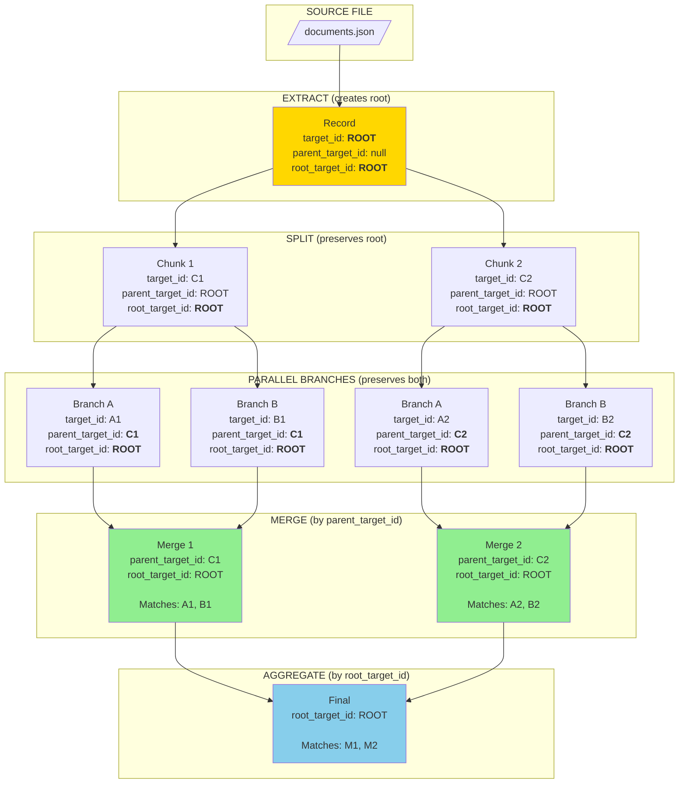
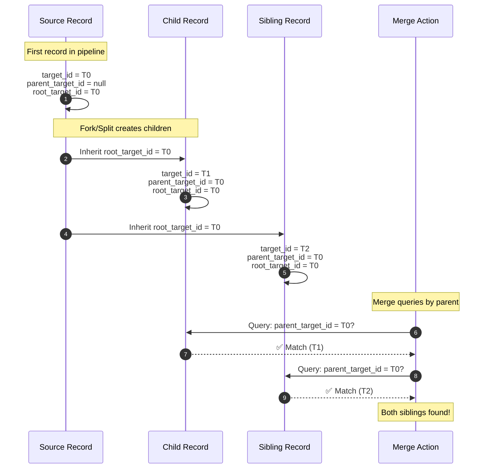
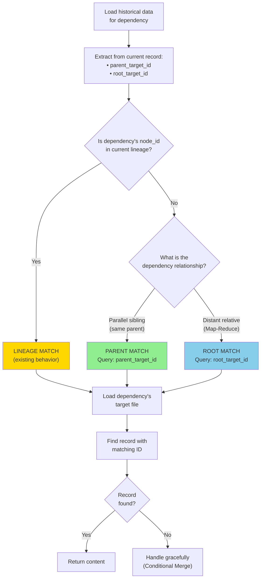
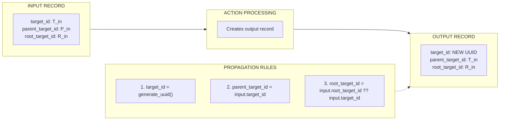
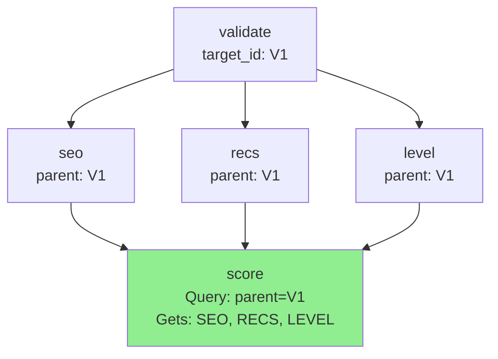
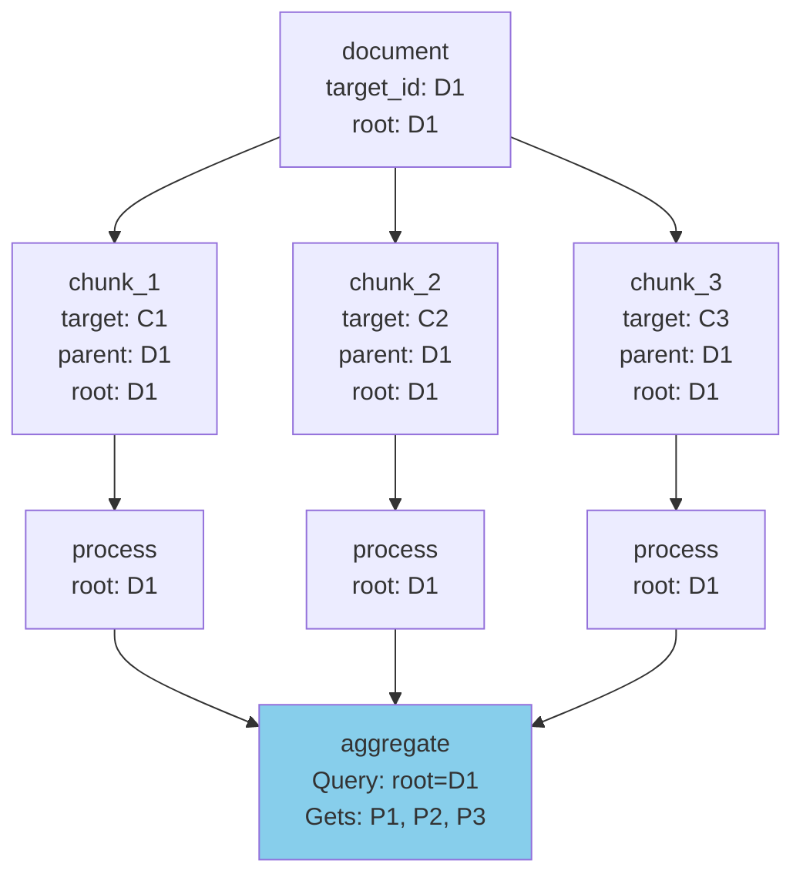
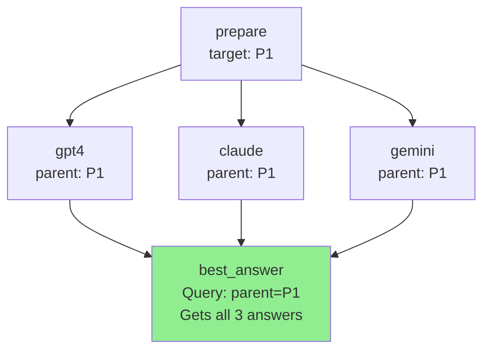
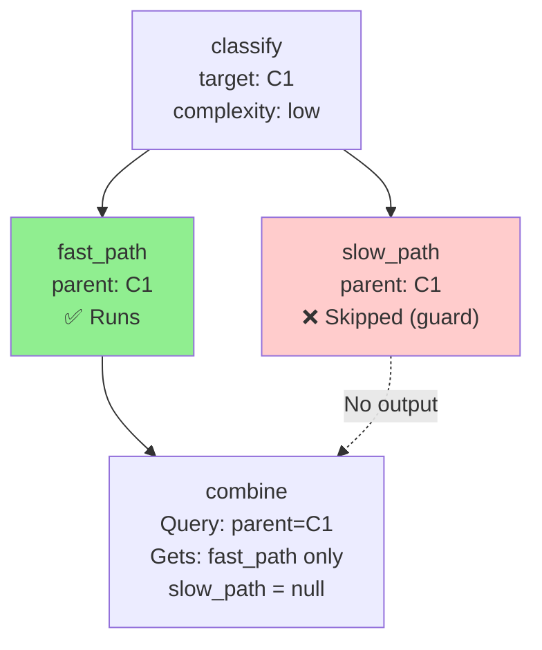
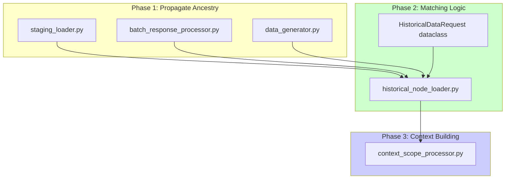
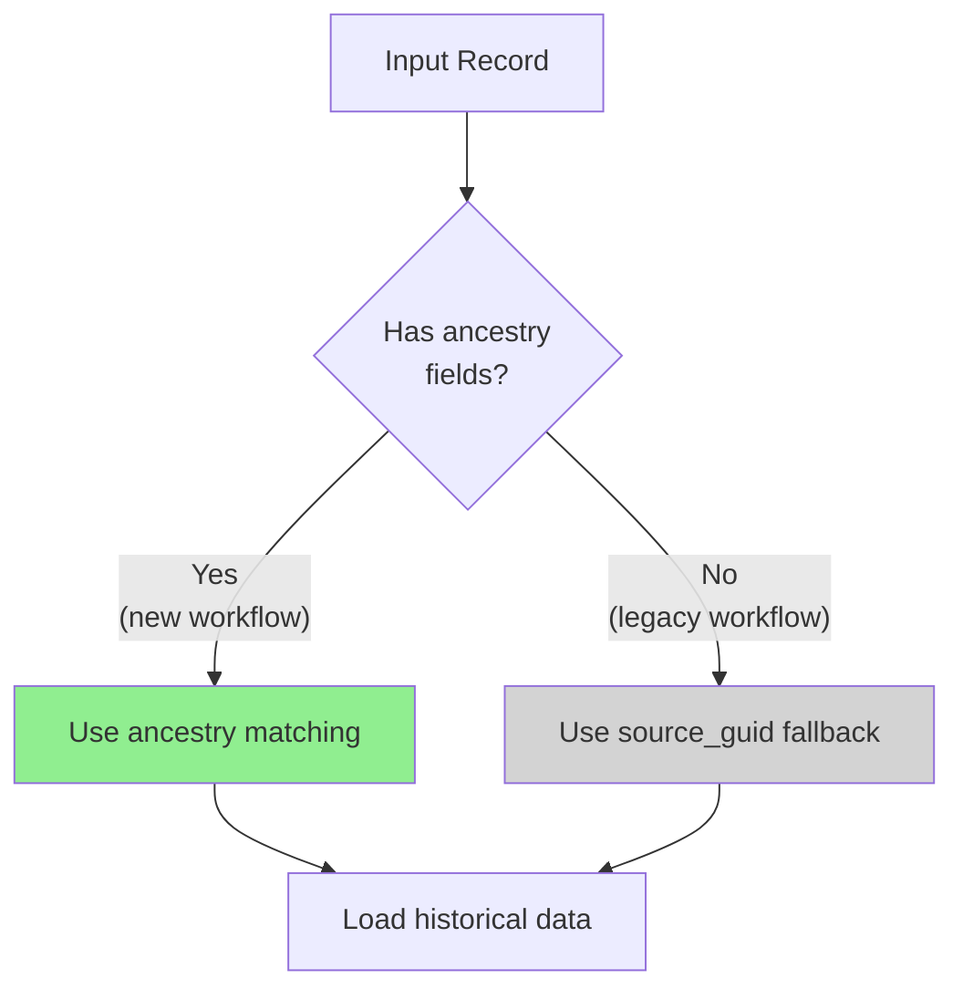

# RFC: Ancestry Chain for Parallel Branch Merge

> **RFC Number:** RFC-001
> **Issue Reference:** [ISSUE_parallel_branch_merge.md](../../ISSUE_parallel_branch_merge.md)
> **Status:** Draft
> **Author:** Agent Actions Team
> **Created:** 2026-01-05

---

## Abstract

This RFC proposes the **Ancestry Chain** pattern to enable parallel branch merging and advanced workflow patterns in Agent Actions. By introducing `parent_target_id` and `root_target_id` fields, we create a complete lineage tracking system that enables Diamond, Map-Reduce, Ensemble, and Conditional Merge patterns.

---

## Motivation

### Current Problem

When parallel branches merge, the child action can only access ONE parent's output:

```
validate ──┬── seo ────────┐
           ├── recs ───────┼── score (❌ can only see ONE branch)
           └── level ──────┘
```

### Desired Outcome

Enable ALL parallel workflow patterns:

```
validate ──┬── seo ────────┐
           ├── recs ───────┼── score (✅ sees ALL branches)
           └── level ──────┘
```

---

## Design Overview

### Ancestry Chain Fields

```json
{
  "source_guid": "file-001",
  "target_id": "uuid-current",
  "parent_target_id": "uuid-parent",
  "root_target_id": "uuid-root",
  "node_id": "node_5_abc",
  "lineage": ["node_0", "node_1", "node_5"],
  "content": { ... }
}
```

| Field | Purpose | Matches |
|-------|---------|---------|
| `source_guid` | Correlation - all records from same source file | Too broad |
| `target_id` | Unique identifier for this record | This record only |
| `parent_target_id` | **Immediate parent** - causation link | Siblings (Diamond) |
| `root_target_id` | **Original ancestor** - before any splits | All descendants (Map-Reduce) |

### Pattern Coverage

```
┌─────────────────────┬──────────────────────┬─────────────────────────────┐
│ Pattern             │ Match Field          │ Status                      │
├─────────────────────┼──────────────────────┼─────────────────────────────┤
│ Diamond/Fan-in      │ parent_target_id     │ ✅ Enabled                  │
│ Multi-enrichment    │ parent_target_id     │ ✅ Enabled                  │
│ Parallel Validation │ parent_target_id     │ ✅ Enabled                  │
│ Ensemble/Voting     │ parent_target_id     │ ✅ Enabled                  │
│ Map-Reduce          │ root_target_id       │ ✅ Enabled                  │
│ Conditional Merge   │ parent_target_id     │ ✅ Enabled (with null check)│
└─────────────────────┴──────────────────────┴─────────────────────────────┘
```

---

## Detailed Design

### 1. Data Flow Diagram



### 2. Record Lifecycle



### 3. Matching Algorithm



### 4. Propagation Rules



**Propagation Logic:**

```python
def create_output_record(input_record, llm_output):
    return {
        "source_guid": input_record["source_guid"],
        "target_id": str(uuid.uuid4()),  # NEW unique ID
        "parent_target_id": input_record["target_id"],  # Link to parent
        "root_target_id": input_record.get("root_target_id") or input_record["target_id"],
        "node_id": f"node_{idx}_{uuid.uuid4()}",
        "lineage": input_record["lineage"] + [new_node_id],
        "content": llm_output
    }
```

---

## Pattern Examples

### Pattern 1: Diamond/Fan-in

```yaml
actions:
  - name: validate
  - name: seo
    dependencies: [validate]
  - name: recs
    dependencies: [validate]
  - name: level
    dependencies: [validate]
  - name: score
    dependencies: [seo, recs, level]  # MERGE
```



**Match:** `parent_target_id = V1` → Returns all 3 siblings

---

### Pattern 2: Map-Reduce

```yaml
actions:
  - name: chunk_document
    granularity: splits  # Creates N chunks
  - name: process_chunk
    dependencies: [chunk_document]
  - name: aggregate
    dependencies: [process_chunk]
    granularity: collect  # Collects all
```



**Match:** `root_target_id = D1` → Returns all processed chunks

---

### Pattern 3: Ensemble/Voting

```yaml
actions:
  - name: prepare
  - name: gpt4_answer
    dependencies: [prepare]
    model_vendor: openai
  - name: claude_answer
    dependencies: [prepare]
    model_vendor: anthropic
  - name: gemini_answer
    dependencies: [prepare]
    model_vendor: google
  - name: best_answer
    dependencies: [gpt4_answer, claude_answer, gemini_answer]
```



---

### Pattern 4: Conditional Merge

```yaml
actions:
  - name: classify
  - name: fast_path
    dependencies: [classify]
    guard:
      condition: "complexity == 'low'"
  - name: slow_path
    dependencies: [classify]
    guard:
      condition: "complexity == 'high'"
  - name: combine
    dependencies: [fast_path, slow_path]
```



**Handling:** Query returns `null` for skipped branches → handle gracefully in template

---

## Implementation Plan

### Phase 1: Schema Update

Add fields to record structure:

```python
# In staging_loader.py, batch_response_processor.py, data_generator.py

output_record = {
    # Existing fields
    "source_guid": input_record["source_guid"],
    "target_id": str(uuid.uuid4()),
    "node_id": f"node_{idx}_{uuid.uuid4()}",
    "lineage": [...],
    "content": {...},

    # NEW: Ancestry Chain
    "parent_target_id": input_record.get("target_id"),
    "root_target_id": input_record.get("root_target_id") or input_record.get("target_id"),
}
```

### Phase 2: Historical Data Loader Update

```python
# In historical_node_loader.py

@dataclass
class HistoricalDataRequest:
    action_name: str
    lineage: List[str]
    source_guid: str
    file_path: str
    agent_indices: Dict[str, int]
    # NEW
    parent_target_id: Optional[str] = None
    root_target_id: Optional[str] = None


def load_historical_node_data(request: HistoricalDataRequest):
    # Step 1: Try lineage match (existing)
    if node_id_in_lineage:
        return find_by_lineage(...)

    # Step 2: Try parent match (siblings)
    if request.parent_target_id:
        record = find_by_field(data, "parent_target_id", request.parent_target_id)
        if record:
            return record

    # Step 3: Try root match (Map-Reduce)
    if request.root_target_id:
        record = find_by_field(data, "root_target_id", request.root_target_id)
        if record:
            return record

    # Step 4: Fallback to source_guid (legacy)
    return find_by_source_guid(data, request.source_guid)
```

### Phase 3: Context Builder Update

```python
# In context_scope_processor.py

def build_field_context_with_history(..., current_item, ...):
    parent_target_id = current_item.get("parent_target_id")
    root_target_id = current_item.get("root_target_id")

    for dep_name in dependencies:
        request = HistoricalDataRequest(
            action_name=dep_name,
            parent_target_id=parent_target_id,
            root_target_id=root_target_id,
            ...
        )
        data = HistoricalNodeDataLoader.load_historical_node_data(request)
        if data:
            field_context[dep_name] = data
```

---

## Files to Modify



| Phase | File | Change |
|-------|------|--------|
| 1 | `staging_loader.py` | Add `parent_target_id`, `root_target_id` to output |
| 1 | `batch_response_processor.py` | Preserve ancestry fields through batch |
| 1 | `data_generator.py` | Preserve ancestry fields through realtime |
| 2 | `historical_node_loader.py` | Add ancestry matching logic |
| 2 | `HistoricalDataRequest` | Add `parent_target_id`, `root_target_id` fields |
| 3 | `context_scope_processor.py` | Pass ancestry to loader |

---

## Test Cases

### Test 1: Ancestry Propagation

```python
def test_ancestry_chain_propagation():
    """First record sets root, children inherit."""
    # Root record
    root = create_record(input_record=None)
    assert root["root_target_id"] == root["target_id"]
    assert root["parent_target_id"] is None

    # Child record
    child = create_record(input_record=root)
    assert child["parent_target_id"] == root["target_id"]
    assert child["root_target_id"] == root["target_id"]

    # Grandchild record
    grandchild = create_record(input_record=child)
    assert grandchild["parent_target_id"] == child["target_id"]
    assert grandchild["root_target_id"] == root["target_id"]  # Still root!
```

### Test 2: Diamond Pattern Merge

```python
def test_diamond_merge_by_parent():
    """Siblings matched by shared parent_target_id."""
    parent = {"target_id": "P1", "root_target_id": "P1"}

    sibling_a = {"parent_target_id": "P1", "content": {"a": 1}}
    sibling_b = {"parent_target_id": "P1", "content": {"b": 2}}
    sibling_c = {"parent_target_id": "P1", "content": {"c": 3}}

    context = load_all_dependencies(
        current_item={"parent_target_id": "P1"},
        dependencies=["branch_a", "branch_b", "branch_c"]
    )

    assert context["branch_a"]["a"] == 1
    assert context["branch_b"]["b"] == 2
    assert context["branch_c"]["c"] == 3
```

### Test 3: Map-Reduce by Root

```python
def test_map_reduce_by_root():
    """All chunks matched by shared root_target_id."""
    root = {"target_id": "ROOT", "root_target_id": "ROOT"}

    chunk_1_output = {"root_target_id": "ROOT", "content": {"sum": 10}}
    chunk_2_output = {"root_target_id": "ROOT", "content": {"sum": 20}}
    chunk_3_output = {"root_target_id": "ROOT", "content": {"sum": 30}}

    # Aggregate action queries by root
    all_chunks = load_by_root(root_target_id="ROOT")

    assert len(all_chunks) == 3
    total = sum(c["content"]["sum"] for c in all_chunks)
    assert total == 60
```

### Test 4: Conditional Merge with Missing Branch

```python
def test_conditional_merge_missing_branch():
    """Handle missing branches gracefully."""
    parent = {"target_id": "P1"}

    # Only fast_path ran (slow_path filtered by guard)
    fast_output = {"parent_target_id": "P1", "content": {"result": "fast"}}
    # slow_path has no output

    context = load_all_dependencies(
        current_item={"parent_target_id": "P1"},
        dependencies=["fast_path", "slow_path"]
    )

    assert context["fast_path"]["result"] == "fast"
    assert context.get("slow_path") is None  # Gracefully missing
```

### Test 5: Split Records Stay Isolated

```python
def test_split_records_isolated():
    """Different parent_target_ids don't cross-contaminate."""
    record_1_children = [
        {"parent_target_id": "R1", "content": {"val": "1A"}},
        {"parent_target_id": "R1", "content": {"val": "1B"}},
    ]
    record_2_children = [
        {"parent_target_id": "R2", "content": {"val": "2A"}},
        {"parent_target_id": "R2", "content": {"val": "2B"}},
    ]

    # Query for R1's children
    r1_context = load_by_parent(parent_target_id="R1")

    assert all(c["content"]["val"].startswith("1") for c in r1_context)
    assert not any(c["content"]["val"].startswith("2") for c in r1_context)
```

---

## Backward Compatibility



- **No migration required** - ancestry fields are optional
- **Legacy workflows** continue to work via `source_guid` fallback
- **New workflows** automatically get ancestry tracking

---

## Risks and Mitigations

| Risk | Impact | Mitigation |
|------|--------|------------|
| Performance: scanning large files | Medium | Add index on `parent_target_id` if needed |
| Storage: additional fields | Low | Two UUID fields per record (~72 bytes) |
| Complexity: multiple match strategies | Medium | Clear priority order, good logging |

---

## Open Questions

1. **Multi-parent scenarios:** Should we support `parent_target_ids: [T1, T2]` for true joins?

2. **Orphaned records:** What if parent was filtered? Currently returns null.

3. **Circular dependencies:** Not possible with DAG, but worth documenting.

---

## References

- [ISSUE_parallel_branch_merge.md](../../ISSUE_parallel_branch_merge.md) - Original issue
- [patterns.md](../patterns.md) - Workflow patterns this enables
- [Event Sourcing - Correlation/Causation](https://martinfowler.com/eaaDev/EventSourcing.html)
- [OpenTelemetry Tracing](https://opentelemetry.io/docs/concepts/signals/traces/)

---

## Appendix: Full Record Example

```json
{
  "source_guid": "file-001-hash",
  "target_id": "550e8400-e29b-41d4-a716-446655440003",
  "parent_target_id": "550e8400-e29b-41d4-a716-446655440001",
  "root_target_id": "550e8400-e29b-41d4-a716-446655440000",
  "node_id": "node_5_abc123",
  "lineage": [
    "node_0_def456",
    "node_1_ghi789",
    "node_5_abc123"
  ],
  "content": {
    "field_a": "value_a",
    "field_b": "value_b"
  }
}
```
