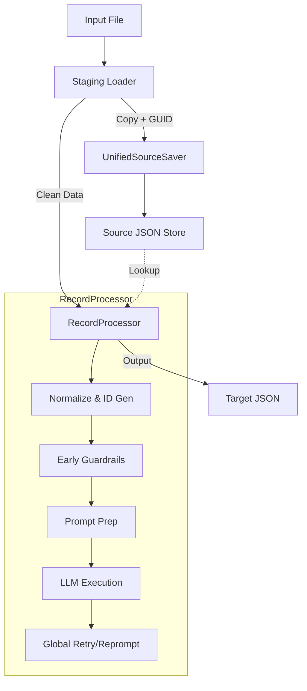

# Architectural Update: Unified Processing Pipeline

## Overview
We have successfully refactored the `agent-actions` framework to utilize a **Unified Processing Pipeline** based on `RecordProcessor`. This change eliminates legacy duplication, enforcing consistent error handling, global retries, and data lineage across all processing stages (both Staging/Initial and Standard).

## Key Architectural Changes

### 1. Unified Processor (`RecordProcessor`)
*   **Previous State**:
    *   `StagingProcessor` handled initial data loading (Stage 1).
    *   `TargetContentProcessor` handled downstream agent execution (Stage 2+).
    *   Retry logic and guardrails were inconsistently applied.
*   **New State**:
    *   `RecordProcessor` is the single engine for **all** stages.
    *   `staging_loader.py` now delegating directly to `RecordProcessor` for initial ingestion.
    *   `TargetGenerator` delegates directly to `RecordProcessor` for downstream processing.
    *   **Benefit**: Global application of Retries (`RetryService`), Pattern-based Reprompting, and Guardrails.

### 2. Legacy Component Removal
*   **Removed/Deprecated**:
    *   `StagingContentLoader`: Replaced by direct use of specialized loaders (`JsonLoader`, `TextLoader`) in `staging_loader.py`.
    *   `TargetContentProcessor`: Logic merged into `RecordProcessor`.
    *   `StagingProcessor`: Logic merged into `RecordProcessor` (First-Stage Mode).

### 3. Data Consistency & Robustness
We engineered several robustness improvements to ensure data flows correctly through the unified pipeline:

#### A. Immutable Source Hashing (The "GUID Fix")
*   **Issue**: Modifying input dictionaries (e.g., adding `source_guid`) before mutation caused `RecordProcessor` to calculate different content hashes than the source saver.
*   **Fix**: `staging_loader.py` now guards against mutation. It creates a separate copy/list for source saving while passing the **clean, original data** to `RecordProcessor`. This guarantees valid, deterministic GUID lookups.

#### B. Robust Source Traversal
*   **Issue**: Legacy data often wrapped content in `{"content": ...}`, while the new pipeline prefers flat structures. `{{source.title}}` templates would fail on wrapped data.
*   **Fix**:
    *   **`SourceDataLoader`**: Enhanced to transparently return inner `content` if present, or the full item if flat.
    *   **`ContextScopeProcessor`**: Added logic to automatically **unwrap** wrapped source dictionaries and **merge** flat source keys into the root context. This ensures templates like `{{title}}` and `{{source.title}}` work consistently regardless of input format (Text vs JSON).

## Data Flow Diagram (New)

## Conclusion
The architecture is now **simpler, more robust, and fully unified**. Any improvement to `RecordProcessor` (e.g., new retry strategies, better logging) immediately benefits every agent in the workflow.
