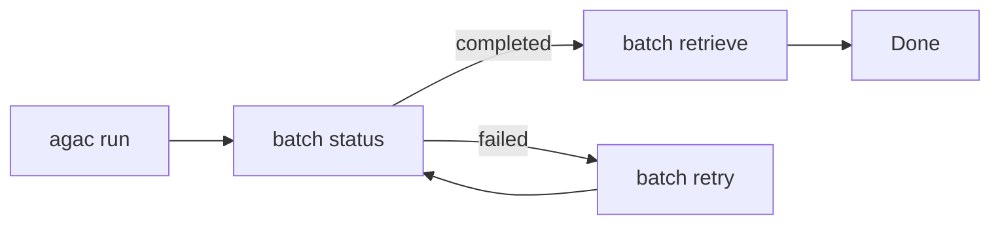

# batch Commands

When you need to process hundreds or thousands of records, running them one at a time is inefficient and expensive. Batch mode lets you submit all records at once for asynchronous processing—like sending a stack of forms to be processed overnight rather than waiting in line for each one.

## Submitting a Batch

To submit a batch, use the standard `run` command with a workflow configured for batch mode:

```yaml
# In your workflow config
defaults:
  run_mode: batch
```

```bash
agac run -a my_workflow
```

When `run_mode: batch` is set, Agent Actions submits the records asynchronously and returns a batch ID. Use the commands below to manage the batch lifecycle.

```bash
agac batch <subcommand> [options]
```

:::tip Run from Anywhere
You can run batch commands from any subdirectory within your project.
:::

## Subcommands

| Subcommand | Description |
|------------|-------------|
| `status` | Check batch job status |
| `retrieve` | Retrieve completed batch results |
| `retry` | Retry failed records |
| `chain-status` | Show retry chain status |

Let's explore each command in detail.

## batch status

**How do you know when a batch job finishes?**

After submitting a batch, you can poll its status to see if it's still processing, completed successfully, or failed:

```bash
agac batch status --batch-id <id>
```

**Options:**
| Option | Description |
|--------|-------------|
| `--batch-id` | The ID of the batch job to check. If not provided, uses the last submitted job ID. |

**Example:**
```bash
$ agac batch status --batch-id batch_abc123
Batch job status: completed
```

If you don't provide a batch ID, Agent Actions uses the last submitted job - convenient when you're iterating on a single batch.

## batch retrieve

Once a batch completes, retrieve the results to your local filesystem:

```bash
agac batch retrieve --batch-id <id> -o <output-dir>
```

**Options:**
| Option | Description |
|--------|-------------|
| `--batch-id` | The ID of the batch job to retrieve. If not provided, uses the last submitted job ID. |
| `-o, --output-dir` | Directory to save the retrieved results (default: current directory) |

**Example:**
```bash
agac batch retrieve --batch-id batch_abc123 -o ./results
```

The results are saved as JSON files matching your agentic workflow's output schema.

## batch retry

**What happens when some records fail?**

Not all records will succeed on the first try - rate limits, transient API errors, or malformed input can cause failures. The retry command resubmits only the failed records, creating a new batch for just those items.

```bash
agac batch retry --batch-id <id> [options]
```

**Options:**
| Option | Description |
|--------|-------------|
| `--batch-id` | The ID of the batch job to retry (required) |
| `-n, --max-attempts` | Maximum number of retry attempts (default: 3) |
| `-o, --output-dir` | Directory containing the batch registry |

**Example:**
```bash
$ agac batch retry --batch-id batch_abc123 --max-attempts 5
Retrying batch batch_abc123 (max attempts: 5)...
Retry complete. Final retry batch: batch_def456
```

:::info Retry Strategy
Retries create a new batch containing only failed records. This is more efficient than re-running the entire original batch. Agent Actions tracks the relationship between original and retry batches automatically.
:::

## batch chain-status

After multiple retries, you might wonder: how many records succeeded overall? Which batches are part of this chain?

The `chain-status` command shows the complete picture - the original batch and all its retries as a linked chain:

```bash
agac batch chain-status --batch-id <id>
```

You can pass any batch ID in the chain - Agent Actions traces it back to the original and shows the full history.

**Options:**
| Option | Description |
|--------|-------------|
| `--batch-id` | Any batch ID in the retry chain (required) |
| `-o, --output-dir` | Directory containing the batch registry |

**Example:**
```bash
$ agac batch chain-status --batch-id batch_abc123
Batch Chain Status for batch_abc123
--------------------------------------------------
Total retry attempts: 2
Current status: completed
Total records: 100

Retry Chain:
  batch_abc123: completed (original), 100 records
    -> batch_def456: completed (retry 1), 5 records
      -> batch_ghi789: completed (retry 2), 1 records
```

This output shows that the original batch had 100 records. 5 failed and were retried, then 1 of those failed and was retried again. All records eventually succeeded.

## Batch Agentic Workflow

The typical batch processing flow follows this pattern: run (submits batch), poll status, retrieve, and retry if needed.



Notice that retries loop back to status checking—you keep polling until all records succeed or you decide to stop retrying.

:::warning Batch Limitations
Batch mode works best for independent records that don't need to share state. If your agentic workflow requires cross-record coordination (like aggregating results from multiple records), process the batch results in a separate step after retrieval.
:::

## See Also

- [run Command](./run) - Execute agentic workflows synchronously
- [Troubleshooting](./troubleshooting) - Debug batch issues
