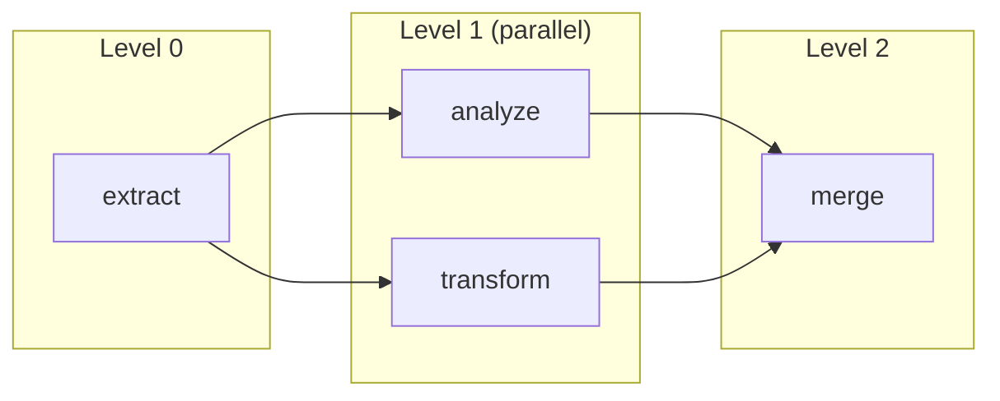

# run Command

The `run` command is your primary way to execute an agentic workflow. It handles dependency resolution, parallel execution, and UDF discovery automatically.

```bash
agac run -a <workflow-name> [options]
```

:::tip Run from Anywhere
You can run this command from any subdirectory within your project. The CLI will automatically find your project root.
:::

## Basic Usage

Let's start with the essentials:

```bash
# Run an agentic workflow
agac run -a my_workflow

# Run with custom user code (UDFs)
agac run -a my_workflow -u ./user_code --use-tools

# Force parallel execution
agac run -a my_workflow --parallel

# Run upstream dependencies first
agac run -a my_workflow --upstream

# Trigger downstream agentic workflows after completion
agac run -a my_workflow --downstream
```

## Options

| Option | Description |
|--------|-------------|
| `-a, --agent TEXT` | Agentic workflow name (required) |
| `-u, --user_code DIRECTORY` | Path to user's code folder containing UDFs |
| `--use-tools` | Enable tool usage for actions |
| `--force` | Force execution even if validation warnings occur |
| `--validate-only` / `-v` | Run pre-flight validation only (useful for CI/CD) |
| `--debug` | Enable debug mode |
| `--verbose` | Enable verbose output |
| `--parallel` | Force parallel execution (overrides auto-detection) |
| `--no-parallel` | Force sequential execution (overrides auto-detection) |
| `--concurrency-limit` | Max concurrent actions (default: 5, range: 1-50) |
| `--upstream` | Execute upstream dependencies first |
| `--downstream` | Execute downstream agentic workflows after completion |

## Parallel Execution

Consider what happens when actions don't depend on each other. Agent Actions automatically detects these situations and runs independent actions concurrently - like workers on an assembly line handling different parts simultaneously.

```bash
# Auto-detect parallel execution (default)
agac run -a my_workflow

# Force parallel execution
agac run -a my_workflow --parallel

# Force sequential execution
agac run -a my_workflow --no-parallel

# Limit concurrent actions to 10
agac run -a my_workflow --parallel --concurrency-limit 10
```

The diagram below shows how Agent Actions organizes actions into levels. Actions at the same level run in parallel because they don't depend on each other's outputs:



Notice that `analyze` and `transform` both depend on `extract`, but not on each other - so they run concurrently. The `merge` action waits for both to complete.

:::info Concurrency Limits
The default concurrency limit is 5 actions. If your agentic workflow has many parallel actions and you're hitting rate limits, consider reducing this. If you have capacity, increase it up to 50.
:::

## Agentic Workflow Dependencies

Sometimes agentic workflows depend on other agentic workflows. For example, a `report_generator` workflow might need data from an `extract_facts` workflow that runs first.

Use `--upstream` and `--downstream` flags to execute entire dependency chains:

```bash
# Execute upstream dependencies first, then run this agentic workflow
agac run -a consumer_workflow --upstream

# Run this agentic workflow, then execute all downstream dependents
agac run -a producer_workflow --downstream

# Execute entire dependency chain (upstream -> current -> downstream)
agac run -a middle_workflow --upstream --downstream
```

:::info Dependency Configuration
Agentic workflow dependencies are defined in your config using the `dependencies` field with a `workflow` key:
```yaml
actions:
  - name: process_data
    dependencies:
      - workflow: upstream_workflow_name
```
:::

## UDF Discovery

**How does Agent Actions find your custom Python functions?**

When your agentic workflow uses User-Defined Functions (UDFs) with the `@udf_tool` decorator, Agent Actions automatically scans the specified directory and registers them before execution starts. This means you can add new UDFs without manually configuring imports.

```bash
$ agac run -a my_workflow -u user_code/

Discovering UDFs...
Discovered 5 UDF(s)

Running agentic workflow: my_workflow
...
```

:::warning UDF Limitations
UDFs must be stateless - they receive inputs and return outputs but cannot maintain state between calls. If you need shared state, consider using an external database or cache.
:::

See the [UDF Decorator Reference](../reference/tools/udf-decorator) for more information on creating and using UDFs.

## Examples

Here are common patterns for running agentic workflows:

```bash
# Basic run
agac run -a my_workflow

# Run with verbose output to see progress
agac run -a my_workflow --verbose

# Run with debug mode for troubleshooting errors
agac run -a my_workflow --debug

# Run with parallel execution and custom concurrency limit
agac run -a my_workflow --parallel --concurrency-limit 10

# Validate only - useful for CI/CD to catch errors before execution
agac run -a my_workflow --validate-only
```

## See Also

- **[batch Commands](./batch)** - For processing large datasets asynchronously
- **[schema Command](./schema)** - Analyze agentic workflow structure and field dependencies
- **[Troubleshooting](./troubleshooting)** - Debug common issues
