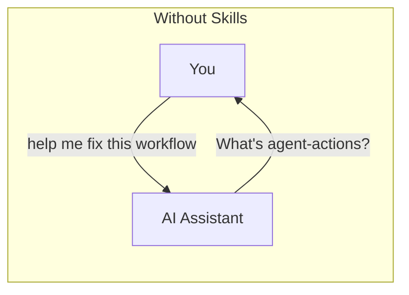
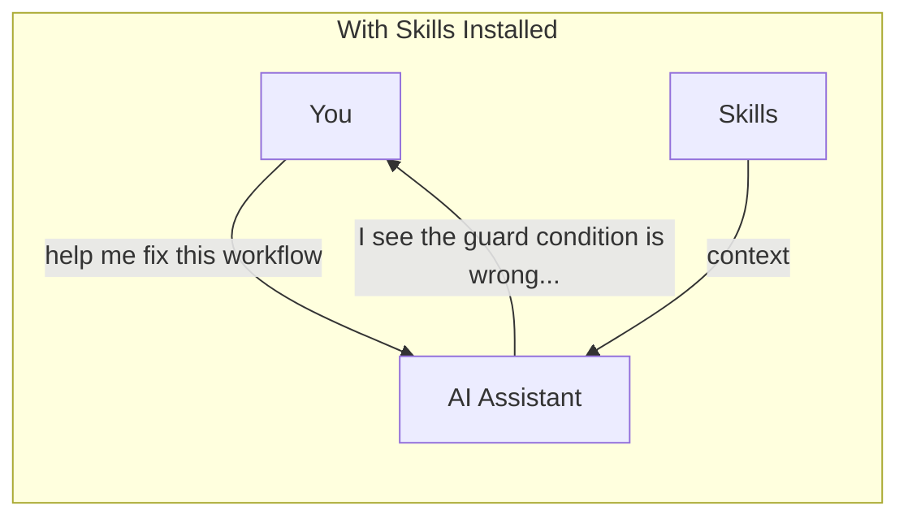
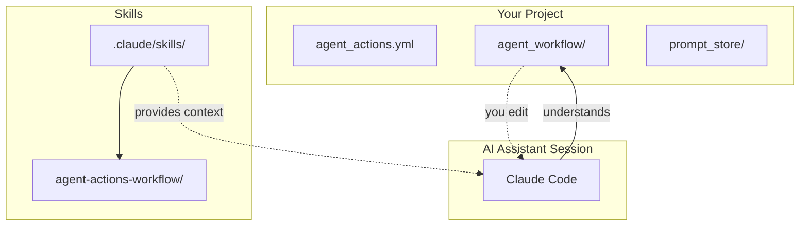

# Skills Command

How do you help your AI coding assistant understand agent-actions workflows? When you ask Claude Code or OpenAI Codex to help with a workflow, they need context about YAML syntax, field references, and execution patterns. Skills provide that context—bundled knowledge packages that teach assistants how to work effectively with your agentic workflows.

Think of skills like onboarding documentation for a new team member. Instead of explaining agent-actions from scratch every session, you install the skill once and the assistant "knows" the framework.

## How Skills Work





The difference is immediate: without skills, assistants lack the domain knowledge to help effectively. With skills installed, they understand Agent Actions concepts—YAML syntax, `context_scope`, guards, field references—and can provide specific, actionable guidance.

When installed, skills provide:

| Capability | What the Assistant Learns |
|------------|---------------------------|
| **Syntax Understanding** | YAML workflow structure, `context_scope`, guards, dependencies |
| **Field References** | How `{{ action.field }}` references work, common patterns |
| **Best Practices** | When to use UDFs vs LLM actions, schema design, batch mode |
| **Troubleshooting** | Common validation errors and how to fix them |

## Listing Available Skills

What skills come bundled with your agent-actions installation?

```bash
agac skills list
```

**Example output:**
```
Available bundled skills:

  agent-actions-workflow
    Build, debug, and manage agent-actions workflows.
    Includes syntax reference, best practices, and troubleshooting.

Install with:
  agac skills install --claude
  agac skills install --codex
```

## Installing Skills

Install skills for your AI coding assistant:

```bash
# For Claude Code users
agac skills install --claude

# For OpenAI Codex users
agac skills install --codex
```

You must specify which assistant you're using. This determines where skills are installed:

| Flag | Install Location | AI Assistant |
|------|------------------|--------------|
| `--claude` | `.claude/skills/` | Claude Code |
| `--codex` | `.codex/skills/` | OpenAI Codex |

### What Gets Installed

Each skill includes comprehensive reference materials:

```
.claude/skills/agent-actions-workflow/
├── SKILL.md           # Main skill documentation
├── references/        # Syntax reference, examples
├── scripts/           # Helper scripts for common tasks
└── assets/            # Diagrams, cheat sheets
```

### Options

| Option | Description |
|--------|-------------|
| `--claude` | Install skills for Claude Code |
| `--codex` | Install skills for OpenAI Codex |
| `--force` | Overwrite existing skills (use after updating agent-actions) |

### Examples

```bash
# Install for Claude Code
agac skills install --claude
# Skills installed to .claude/skills/

# Install for Codex
agac skills install --codex
# Skills installed to .codex/skills/

# Update skills after upgrading agent-actions
agac skills install --claude --force
# Overwrites existing with latest version
```

## Requirements

The skills command must be run from an agent-actions project (a directory containing `agent_actions.yml` or a subdirectory of one).

```bash
# This works - in a project directory
cd my-project/
agac skills install --claude
# ✓ Skills installed to .claude/skills/

# This fails - not in a project
cd ~/random-folder/
agac skills install --claude
# ✗ Error: Not in an agent-actions project.
#   Run this command from a directory containing agent_actions.yml
```

## Updating Skills

When you update agent-actions, the bundled skills may include new documentation or fixes. Update your installed skills:

```bash
# Force reinstall to get the latest
agac skills install --claude --force
```

Without `--force`, existing skills are skipped:

```bash
$ agac skills install --claude
Skipped: agent-actions-workflow (already exists)
Use --force to overwrite existing skills
```

## Workflow Integration



Skills are project-scoped. Each agent-actions project can have skills installed, and the AI assistant picks them up when you open that project.

## See Also

- [Editor Integration](../reference/editor-integration) - LSP support for Go to Definition, Hover, Autocomplete
- [Utility Commands](./utilities) - Other project management commands
