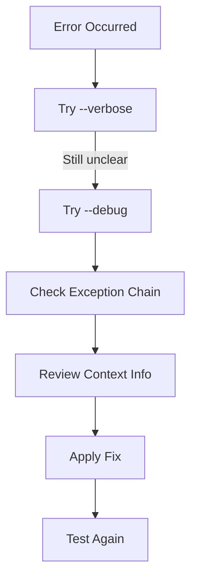

# Troubleshooting

When something goes wrong in your agentic workflow, you need clear information to fix it fast. Agent Actions is designed to give you actionable error messages and multiple debugging options.

Let's explore how to diagnose and resolve issues.

## Error Messages

**What went wrong, and how do I fix it?** Agent Actions answers both questions in every error message.

By default, you see clean, actionable errors designed for agentic workflow authors. When you need more detail, debug mode reveals the full technical context.

### Without Debug Mode (Default)

Error messages focus on what you need to know:

```
Configuration Error: Invalid model specified

  Action: extract_facts
  Field: model_name
  Value: claude-sonnet-4-20250514
  Issue: This model is not available for provider 'anthropic'

  Available models:
  • claude-3-5-sonnet-20241022
  • claude-3-5-haiku-20241022
  • claude-3-opus-20240229

  Fix: Update your workflow config:

  model_vendor: anthropic
  model_name: claude-3-5-sonnet-20241022
```

### With Debug Mode

When the simplified message isn't enough, debug mode shows the full picture:

```
Configuration Error: Invalid model specified
  [... user-friendly message ...]

--- Debug Information ---

Exception Chain:
Level 1: ConfigurationError - Invalid model specified
  Context: {
    'action': 'extract_facts',
    'field': 'model_name',
    'file_path': 'agent_config/my_workflow.yml',
    'operation': 'load_config',
    'timestamp': '2025-01-27T10:30:00Z'
  }

Level 2: ValueError - Model 'claude-sonnet-4-20250514' not found
  Context: {
    'provider': 'anthropic',
    'available_models': [...]
  }

Full Traceback:
Traceback (most recent call last):
  File "agent_actions/core/config.py", line 123, in load_config
    validate_model(config['model_name'])
  ...
```

## Logging Levels

Agent Actions adjusts verbosity based on the flags you provide. Think of it as a zoom lens: normal mode shows you the overview, verbose mode adds detail, and debug mode reveals everything.

| Flag | Level | Shows |
|------|-------|-------|
| None | `CRITICAL` | Only critical system errors |
| `--verbose` | `INFO` | Progress and status updates |
| `--debug` | `DEBUG` | All internal operations + structured logs |

## Environment Variables

Agent Actions respects these environment variables:

| Variable | Description |
|----------|-------------|
| `ANTHROPIC_API_KEY` | Anthropic API key |
| `OPENAI_API_KEY` | OpenAI API key |
| `GEMINI_API_KEY` | Google Gemini API key |
| `GROQ_API_KEY` | Groq API key |
| `MISTRAL_API_KEY` | Mistral API key |
| `COHERE_API_KEY` | Cohere API key |
| `AGENT_ACTIONS_ENV` | Environment (dev/staging/prod) |

## Exit Codes

| Code | Meaning |
|------|---------|
| `0` | Success |
| `1` | General error |
| `2` | Usage error (invalid arguments) |
| `130` | Interrupted by user (Ctrl+C) |

## Examples

### Basic Agentic Workflow Execution

```bash
agac run -a product_pipeline
```

### Debug Configuration Issues

```bash
agac run -a product_pipeline --debug
```

This reveals the complete error context:
- Full exception chains showing where errors originated
- Configuration loading details
- File path context
- Operation timestamps

### Monitor Long-Running Agentic Workflows

```bash
agac run -a large_batch --verbose
```

### Check Version

```bash
agac --version
```

### Get Help

```bash
# General help
agac --help

# Command-specific help
agac run --help
agac batch --help
```

## Best Practices

### During Development

- Use `--debug` when building new agentic workflows - you'll want the full context
- Check exception chains to understand where errors originate
- Review structured logs when data isn't flowing as expected

### In Production

- Run without flags for clean output suitable for logging
- Capture logs to monitoring systems for later analysis
- Use exit codes in CI/CD pipelines to fail builds on errors

### Debugging Process

When an error occurs, here's how to systematically investigate:



The diagram shows the escalation path: start with verbose output to see the execution flow, then add debug mode if you need more detail. The exception chain often reveals the root cause - follow it from the top-level error down to the original failure.

1. Start with `--verbose` to see execution flow
2. Use `--debug` to investigate specific errors
3. Check exception chains for root causes
4. Review context information (file paths, action names, operations)

:::info Limitation
Debug mode can produce substantial output, especially for large agentic workflows with many actions. Consider redirecting output to a file when debugging complex issues: `agac run -a my_workflow --debug > debug.log 2>&1`
:::

## See Also

- [Getting Started](../getting-started/) - Build your first agentic workflow
- [Reference](../reference/) - Complete feature reference
- [Installation](../installation.md) - Setup instructions
