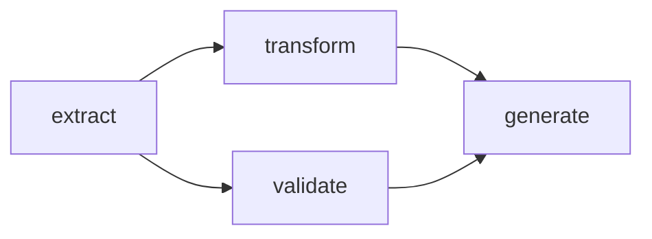
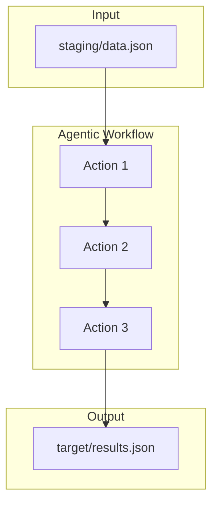

# Key Concepts

Let's explore the core ideas behind Agent Actions. Understanding these concepts will help you design effective agentic workflows.

## Agentic Workflows as DAGs

**What is an agentic workflow?** An agentic workflow is a directed acyclic graph (DAG) of actions. Think of it like a project plan: each task declares what it depends on, and the project manager (Agent Actions) figures out the execution order.



Notice how `transform` and `validate` both depend on `extract`, but are independent of each other. Agent Actions recognizes this and runs them in parallel.

This structure guarantees:
- Actions run only after their dependencies complete
- Data flows in one direction (no cycles)
- Independent actions run in parallel automatically

## Actions

An action is a single step in your agentic workflow—either an LLM call or a Python function. You might wonder: why not just chain API calls directly? Actions provide structure: they declare dependencies, enforce schemas, and integrate with the execution engine.

```yaml
actions:
  - name: analyze_content
    model_vendor: openai
    model_name: gpt-4o-mini
    prompt: |
      Analyze this text: {{ source.content }}
    schema: analysis_result
    dependencies: load_data  # Input source
```

Each action has:

| Component | Description |
|-----------|-------------|
| **name** | Unique identifier for referencing this action |
| **prompt** | Instructions for the LLM (with Jinja2 templating) |
| **schema** | JSON Schema for output validation |
| **dependencies** | Actions that must complete first (execution order) |

Actions are stateless—they receive input, process it, and produce validated output. This makes them easy to test, retry, and reason about.

### Dependency Types

Agent Actions distinguishes between two types of dependencies:

- **Execution dependencies**: Declared explicitly via `dependencies: action_name`. These control execution order—ensuring upstream actions complete before downstream actions start.
- **Context dependencies**: Auto-inferred from field references like `{{ action.field }}` in your prompts. Agent Actions automatically makes these fields available in the action's context.

You only need to declare execution dependencies explicitly. Context dependencies are handled automatically based on your prompt template references.

## Field References

**How do actions share data?** Field references work like spreadsheet formulas. When you write `{{ extract_data.product_name }}`, you're pointing to a cell that will be filled in when that action completes.

```yaml
prompt: |
  Product: {{ extract_data.product_name }}
  Features: {{ extract_data.key_features }}
```

The `{{ action_name.field }}` syntax pulls data from completed upstream actions. Agent Actions validates these references at configuration time—you'll catch typos before making any API calls.

**Auto-inferred context**: When you reference a field like `{{ extract_data.product_name }}` in your prompt, Agent Actions automatically makes that field available in the action's context. You don't need to manually configure which fields to include—the system infers them from your template references.

## Schema Validation

**What happens when an LLM returns malformed JSON?** Every action output is validated against a JSON Schema. If validation fails, Agent Actions automatically reprompts until the output conforms.

```json
{
  "type": "object",
  "properties": {
    "sentiment": {
      "type": "string",
      "enum": ["positive", "negative", "neutral"]
    },
    "confidence": {
      "type": "number",
      "minimum": 0,
      "maximum": 1
    }
  },
  "required": ["sentiment", "confidence"]
}
```

This means downstream actions always receive well-structured data. However, schema validation catches structural errors but cannot verify semantic correctness—a response might match your schema but still contain incorrect information.

## Context Scope

Consider what happens when you have a large document. Do you really want to pass the entire raw HTML to every downstream action? Context scope lets you control what data flows between actions—keeping prompts focused and token costs down.

| Directive | Effect |
|-----------|--------|
| `observe` | Include specific fields from upstream |
| `drop` | Exclude fields from context |
| `passthrough` | Pass fields unchanged to output |

```yaml
context_scope:
  observe:
    - extract_data.product_name
  drop:
    - source.raw_html
  passthrough:
    - source.id
```

This configuration tells the action to focus on `product_name`, ignore the raw HTML, and preserve the source ID in its output.

## Execution Flow

Let's trace how data moves through an agentic workflow from start to finish:



The flow is straightforward:

1. Input data placed in `agent_io/staging/`
2. Agent Actions creates tracking references in `source/`
3. Actions execute in dependency order (with parallelization where possible)
4. Each action output is validated against its schema
5. Final results are written to `agent_io/target/`

## Further Reading

- **[Field References](../reference/context/field-references)** — Reference syntax details
- **[Context Scope](../reference/context/context-scope)** — Data flow control
- **[Schemas](../reference/schemas/)** — Schema design patterns
- **[Guards](../reference/execution/guards)** — Conditional execution
