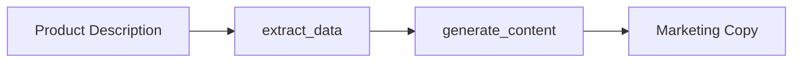

# Getting Started

Let's build your first agentic workflow in 5 minutes. You'll create a two-action pipeline that extracts product data and generates marketing content—a common pattern for automating content creation.

## What You'll Build

Think of an agentic workflow like an assembly line. Each action is a station: it receives input, does its work, and passes output to the next station. Here's the simple workflow you'll create:



The first action extracts structured data from raw text. The second action uses that data to generate polished marketing copy.

## 1. Set Up Your Project

Create a project directory with this structure:

```
my_workflow/
├── agent_actions.yml
├── agent_workflow/
│   └── product_pipeline/
│       ├── agent_config/
│       │   └── product_pipeline.yml
│       └── agent_io/
│           └── staging/
│               └── products.json
├── schema/
│   ├── product_data.json
│   └── marketing_content.json
└── prompt_store/
    └── product_pipeline.md
```

## 2. Define Your Schemas

**Why schemas matter:** When an LLM generates output, how do you know it's valid? Schemas act as contracts—they define exactly what structure you expect, and Agent Actions validates every response against them. If the LLM returns malformed data, Agent Actions automatically reprompts until it conforms.

Create these schema files:

**`schema/product_data.json`**:
```json
{
  "type": "object",
  "properties": {
    "product_name": { "type": "string" },
    "category": { "type": "string" },
    "key_features": {
      "type": "array",
      "items": { "type": "string" },
      "minItems": 3
    },
    "price_range": { "type": "string" },
    "target_audience": { "type": "string" }
  },
  "required": ["product_name", "category", "key_features"]
}
```

**`schema/marketing_content.json`**:
```json
{
  "type": "object",
  "properties": {
    "headline": { "type": "string", "maxLength": 60 },
    "description": { "type": "string", "maxLength": 200 },
    "key_benefits": {
      "type": "array",
      "items": { "type": "string" },
      "minItems": 3,
      "maxItems": 5
    }
  },
  "required": ["headline", "description", "key_benefits"]
}
```

## 3. Create Your Agentic Workflow

Here's where it gets interesting. The workflow configuration defines your actions and how data flows between them. Notice how `generate_content` references fields from `extract_data` using `{{ extract_data.field }}` syntax—this is how actions share data.

**`agent_workflow/product_pipeline/agent_config/product_pipeline.yml`**:

```yaml
name: product_pipeline
description: "Extract product data and generate marketing content"

defaults:
  model_vendor: openai
  model_name: gpt-4o-mini
  json_mode: true

actions:
  - name: extract_data
    prompt: |
      Extract structured product information from this text:
      {{ source.content }}

      Return: product name, category, key features, price range, target audience.
    schema: product_data

  - name: generate_content
    dependencies: extract_data  # Input source
    prompt: |
      Create marketing content for this product:

      Name: {{ extract_data.product_name }}
      Category: {{ extract_data.category }}
      Features: {{ extract_data.key_features }}
      Audience: {{ extract_data.target_audience }}

      Generate a catchy headline, engaging description, and 3-5 key benefits.
    schema: marketing_content
```

## 4. Add Input Data

**`agent_workflow/product_pipeline/agent_io/staging/products.json`**:

```json
[
  {
    "content": "Smart Fitness Tracker Pro - Advanced health monitoring device with heart rate tracking, sleep analysis, and GPS functionality. Price: $199-249. Perfect for fitness enthusiasts and health-conscious users."
  }
]
```

## 5. Configure the Project

**`agent_actions.yml`**:

```yaml
default_agent_config:
  api_key: OPENAI_API_KEY
  model_vendor: openai
  model_name: gpt-4o-mini

tool_path: ["tools"]
```

## 6. Run Your Agentic Workflow

```bash
agac run -a product_pipeline
```

You should see output like this:

```
Running workflow: product_pipeline
├── extract_data ✓
└── generate_content ✓

Results written to: agent_io/target/
```

Check `agent_io/target/` for your results:

```json
{
  "product_name": "Smart Fitness Tracker Pro",
  "category": "Wearable Technology",
  "key_features": ["Heart Rate Tracking", "Sleep Analysis", "GPS"],
  "headline": "Track Your Fitness Like a Pro",
  "description": "Advanced health monitoring with precision tracking...",
  "key_benefits": ["24/7 Health Monitoring", "GPS Accuracy", "Sleep Insights"]
}
```

## What Just Happened?

Let's walk through what Agent Actions did behind the scenes:

1. **extract_data** read from `staging/`, called the LLM, and validated the output against the `product_data` schema
2. **generate_content** received extract_data's output via `{{ extract_data.field }}` references, generated marketing content, and validated against the `marketing_content` schema
3. Results were written to `target/`

**What if the LLM returns invalid JSON?** Agent Actions automatically reprompts until the output conforms to your schema. This means you can trust that downstream actions always receive well-structured data—no defensive parsing needed.

## Next Steps

- **[Key Concepts](./concepts)** — Understand actions, dependencies, and context
- **[Custom Functions](./custom-functions)** — Add Python functions to your agentic workflow
- **[Common Patterns](./patterns)** — Learn reusable agentic workflow patterns
