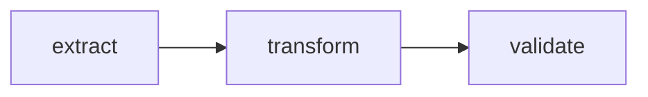
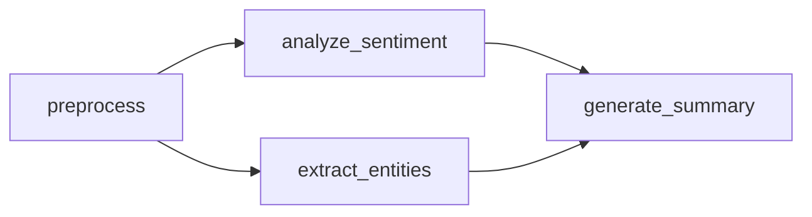
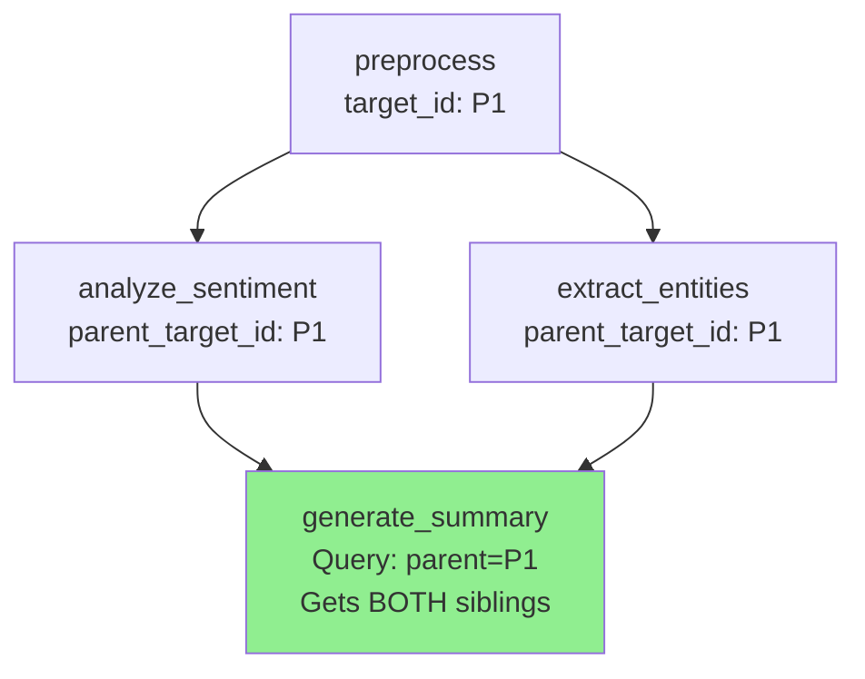
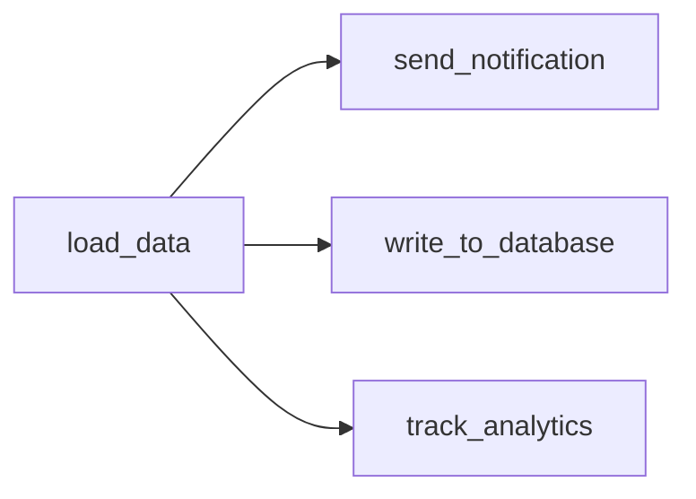
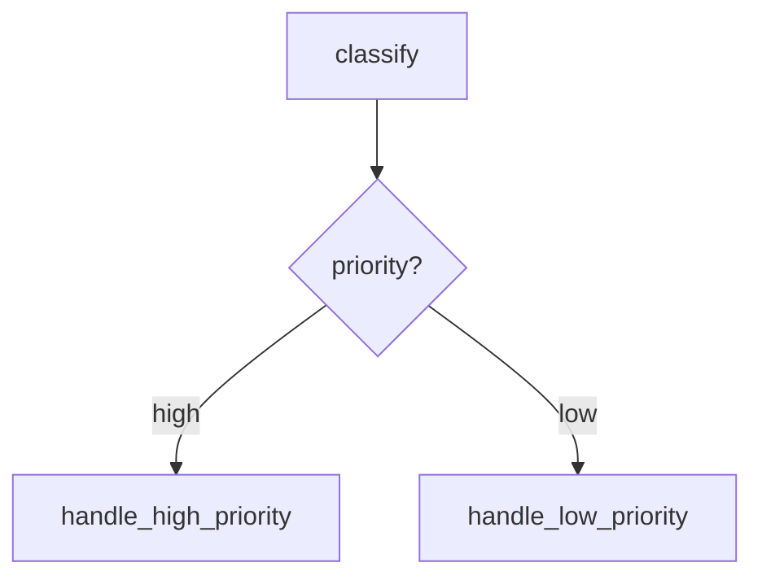
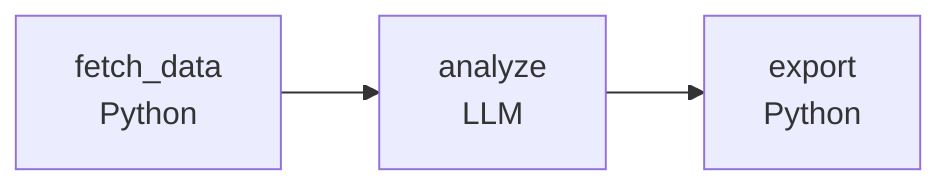
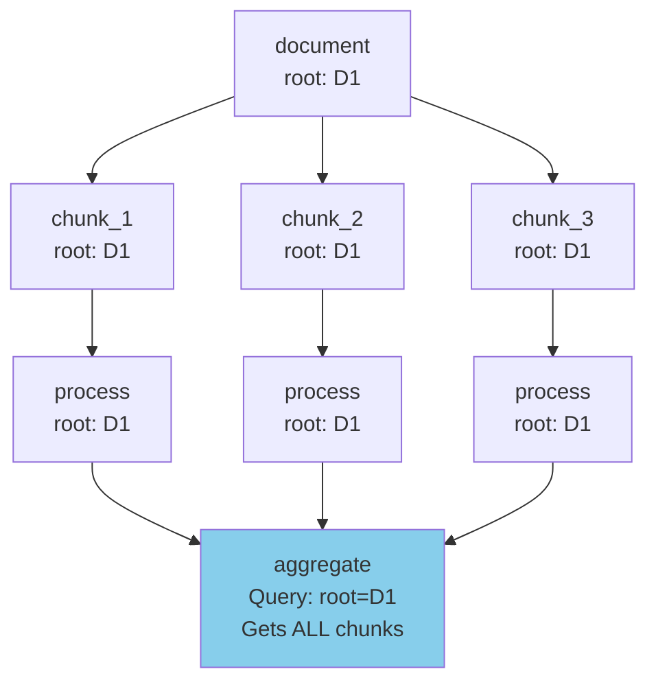

# Common Patterns

Once you understand the basics, you'll notice that most agentic workflows follow a handful of recurring patterns. Let's explore the most common ones so you can recognize which pattern fits your use case.

## Sequential Pipeline

The simplest pattern: a linear chain where each action depends on the previous. Think of it like a relay race—each runner completes their leg before handing off the baton.

```yaml
actions:
  - name: extract
    # No dependencies - reads from source

  - name: transform
    dependencies: extract  # Input source

  - name: validate
    dependencies: transform  # Input source
```

The diagram shows the straightforward data flow:



**Use cases:** ETL pipelines, document processing, data enrichment

**Limitation:** No parallelization—each action waits for the previous one to complete.

## Parallel Processing with Merge

**What if you need to run multiple analyses on the same data?** The parallel-merge pattern lets you run operations concurrently, then combine results. Agent Actions automatically parallelizes actions that share a dependency but do not depend on each other.

```yaml
actions:
  - name: preprocess
    # No dependencies - reads from source

  - name: analyze_sentiment
    dependencies: preprocess  # Input source

  - name: extract_entities
    dependencies: preprocess  # Input source

  - name: generate_summary
    dependencies: [analyze_sentiment, extract_entities]  # Merge pattern
```

Notice how `analyze_sentiment` and `extract_entities` both depend on `preprocess`—they run in parallel:



**Use cases:** Multi-aspect analysis, concurrent API calls, feature extraction

### How Parallel Merge Works

When `generate_summary` runs, it needs to access outputs from **both** parallel branches. Agent Actions uses an **Ancestry Chain** to track relationships between records:

- **`parent_target_id`**: Links each record to its immediate parent
- **`root_target_id`**: Links each record to the original source

Since both `analyze_sentiment` and `extract_entities` share the same parent (`preprocess`), the merge action can find all sibling branches by querying `parent_target_id`.



In your prompt template, access each branch's output using namespaced references:

```yaml
- name: generate_summary
  dependencies: [analyze_sentiment, extract_entities]  # Merge pattern
  prompt: |
    Sentiment: {{ analyze_sentiment.sentiment_score }}
    Entities: {{ extract_entities.entities }}

    Generate a summary incorporating these insights.
```

See [Data Lineage](../reference/data-io/data-lineage) for details on ancestry tracking.

## Fan-Out Pattern

Consider what happens when you need to distribute data to multiple destinations. The fan-out pattern sends one source to multiple independent consumers—all running in parallel.

```yaml
actions:
  - name: load_data
    # No dependencies - reads from source

  - name: send_notification
    dependencies: load_data  # Input source

  - name: write_to_database
    dependencies: load_data  # Input source

  - name: track_analytics
    dependencies: load_data  # Input source
```

All three downstream actions start as soon as `load_data` completes:



**Use cases:** Event distribution, multi-channel notifications, data replication

## Conditional Branching

**How do you route data based on its content?** Guards let you execute actions conditionally. Think of them as quality checkpoints—if the condition fails, the action is skipped entirely (no API call, no cost).

```yaml
actions:
  - name: classify
    schema: classification

  - name: handle_high_priority
    dependencies: classify  # Input source
    guard:
      condition: "classify.priority == 'high'"
      on_false: skip

  - name: handle_low_priority
    dependencies: classify  # Input source
    guard:
      condition: "classify.priority == 'low'"
      on_false: skip
```

The guard evaluates after `classify` completes, routing to the appropriate handler:



See [Guards](../reference/execution/guards) for complete documentation.

## Schema Evolution

As data flows through your agentic workflow, it often gains structure and richness. Schema evolution captures this—each action has its own schema that reflects the data at that stage.

```yaml
actions:
  - name: load_raw
    schema: raw_data

  - name: enrich
    dependencies: load_raw  # Input source
    schema: enriched_data

  - name: finalize
    dependencies: enrich  # Input source
    schema: final_output
```

Each schema builds on the previous, adding fields as data flows through. This makes it easy to debug: if validation fails at `enrich`, you know exactly which stage introduced the problem.

## Tool + LLM Hybrid

Here's where it gets interesting. You can mix Python UDFs with LLM calls in the same agentic workflow—use Python for deterministic operations (API calls, file exports, calculations) and LLMs for tasks requiring language understanding.

```yaml
actions:
  - name: fetch_data
    kind: tool
    impl: fetch_from_api

  - name: analyze
    dependencies: fetch_data  # Input source
    prompt: |
      Analyze this data: {{ fetch_data.results }}
    schema: analysis

  - name: export
    kind: tool
    impl: export_to_excel
    dependencies: analyze  # Input source
```

The diagram shows the alternating pattern—Python on the edges, LLM in the middle:



**Use cases:** API integration, file exports, data validation

## Aggregation Pattern

**What if you have 1000 records to process, then need to summarize them?** The aggregation pattern processes items individually at Record granularity, then switches to File granularity to aggregate results.

```yaml
defaults:
  granularity: Record

actions:
  - name: process_item
    prompt: "Process: {{ source.content }}"
    schema: processed_item

  - name: aggregate
    dependencies: process_item  # Input source
    granularity: File
    kind: tool
    impl: aggregate_results
```

This pattern works best when individual processing is independent. If items need to share state during processing, consider a different approach.

See [Granularity](../reference/execution/granularity) for Record vs File processing.

## Map-Reduce Pattern

For more complex aggregations where records are split, processed in parallel, and then merged, the Map-Reduce pattern uses `root_target_id` to collect all descendants:

```yaml
actions:
  - name: chunk_document
    granularity: splits  # Creates N chunks

  - name: process_chunk
    dependencies: chunk_document  # Input source

  - name: aggregate_results
    dependencies: process_chunk  # Input source
    granularity: collect  # Collects all chunks
```



The `root_target_id` field preserves the original document identity through all splits, enabling the aggregate action to collect all processed chunks that belong to the same source document.

See [Data Lineage](../reference/data-io/data-lineage) for details on the ancestry chain.

## Next Steps

Now that you've seen the common patterns, explore the features that make them possible:

- **[Guards](../reference/execution/guards)** — Conditional execution
- **[Granularity](../reference/execution/granularity)** — Record vs file processing
- **[Context Scope](../reference/context/context-scope)** — Data flow control
- **[Agentic Workflow Dependencies](../reference/execution/workflow-dependencies)** — Chain agentic workflows together
