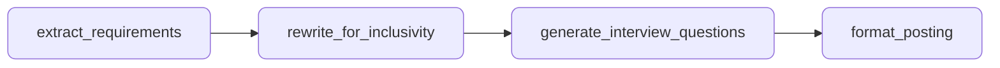
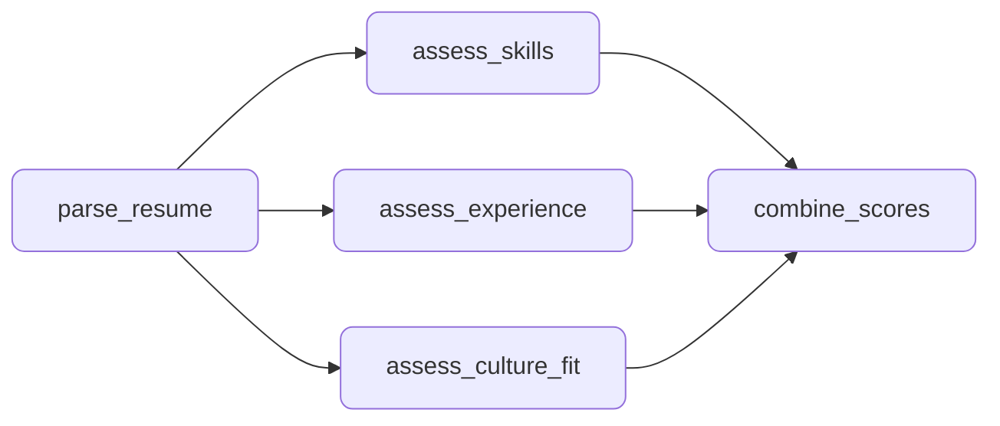
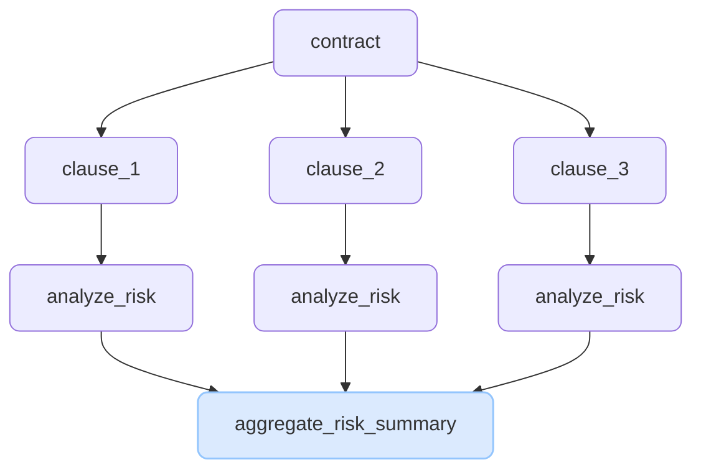
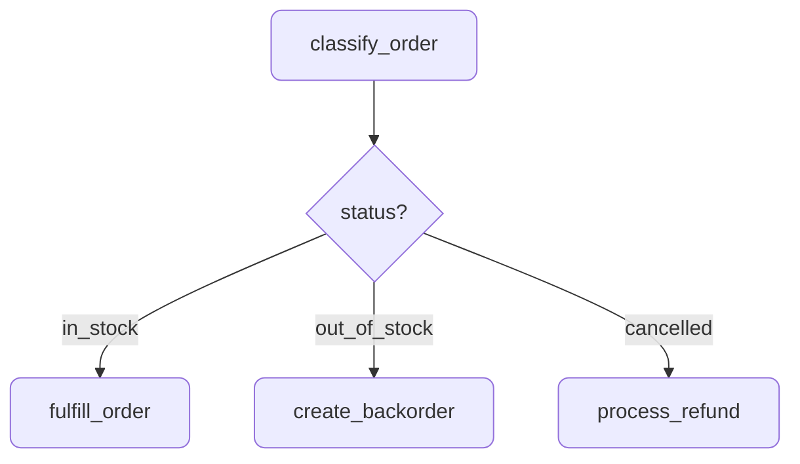
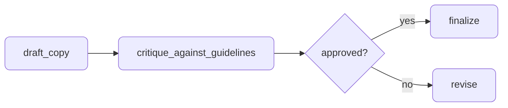
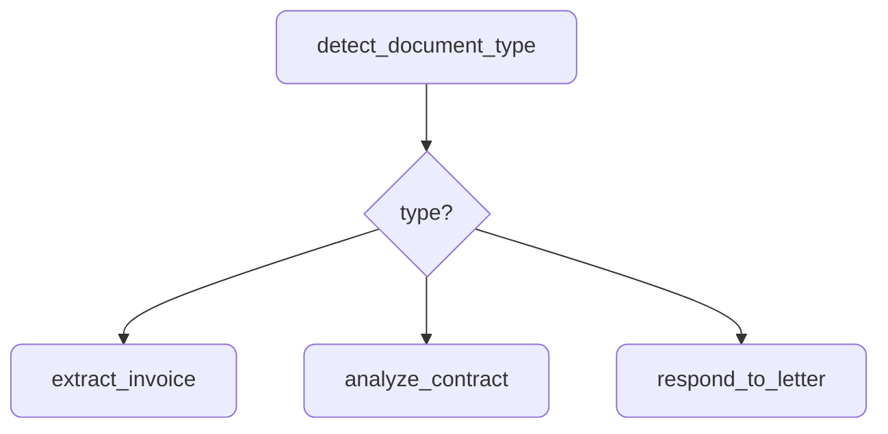
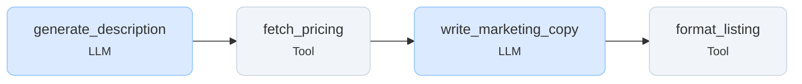
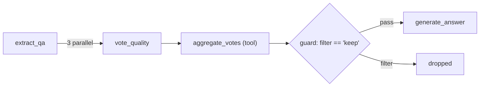

# Design Patterns

Agentic AI systems follow well-established design patterns. Understanding these patterns helps you choose the right architecture for your use case and implement it correctly with Agent Actions.

## Pattern Categories

| Category | Patterns | When to Use |
|----------|----------|-------------|
| **Deterministic** | Sequential, Parallel, Map-Reduce | Predictable workflows with known steps |
| **Dynamic** | Coordinator, Conditional Routing | Adaptive workflows that respond to data |
| **Iterative** | Review & Critique, Refinement Loop | Quality-critical outputs requiring validation |
| **Hybrid** | Tool + LLM | Mixing deterministic logic with AI reasoning |

---

## Sequential Pipeline

The simplest pattern: actions execute in a predefined linear order where each output becomes the next input.



```yaml
name: job_posting_optimizer
description: "Optimize job postings for clarity, inclusivity, and hiring effectiveness"

defaults:
  model_vendor: openai
  model_name: gpt-4o-mini
  json_mode: true

actions:
  - name: extract_requirements
    prompt: |
      Analyze this job posting and extract structured requirements.

      Posting: {{ source.raw_posting }}

      Separate must-have qualifications from nice-to-haves.
      Identify the core responsibilities and team context.
    schema:
      role_title: string
      must_have_skills: array
      nice_to_have_skills: array
      responsibilities: array
      team_context: string
      years_experience_mentioned: number

  - name: rewrite_for_inclusivity
    dependencies: [extract_requirements]
    prompt: |
      Rewrite this job posting to be more inclusive and welcoming.

      Original posting: {{ source.raw_posting }}
      Must-have skills: {{ extract_requirements.must_have_skills | join(', ') }}
      Nice-to-haves: {{ extract_requirements.nice_to_have_skills | join(', ') }}

      Remove gendered language, unnecessary jargon, and inflated requirements.
      Replace "rockstar/ninja/guru" with clear role descriptions.
      If years of experience exceed what the role needs, flag it.
    schema:
      rewritten_posting: string
      changes_made: array
      inclusivity_score: number

  - name: generate_interview_questions
    dependencies: [rewrite_for_inclusivity]
    prompt: |
      Generate structured interview questions for this role.

      Role: {{ extract_requirements.role_title }}
      Key skills: {{ extract_requirements.must_have_skills | join(', ') }}
      Responsibilities: {{ extract_requirements.responsibilities | join(', ') }}

      Create 5 behavioral and 3 technical questions.
      Each question should map to a specific requirement.
    schema:
      behavioral_questions:
        type: array
        items: string
        minItems: 5
      technical_questions:
        type: array
        items: string
        minItems: 3
      skill_mapping: object

  - name: format_posting
    dependencies: [generate_interview_questions]
    kind: tool
    impl: format_job_package
    intent: "Package optimized posting with interview kit"
    context_scope:
      observe:
        - rewrite_for_inclusivity.*
        - generate_interview_questions.*
        - extract_requirements.*
```

**Advantages:**
- Simple to build and debug
- Predictable execution order
- No orchestration overhead

**Limitations:**
- No parallelization—each step waits for the previous
- Cannot skip unnecessary steps

**Use cases:** Document processing, content optimization, data enrichment pipelines

---

## Parallel Processing

Multiple actions execute simultaneously when they share a dependency but don't depend on each other. Agent Actions detects these opportunities automatically.



```yaml
name: applicant_screener
description: "Screen candidates with parallel independent assessment"

defaults:
  json_mode: true
  model_vendor: openai
  model_name: gpt-4o-mini
  context_scope:
    seed_path:
      role_requirements: $file:role_requirements.json
      company_values: $file:company_values.json

actions:
  - name: parse_resume
    intent: "Extract structured information from resume"
    schema:
      candidate_name: string
      skills: array
      experience_years: number
      education: array
      previous_roles: array
      notable_achievements: array
    prompt: $prompts.parse_resume
    context_scope:
      observe:
        - source.resume_text
        - source.cover_letter

  # These three run in parallel — all depend on parse_resume
  - name: assess_skills
    dependencies: [parse_resume]
    intent: "Evaluate technical skill match against role requirements"
    schema:
      skill_match_score: number
      matched_skills: array
      missing_skills: array
      reasoning: string
    prompt: $prompts.assess_skills
    context_scope:
      observe:
        - parse_resume.skills
        - parse_resume.previous_roles
        - seed.role_requirements

  - name: assess_experience
    dependencies: [parse_resume]
    intent: "Evaluate depth and relevance of work experience"
    schema:
      experience_score: number
      relevant_experience_years: number
      leadership_signals: array
      reasoning: string
    prompt: $prompts.assess_experience
    context_scope:
      observe:
        - parse_resume.previous_roles
        - parse_resume.notable_achievements
        - parse_resume.experience_years
        - seed.role_requirements

  - name: assess_culture_fit
    dependencies: [parse_resume]
    intent: "Evaluate alignment with company values and team dynamics"
    schema:
      culture_score: number
      alignment_signals: array
      concerns: array
      reasoning: string
    prompt: $prompts.assess_culture_fit
    context_scope:
      observe:
        - parse_resume.notable_achievements
        - parse_resume.previous_roles
        - source.cover_letter
        - seed.company_values

  # Fan-in: merge results from all parallel branches
  - name: combine_scores
    dependencies: [assess_skills, assess_experience, assess_culture_fit]
    kind: tool
    impl: calculate_composite_score
    intent: "Compute weighted composite score from parallel assessments"
    context_scope:
      observe:
        - assess_skills.*
        - assess_experience.*
        - assess_culture_fit.*
      passthrough:
        - parse_resume.candidate_name
        - parse_resume.skills
```

:::tip Fan-in Pattern
When multiple different actions feed into one action, the system uses **fan-in**: the first dependency drives execution count, while others are loaded via historical context with lineage matching. This ensures each execution sees data from the same record lineage.
:::

**Advantages:**
- Reduces latency through concurrent execution
- Gathers diverse perspectives simultaneously

**Limitations:**
- Higher resource utilization
- Synthesis logic can be complex when results conflict

**Use cases:** Multi-aspect evaluation, document analysis, feature extraction

---

## Map-Reduce

Split large inputs into chunks, process each in parallel, then aggregate results. This pattern scales to handle documents of any size.



```yaml
name: contract_reviewer
description: "Analyze contract clauses for risk and obligations"

defaults:
  json_mode: true
  model_vendor: openai
  model_name: gpt-4o-mini

actions:
  - name: split_into_clauses
    kind: tool
    impl: split_contract_by_clause
    intent: "Split contract into individual clauses for analysis"

  - name: analyze_clause
    dependencies: [split_into_clauses]
    prompt: |
      Analyze this contract clause for risk, obligations, and deadlines.

      Clause: {{ split_into_clauses.clause_text }}
      Clause number: {{ split_into_clauses.clause_number }}

      Identify:
      - Risk level (high/medium/low) and why
      - Obligations for each party
      - Any deadlines or time-sensitive terms
      - Unusual or non-standard language
    schema:
      risk_level: string
      risk_reasoning: string
      obligations: array
      deadlines: array
      unusual_terms: array

  - name: aggregate_risk_summary
    dependencies: [analyze_clause]
    kind: tool
    impl: aggregate_clause_analyses
    intent: "Combine clause analyses into unified risk report"
```

The `root_target_id` field preserves document identity through all splits, enabling the aggregate action to collect all clauses belonging to the same contract.

**Advantages:**
- Handles arbitrarily large inputs
- Parallel clause processing reduces latency

**Limitations:**
- Clause boundaries can split important cross-references
- Aggregation must reconcile clauses that interact with each other

**Use cases:** Contract review, legal document analysis, research paper summarization

See [Granularity](../reference/execution/granularity) for record and file modes.

---

## Conditional Routing

Route data to different handlers based on content. Guards evaluate conditions and skip actions that don't apply—no API call, no cost.



```yaml
name: order_processor
description: "Route orders to appropriate handlers based on status"

defaults:
  json_mode: true
  model_vendor: openai
  model_name: gpt-4o-mini

actions:
  - name: classify_order
    prompt: |
      Analyze this order and determine its processing path.

      Order details: {{ source.order_details }}
      Customer message: {{ source.customer_message }}
      Inventory status: {{ source.inventory_status }}

      Determine if this order should be fulfilled, backordered, or refunded.
    schema:
      order_status: string
      reasoning: string
      priority: string

  # Only runs for in-stock orders
  - name: fulfill_order
    dependencies: [classify_order]
    guard:
      condition: 'classify_order.order_status == "in_stock"'
      on_false: "filter"
    intent: "Generate fulfillment instructions for in-stock orders"
    prompt: $prompts.fulfill_order
    schema:
      shipping_method: string
      estimated_delivery: string
      confirmation_message: string
    context_scope:
      observe:
        - classify_order.*
        - source.order_details
        - source.shipping_address

  # Only runs for out-of-stock orders
  - name: create_backorder
    dependencies: [classify_order]
    guard:
      condition: 'classify_order.order_status == "out_of_stock"'
      on_false: "filter"
    intent: "Create backorder with estimated restock timeline"
    prompt: $prompts.create_backorder
    schema:
      backorder_message: string
      estimated_restock: string
      alternatives_suggested: array
    context_scope:
      observe:
        - classify_order.*
        - source.order_details

  # Only runs for cancelled orders
  - name: process_refund
    dependencies: [classify_order]
    guard:
      condition: 'classify_order.order_status == "cancelled"'
      on_false: "filter"
    intent: "Process refund and generate confirmation"
    prompt: $prompts.process_refund
    schema:
      refund_amount: string
      refund_method: string
      confirmation_message: string
```

**Advantages:**
- Optimizes cost by skipping irrelevant actions
- Adapts processing to data characteristics

**Limitations:**
- Guard conditions must be deterministic
- Complex routing logic can be hard to debug

**Use cases:** Order processing, content-type routing, priority-based handling

See [Guards](../reference/execution/guards) for complete documentation.

---

## Review and Critique

A generator creates output; a critic evaluates it against criteria. This pattern improves quality for high-stakes outputs.



```yaml
name: marketing_copy_editor
description: "Generate and review marketing copy against brand guidelines"

defaults:
  json_mode: true
  model_vendor: openai
  model_name: gpt-4o-mini
  context_scope:
    seed_path:
      brand_guidelines: $file:brand_guidelines.json

actions:
  - name: draft_copy
    prompt: |
      Write marketing copy for this campaign:

      Product: {{ source.product_name }}
      Target audience: {{ source.target_audience }}
      Campaign goal: {{ source.campaign_goal }}
      Channel: {{ source.channel }}

      Write compelling copy appropriate for the channel.
    schema:
      headline: string
      body_copy: string
      call_to_action: string
      tone: string

  - name: critique_against_guidelines
    dependencies: [draft_copy]
    prompt: |
      Review this marketing copy against our brand guidelines.

      Copy:
      Headline: {{ draft_copy.headline }}
      Body: {{ draft_copy.body_copy }}
      CTA: {{ draft_copy.call_to_action }}

      Brand guidelines:
      {{ seed.brand_guidelines | tojson }}

      Check for:
      - Voice and tone alignment
      - Prohibited words or phrases
      - Claims that need legal review
      - Accessibility of language
      - Channel-appropriate length

      Provide an approval decision with specific feedback.
    schema:
      approved: boolean
      feedback: string
      issues: array
      brand_alignment_score: number
    context_scope:
      observe:
        - draft_copy.*
        - seed.brand_guidelines
        - source.channel

  - name: finalize
    dependencies: [critique_against_guidelines]
    guard:
      condition: 'critique_against_guidelines.approved == true'
      on_false: "filter"
    prompt: |
      Polish this approved marketing copy for publication.

      {{ draft_copy.headline }}
      {{ draft_copy.body_copy }}
      {{ draft_copy.call_to_action }}

      Apply minor polish only — the substance has been approved.
    schema:
      final_headline: string
      final_body: string
      final_cta: string

  - name: revise
    dependencies: [critique_against_guidelines]
    guard:
      condition: 'critique_against_guidelines.approved == false'
      on_false: "filter"
    prompt: |
      Revise this marketing copy based on the critique.

      Original headline: {{ draft_copy.headline }}
      Original body: {{ draft_copy.body_copy }}
      Original CTA: {{ draft_copy.call_to_action }}

      Feedback: {{ critique_against_guidelines.feedback }}
      Issues: {{ critique_against_guidelines.issues | join(', ') }}

      Address every issue while maintaining the campaign goal.
    schema:
      revised_headline: string
      revised_body: string
      revised_cta: string
      changes_made: array
```

**Advantages:**
- Catches errors before they reach customers
- Provides audit trail of quality checks

**Limitations:**
- Increases latency and cost
- Critic may have blind spots similar to generator

**Use cases:** Marketing copy, legal drafts, compliance-sensitive content

---

## Iterative Refinement

Repeatedly improve output until quality thresholds are met. Use reprompting for automatic retry on validation failures.

```yaml
actions:
  - name: generate_translation
    prompt: $prompts.translate
    schema:
      translated_text: string
      confidence: number
      difficult_phrases: array
    reprompt:
      enabled: true
      max_attempts: 3
      strategy: validation_feedback
```

For multi-stage refinement with parallel strategy generation, use versioned actions:

```yaml
name: translation_pipeline
description: "Multi-strategy translation with quality validation"

defaults:
  json_mode: true
  model_vendor: openai
  model_name: gpt-4o-mini
  context_scope:
    seed_path:
      glossary: $file:domain_glossary.json

actions:
  - name: extract_context
    intent: "Identify domain, tone, and key terms before translation"
    schema:
      source_language: string
      target_language: string
      domain: string
      tone: string
      key_terms: array
      cultural_references: array
    prompt: $prompts.extract_translation_context
    context_scope:
      observe:
        - source.text
        - source.target_language
        - seed.glossary

  # Parallel translation strategies
  - name: translate
    dependencies: [extract_context]
    intent: "Translate using different strategies for comparison"
    versions:
      param: strategy
      range: ["literal", "idiomatic", "domain_adapted"]
      mode: parallel
    schema:
      translated_text: string
      strategy_used: string
      difficult_passages: array
      confidence: number
    prompt: $prompts.translate_with_strategy
    context_scope:
      observe:
        - source.text
        - extract_context.*
        - seed.glossary

  - name: select_best_translation
    dependencies: [translate]
    kind: tool
    impl: compare_translations
    intent: "Score and select the best translation from parallel attempts"
    version_consumption:
      source: translate
      pattern: merge
    context_scope:
      observe:
        - translate_literal.*
        - translate_idiomatic.*
        - translate_domain_adapted.*

  - name: back_translate
    dependencies: [select_best_translation]
    intent: "Translate back to source language for quality validation"
    schema:
      back_translated_text: string
      semantic_drift_detected: boolean
      drift_passages: array
    prompt: $prompts.back_translate
    context_scope:
      observe:
        - select_best_translation.best_translation
        - extract_context.source_language

  - name: validate_quality
    dependencies: [back_translate]
    intent: "Compare back-translation against original to detect meaning loss"
    schema:
      quality_score: number
      meaning_preserved: boolean
      issues: array
      final_translation: string
    prompt: $prompts.validate_translation_quality
    context_scope:
      observe:
        - source.text
        - select_best_translation.best_translation
        - back_translate.*
```

**Advantages:**
- Achieves quality difficult in single attempts
- Automatic recovery from validation failures

**Limitations:**
- Each cycle increases latency and cost
- Requires well-defined exit conditions

**Use cases:** Translation, content localization, quality-critical text generation

See [Reprompting](../reference/validation/reprompting) for automatic refinement.

---

## Coordinator Pattern

A central action analyzes requests and dispatches to specialized handlers. Use guards for dynamic routing based on classification results.



```yaml
name: document_processor
description: "Route documents to specialized handlers by type"

defaults:
  json_mode: true
  model_vendor: openai
  model_name: gpt-4o-mini
  context_scope:
    seed_path:
      vendor_catalog: $file:vendor_catalog.json
      contract_templates: $file:contract_templates.json

actions:
  - name: detect_document_type
    intent: "Classify incoming document type"
    prompt: |
      Analyze this document and determine its type.

      Document: {{ source.document_text }}

      Categories:
      - invoice: Bills, purchase orders, payment requests
      - contract: Agreements, terms, legal documents
      - letter: Correspondence, inquiries, complaints
    schema:
      document_type: string
      confidence: number
      key_entities: array
      summary: string

  - name: extract_invoice
    dependencies: [detect_document_type]
    guard:
      condition: 'detect_document_type.document_type == "invoice"'
      on_false: "filter"
    intent: "Extract structured data from invoices"
    prompt: $prompts.extract_invoice
    context_scope:
      observe:
        - detect_document_type.*
        - source.document_text
        - seed.vendor_catalog
    schema:
      vendor_name: string
      invoice_number: string
      line_items: array
      total_amount: number
      due_date: string
      payment_terms: string

  - name: analyze_contract
    dependencies: [detect_document_type]
    guard:
      condition: 'detect_document_type.document_type == "contract"'
      on_false: "filter"
    intent: "Analyze contract terms and flag key obligations"
    prompt: $prompts.analyze_contract
    context_scope:
      observe:
        - detect_document_type.*
        - source.document_text
        - seed.contract_templates
    schema:
      parties: array
      key_terms: array
      obligations: array
      risk_flags: array
      expiration_date: string

  - name: respond_to_letter
    dependencies: [detect_document_type]
    guard:
      condition: 'detect_document_type.document_type == "letter"'
      on_false: "filter"
    intent: "Draft appropriate response to correspondence"
    prompt: $prompts.respond_to_letter
    context_scope:
      observe:
        - detect_document_type.*
        - source.document_text
    schema:
      response_draft: string
      response_tone: string
      action_items: array
```

**Advantages:**
- Flexible routing based on content
- Specialized handlers for each document type

**Limitations:**
- Coordinator adds latency
- Routing errors cascade to wrong handlers

**Use cases:** Document processing, email triage, multi-format data ingestion

See [Dispatch Tool](../reference/prompts/dispatch) for advanced routing.

---

## Tool + LLM Hybrid

Mix deterministic tools with LLM reasoning. Tools handle API calls, calculations, and data transformations; LLMs handle understanding and generation.



```yaml
name: product_listing_enrichment
description: "Enrich product listings with AI descriptions and real market data"

defaults:
  json_mode: true
  model_vendor: openai
  model_name: gpt-4o-mini
  context_scope:
    seed_path:
      brand_voice: $file:brand_voice.json
      marketplace_rules: $file:marketplace_rules.json

actions:
  # LLM: Understand product specs and generate description
  - name: generate_description
    intent: "Generate product description from raw specs"
    schema:
      product_title: string
      description: string
      key_features: array
      target_buyer: string
      search_keywords: array
    prompt: $prompts.generate_description
    context_scope:
      observe:
        - source.product_specs
        - source.product_images_description
        - seed.brand_voice

  # Tool: Fetch real competitive pricing (deterministic, no hallucination)
  - name: fetch_pricing
    dependencies: [generate_description]
    kind: tool
    impl: fetch_competitor_prices
    intent: "Look up current competitor pricing for similar products"
    context_scope:
      observe:
        - generate_description.search_keywords
        - generate_description.product_title
        - source.product_category

  # LLM: Write marketing copy informed by real market position
  - name: write_marketing_copy
    dependencies: [fetch_pricing]
    intent: "Write compelling marketing copy with competitive positioning"
    schema:
      headline: string
      selling_points: array
      price_positioning: string
      comparison_angle: string
    prompt: $prompts.write_marketing_copy
    context_scope:
      observe:
        - generate_description.*
        - fetch_pricing.competitor_prices
        - fetch_pricing.price_range
        - seed.brand_voice
      drop:
        - source.product_specs    # Already distilled into description

  # Tool: Format for marketplace requirements (deterministic)
  - name: format_listing
    dependencies: [write_marketing_copy]
    kind: tool
    impl: format_for_marketplace
    intent: "Format listing to meet marketplace character limits and requirements"
    context_scope:
      observe:
        - write_marketing_copy.*
        - generate_description.*
        - fetch_pricing.*
        - seed.marketplace_rules
      passthrough:
        - source.product_id
        - source.product_category
```

**Advantages:**
- Guaranteed correctness for deterministic operations
- LLM focuses on what it does best (language), tools handle data

**Limitations:**
- Tools must be stateless
- Error handling spans two paradigms

**Use cases:** E-commerce enrichment, API integration, data validation, report generation

See [Custom Tools](./custom-tools) for building tools.

---

## Choosing a Pattern

| If you need... | Use this pattern |
|----------------|------------------|
| Simple, predictable workflow | Sequential |
| Faster processing of independent tasks | Parallel |
| Handle large documents | Map-Reduce |
| Route based on content | Conditional Routing |
| High-quality, validated outputs | Review and Critique |
| Automatic error recovery | Iterative Refinement |
| Flexible request handling | Coordinator |
| Mix AI with deterministic logic | Tool + LLM Hybrid |

Most real agentic workflows combine multiple patterns. A product review analyzer might use Parallel for multi-scorer consensus, Conditional Routing for quality-based filtering, and Tool + LLM Hybrid for deterministic aggregation alongside AI-generated responses.

---

## Production Example: Vote-Aggregate-Guard Pipeline

This pattern from a production quiz generation system shows how to combine versioned parallel execution, tool-based aggregation, and guard filtering into a quality gate pipeline.



**Step 1: Parallel voting** — Three independent LLM voters assess quality:

```yaml
- name: vote_quality
  dependencies: [extract_qa]
  versions:
    param: voter_id
    range: [1, 2, 3]
    mode: parallel
  prompt: $my_workflow.Vote_Quality
  schema: quality_vote
```

**Step 2: Aggregate votes** — A tool counts votes and determines the verdict:

```yaml
- name: aggregate_votes
  kind: tool
  impl: aggregate_votes
  dependencies: [vote_quality]
  version_consumption:
    source: vote_quality
    pattern: merge
  schema: aggregate_result
```

```python
@udf_tool()
def aggregate_votes(data: dict[str, Any]) -> dict[str, Any]:
    """Majority vote across 3 parallel voters."""
    keep_count = sum(
        1 for i in range(1, 4)
        if data[f"vote_quality_{i}"]["verdict"] == "keep"
    )
    return {
        "filter": "keep" if keep_count >= 2 else "filter",
        "vote_summary": {"keep": keep_count, "filter": 3 - keep_count},
    }
```

**Step 3: Guard gate** — Only records that passed voting continue:

```yaml
- name: generate_answer
  dependencies: [aggregate_votes]
  guard:
    condition: 'aggregate_votes.filter == "keep"'
    on_false: filter
  prompt: $my_workflow.Generate_Answer
```

This pattern scales to any quality gate: use it for content moderation, fact-checking, or multi-reviewer approval pipelines. The key insight is that each voter runs independently (no shared context between versions), the tool performs deterministic aggregation, and the guard enforces the decision.

---

## Next Steps

Explore the features that make these patterns possible:

- **[Guards](../reference/execution/guards)** — Conditional execution
- **[Granularity](../reference/execution/granularity)** — Record and file modes
- **[Context Scope](../reference/context/context-scope)** — Data flow control
- **[Reprompting](../reference/validation/reprompting)** — Automatic refinement on failures
