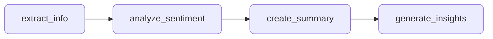
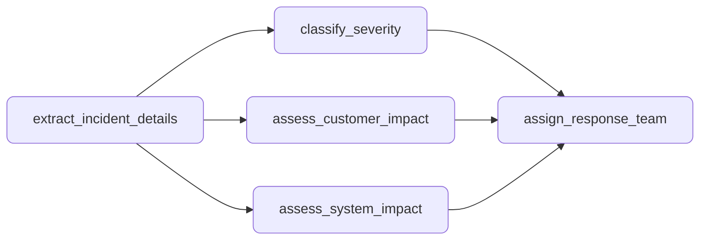
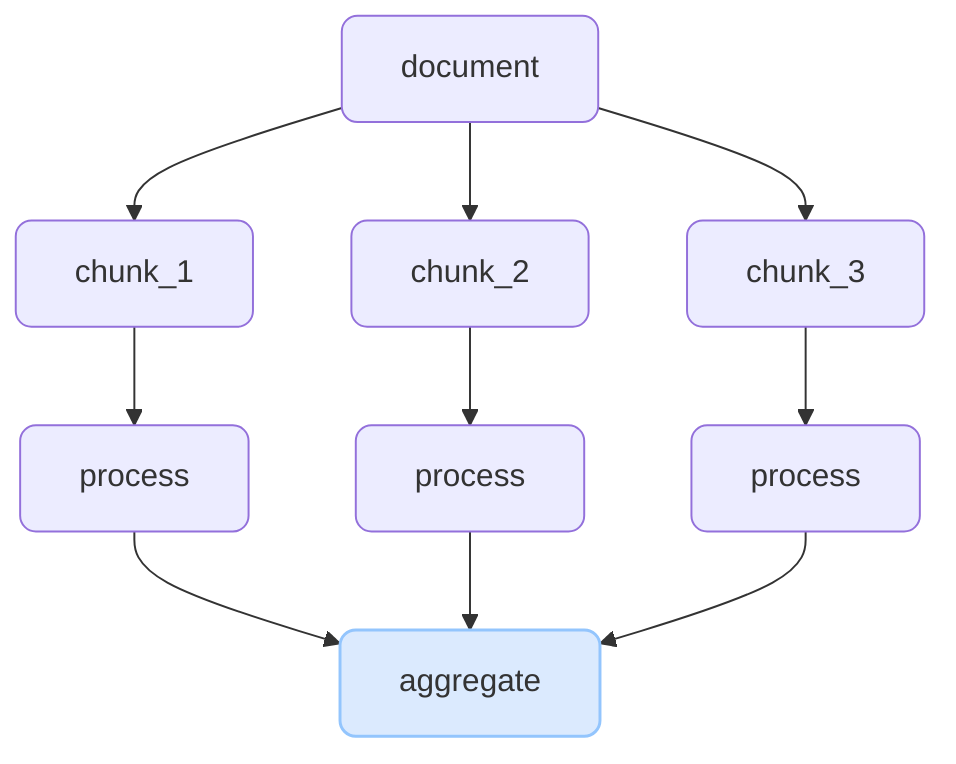
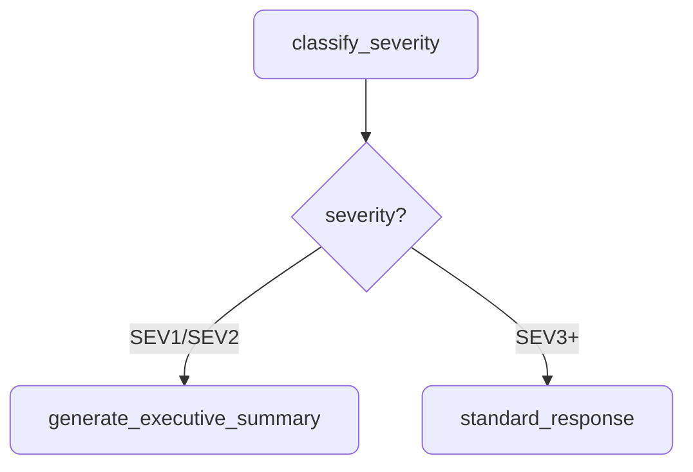
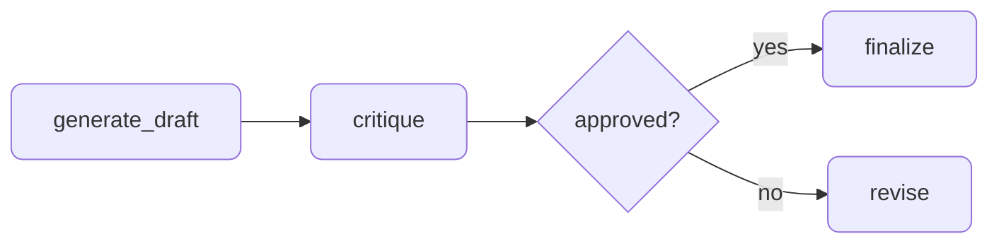
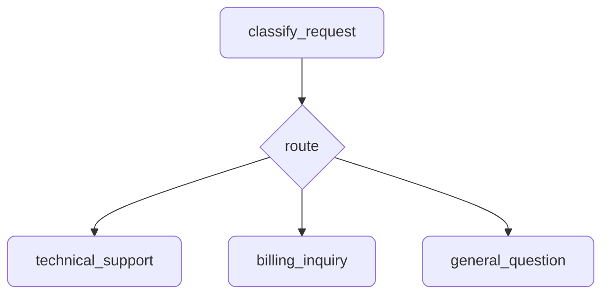
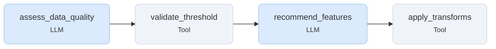

# Design Patterns

Agentic AI systems follow well-established design patterns. Understanding these patterns helps you choose the right architecture for your use case and implement it correctly with Agent Actions.

## Pattern Categories

| Category | Patterns | When to Use |
|----------|----------|-------------|
| **Deterministic** | Sequential, Parallel, Map-Reduce | Predictable workflows with known steps |
| **Dynamic** | Coordinator, Conditional Routing | Adaptive workflows that respond to data |
| **Iterative** | Review & Critique, Refinement Loop | Quality-critical outputs requiring validation |
| **Hybrid** | Tool + LLM | Mixing deterministic logic with AI reasoning |

---

## Sequential Pipeline

The simplest pattern: actions execute in a predefined linear order where each output becomes the next input.


```mermaid
flowchart LR
    A[extract_info] --> B[analyze_sentiment] --> C[create_summary] --> D[generate_insights]

    classDef default rx:8,ry:8
```

```yaml
name: content_analysis
description: "Multi-step content analysis pipeline"

defaults:
  model_vendor: openai
  model_name: gpt-4o-mini
  json_mode: true

actions:
  - name: extract_info
    prompt: |
      Analyze the following text and extract key information.

      Text: {{ source.raw_text }}

      Identify named entities, key phrases, and main topics.
    schema:
      entities:
        type: array
        items: string
      key_phrases:
        type: array
        items: string
      topics:
        type: array
        items: string

  - name: analyze_sentiment
    dependencies: [extract_info]
    prompt: |
      Based on the text and extracted information, analyze the sentiment.

      Original Text: {{ source.raw_text }}
      Entities: {{ extract_info.entities | join(', ') }}
      Topics: {{ extract_info.topics | join(', ') }}

      Provide sentiment analysis with a score from -1.0 to 1.0.
    schema:
      sentiment:
        type: string
        enum: [positive, negative, neutral]
      sentiment_score:
        type: number
        minimum: -1.0
        maximum: 1.0

  - name: create_summary
    dependencies: [analyze_sentiment]
    prompt: |
      Create a summary incorporating the extracted entities and sentiment.

      Original Text: {{ source.raw_text }}
      Key Entities: {{ extract_info.entities | join(', ') }}
      Sentiment: {{ analyze_sentiment.sentiment }}

      Provide a concise summary (100-150 words).
    schema:
      summary: string
      word_count: integer

  - name: generate_insights
    dependencies: [create_summary]
    prompt: |
      Generate actionable insights based on the analysis.

      Topics: {{ extract_info.topics | join(', ') }}
      Sentiment: {{ analyze_sentiment.sentiment }} ({{ analyze_sentiment.sentiment_score }})
      Summary: {{ create_summary.summary }}

      Provide 3-5 key insights and 2-3 recommendations.
    schema:
      insights:
        type: array
        items: string
        minItems: 3
        maxItems: 5
      recommendations:
        type: array
        items: string
        minItems: 2
        maxItems: 3
```

**Advantages:**
- Simple to build and debug
- Predictable execution order
- No orchestration overhead

**Limitations:**
- No parallelization—each step waits for the previous
- Cannot skip unnecessary steps

**Use cases:** ETL pipelines, document processing, data enrichment

---

## Parallel Processing

Multiple actions execute simultaneously when they share a dependency but don't depend on each other. Agent Actions detects these opportunities automatically.


```mermaid
flowchart LR
    A[extract_incident_details] --> B[classify_severity]
    A --> C[assess_customer_impact]
    A --> D[assess_system_impact]
    B --> E[assign_response_team]
    C --> E
    D --> E

    classDef default rx:8,ry:8
```

```yaml
name: incident_triage
description: "Automated incident triage with parallel assessment"

defaults:
  json_mode: true
  model_vendor: openai
  model_name: gpt-4o-mini
  context_scope:
    seed_data:
      team_roster: $file:team_roster.json
      service_catalog: $file:service_catalog.json

actions:
  - name: extract_incident_details
    intent: "Extract structured information from raw incident report"
    schema:
      title: string
      description: string
      affected_systems: array
      error_messages: array
      impact_signals: array
    prompt: $prompts.extract_incident_details
    context_scope:
      observe:
        - source.incident_report
        - source.monitoring_data
        - seed.service_catalog

  # These three run in parallel - all depend on extract_incident_details
  - name: classify_severity
    dependencies: [extract_incident_details]
    intent: "Classify incident severity"
    schema:
      severity: string
      confidence: number
      reasoning: string
    prompt: $prompts.classify_severity
    context_scope:
      observe:
        - extract_incident_details.*
        - source.incident_report

  - name: assess_customer_impact
    dependencies: [extract_incident_details]
    intent: "Assess impact on customers and revenue"
    schema:
      customer_impact_level: string
      affected_customer_count_estimate: string
      revenue_impact_estimate: string
      customer_facing: boolean
    prompt: $prompts.assess_customer_impact
    context_scope:
      observe:
        - extract_incident_details.*

  - name: assess_system_impact
    dependencies: [extract_incident_details]
    intent: "Assess technical system impact"
    schema:
      system_impact_level: string
      affected_services: array
      degradation_percentage: string
      cascading_failure_risk: string
    prompt: $prompts.assess_system_impact
    context_scope:
      observe:
        - extract_incident_details.*

  # Merge results from all parallel branches
  - name: assign_response_team
    dependencies: [classify_severity, assess_customer_impact, assess_system_impact]
    kind: tool
    impl: assign_team_based_on_impact
    intent: "Assign response team based on severity and impact"
    context_scope:
      observe:
        - classify_severity.*
        - assess_customer_impact.*
        - assess_system_impact.*
        - seed.team_roster
        - seed.service_catalog
```

**Advantages:**
- Reduces latency through concurrent execution
- Gathers diverse perspectives simultaneously

**Limitations:**
- Higher resource utilization
- Synthesis logic can be complex when results conflict

**Use cases:** Multi-aspect analysis, incident triage, feature extraction

---

## Map-Reduce

Split large inputs into chunks, process each in parallel, then aggregate results. This pattern scales to handle documents of any size.


```mermaid
flowchart TD
    DOC[document] --> C1[chunk_1]
    DOC --> C2[chunk_2]
    DOC --> C3[chunk_3]
    C1 --> P1[process]
    C2 --> P2[process]
    C3 --> P3[process]
    P1 --> AGG[aggregate]
    P2 --> AGG
    P3 --> AGG

    class AGG highlight
    classDef default rx:8,ry:8
    classDef highlight fill:#dbeafe,stroke:#93c5fd,stroke-width:1.5px,rx:8,ry:8
```

```yaml
name: document_analysis
description: "Large document analysis with chunking"

defaults:
  json_mode: true
  model_vendor: openai
  model_name: gpt-4o-mini

actions:
  - name: chunk_document
    granularity: splits
    prompt: $prompts.chunk_document

  - name: analyze_chunk
    dependencies: [chunk_document]
    prompt: |
      Analyze this document section:

      {{ chunk_document.content }}

      Extract key points, entities, and themes.
    schema:
      key_points: array
      entities: array
      themes: array
      sentiment: string

  - name: aggregate_analysis
    dependencies: [analyze_chunk]
    granularity: collect
    kind: tool
    impl: aggregate_chunk_analyses
    intent: "Combine chunk analyses into unified report"
```

The `root_target_id` field preserves document identity through all splits, enabling the aggregate action to collect all chunks belonging to the same source.

**Advantages:**
- Handles arbitrarily large inputs
- Parallel chunk processing reduces latency

**Limitations:**
- Chunk boundaries can split important context
- Aggregation must reconcile potentially conflicting analyses

**Use cases:** Large document analysis, batch processing, distributed computation

See [Granularity](../reference/execution/granularity) for splits and collect modes.

---

## Conditional Routing

Route data to different handlers based on content. Guards evaluate conditions and skip actions that don't apply—no API call, no cost.


```mermaid
flowchart TB
    A[classify_severity] --> B{severity?}
    B -->|SEV1/SEV2| C[generate_executive_summary]
    B -->|SEV3+| D[standard_response]

    classDef default rx:8,ry:8
```

```yaml
name: incident_response
description: "Route incidents based on severity"

defaults:
  json_mode: true
  model_vendor: openai
  model_name: gpt-4o-mini

actions:
  - name: classify_severity
    prompt: $prompts.classify_severity
    schema:
      final_severity: string
      confidence: number
      reasoning: string

  # Only runs for SEV1 or SEV2 incidents
  - name: generate_executive_summary
    dependencies: [classify_severity]
    intent: "Generate executive summary for high-severity incidents"
    guard:
      condition: 'final_severity == "SEV1" or final_severity == "SEV2"'
      on_false: "filter"
    schema:
      executive_summary: string
      business_impact_summary: string
      key_stakeholders: array
    prompt: $prompts.executive_summary
    context_scope:
      observe:
        - classify_severity.*

  # Only runs for lower severity incidents
  - name: standard_response
    dependencies: [classify_severity]
    guard:
      condition: 'final_severity not in ["SEV1", "SEV2"]'
      on_false: "filter"
    prompt: $prompts.standard_response
    schema:
      response_plan: string
      estimated_resolution_time: string
```

**Advantages:**
- Optimizes cost by skipping irrelevant actions
- Adapts processing to data characteristics

**Limitations:**
- Guard conditions must be deterministic
- Complex routing logic can be hard to debug

**Use cases:** Priority-based processing, content-type routing, A/B workflows

See [Guards](../reference/execution/guards) for complete documentation.

---

## Review and Critique

A generator creates output; a critic evaluates it against criteria. This pattern improves quality for high-stakes outputs.


```mermaid
flowchart LR
    A[generate_draft] --> B[critique]
    B --> C{approved?}
    C -->|yes| D[finalize]
    C -->|no| E[revise]

    classDef default rx:8,ry:8
```

```yaml
name: content_review
description: "Generate and review content with quality checks"

defaults:
  json_mode: true
  model_vendor: openai
  model_name: gpt-4o-mini

actions:
  - name: generate_draft
    prompt: |
      Generate a professional response for:
      {{ source.request }}
    schema:
      content: string
      tone: string
      key_points: array

  - name: critique
    dependencies: [generate_draft]
    prompt: |
      Review this draft against these criteria:
      - Accuracy: Are all facts correct?
      - Completeness: Are all requirements addressed?
      - Clarity: Is the language clear and professional?
      - Tone: Is it appropriate for the audience?

      Draft: {{ generate_draft.content }}

      Provide detailed feedback and an approval decision.
    schema:
      approved: boolean
      feedback: string
      issues: array
      quality_score: number

  - name: finalize
    dependencies: [critique]
    guard:
      condition: 'approved == true'
      on_false: "filter"
    prompt: |
      Finalize this approved content:
      {{ generate_draft.content }}

      Apply any minor polish while preserving the substance.
    schema:
      final_content: string

  - name: revise
    dependencies: [critique]
    guard:
      condition: 'approved == false'
      on_false: "filter"
    prompt: |
      Revise this content based on the feedback:

      Original: {{ generate_draft.content }}
      Feedback: {{ critique.feedback }}
      Issues: {{ critique.issues | join(', ') }}
    schema:
      revised_content: string
      changes_made: array
```

**Advantages:**
- Catches errors before they reach users
- Provides audit trail of quality checks

**Limitations:**
- Increases latency and cost
- Critic may have blind spots similar to generator

**Use cases:** Content generation, code review, compliance checking

---

## Iterative Refinement

Repeatedly improve output until quality thresholds are met. Use reprompting for automatic retry on validation failures.

```yaml
actions:
  - name: generate_analysis
    prompt: $prompts.generate
    schema:
      analysis: string
      confidence: number
      supporting_evidence: array
    reprompt:
      enabled: true
      max_attempts: 3
      strategy: validation_feedback
```

For multi-stage refinement with parallel hypothesis generation, use versioned actions:

```yaml
name: root_cause_analysis
description: "Root cause analysis with parallel hypothesis generation"

defaults:
  json_mode: true
  model_vendor: openai
  model_name: gpt-4o-mini
  context_scope:
    seed_data:
      system_topology: $file:system_topology.json
      historical_incidents: $file:historical_incidents.json
      causal_patterns: $file:causal_patterns.json

actions:
  - name: extract_anomaly_signals
    intent: "Extract anomaly signals from monitoring data"
    schema:
      anomaly_type: string
      affected_components: array
      observed_symptoms: array
      metric_deviations: array
    prompt: $prompts.extract_anomaly_signals
    context_scope:
      observe:
        - source.monitoring_data
        - source.alerts
        - seed.system_topology

  # Parallel hypothesis generation with different strategies
  - name: generate_hypotheses
    dependencies: [extract_anomaly_signals]
    intent: "Generate causal hypotheses using different reasoning strategies"
    versions:
      param: reasoning_strategy
      range: ["data_driven", "topology_driven", "pattern_matching"]
      mode: parallel
    schema:
      hypotheses: array
      reasoning_path: string
      supporting_evidence: array
    prompt: $prompts.generate_hypotheses
    context_scope:
      observe:
        - extract_anomaly_signals.*
        - seed.system_topology
        - seed.historical_incidents

  - name: rank_hypotheses
    dependencies: [generate_hypotheses]
    kind: tool
    impl: rank_causal_hypotheses
    intent: "Aggregate and rank hypotheses by evidence strength"
    version_consumption:
      source: generate_hypotheses
      pattern: merge
    context_scope:
      observe:
        - generate_hypotheses_data_driven.*
        - generate_hypotheses_topology_driven.*
        - generate_hypotheses_pattern_matching.*
        - seed.causal_patterns

  - name: validate_hypotheses
    dependencies: [rank_hypotheses]
    intent: "Validate top hypotheses against available evidence"
    schema:
      validated_hypotheses: array
      evidence_analysis: string
      confidence_scores: object
      contradicting_evidence: array
    prompt: $prompts.validate_hypotheses
    context_scope:
      observe:
        - rank_hypotheses.top_hypotheses
        - extract_anomaly_signals.*
        - seed.historical_incidents
```

**Advantages:**
- Achieves quality difficult in single attempts
- Automatic recovery from validation failures

**Limitations:**
- Each cycle increases latency and cost
- Requires well-defined exit conditions

**Use cases:** Complex generation, root cause analysis, quality-critical outputs

See [Reprompting](../reference/validation/reprompting) for automatic refinement.

---

## Coordinator Pattern

A central action analyzes requests and dispatches to specialized handlers. Use guards for dynamic routing based on classification results.


```mermaid
flowchart TB
    A[classify_request] --> B{route}
    B --> C[technical_support]
    B --> D[billing_inquiry]
    B --> E[general_question]

    classDef default rx:8,ry:8
```

```yaml
name: customer_service
description: "Route customer requests to specialized handlers"

defaults:
  json_mode: true
  model_vendor: openai
  model_name: gpt-4o-mini
  context_scope:
    seed_data:
      knowledge_base: $file:knowledge_base.json
      product_catalog: $file:product_catalog.json

actions:
  - name: classify_request
    intent: "Classify incoming customer request"
    prompt: |
      Analyze this customer request and determine the best handler:

      Request: {{ source.customer_message }}

      Categories:
      - technical_support: Product issues, bugs, how-to questions
      - billing_inquiry: Payment, subscription, refunds
      - general_question: Other inquiries
    schema:
      category: string
      confidence: number
      extracted_intent: string
      key_entities: array

  - name: technical_support
    dependencies: [classify_request]
    guard:
      condition: 'category == "technical_support"'
      on_false: "filter"
    intent: "Handle technical support requests"
    prompt: $prompts.technical_support
    context_scope:
      observe:
        - classify_request.*
        - source.customer_message
        - seed.knowledge_base
        - seed.product_catalog
    schema:
      response: string
      troubleshooting_steps: array
      relevant_docs: array

  - name: billing_inquiry
    dependencies: [classify_request]
    guard:
      condition: 'category == "billing_inquiry"'
      on_false: "filter"
    intent: "Handle billing and subscription questions"
    prompt: $prompts.billing_inquiry
    context_scope:
      observe:
        - classify_request.*
        - source.customer_message
    schema:
      response: string
      account_actions: array

  - name: general_question
    dependencies: [classify_request]
    guard:
      condition: 'category == "general_question"'
      on_false: "filter"
    intent: "Handle general inquiries"
    prompt: $prompts.general_question
    context_scope:
      observe:
        - classify_request.*
        - source.customer_message
        - seed.knowledge_base
    schema:
      response: string
```

**Advantages:**
- Flexible routing based on content
- Specialized handlers for each domain

**Limitations:**
- Coordinator adds latency
- Routing errors cascade to wrong handlers

**Use cases:** Customer service, request triage, multi-domain assistants

See [Dispatch Tool](../reference/prompts/dispatch) for advanced routing.

---

## Tool + LLM Hybrid

Mix deterministic tools with LLM reasoning. Tools handle API calls, calculations, and data transformations; LLMs handle understanding and generation.


```mermaid
flowchart LR
    A["assess_data_quality<br/><small>LLM</small>"] --> B["validate_threshold<br/><small>Tool</small>"] --> C["recommend_features<br/><small>LLM</small>"] --> D["apply_transforms<br/><small>Tool</small>"]

    class B,D tool
    class A,C llm
    classDef default rx:8,ry:8
    classDef tool fill:#f1f5f9,stroke:#cbd5e1,stroke-width:1px,rx:8,ry:8
    classDef llm fill:#dbeafe,stroke:#93c5fd,stroke-width:1px,rx:8,ry:8
```

```yaml
name: ml_pipeline
description: "ML pipeline with quality gates and feature engineering"

defaults:
  json_mode: true
  model_vendor: openai
  model_name: gpt-4o-mini
  context_scope:
    seed_data:
      feature_definitions: $file:feature_definitions.json
      deployment_config: $file:deployment_config.json

actions:
  # LLM: Assess data quality
  - name: assess_data_quality
    intent: "Assess data quality and identify issues"
    schema:
      quality_score: number
      completeness: number
      detected_issues: array
      recommendations: array
    prompt: $prompts.assess_data_quality
    context_scope:
      observe:
        - source.training_data
        - seed.feature_definitions

  # Tool: Validate quality threshold (deterministic check)
  - name: data_quality_check
    dependencies: [assess_data_quality]
    kind: tool
    impl: validate_data_quality_threshold
    intent: "Validate data meets quality threshold"
    guard:
      condition: 'quality_score >= 0.7'
      on_false: "filter"
    context_scope:
      observe:
        - assess_data_quality.*

  # LLM: Recommend feature engineering
  - name: recommend_features
    dependencies: [data_quality_check]
    intent: "Recommend feature engineering transformations"
    schema:
      recommended_features: array
      transformation_pipeline: array
      encoding_strategies: object
    prompt: $prompts.recommend_features
    context_scope:
      observe:
        - assess_data_quality.data_profile
        - source.training_data
        - seed.feature_definitions

  # Tool: Apply transformations (deterministic execution)
  - name: execute_feature_engineering
    dependencies: [recommend_features]
    kind: tool
    impl: apply_feature_transformations
    intent: "Apply recommended feature transformations"
    context_scope:
      observe:
        - recommend_features.transformation_pipeline
        - recommend_features.encoding_strategies
        - source.training_data
      passthrough:
        - assess_data_quality.*
        - recommend_features.*
```

**Advantages:**
- Guaranteed correctness for deterministic operations
- LLM focuses on what it does best

**Limitations:**
- Tools must be stateless
- Error handling spans two paradigms

**Use cases:** ML pipelines, API integration, data validation, report generation

See [Custom Tools](./custom-tools) for building tools.

---

## Choosing a Pattern

| If you need... | Use this pattern |
|----------------|------------------|
| Simple, predictable workflow | Sequential |
| Faster processing of independent tasks | Parallel |
| Handle large documents | Map-Reduce |
| Route based on content | Conditional Routing |
| High-quality, validated outputs | Review and Critique |
| Automatic error recovery | Iterative Refinement |
| Flexible request handling | Coordinator |
| Mix AI with deterministic logic | Tool + LLM Hybrid |

Most real workflows combine multiple patterns. An incident triage system might use Parallel for multi-aspect assessment, Conditional Routing for severity-based escalation, and Tool + LLM Hybrid for team assignment.

---

## Next Steps

Explore the features that make these patterns possible:

- **[Guards](../reference/execution/guards)** — Conditional execution
- **[Granularity](../reference/execution/granularity)** — Record, file, splits, and collect modes
- **[Context Scope](../reference/context/context-scope)** — Data flow control
- **[Workflow Dependencies](../reference/execution/workflow-dependencies)** — Chain workflows together
- **[Reprompting](../reference/validation/reprompting)** — Automatic refinement on failures
