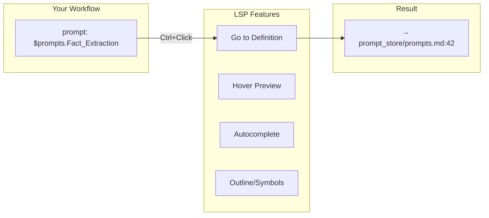
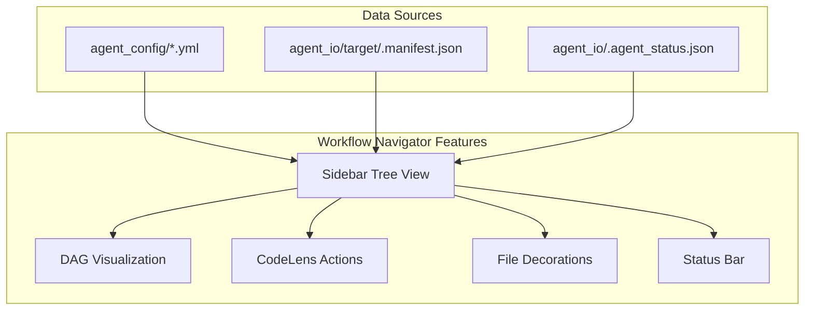
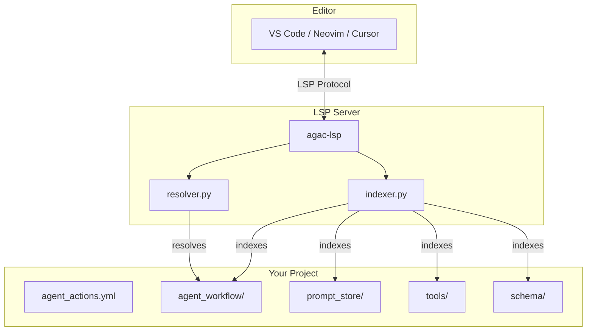

# Editor Integration

What happens when you Ctrl+Click on `$prompts.Extract_Facts` in your workflow YAML? Without editor integration, nothing. You'd manually search for the prompt file, scroll to find the right `{prompt}` block, and lose your train of thought. With the Agent Actions LSP, you jump directly to the definition—just like navigating code.

The Language Server Protocol (LSP) brings IDE-quality navigation to your agentic workflows. It's bundled with agent-actions, so you get it automatically with `uv pip install agent-actions`.

## What You Get



| Feature | What It Does | Example |
|---------|--------------|---------|
| **Go to Definition** | Ctrl+Click to jump to source | `$prompts.Extract` → prompt file, line 42 |
| **Hover** | Preview content without leaving current file | Hover on `impl: flatten_questions` → see function signature |
| **Autocomplete** | Suggestions as you type | Type `$prompts.` → list of available prompts |
| **Outline** | Document symbols in sidebar | See all actions in a workflow, all prompts in a file |
| **Syntax Highlighting** | Colored `{prompt}` tags and Jinja2 | Visual distinction for template syntax |

## Navigation Reference

The LSP understands agent-actions references and resolves them to file locations:

| Pattern | Example | Jumps To |
|---------|---------|----------|
| **Prompt** | `prompt: $quiz_gen.Extract_Raw_QA` | `prompt_store/quiz_gen.md` → `{prompt Extract_Raw_QA}` |
| **Tool** | `impl: flatten_questions` | `tools/**/flatten_questions.py` → `@udf_tool def` |
| **Schema** | `schema: question_schema` | `schema/question_schema.yml` (or `.yaml`/`.json`) |
| **Action** | `dependencies: extract_qa` or `dependencies: [a, b]` | Same file → `- name: extract_qa` |
| **Workflow** | `workflow: other_workflow` | `agent_workflow/other_workflow/agent_config/*.yml` |
| **Seed File** | `$file:exam_syllabus.json` | `seed_data/exam_syllabus.json` |

## Installation

The LSP comes bundled with agent-actions. Install the package and you get `agac-lsp`:

```bash
uv pip install agent-actions

# Verify it's available
agac-lsp --help
```

## VS Code Setup

### Option A: Install from VSIX (Recommended)

Build and install the VS Code extension:

```bash
# From the agent-actions repository
cd editors/vscode

# Install dependencies and build
npm install
npm run compile

# Package the extension
npx vsce package --allow-missing-repository

# Install to VS Code
code --install-extension agent-actions-lsp-0.3.0.vsix
```

After installation, reload VS Code (`Cmd+Shift+P` → "Developer: Reload Window").

### Option B: Development Mode

For extension development or testing:

1. Open the extension folder:
   ```bash
   code editors/vscode
   ```

2. Install dependencies:
   ```bash
   npm install && npm run compile
   ```

3. Press **F5** to launch Extension Development Host

4. Open your agent-actions project and test Ctrl+Click

### Requirements

The extension needs `agac-lsp` in your PATH. If you installed agent-actions in a virtual environment:

```bash
# Option 1: Activate the environment before opening VS Code
source .venv/bin/activate
code .

# Option 2: Add the venv bin to PATH in your shell config
export PATH="$HOME/projects/my-project/.venv/bin:$PATH"
```

## VS Code Workflow Navigator

Beyond LSP features, the VS Code extension includes a **Workflow Navigator** that provides real-time visibility into your workflow execution.



### Sidebar Tree View

The Explorer sidebar shows all workflows and actions in execution order:

| Icon | Status | Meaning |
|------|--------|---------|
| ✓ (green) | Completed | Action finished successfully |
| ↻ (yellow, spinning) | Running | Action currently executing |
| ✗ (red) | Failed | Action encountered an error |
| ○ (gray) | Pending | Action waiting to run |
| ⊘ (blue) | Skipped | Action was skipped |

**Features:**
- Click any action to jump to its definition in the YAML config
- Expand actions to see output folders
- Multi-workflow support for projects with multiple workflows
- Status summary shows completed/total count

### DAG Visualization

View your workflow as an interactive directed acyclic graph:

```
Keyboard Shortcut: Cmd+Shift+D (Mac) / Ctrl+Shift+D (Windows/Linux)
Command Palette: "Agent Actions: Show Workflow DAG"
```

**Features:**
- Action dependencies shown as directed edges
- Status-colored nodes (green=completed, yellow=running, red=failed, gray=pending)
- Click any node to navigate to its config definition
- Toggle between vertical and horizontal layouts
- Auto-updates as workflow runs

### CodeLens Actions

In workflow YAML files (`agent_config/*.yml`), each action definition shows inline links:

```yaml
actions:
  - name: extract_facts    # 🔎 Preview Output | ✅ completed
    prompt: $prompts.Extract_Facts
    dependencies: [load_data]
```

| Link | Action |
|------|--------|
| 🔎 **Preview Output** | Preview action output from storage backend |
| Status indicator | Shows current status, click to open DAG |

### Query Results Panel

The Query Results Panel provides an interactive view of your action's output data, displaying results from the storage backend in a rich table or JSON format.

**Features:**
- **Table View**: HTML table with sticky column headers, row counts, and column counts
- **JSON View**: Formatted JSON display with metadata
- **View Toggle**: Switch between table and JSON modes via toolbar buttons
- **Pagination**: Navigate through large datasets with next/previous page controls (50 rows per page)
- **Theme Integration**: Automatically adapts to VS Code light/dark themes

**How to Access:**
1. **From Tree View**: Right-click any action in the Workflow Navigator → "Preview Data"
2. **From CodeLens**: Click 🔎 **Preview Output** above action definitions in YAML files
3. **From Command Palette**: `Cmd+Shift+P` → "Agent Actions: Preview Data"

The panel opens in a new editor tab beside your current file, allowing side-by-side comparison with your workflow configuration.

**Pagination Controls:**
- Click **Next Page** / **Previous Page** buttons in the panel header
- Page size: 50 rows
- Shows current offset and total row count

**Requirements:**
For data preview to work, the extension needs to locate the `agent_actions` Python module. In most cases this happens automatically, but for monorepos or complex setups, you may need to set `agentActions.modulePath`:

```json
{
  "agentActions.modulePath": "/path/to/agent-actions"
}
```

**Caching:**
Preview data is cached for 5 seconds by default to improve performance. Adjust with:

```json
{
  "agentActions.previewCacheTTL": 5000  // milliseconds, 0 to disable
}
```

### File Decorations

Action folders in `agent_io/target/` display badges:

- **Execution order number** (1, 2, 3...) as badge
- **Status-colored text** matching the action's current state

This helps you quickly identify which output belongs to which action.

### Status Bar

The bottom status bar shows workflow progress at a glance:

```
$(graph) MyWorkflow: 5/10 | [6] process_results
```

- **Completed/total** count
- **Currently running** action name (if any)
- Click to focus the Workflow Navigator panel

### Keyboard Shortcuts

| Command | Mac | Windows/Linux | Description |
|---------|-----|---------------|-------------|
| Show Workflow DAG | `Cmd+Shift+D` | `Ctrl+Shift+D` | Open visual DAG panel |
| Go to Action | `Cmd+Shift+A` | `Ctrl+Shift+A` | Quick-pick to jump to any action |
| Refresh Workflow | `Cmd+Shift+R` | `Ctrl+Shift+R` | Manually refresh workflow state |

### Command Palette

All commands are also available via the Command Palette (`Cmd+Shift+P` / `Ctrl+Shift+P`):

| Command | Description |
|---------|-------------|
| Agent Actions: Show Workflow DAG | Open visual DAG panel |
| Agent Actions: Go to Action... | Quick-pick to jump to any action |
| Agent Actions: Refresh Workflow | Manually refresh workflow state |
| Agent Actions: Preview Data | Open data preview for selected action |
| Agent Actions: Open Action Config | Navigate to action's YAML definition |
| Agent Actions: Show Workflow Navigator | Focus the sidebar tree view |
| Agent Actions: Open Documentation | Open the Agent Actions docs site |
| Agent Actions: Open Settings | Jump to Agent Actions settings |

### Settings

Configure the Workflow Navigator in VS Code settings:

```json
{
  "agentActions.pythonPath": "",
  "agentActions.modulePath": "",
  "agentActions.showStatusBar": true,
  "agentActions.autoRevealSidebar": false,
  "agentActions.showCodeLens": true,
  "agentActions.showFileDecorations": true,
  "agentActions.dagLayout": "vertical",
  "agentActions.refreshInterval": 0,
  "agentActions.logLevel": "info",
  "agentActions.previewCacheTTL": 5000,
  "agentActions.previewPageSize": 50
}
```

| Setting | Default | Description |
|---------|---------|-------------|
| `pythonPath` | `""` | Python interpreter path. Empty = auto-detect from Python extension. |
| `modulePath` | `""` | Path to agent-actions module directory. Required for data preview in monorepos. |
| `showStatusBar` | `true` | Show workflow progress in status bar. |
| `autoRevealSidebar` | `false` | Automatically reveal Agent Actions sidebar when opening a project with workflows. |
| `showCodeLens` | `true` | Show action links (Preview Output, Status) in YAML files. |
| `showFileDecorations` | `true` | Show execution order badges on action folders. |
| `dagLayout` | `"vertical"` | DAG direction: `"vertical"` (top-down) or `"horizontal"` (left-right). |
| `refreshInterval` | `0` | Polling interval in ms. `0` = rely on file watchers only. Set to `2000` for 2-second polling. |
| `logLevel` | `"info"` | Log verbosity in the Output panel: `debug`, `info`, `warn`, `error`. |
| `previewCacheTTL` | `5000` | Cache duration in ms for data preview. `0` = disable caching. |
| `previewPageSize` | `50` | Number of rows per page in data preview. |

### Data Sources

The Workflow Navigator reads from three sources:

| File | Purpose | When Updated |
|------|---------|--------------|
| `agent_config/*.yml` | Workflow structure, action definitions, dependencies | When you edit the workflow |
| `agent_io/target/.manifest.json` | Execution plan, action levels, output directories | When workflow starts |
| `agent_io/.agent_status.json` | Live runtime status for each action | During workflow execution |

File watchers automatically refresh the UI when these files change. For more responsive updates during execution, enable polling with `agentActions.refreshInterval`.

## Neovim Setup

Using nvim-lspconfig:

```lua
local lspconfig = require('lspconfig')
local configs = require('lspconfig.configs')

-- Register the agent-actions language server
configs.agent_actions = {
  default_config = {
    cmd = { 'agac-lsp', '--stdio' },
    filetypes = { 'yaml', 'markdown' },
    root_dir = lspconfig.util.root_pattern('agent_actions.yml'),
    settings = {},
  },
}

-- Configure with your preferences
lspconfig.agent_actions.setup({
  on_attach = function(client, bufnr)
    -- Go to definition
    vim.keymap.set('n', 'gd', vim.lsp.buf.definition, { buffer = bufnr })
    -- Hover
    vim.keymap.set('n', 'K', vim.lsp.buf.hover, { buffer = bufnr })
    -- Autocomplete (if using nvim-cmp, it picks this up automatically)
  end,
})
```

## Cursor Setup

Cursor uses VS Code extensions. Follow the VS Code VSIX installation, then:

1. Open Cursor
2. Go to Extensions → Install from VSIX
3. Select `agent-actions-lsp-0.3.0.vsix`
4. Reload the window

## Syntax Highlighting

The extension provides syntax highlighting for prompt files (Markdown with agent-actions syntax):

| Element | Highlighting | Example |
|---------|--------------|---------|
| `{prompt Name}` | Keyword (purple) | Block delimiter |
| `{end_prompt}` | Keyword (purple) | Block delimiter |
| `{{ variable }}` | Variable (orange) | Jinja2 expression |
| `` | Control (blue) | Jinja2 control flow |
| `{# comment #}` | Comment (dimmed) | Jinja2 comment |
| `CRITICAL` / `WARNING` | Warning markers | Red/yellow emphasis |

### Outline Navigation

Open the Outline panel (`Cmd+Shift+O` in VS Code) to see document symbols:

**In YAML workflow files:**
- All action names listed as symbols
- Quick jump to any action

**In Markdown prompt files:**
- All `{prompt}` blocks listed
- Quick navigation between prompts

## How It Works



### Project Detection

The LSP finds your project by walking up from the opened file until it finds `agent_actions.yml`. It then indexes:

| Directory | What's Indexed |
|-----------|----------------|
| `agent_workflow/*/agent_config/*.yml` | Actions (`- name: X`) |
| `prompt_store/*.md` | Prompts (`{prompt X}`) |
| `tools/**/*.py` | Tools (`@udf_tool def`) |
| `schema/*.{yml,yaml,json}` | Schema files |
| `seed_data/` | Seed files (`$file:X`) |

### Re-indexing

The LSP re-indexes automatically when you save files. If you add new files while the LSP is running:

- Save any file to trigger re-index
- Or reload the editor window

## Troubleshooting

### "agac-lsp: command not found"

The LSP command isn't in your PATH:

```bash
# Check if agent-actions is installed
uv pip show agent-actions

# Find where agac-lsp is
uv pip show agent-actions | grep Location
# Then check: <location>/agent_actions/tooling/lsp/

# Reinstall if needed
uv pip install --force-reinstall agent-actions
```

### Extension Not Activating

1. Check Output panel → "Agent Actions LSP" for errors
2. Ensure your workspace contains `agent_actions.yml`
3. Verify `agac-lsp --help` works in terminal

### References Not Resolving

If Ctrl+Click doesn't work on a reference:

1. **File not indexed yet** - Save any file to trigger re-index
2. **Reference typo** - The referenced item doesn't exist
3. **Outside project** - The file isn't under the `agent_actions.yml` directory

### Hover Shows Nothing

The LSP may not have finished indexing. Wait a moment after opening a project, or reload the window.

### Workflow Navigator Not Showing

Ensure your project has:
- `agent_config/` directory with `.yml` files
- Actions defined with `- name:` fields

### Status Not Updating

If workflow status isn't refreshing:

1. Check that `agent_io/target/.manifest.json` exists
2. Try `Cmd+Shift+R` to manually refresh
3. Enable polling: `"agentActions.refreshInterval": 2000`

### DAG Not Rendering

If the DAG panel shows nothing:

1. Ensure you have at least one workflow with actions
2. Check that action `dependencies` are correctly defined
3. Reload the window and try again

### Data Preview Not Working

If clicking "Preview Data" shows errors or doesn't display data:

**"Module import failed" or "Failed to load data from storage backend":**

The extension can't find the `agent_actions` Python module. Set the module path explicitly:

```json
{
  "agentActions.modulePath": "/path/to/agent-actions"
}
```

To find the correct path:
```bash
uv pip show agent-actions | grep Location
# Use the path shown (e.g., /Users/you/.venv/lib/python3.11/site-packages)
```

**No data appears in table:**

1. Ensure the action has completed and written output data
2. Check the storage backend is configured correctly in your workflow
3. Verify the action's output directory exists in `agent_io/target/`
4. Look for errors in the Output panel → "Agent Actions"

**Reinstalling the Extension:**

If preview features aren't working after updates, completely reinstall:

```bash
cd editors/vscode

# Remove any globally installed version
rm -rf ~/.vscode/extensions/agent-actions.agent-actions-lsp-*

# Clean and rebuild
rm -rf out/
npm run compile
npx @vscode/vsce package --allow-missing-repository

# Install fresh
code --install-extension agent-actions-lsp-0.3.0.vsix --force
```

Then reload VS Code: `Cmd+Shift+P` → "Developer: Reload Window"

## See Also

- [Skills Command](../reference/cli/skills) - Install AI coding assistant skills
- [Troubleshooting](./troubleshooting) - Common issues and solutions
