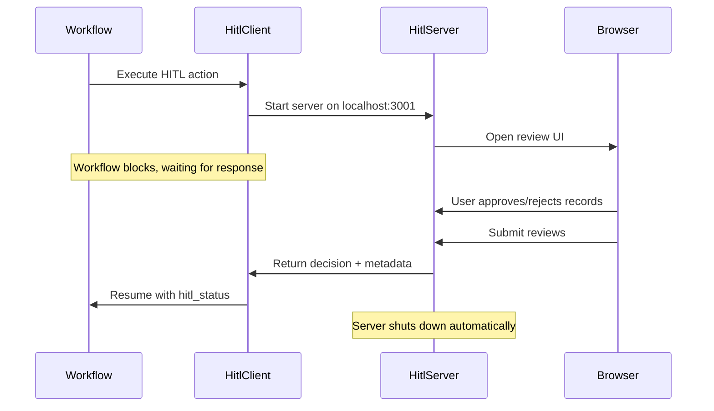

# Human-in-the-Loop (HITL) Review

Human-in-the-Loop (HITL) actions let you pause workflow execution for manual review and approval. This is essential when you need human judgment before proceeding—like reviewing AI-generated content, approving data transformations, or quality-checking critical outputs.

## Quick Start

Add a HITL action to your workflow:

```yaml
actions:
  - name: review_data
    kind: hitl  # Required: marks this as a human review action
    dependencies: [extract_data]
    intent: "Human reviews extracted data before processing"
    hitl:
      port: 3001  # Optional: port for review UI (default: 3001)
      instructions: "Review the extracted data for accuracy"
      timeout: 300  # Optional: seconds before timeout (default: 300)
      require_comment_on_reject: true  # Optional: require comment when rejecting
    context_scope:
      observe:
        - extract_data.*  # Data to review
```

When the agentic workflow reaches this action:
1. A browser UI opens at `http://localhost:3001`
2. Workflow pauses and waits for your decision
3. You review each record and approve/reject
4. After submitting, the workflow continues automatically

## How It Works

### Architecture

HITL actions use a **client-server architecture**:

- **HitlClient**: Validates config, starts server, blocks workflow execution
- **HitlServer**: Flask server serving the review UI at localhost
- **Browser UI**: Interactive approval interface with per-record navigation



### Review UI Features

The browser UI provides:

- **Per-record navigation**: Review each record individually with auto-advance
- **Keyboard shortcuts**:
  - `A` - Approve current record
  - `R` - Reject current record
  - `←/→` - Navigate between records
- **View toggles**:
  - **Fields view**: Structured display of record fields
  - **JSON view**: Raw JSON for debugging
- **Progress tracking**: Visual progress bar and stats (pending/approved/rejected)
- **State persistence**: Refresh the page without losing your reviews
- **Auto-shutdown**: Server closes automatically after submission

## Configuration

### HITL Config Block

```yaml
hitl:
  port: 3001                        # Port for review server (1024-65535)
  instructions: "Review carefully"  # Instructions shown in UI (required)
  timeout: 300                      # Seconds before auto-timeout (30-3600)
  require_comment_on_reject: true   # Require comment when rejecting
```

**Configuration options:**

| Field | Type | Default | Description |
|-------|------|---------|-------------|
| `port` | int | 3001 | Server port (1024-65535). If busy, tries up to 5 consecutive ports. |
| `instructions` | str | *(required)* | Instructions displayed in review UI. Be clear and specific. |
| `timeout` | int | 300 | Seconds before timeout. Server shuts down and workflow continues with `hitl_status: timeout`. |
| `require_comment_on_reject` | bool | true | If true, rejecting a record requires a comment explaining why. |

### Workflow-Level Default Timeout

Set a default HITL timeout for all HITL actions in the workflow using `defaults.hitl_timeout`. Individual actions can still override this value.

```yaml
defaults:
  hitl_timeout: 600  # 10 minutes for all HITL actions

actions:
  - name: review_data
    kind: hitl
    dependencies: [extract_data]
    hitl:
      instructions: "Review extracted data"
      # Uses workflow default: 600s

  - name: review_summary
    kind: hitl
    dependencies: [generate_summary]
    hitl:
      instructions: "Review generated summary"
      timeout: 120  # Overrides workflow default
```

**Resolution order:** action `hitl.timeout` > `defaults.hitl_timeout` > 300s hardcoded default.

:::note Minimum timeout
The minimum allowed value is 5 seconds (useful for testing). For real reviews, use at least 60 seconds — reviewers need time to read instructions and inspect records.
:::

### Granularity

HITL actions always use **FILE granularity** — all records are presented in a single review session. Within that session, the reviewer can navigate between records, approve or reject each individually, and submit once. (File granularity here means one UI session for the entire batch, not one session per record.)

:::warning Record granularity not supported
Setting `granularity: record` on a HITL action raises a `ConfigurationError`. Record granularity would launch a separate approval UI per record, which is broken UX. If you need per-record filtering before HITL, use a guard to pre-filter records.
:::

```yaml
- name: review_data
  kind: hitl
  dependencies: [extract_data]
  hitl:
    instructions: "Review the full dataset and approve or reject"
  context_scope:
    observe:
      - extract_data.*
```

**Output**: Each record gets its own `hitl_status`, `user_comment`, and `timestamp` under the HITL action's namespace, based on per-record review decisions in the UI.

```json
[
  {
    "content": {
      "extract_data": { "id": 1, "name": "Alice" },
      "review_data": {
        "hitl_status": "approved",
        "user_comment": "",
        "timestamp": "2026-02-12T10:00:00Z"
      }
    }
  },
  {
    "content": {
      "extract_data": { "id": 2, "name": "Bob" },
      "review_data": {
        "hitl_status": "rejected",
        "user_comment": "Invalid email",
        "timestamp": "2026-02-12T10:00:00Z"
      }
    }
  }
]
```

Downstream actions access HITL fields via the namespace: `review_data.hitl_status`, `review_data.user_comment`.

## Output Schema

HITL actions return decisions in a standardized format:

### Response Fields

| Field | Type | Description |
|-------|------|-------------|
| `hitl_status` | str | `"approved"`, `"rejected"`, or `"timeout"` |
| `user_comment` | str | Optional comment from reviewer |
| `timestamp` | str | ISO-8601 timestamp (UTC) when review was submitted |
| `record_reviews` | list | (FILE mode only) Per-record decisions |

### Accessing HITL Decisions Downstream

HITL decision fields (`hitl_status`, `user_comment`, `timestamp`) are stored under the HITL action's namespace in the record content. Downstream actions access them using the action name as a namespace prefix (e.g., `review_data.hitl_status`).

#### Guards

Guards evaluate against namespaced fields — use the HITL action name as the namespace prefix:

```yaml
- name: process_approved_data
  dependencies: [review_data]
  guard:
    condition: "review_data.hitl_status == 'approved'"
    on_false: skip  # Skip processing if HITL rejected
  prompt: |
    Process the approved data:
    {{ review_data.* }}

    Reviewer comment: {{ review_data.user_comment }}
```

**Common guard patterns:**

```yaml
# Only process approved items (filter out rejected/timeout)
guard:
  condition: "review_action.hitl_status == 'approved'"
  on_false: filter

# Skip downstream if rejected (passthrough original content)
guard:
  condition: "review_action.hitl_status == 'approved'"
  on_false: skip

# Handle timeout
guard:
  condition: "review_action.hitl_status != 'timeout'"
  on_false: skip
```

## Usage Patterns

### Pattern 1: Quality Gate

Approve AI-generated content before using it:

```yaml
actions:
  - name: generate_summary
    intent: "LLM generates article summary"
    prompt: "Summarize this article..."

  - name: review_summary
    kind: hitl
    dependencies: [generate_summary]
    intent: "Human reviews AI summary"
    hitl:
      instructions: "Review the generated summary for accuracy and tone"
    context_scope:
      observe:
        - generate_summary.summary

  - name: publish_summary
    dependencies: [review_summary]
    intent: "Publish approved summary"
    guard:
      condition: "review_summary.hitl_status == 'approved'"
      on_false: skip
    prompt: "Publish the summary..."
```

### Pattern 2: Batch Approval

Review and filter a dataset before processing:

```yaml
actions:
  - name: extract_candidates
    intent: "Extract potential matches from data"

  - name: review_candidates
    kind: hitl
    dependencies: [extract_candidates]
    hitl:
      instructions: "Approve valid candidates, reject false positives"
      require_comment_on_reject: true
    context_scope:
      observe:
        - extract_candidates.*

  - name: process_approved_only
    dependencies: [review_candidates]
    intent: "Process only approved candidates"
    guard:
      condition: "review_candidates.hitl_status == 'approved'"
      on_false: filter
```

### Pattern 3: Checkpoint Review

Pause between workflow stages for manual inspection:

```yaml
actions:
  - name: stage_1_transformation
    intent: "Initial data transformation"

  - name: checkpoint_review
    kind: hitl
    granularity: file  # One decision for entire stage
    dependencies: [stage_1_transformation]
    hitl:
      instructions: "Verify stage 1 output before continuing to stage 2"
    context_scope:
      observe:
        - stage_1_transformation.*

  - name: stage_2_enrichment
    dependencies: [checkpoint_review]
    guard:
      condition: "checkpoint_review.hitl_status == 'approved'"
      on_false: filter  # Exclude items if stage 1 was rejected
```

### Pattern 4: Pre-filtered HITL Review

Use a guard on the HITL action itself to show only flagged records to the reviewer:

```yaml
actions:
  - name: auto_review_quality
    intent: "LLM scores each record for quality"
    prompt: "Score this Q&A for quality (1-10)..."

  - name: review_flagged_items
    kind: hitl
    dependencies: [auto_review_quality]
    guard:
      condition: 'auto_review_quality.decision == "review"'
      on_false: skip  # Auto-approved records skip HITL, preserve original content
    hitl:
      instructions: "Review items flagged by auto-review"
    context_scope:
      observe:
        - auto_review_quality.*
```

The guard runs per-record before the HITL UI launches. Only records where `decision == "review"` appear in the approval UI. See [Guards with File Granularity](../reference/execution/guards.md#guards-with-file-granularity) for how `on_false` modes behave.

## Debugging & Troubleshooting

### Guard Filters or Skips All Items

If your downstream guard filters/skips **every** item (even approved ones), the most common causes are:

**1. Missing action name prefix in the guard condition**

```yaml
# Wrong - hitl_status must be namespaced under the HITL action
condition: "hitl_status == 'approved'"

# Correct - use the HITL action name as namespace prefix
condition: "review_data.hitl_status == 'approved'"
```

Guard conditions use dotted namespace paths. Fields like `hitl_status` are accessed under the HITL action name, just like any other upstream field.

**2. Wrong field name**

Field names are case-sensitive. Verify the exact field name in your data:
- The HITL server produces `hitl_status` (snake_case)
- Your storage layer may display it as `hitlStatus` (camelCase)
- Use the field name as it appears **during processing**, which is `hitl_status`

**3. Default passthrough behavior**

With `passthrough_on_error: true` (the default), if the guard condition **errors** (e.g., field not found), the item passes through. But if the field resolves to `None` and the comparison simply evaluates to `False`, that's not an error — the `on_false` behavior applies to all items.

### Check Server Logs

HITL logs appear in workflow output:

```
13:45:32 | Action 'review_data': Starting HITL server...
13:45:32 | 🔍 APPROVAL REQUIRED
13:45:32 | ============================================================
13:45:32 | Open this URL in your browser:
13:45:32 |   http://localhost:3001
13:45:32 | ============================================================
```

### Browser Console Debugging

Open DevTools (F12) → Console to see:

```javascript
// When saving a decision:
Persisted decision for record 0: approved

// When refreshing (state restoration):
Loaded review state from server: {record_count: 3, record_reviews: [...]}
Restored 2 of 3 reviews from server

// If restoration fails:
Failed to restore review state: <error details>
```

### State Refresh Issue

If refreshing the page shows all records as "pending":

1. **Check browser console** for errors
2. **Check server logs** for `/api/review-state` requests
3. **Verify persistence** by checking if decisions were saved:
   - Approve a record
   - Check console: `Persisted decision for record 0: approved`
   - Refresh page
   - Check console: `Restored 1 of 3 reviews from server`

If state isn't restoring, the console will show the error.

### Port Conflicts

If the configured port is busy:

```
WARNING: Port 3001 in use, using 3002 instead
```

HITL tries up to 5 consecutive ports. If all are busy:

```
NetworkError: Could not find available port near 3001
Attempted ports: [3001, 3002, 3003, 3004, 3005]
```

**Fix**: Close unused servers or configure a different port range.

### Timeout Handling

If the review isn't completed within the timeout:

```yaml
hitl:
  timeout: 300  # 5 minutes
```

After timeout:
- Server shuts down
- Workflow continues with `hitl_status: "timeout"`
- Downstream guards can handle this:

```yaml
guard:
  condition: "review_action.hitl_status != 'timeout'"
  on_false: filter
```

## Advanced Topics

### Custom Ports

Configure port at workflow level to avoid conflicts:

```yaml
actions:
  - name: review_stage_1
    kind: hitl
    hitl:
      port: 3001  # First review

  - name: review_stage_2
    kind: hitl
    hitl:
      port: 3002  # Second review (different port)
```

### Workflow Continuation

After clicking "Submit Reviews":

1. ✅ **Server shuts down automatically** (1.5s delay)
2. ✅ **Browser tab attempts to close** (may not work due to browser security)
3. ✅ **Workflow continues immediately** (doesn't wait for browser)
4. Message shown: "✅ Complete! Workflow is continuing. You can close this tab now."

The workflow continues as soon as you submit, even if the browser tab stays open.

### Security Notes

- ✅ Server binds to `127.0.0.1` (localhost only, no network exposure)
- ✅ No authentication required (local-only access)
- ✅ No CSRF protection needed (not exposed to public network)
- ✅ HTML escaping prevents XSS
- ⚠️ Not suitable for remote or multi-user reviews (use webhooks instead)

### Testing HITL Actions

For automated testing, mock the HITL decision:

```python
from agent_actions.llm.providers.hitl.client import HitlClient

def test_workflow_with_hitl(monkeypatch):
    # Mock HITL to auto-approve
    def mock_invoke(self, context, config):
        return {
            "hitl_status": "approved",
            "user_comment": "Auto-approved for testing",
            "timestamp": "2026-02-12T10:00:00Z"
        }

    monkeypatch.setattr(HitlClient, "invoke", mock_invoke)

    # Run workflow - HITL will auto-approve
    result = run_workflow("workflow.yml")
    assert result.success
```

## See Also

- [Design Patterns](./design-patterns.md) - Workflow orchestration patterns
- [Context Scope](../reference/context/context-scope.md) - Control data flow with observe/drop/passthrough
- [Key Concepts](../tutorials/concepts.md) - Understanding actions, dependencies, and conditional execution
