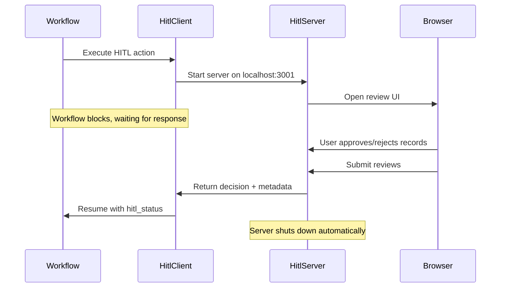

# Human-in-the-Loop (HITL) Review

Human-in-the-Loop (HITL) actions let you pause workflow execution for manual review and approval. This is essential when you need human judgment before proceeding—like reviewing AI-generated content, approving data transformations, or quality-checking critical outputs.

## Quick Start

Add a HITL action to your workflow:

```yaml
actions:
  - name: review_data
    kind: hitl  # Required: marks this as a human review action
    dependencies: [extract_data]
    intent: "Human reviews extracted data before processing"
    hitl:
      port: 3001  # Optional: port for review UI (default: 3001)
      instructions: "Review the extracted data for accuracy"
      timeout: 300  # Optional: seconds before timeout (default: 300)
      require_comment_on_reject: true  # Optional: require comment when rejecting
    observe:
      - extract_data.*  # Data to review
```

When the workflow reaches this action:
1. A browser UI opens at `http://localhost:3001`
2. Workflow pauses and waits for your decision
3. You review each record and approve/reject
4. After submitting, the workflow continues automatically

## How It Works

### Architecture

HITL actions use a **client-server architecture**:

- **HitlClient**: Validates config, starts server, blocks workflow execution
- **HitlServer**: Flask server serving the review UI at localhost
- **Browser UI**: Interactive approval interface with per-record navigation


```mermaid
sequenceDiagram
    participant W as Workflow
    participant C as HitlClient
    participant S as HitlServer
    participant B as Browser

    W->>C: Execute HITL action
    C->>S: Start server on localhost:3001
    S->>B: Open review UI
    Note over W,C: Workflow blocks, waiting for response
    B->>S: User approves/rejects records
    B->>S: Submit reviews
    S->>C: Return decision + metadata
    C->>W: Resume with hitl_status
    Note over S: Server shuts down automatically
```

### Review UI Features

The browser UI provides:

- **Per-record navigation**: Review each record individually with auto-advance
- **Keyboard shortcuts**:
  - `A` - Approve current record
  - `R` - Reject current record
  - `←/→` - Navigate between records
- **View toggles**:
  - **Fields view**: Structured display of record fields
  - **JSON view**: Raw JSON for debugging
- **Progress tracking**: Visual progress bar and stats (pending/approved/rejected)
- **State persistence**: Refresh the page without losing your reviews
- **Auto-shutdown**: Server closes automatically after submission

## Configuration

### HITL Config Block

```yaml
hitl:
  port: 3001                        # Port for review server (1024-65535)
  instructions: "Review carefully"  # Instructions shown in UI (required)
  timeout: 300                      # Seconds before auto-timeout (30-3600)
  require_comment_on_reject: true   # Require comment when rejecting
```

**Configuration options:**

| Field | Type | Default | Description |
|-------|------|---------|-------------|
| `port` | int | 3001 | Server port (1024-65535). If busy, tries up to 5 consecutive ports. |
| `instructions` | str | *(required)* | Instructions displayed in review UI. Be clear and specific. |
| `timeout` | int | 300 | Seconds before timeout. Server shuts down and workflow continues with `hitl_status: timeout`. |
| `require_comment_on_reject` | bool | true | If true, rejecting a record requires a comment explaining why. |

### Granularity Modes

HITL actions support two granularity modes:

#### Record Mode (Default)

Each record is reviewed individually and gets its own decision:

```yaml
- name: review_each_record
  kind: hitl
  granularity: record  # Optional: this is the default
  dependencies: [extract_data]
  hitl:
    instructions: "Approve or reject each record"
  observe:
    - extract_data.*
```

**Output**: Each input record gets `hitl_status`, `user_comment`, and `timestamp` fields added.

```json
[
  {
    "id": 1,
    "name": "Alice",
    "hitl_status": "approved",
    "user_comment": "Looks good",
    "timestamp": "2026-02-12T10:00:00Z"
  },
  {
    "id": 2,
    "name": "Bob",
    "hitl_status": "rejected",
    "user_comment": "Invalid email",
    "timestamp": "2026-02-12T10:01:00Z"
  }
]
```

#### FILE Mode

Review the entire dataset once and apply a single decision to all records:

```yaml
- name: review_entire_file
  kind: hitl
  granularity: file  # Review all records, make one decision
  dependencies: [extract_data]
  hitl:
    instructions: "Review the full dataset and approve or reject"
  observe:
    - extract_data.*
```

**Output**: Each record gets the **file-level decision**, but you can still provide per-record feedback in the UI if needed. The `hitl_status` applies to all records, but individual records can have their own `user_comment`.

```json
[
  {
    "id": 1,
    "name": "Alice",
    "hitl_status": "approved",  // File-level decision
    "user_comment": "",
    "timestamp": "2026-02-12T10:00:00Z"
  },
  {
    "id": 2,
    "name": "Bob",
    "hitl_status": "approved",  // Same decision for all
    "user_comment": "Check this one later",  // But can have per-record notes
    "timestamp": "2026-02-12T10:00:00Z"
  }
]
```

:::tip When to use FILE mode
Use FILE mode when you need to approve/reject an entire batch (e.g., "this dataset is ready for processing" vs "this dataset needs work"). The UI still shows records one-by-one for inspection, but the final decision applies to all.
:::

## Output Schema

HITL actions return decisions in a standardized format:

### Response Fields

| Field | Type | Description |
|-------|------|-------------|
| `hitl_status` | str | `"approved"`, `"rejected"`, or `"timeout"` |
| `user_comment` | str | Optional comment from reviewer |
| `timestamp` | str | ISO-8601 timestamp (UTC) when review was submitted |
| `record_reviews` | list | (FILE mode only) Per-record decisions |

### Accessing HITL Decisions Downstream

Reference HITL decisions in downstream actions:

```yaml
- name: process_approved_data
  dependencies: [review_data]
  guard:
    condition: "review_data.hitl_status == 'approved'"
    behavior: skip  # Skip if HITL rejected
  prompt: |
    Process the approved data:
    {{ review_data.* }}

    Reviewer comment: {{ review_data.user_comment }}
```

**Common guard patterns:**

```yaml
# Skip downstream if rejected
guard:
  condition: "review_data.hitl_status == 'approved'"
  behavior: skip

# Fail workflow if rejected
guard:
  condition: "review_data.hitl_status == 'rejected'"
  behavior: error
  error_message: "Human reviewer rejected the data"

# Handle timeout
guard:
  condition: "review_data.hitl_status != 'timeout'"
  behavior: skip
```

## Usage Patterns

### Pattern 1: Quality Gate

Approve AI-generated content before using it:

```yaml
actions:
  - name: generate_summary
    intent: "LLM generates article summary"
    prompt: "Summarize this article..."

  - name: review_summary
    kind: hitl
    dependencies: [generate_summary]
    intent: "Human reviews AI summary"
    hitl:
      instructions: "Review the generated summary for accuracy and tone"
    observe:
      - generate_summary.summary

  - name: publish_summary
    dependencies: [review_summary]
    intent: "Publish approved summary"
    guard:
      condition: "review_summary.hitl_status == 'approved'"
      behavior: skip
    prompt: "Publish the summary..."
```

### Pattern 2: Batch Approval

Review and filter a dataset before processing:

```yaml
actions:
  - name: extract_candidates
    intent: "Extract potential matches from data"

  - name: review_candidates
    kind: hitl
    granularity: record  # Review each candidate individually
    dependencies: [extract_candidates]
    hitl:
      instructions: "Approve valid candidates, reject false positives"
      require_comment_on_reject: true
    observe:
      - extract_candidates.*

  - name: process_approved_only
    dependencies: [review_candidates]
    intent: "Process only approved candidates"
    # Downstream can filter: {{ review_candidates | filter(hitl_status='approved') }}
```

### Pattern 3: Checkpoint Review

Pause between workflow stages for manual inspection:

```yaml
actions:
  - name: stage_1_transformation
    intent: "Initial data transformation"

  - name: checkpoint_review
    kind: hitl
    granularity: file  # One decision for entire stage
    dependencies: [stage_1_transformation]
    hitl:
      instructions: "Verify stage 1 output before continuing to stage 2"
    observe:
      - stage_1_transformation.*

  - name: stage_2_enrichment
    dependencies: [checkpoint_review]
    guard:
      condition: "checkpoint_review.hitl_status == 'approved'"
      behavior: error  # Fail workflow if stage 1 was rejected
```

## Debugging & Troubleshooting

### Check Server Logs

HITL logs appear in workflow output:

```
13:45:32 | Action 'review_data': Starting HITL server...
13:45:32 | 🔍 APPROVAL REQUIRED
13:45:32 | ============================================================
13:45:32 | Open this URL in your browser:
13:45:32 |   http://localhost:3001
13:45:32 | ============================================================
```

### Browser Console Debugging

Open DevTools (F12) → Console to see:

```javascript
// When saving a decision:
Persisted decision for record 0: approved

// When refreshing (state restoration):
Loaded review state from server: {record_count: 3, record_reviews: [...]}
Restored 2 of 3 reviews from server

// If restoration fails:
Failed to restore review state: <error details>
```

### State Refresh Issue

If refreshing the page shows all records as "pending":

1. **Check browser console** for errors
2. **Check server logs** for `/api/review-state` requests
3. **Verify persistence** by checking if decisions were saved:
   - Approve a record
   - Check console: `Persisted decision for record 0: approved`
   - Refresh page
   - Check console: `Restored 1 of 3 reviews from server`

If state isn't restoring, the console will show the error.

### Port Conflicts

If the configured port is busy:

```
WARNING: Port 3001 in use, using 3002 instead
```

HITL tries up to 5 consecutive ports. If all are busy:

```
NetworkError: Could not find available port near 3001
Attempted ports: [3001, 3002, 3003, 3004, 3005]
```

**Fix**: Close unused servers or configure a different port range.

### Timeout Handling

If the review isn't completed within the timeout:

```yaml
hitl:
  timeout: 300  # 5 minutes
```

After timeout:
- Server shuts down
- Workflow continues with `hitl_status: "timeout"`
- Downstream guards can handle this:

```yaml
guard:
  condition: "review_data.hitl_status != 'timeout'"
  behavior: error
  error_message: "Review timed out - manual intervention required"
```

## Advanced Topics

### Custom Ports

Configure port at workflow level to avoid conflicts:

```yaml
actions:
  - name: review_stage_1
    kind: hitl
    hitl:
      port: 3001  # First review

  - name: review_stage_2
    kind: hitl
    hitl:
      port: 3002  # Second review (different port)
```

### Workflow Continuation

After clicking "Submit Reviews":

1. ✅ **Server shuts down automatically** (1.5s delay)
2. ✅ **Browser tab attempts to close** (may not work due to browser security)
3. ✅ **Workflow continues immediately** (doesn't wait for browser)
4. Message shown: "✅ Complete! Workflow is continuing. You can close this tab now."

The workflow continues as soon as you submit, even if the browser tab stays open.

### Security Notes

- ✅ Server binds to `127.0.0.1` (localhost only, no network exposure)
- ✅ No authentication required (local-only access)
- ✅ No CSRF protection needed (not exposed to public network)
- ✅ HTML escaping prevents XSS
- ⚠️ Not suitable for remote or multi-user reviews (use webhooks instead)

### Testing HITL Actions

For automated testing, mock the HITL decision:

```python
from agent_actions.llm.providers.hitl.client import HitlClient

def test_workflow_with_hitl(monkeypatch):
    # Mock HITL to auto-approve
    def mock_invoke(self, context, config):
        return {
            "hitl_status": "approved",
            "user_comment": "Auto-approved for testing",
            "timestamp": "2026-02-12T10:00:00Z"
        }

    monkeypatch.setattr(HitlClient, "invoke", mock_invoke)

    # Run workflow - HITL will auto-approve
    result = run_workflow("workflow.yml")
    assert result.success
```

## See Also

- [Design Patterns](./design-patterns.md) - Workflow orchestration patterns
- [Context Scope](../reference/context/context-scope.md) - Control data flow with observe/drop/passthrough
- [Key Concepts](../tutorials/concepts.md) - Understanding actions, dependencies, and conditional execution
