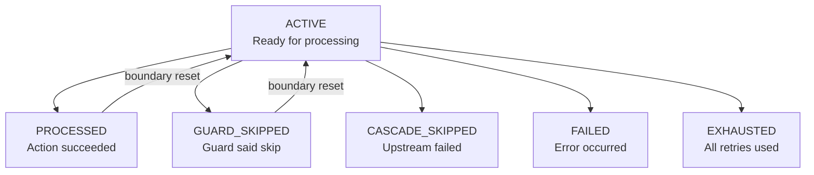

# Record Lifecycle

A record enters your agentic workflow as raw input. It exits carrying the accumulated output of every action that touched it, a full state history, and metadata about every retry, skip, and failure along the way.

This guide explains how that works — from the state machine that governs each record, to the audit trail that makes every decision traceable.

## The Record Envelope

When Agent Actions reads your input data, it wraps each item in a **record envelope**:

```json
{
  "source_guid": "a3f7c291-8d1c-5f83-be54-2b9ef2a548bb",
  "content": {},
  "_state": "active",
  "_state_schema_version": 1,
  "_state_history": []
}
```

The `content` dict is empty — it will grow as each action adds its output under a namespace key. The `_state` is `active`, meaning the record is ready to be processed. The `_state_history` will accumulate every transition the record goes through.

## The State Machine

Every record has a `_state` field governed by a finite state machine. There are 6 possible states:



Three categories:

| Category | States | Behavior |
|----------|--------|----------|
| **Processable** | `active` | Ready for the next action |
| **Resettable** | `processed`, `guard_skipped` | Reset to `active` at the next action boundary |
| **Terminal** | `cascade_skipped`, `failed`, `exhausted` | Record stops flowing. No further actions process it. |

## How Records Flow Through Actions

Consider what happens when a record passes through three actions:

```yaml
actions:
  - name: classify_ticket
  - name: extract_entities
  - name: draft_response
```

### Step 1: First action processes the record

The executor sends the record to `classify_ticket`. The LLM returns structured output. The framework wraps it under the action's namespace and transitions the state:

```json
{
  "content": {
    "classify_ticket": { "category": "billing", "urgency": "high" }
  },
  "_state": "processed",
  "_state_history": [
    { "action": "classify_ticket", "from": "active", "to": "processed", "reason": "success" }
  ]
}
```

### Step 2: Boundary reset

Before the next action runs, the executor resets `processed` back to `active`:

```json
{
  "_state": "active",
  "_state_history": [
    { "action": "classify_ticket", "from": "active", "to": "processed", "reason": "success" },
    { "action": "classify_ticket", "from": "processed", "to": "active", "reason": "downstream_reset" }
  ]
}
```

### Step 3: Next action adds its output

`extract_entities` runs. Its output goes under its own namespace. The `content` dict grows:

```json
{
  "content": {
    "classify_ticket": { "category": "billing", "urgency": "high" },
    "extract_entities": { "amount": 299.00, "subscription": "premium" }
  },
  "_state": "processed",
  "_state_history": [
    { "action": "classify_ticket", "from": "active", "to": "processed", "reason": "success" },
    { "action": "classify_ticket", "from": "processed", "to": "active", "reason": "downstream_reset" },
    { "action": "extract_entities", "from": "active", "to": "processed", "reason": "success" }
  ]
}
```

Each action adds to the record. Nothing gets overwritten. The history grows. The content accumulates.

## Guard Skips

When a guard condition evaluates to false, the action doesn't run. The record transitions to `guard_skipped`:

```yaml
- name: rewrite_response
  guard:
    condition: "review_response.pass == false"
    on_false: skip
```

If the review passed, `rewrite_response` is skipped:

```json
{
  "_state": "guard_skipped",
  "_state_history": [
    ...previous entries...,
    { "action": "rewrite_response", "from": "active", "to": "guard_skipped", "reason": "guard_skip" }
  ]
}
```

Here's the part that people don't expect: **a skipped record is still a live record**. It resets to `active` at the next boundary and continues downstream with all its data intact. The skip means "this action had nothing to do," not "this record is done."

## Terminal States: When a Record Stops

Three states are terminal — the record stops flowing:

### `failed`

An action hit an unrecoverable error. The record won't be processed by downstream actions.

### `cascade_skipped`

An upstream action failed or was exhausted. Rather than attempt processing with incomplete data, the framework cascade-skips all downstream actions for this record. No wasted LLM calls.

### `exhausted`

The action retried multiple times and never succeeded. The record carries the best-effort result (if `on_exhausted: return_last`) or empty content.

When the executor encounters a terminal record at an action boundary, it propagates `cascade_skipped` downstream instead of resetting to `active`:

```json
{
  "_state": "cascade_skipped",
  "_state_history": [
    { "action": "classify_ticket", "from": "active", "to": "processed", "reason": "success" },
    { "action": "draft_response", "from": "active", "to": "failed", "reason": "parse_error" },
    { "action": "review_response", "from": "active", "to": "cascade_skipped", "reason": "upstream draft_response failed" },
    { "action": "send_response", "from": "active", "to": "cascade_skipped", "reason": "upstream draft_response failed" }
  ]
}
```

You can read this history and see exactly where it broke and what was skipped as a result.

## The Single Transition Function

All state changes go through one function:

```python
RecordEnvelope.transition(record, new_state, action_name, reason)
```

This function:
1. Validates the transition is legal (you can't go from `failed` to `processed`)
2. Sets `_state` to the new value
3. Appends to `_state_history` with timestamp, action name, from/to states, and reason
4. Sets `_state_schema_version` so readers can detect stale records

No other code path can modify `_state` or `_state_history`. This single-mutator design prevents the inconsistencies that arise when multiple code paths set state independently.

## The Audit Trail: `_state_history`

Every record carries its complete transition history in `_state_history`. Each entry contains:

| Field | Description |
|-------|-------------|
| `timestamp` | ISO 8601 timestamp of the transition |
| `action` | Which action triggered the transition |
| `from` | Previous state (or `null` for the first transition) |
| `to` | New state |
| `reason` | Why the transition happened (`success`, `guard_skip`, `downstream_reset`, etc.) |
| `detail` | Optional additional context |

The history is capped at 64 entries (`STATE_HISTORY_CAP` in `agent_actions/record/envelope.py`) to bound memory usage. Because each action contributes 2–4 transitions per record (downstream-reset to `active` plus a final state, plus one entry per retry), workflows with roughly 16 or more actions can start seeing older entries dropped. The framework emits an INFO log the first time truncation fires for each action in a process:

```
_state_history capped at 64 entries; dropped N oldest transition(s) for action='<name>'.
```

If you see this line, the record's oldest transitions have already been lost for that action. Subsequent truncations for the same action are silent by design (one log per action per process, so the diagnostic doesn't become per-record spam).

:::tip
You can filter records by their history to answer questions like "which records were guard-skipped at action X?" or "which records required retries?" — without needing separate log aggregation.
:::

### Failure Forensics: `input_snapshot`

When a record reaches a terminal failure state (`failed` or `exhausted`) through the result collection pipeline, the disposition store captures the input record at the moment of failure in the `input_snapshot` column of `record_disposition`. This covers online, batch, and file-tool processing paths. The snapshot preserves the data that was being processed when the failure occurred — even after batch context maps and temporary recovery files have been cleaned up.

The snapshot is serialized as JSON and truncated to 10KB by the storage backend. To inspect it, query the store database directly:

```sql
SELECT action_name, record_id, reason, input_snapshot
FROM record_disposition
WHERE disposition IN ('failed', 'exhausted') AND input_snapshot IS NOT NULL;
```

## Field Categories

The record envelope manages three categories of framework fields:

| Category | Fields | Behavior |
|----------|--------|----------|
| **Tracking** | `source_guid`, `version_correlation_id` | Set once at record creation. Stable identity that never changes. |
| **Lifecycle** | `_state_history`, `_state_schema_version` | Cumulative — carried forward and appended to across all actions. |
| **Stage** | `_state`, `target_id`, `metadata`, `content`, `lineage`, `node_id`, etc. | Rebuilt per action. Not carried forward — enrichers set these fresh at each stage. |

All three categories are considered **framework fields** and are excluded from user-visible content. Your action outputs live under `content.{action_name}` — framework fields never leak into that namespace.

## A Complete Record

A record that finishes a 7-action agentic workflow looks like this:

```json
{
  "source_guid": "a3f7c291-8d1c-5f83-be54-2b9ef2a548bb",
  "version_correlation_id": "corr_efe50c6190398e05",
  "target_id": "56901d5d-c411-436a-be5a-4ca6d7a3487d",
  "content": {
    "classify_ticket": { "category": "billing", "urgency": "high" },
    "extract_entities": { "amount": 299.00, "subscription": "premium" },
    "search_kb": { "articles": ["KB-201"], "confidence": 0.92 },
    "draft_response": { "text": "Dear Sarah, ...", "tone": "empathetic" },
    "review_response": { "pass": true, "compliance_ok": true },
    "route_decision": { "action": "auto_send" },
    "send_response": { "sent": true, "channel": "email" }
  },
  "_state": "processed",
  "_state_schema_version": 1,
  "_state_history": [
    { "timestamp": "2024-01-18T09:14:02Z", "action": "classify_ticket", "from": null, "to": "processed", "reason": "success", "detail": null },
    { "timestamp": "2024-01-18T09:14:02Z", "action": "classify_ticket", "from": "processed", "to": "active", "reason": "downstream_reset", "detail": null },
    { "timestamp": "2024-01-18T09:14:04Z", "action": "extract_entities", "from": "active", "to": "processed", "reason": "success", "detail": null },
    { "timestamp": "2024-01-18T09:14:04Z", "action": "extract_entities", "from": "processed", "to": "active", "reason": "downstream_reset", "detail": null },
    { "timestamp": "2024-01-18T09:14:05Z", "action": "search_kb", "from": "active", "to": "processed", "reason": "success", "detail": null },
    { "timestamp": "2024-01-18T09:14:05Z", "action": "search_kb", "from": "processed", "to": "active", "reason": "downstream_reset", "detail": null },
    { "timestamp": "2024-01-18T09:16:30Z", "action": "draft_response", "from": "active", "to": "processed", "reason": "success", "detail": null },
    { "timestamp": "2024-01-18T09:16:30Z", "action": "draft_response", "from": "processed", "to": "active", "reason": "downstream_reset", "detail": null },
    { "timestamp": "2024-01-18T09:18:15Z", "action": "review_response", "from": "active", "to": "processed", "reason": "success", "detail": null },
    { "timestamp": "2024-01-18T09:18:15Z", "action": "review_response", "from": "processed", "to": "active", "reason": "downstream_reset", "detail": null },
    { "timestamp": "2024-01-18T09:18:15Z", "action": "route_decision", "from": "active", "to": "processed", "reason": "success", "detail": null },
    { "timestamp": "2024-01-18T09:18:15Z", "action": "route_decision", "from": "processed", "to": "active", "reason": "downstream_reset", "detail": null },
    { "timestamp": "2024-01-18T09:18:16Z", "action": "send_response", "from": "active", "to": "processed", "reason": "success", "detail": null }
  ],
  "metadata": { "model": "gpt-4o-mini", "provider": "openai" },
  "node_id": "send_response_d38daf8b-...",
  "lineage": ["send_response_d38daf8b-..."]
}
```

One dict. Seven namespaces in `content`. Thirteen entries in `_state_history`. You can answer any question about this record — what happened, in what order, what each action produced — by reading this single object.

## Batch Mode: Across Process Boundaries

In online mode, the record lives in memory for the entire run. In batch mode, the record crosses process boundaries — it's persisted to SQLite after each action. A new process polls for results and picks up where the previous one left off.

The record survives this because `_state_history` spans both processes. The `source_guid` ties everything together. From the record's perspective, it doesn't matter how many processes touched it or how much time passed between actions.

## See Also

- [Data Lineage](../reference/data-io/data-lineage.md) — how `target_id`, `parent_target_id`, and `root_target_id` track ancestry
- [Guards](../reference/execution/guards.md) — conditional execution and guard skip behavior
- [Batch Recovery](../reference/execution/batch-recovery.md) — retry and repair mechanics
- [Prompt Traces](../reference/data-io/prompt-traces.md) — LLM request/response observability per record
