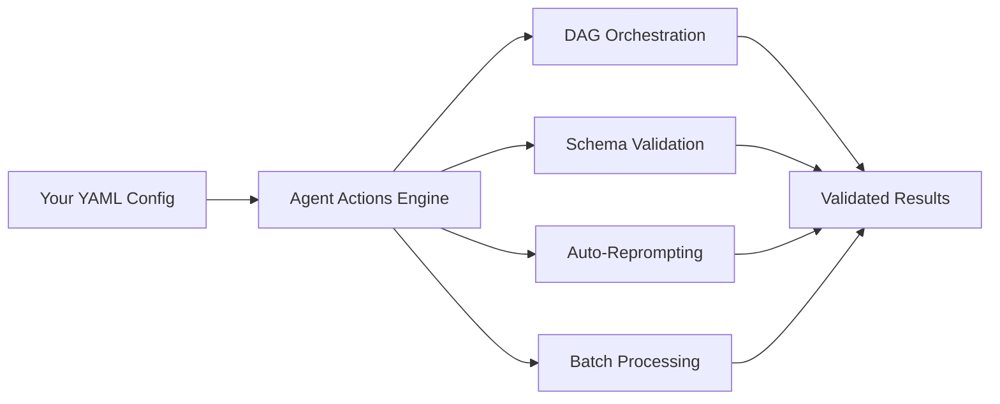

# Agent Actions

Build production-ready agentic workflows with declarative YAML. No framework boilerplate, no custom Python classes—just configuration that works.

```yaml
actions:
  - name: extract_facts
    model_vendor: openai
    prompt: "Extract key facts from: {{ source.content }}"
    schema: facts_schema

  - name: generate_summary
    dependencies: extract_facts  # Input source
    prompt: "Summarize: {{ extract_facts.facts }}"
```

```bash
pip install agent-actions
agac run -a my_workflow
```

## Why Agent Actions?

**What happens when you need to chain multiple LLM calls together?** You quickly discover that reliable AI pipelines require DAG orchestration, schema validation, error recovery, multi-provider support, and batch processing. That's a lot of infrastructure code before you even get to your actual logic.

Think of Agent Actions like a railway system for your LLM calls. You define the stations (actions) and the tracks between them (dependencies), and Agent Actions handles the scheduling, safety checks, and rerouting when things go wrong. You focus on what each station should do—not on building the railway.

Consider what happens when your agentic workflow runs:



The engine reads your YAML configuration and coordinates four key systems: it orders your actions as a DAG (directed acyclic graph), validates every output against your schemas, automatically reprompts when outputs don't conform, and batches requests for cost efficiency.

## Key Features

### Declarative Agentic Workflows
Define your entire agentic workflow in YAML with Jinja templating. Actions declare dependencies, and the DAG executes automatically.

### Schema Validation
Every action output is validated against JSON Schema. Invalid outputs trigger automatic reprompting until they conform. Note that schema validation catches structural errors but cannot verify semantic correctness—a response might match your schema but still contain incorrect information.

### Multi-Provider Support
Chain OpenAI, Anthropic, Gemini, Groq, Mistral, and Ollama in the same agentic workflow. Switch models per-action or set defaults workflow-wide.

### Batch Processing
Run large agentic workflows asynchronously with vendor batch APIs. Up to 50% cost savings on compatible models. Batch mode works best for independent records—if your actions need to share state across records, use online mode instead.

### Custom Tools
Embed Python functions alongside LLM actions using `@udf_tool`. These are auto-discovered and referenced by name in your agentic workflow.

### Pre-flight Validation
**What if you could catch errors before spending money on API calls?** Agent Actions validates your configuration, checks for missing variables, and verifies dependency wiring before any LLM calls are made. This means typos and wiring errors surface immediately, not after processing thousands of records.

## Get Started

Let's explore what you can build. The links below take you from installation to running your first agentic workflow:

<div className="card-group">

**[Installation](./installation.md)**
Install the CLI and configure your environment.

**[Quickstart](./getting-started/)**
Build and run your first agentic workflow in 5 minutes.

**[CLI Reference](./cli-reference/)**
Complete command documentation.

**[Reference](./reference/)**
Deep dive into all features.

</div>
