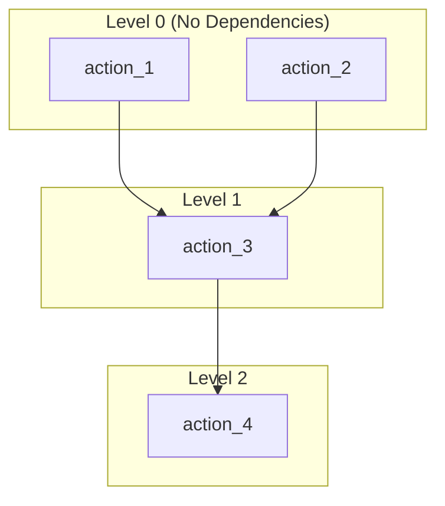
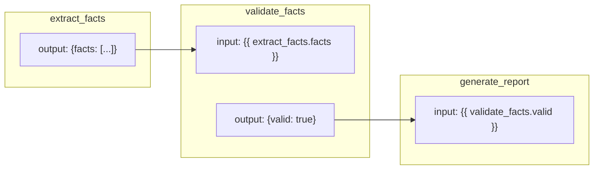
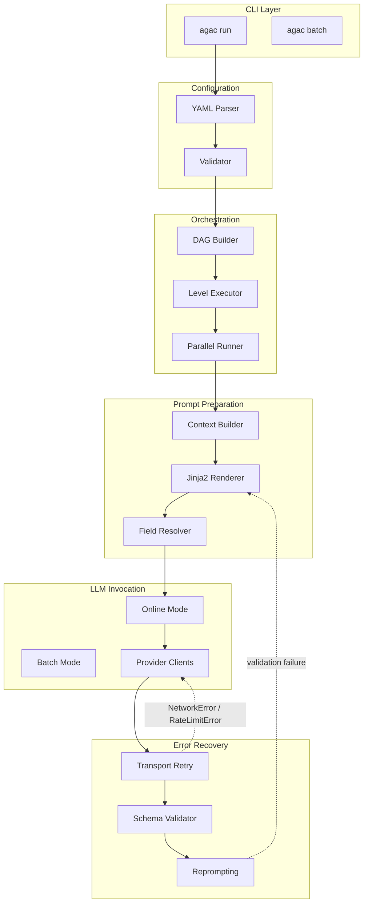

# Architecture

How does Agent Actions decide which actions run first? How does data flow from one action to the next? Understanding the architecture helps you design better agentic workflows and debug issues when they arise.

Agent Actions uses a **Directed Acyclic Graph (DAG)** execution model—think of it like a recipe where some steps can happen in parallel (chopping vegetables while water boils) but others must wait for dependencies (you can't strain pasta until it's cooked). This architecture enables parallel execution, deterministic ordering, and clear data flow.

## DAG Execution Model

Let's walk through how actions are organized for execution. The diagram below shows four actions grouped into levels:

Notice that `action_1` and `action_2` have no dependencies, so they can run in parallel. `action_3` waits for both to complete, and `action_4` waits for `action_3`.

Actions are organized into **levels** based on their dependencies:

| Level | Description | Execution |
|-------|-------------|-----------|
| Level 0 | Actions with no dependencies | Execute in parallel |
| Level 1 | Actions depending only on Level 0 | Execute after Level 0 completes |
| Level N | Actions depending on Levels 0..N-1 | Execute after all dependencies complete |

Actions within the same level execute **concurrently** up to the concurrency limit (default: 5, max: 50). This is a practical limitation to avoid overwhelming API rate limits.

## Data Flow

You might wonder: how does data get from one action to the next? Field references work like spreadsheet formulas—when you write `{{ extract_facts.facts }}`, you're pointing to a cell that will be filled in when that action completes.

Data flows through the DAG via **field references**:

The arrows show data dependencies. `validate_facts` can't run until `extract_facts` produces its output.

When an action references `{{ upstream_action.field }}`:

1. **Locate** - Find the output file from the upstream action
2. **Extract** - Parse JSON and extract the specified field
3. **Inject** - Make value available in prompt template

## Component Architecture

Here's how the pieces fit together. Each layer handles a specific concern:

Two recovery loops are visible here:
- **Transport retry** (Retry → Providers): same request resubmitted with exponential backoff when network errors or rate limits occur
- **Validation reprompt** (Reprompt → Template): prompt rebuilt with error feedback when schema validation fails

In batch mode, these run as two sequential phases after the batch completes. See [Batch Recovery](../execution/batch-recovery.md) for details.

## Execution Lifecycle

Let's walk through what happens when you run `agac run -a my_workflow`.

### 1. Configuration Loading

1. Parse `agent_actions.yml` (project config)
2. Parse agentic workflow YAML
3. Merge configuration hierarchy (project defaults -> agentic workflow defaults -> action)
4. Validate configuration

### 2. Pre-flight Validation

1. Check all field references resolve
2. Validate schema files exist
3. Verify vendor compatibility
4. Detect circular dependencies

### 3. DAG Construction

1. Build dependency graph from action `dependencies`
2. Compute execution levels
3. Validate DAG is acyclic

### 4. Execution

For each level:
1. Evaluate guards (skip/filter actions)
2. Prepare prompts (resolve field references, apply context scope)
3. Execute actions in parallel (up to concurrency limit)
4. Validate outputs against schemas
5. Reprompt on validation failure (if enabled)
6. Write outputs to target directory

### 5. Output

- JSON files per action per record in `target/`
- Lineage tracking via `source_guid` and `node_id`
- Passthrough fields merged from context scope

This lineage tracking is important: it lets you trace any output back through the actions that produced it, which is invaluable for debugging and auditing.

## See Also

- [Run Modes](../execution/run-modes.md) — Batch vs online execution
- [Batch Recovery](../execution/batch-recovery.md) — Two-phase recovery for batch processing
- [Granularity](../execution/granularity.md) — Record vs file processing
- [Data I/O](../data-io/) — Directory structure and file formats
- [Validation](../validation/) — Pre-flight and schema validation
