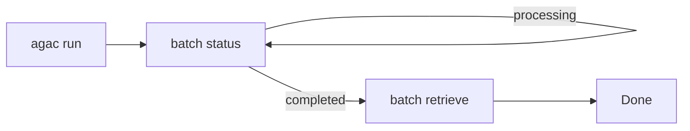

# batch Commands

When you need to process hundreds or thousands of records, running them one at a time is inefficient and expensive. Batch mode lets you submit all records at once for asynchronous processing—like sending a stack of forms to be processed overnight rather than waiting in line for each one.

## Submitting a Batch

To submit a batch, use the standard `run` command with a workflow configured for batch mode:

```yaml
# In your workflow config
defaults:
  run_mode: batch
```

```bash
agac run -a my_workflow
```

When `run_mode: batch` is set, Agent Actions submits the records asynchronously and returns a batch ID. Use the commands below to manage the batch lifecycle.

```bash
agac batch <subcommand> [options]
```

:::tip Run from Anywhere
You can run batch commands from any subdirectory within your project.
:::

## Subcommands

| Subcommand | Description |
|------------|-------------|
| `status` | Check batch job status |
| `retrieve` | Retrieve completed batch results |

Let's explore each command in detail.

## batch status

**How do you know when a batch job finishes?**

After submitting a batch, you can poll its status to see if it's still processing, completed successfully, or failed:

```bash
agac batch status --batch-id <id>
```

**Options:**
| Option | Description |
|--------|-------------|
| `--batch-id` | The ID of the batch job to check. If not provided, uses the last submitted job ID. |

**Example:**
```bash
$ agac batch status --batch-id batch_abc123
Batch job status: completed
```

If you don't provide a batch ID, Agent Actions uses the last submitted job - convenient when you're iterating on a single batch.

## batch retrieve

Once a batch completes, retrieve the results:

```bash
agac batch retrieve --batch-id <id>
```

**Options:**
| Option | Description |
|--------|-------------|
| `--batch-id` | The ID of the batch job to retrieve. If not provided, uses the last submitted job ID. |

**Example:**
```bash
agac batch retrieve --batch-id batch_abc123
```

Results are saved to your workflow's configured output directory as JSON files matching your output schema.

## Batch Agentic Workflow

The typical batch processing flow follows this pattern: run (submits batch), poll status, and retrieve.



:::warning Batch Limitations
Batch mode works best for independent records that don't need to share state. If your agentic workflow requires cross-record coordination (like aggregating results from multiple records), process the batch results in a separate step after retrieval.
:::

## See Also

- [run Command](./run) - Execute agentic workflows synchronously
- [Troubleshooting](./troubleshooting) - Debug batch issues
