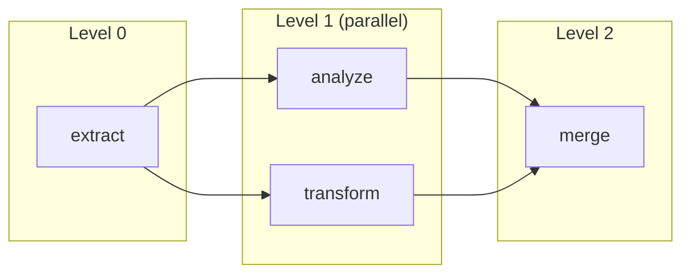

# run Command

The `run` command is your primary way to execute an agentic workflow. It handles dependency resolution, parallel execution, and tool discovery automatically.

```bash
agac run -a <workflow-name> [options]
```

:::tip Run from Anywhere
You can run this command from any subdirectory within your project. The CLI will automatically find your project root.
:::

## Basic Usage

Let's start with the essentials:

```bash
# Run an agentic workflow
agac run -a my_workflow

# Run with custom tools
agac run -a my_workflow -u ./user_code --use-tools

# Force parallel execution
agac run -a my_workflow --execution-mode parallel

# Run upstream dependencies first
agac run -a my_workflow --upstream

# Trigger downstream agentic workflows after completion
agac run -a my_workflow --downstream
```

## Options

| Option | Description |
|--------|-------------|
| `-a, --agent NAME` | Agentic workflow name (required) |
| `-u, --user-code DIRECTORY` | Path to user's code folder containing tools |
| `--use-tools` | Enable tool usage for actions |
| `-e, --execution-mode` | Execution mode: `auto` (default), `parallel`, or `sequential` |
| `--concurrency-limit` | Max concurrent actions (default: 5, range: 1-50) |
| `--upstream` | Execute upstream dependencies first |
| `--downstream` | Execute downstream agentic workflows after completion |

## Parallel Execution

Agent Actions automatically detects independent actions and runs them concurrently.

```bash
# Auto-detect parallel execution (default)
agac run -a my_workflow

# Force parallel execution
agac run -a my_workflow --execution-mode parallel
# Or using short form:
agac run -a my_workflow -e parallel

# Force sequential execution
agac run -a my_workflow --execution-mode sequential

# Limit concurrent actions to 10
agac run -a my_workflow -e parallel --concurrency-limit 10
```

The diagram below shows how Agent Actions organizes actions into levels. Actions at the same level run in parallel because they don't depend on each other's outputs:



Notice that `analyze` and `transform` both depend on `extract`, but not on each other - so they run concurrently. The `merge` action waits for both to complete.

:::info Concurrency Limits
The default concurrency limit is 5 actions. If your agentic workflow has many parallel actions and you're hitting rate limits, consider reducing this. If you have capacity, increase it up to 50.
:::

## Workflow Dependencies

Use `--upstream` and `--downstream` flags to execute dependency chains between workflows.

```bash
# Execute upstream dependencies first, then run this workflow
agac run -a consumer_workflow --upstream

# Run this workflow, then execute all downstream dependents
agac run -a producer_workflow --downstream

# Execute entire dependency chain
agac run -a middle_workflow --upstream --downstream
```

See **[Workflow Dependencies](../execution/workflow-dependencies)** for detailed diagrams and configuration examples.

## See Also

- **[Workflow Dependencies](../execution/workflow-dependencies)** - Chain workflows with upstream/downstream execution
- **[Tool Actions](../tools/)** - Creating custom tools with `@udf_tool`
- **[batch Commands](./batch)** - Process large datasets asynchronously
- **[schema Command](./schema)** - Analyze workflow structure and field dependencies
- **[inspect Commands](./inspect)** - Analyze context and data flow without running
