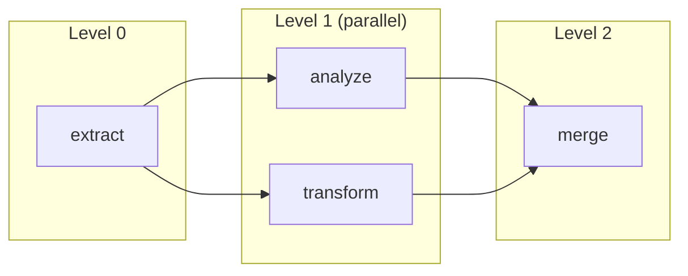

# run Command

The `run` command is your primary way to execute an agentic workflow. It handles dependency resolution, parallel execution, and tool discovery automatically.

```bash
agac run -a <workflow-name> [options]
```

:::tip Run from Anywhere
You can run this command from any subdirectory within your project. The CLI will automatically find your project root.
:::

## Basic Usage

Let's start with the essentials:

```bash
# Run an agentic workflow
agac run -a my_workflow

# Run with custom tools
agac run -a my_workflow -u ./user_code --use-tools

# Force parallel execution
agac run -a my_workflow --execution-mode parallel
```

## Options

| Option | Description |
|--------|-------------|
| `-a, --agent NAME` | Agentic workflow name (required) |
| `-u, --user-code DIRECTORY` | Path to user's code folder containing tools |
| `--use-tools` | Enable tool usage for actions |
| `-e, --execution-mode` | Execution mode: `auto` (default), `parallel`, or `sequential` |
| `--concurrency-limit` | Max concurrent actions (default: 5, range: 1-50) |
| `--record-limit N` | Cap each action at N records **per input file** — the same unit `record_limit` uses — whatever the workflow config sets. Applies to actions that set no limit of their own, and takes precedence over `AGAC_RECORD_LIMIT`. An action that actually drops records says so, naming this flag and the counts, since a truncated run otherwise looks complete |
| `--file-limit N` | Stop each action after N input files — the same unit `file_limit` uses — whatever the workflow config sets. It counts files the action got through, so a file that fails does not spend the budget and a directory of unreadable files is attempted in full. Applies to actions that set no limit of their own, and takes precedence over `AGAC_FILE_LIMIT`. An action whose walk actually stops says so, naming this flag, since a shortened run otherwise looks complete. Never holds back `agac retry` |
| `--fresh` | Clear stored results, dispositions, status, and event logs (`events.json`, `errors.json`) before execution. Gives a clean slate for debugging. |
| `--verify-keys` | Verify API keys before execution |

## Running a project smaller than it is

A workflow's limits live in the project's config, per action. To run it cheaply from
outside — a smoke check, a quick pass over a real dataset, one action under a debugger —
bound the whole run from the command line:

```bash
agac run -a my_workflow --record-limit 2 --file-limit 1
```

The bound applies to **every** action, including those that configure no limit of their own,
which matters more than it sounds: a workflow that fans out across dozens of actions with repair
loops turns a small configured limit into a very large number of model calls.

The two flags bound different axes, and a run is proportional to both. `--record-limit` counts
**per input file**, the same unit [`record_limit`](../configuration/defaults) uses — so a staging
directory holding five files and `--record-limit 2` processes up to ten records per action, not
two. `--file-limit` bounds the walk itself, so `--file-limit 1` reaches one of those five files
whatever the record limit is.

Each action that actually drops records logs a line naming the flag and the counts, and each
action whose walk actually stops logs one naming the flag that stopped it; an action smaller than
its limit stays quiet. `AGAC_RECORD_LIMIT` and `AGAC_FILE_LIMIT` do the same job from the
environment; when both doors are used the flag wins, because it was typed for this run. A value
that cannot bound anything fails the run rather than being ignored, and fails it before any
action starts.

Either way the limits in force are stored with the action, so lifting one re-runs what it held
back instead of serving a short run as a finished one. Changing `--record-limit` to another value
re-runs the action when the new limit could have held something back; raising it above what an
untruncated run already processed changes nothing, because a limit that cannot bite is not a
different amount of work. `--file-limit` has no such count behind it, so any change to it re-runs
the action, including a change to a value larger than the number of staged files. A batch action stores what the run that *submitted* it applied, not
what the later run that collects it was asked for.

The two limits leave different traces. `--record-limit` rewrites every file it walks, so the
surplus records are dropped and what remains is that limit's work. `--file-limit` bounds which
files are opened at all, and a file it does not reach keeps the output the previous run wrote
there — the point of not walking it. So a bounded run over a project that has already been run is
not a fresh smaller copy of it: it is the earlier output with the walked files replaced. That is
usually what you want for a quick pass, and it is not what you want if the workflow's prompts or
schema also changed, since the files outside the walk keep their older answers while the action
reads as complete. Pass `--fresh` when the whole output has to come from one version.

Neither flag holds back [`agac retry`](./retry): a repair walks every file holding a record it
named. Stopping short of one would leave that record's cleared disposition unwritten, which is
the erasure a limit exists to avoid.


## Parallel Execution

Agent Actions automatically detects independent actions and runs them concurrently.

```bash
# Auto-detect parallel execution (default)
agac run -a my_workflow

# Force parallel execution
agac run -a my_workflow --execution-mode parallel
# Or using short form:
agac run -a my_workflow -e parallel

# Force sequential execution
agac run -a my_workflow --execution-mode sequential

# Limit concurrent actions to 10
agac run -a my_workflow -e parallel --concurrency-limit 10
```

The diagram below shows how Agent Actions organizes actions into levels. Actions at the same level run in parallel because they don't depend on each other's outputs:


```mermaid
graph LR
    subgraph "Level 0"
        A[extract]
    end
    subgraph "Level 1 (parallel)"
        B[analyze]
        C[transform]
    end
    subgraph "Level 2"
        D[merge]
    end
    A --> B
    A --> C
    B --> D
    C --> D
```

Notice that `analyze` and `transform` both depend on `extract`, but not on each other - so they run concurrently. The `merge` action waits for both to complete.

:::info Concurrency Limits
The default concurrency limit is 5 actions. If your agentic workflow has many parallel actions and you're hitting rate limits, consider reducing this. If you have capacity, increase it up to 50.
:::

## See Also

- **[Tool Actions](../tools/)** - Creating custom tools with `@udf_tool`
- **[batch Commands](./batch)** - Process large datasets asynchronously
- **[schema Command](./schema)** - Analyze workflow structure and field dependencies
- **[inspect Commands](./inspect)** - Analyze context and data flow without running
