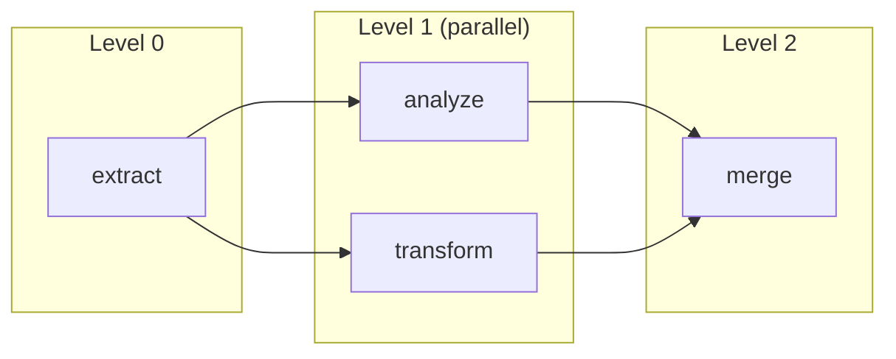

# run Command

The `run` command is your primary way to execute an agentic workflow. It handles dependency resolution, parallel execution, and tool discovery automatically.

```bash
agac run -a <workflow-name> [options]
```

:::tip Run from Anywhere
You can run this command from any subdirectory within your project. The CLI will automatically find your project root.
:::

## Basic Usage

Let's start with the essentials:

```bash
# Run an agentic workflow
agac run -a my_workflow

# Run with custom tools
agac run -a my_workflow -u ./user_code --use-tools

# Force parallel execution
agac run -a my_workflow --execution-mode parallel
```

## Options

| Option | Description |
|--------|-------------|
| `-a, --agent NAME` | Agentic workflow name (required) |
| `-u, --user-code DIRECTORY` | Path to user's code folder containing tools |
| `--use-tools` | Enable tool usage for actions |
| `-e, --execution-mode` | Execution mode: `auto` (default), `parallel`, or `sequential` |
| `--concurrency-limit` | Max concurrent actions (default: 5, range: 1-50) |
| `--record-limit N` | Cap each action at N records **per input file** — the same unit `record_limit` uses — whatever the workflow config sets. Applies to actions that set no limit of their own, and takes precedence over `AGAC_RECORD_LIMIT`. An action that actually drops records says so, naming this flag and the counts, since a truncated run otherwise looks complete |
| `--fresh` | Clear stored results, dispositions, status, and event logs (`events.json`, `errors.json`) before execution. Gives a clean slate for debugging. |
| `--verify-keys` | Verify API keys before execution |

## Running a project smaller than it is

A workflow's record limits live in the project's config, per action. To run it cheaply from
outside — a smoke check, a quick pass over a real dataset, one action under a debugger —
cap the whole run from the command line:

```bash
agac run -a my_workflow --record-limit 2
```

The cap applies to **every** action, including those that configure no `record_limit`, which
matters more than it sounds: a workflow that fans out across dozens of actions with repair
loops turns a small configured limit into a very large number of model calls.

It counts **per input file**, the same unit [`record_limit`](../configuration/defaults) uses —
so a staging directory holding five files and `--record-limit 2` processes up to ten records per
action, not two. Stage fewer files if you need a harder ceiling.

Each action that actually drops records logs a line naming the flag and the counts; an action
with fewer records than the limit stays quiet. `AGAC_RECORD_LIMIT` does the same job from the
environment; when both are set the flag wins, because it was typed for this run. Either way the
limit in force is stored with the action, so lifting it re-runs what it truncated instead of
serving a short run as a finished one. Changing it to any other value re-runs the action too,
including to one larger than the input — the stored limit records what was set, not whether it
dropped anything.


## Parallel Execution

Agent Actions automatically detects independent actions and runs them concurrently.

```bash
# Auto-detect parallel execution (default)
agac run -a my_workflow

# Force parallel execution
agac run -a my_workflow --execution-mode parallel
# Or using short form:
agac run -a my_workflow -e parallel

# Force sequential execution
agac run -a my_workflow --execution-mode sequential

# Limit concurrent actions to 10
agac run -a my_workflow -e parallel --concurrency-limit 10
```

The diagram below shows how Agent Actions organizes actions into levels. Actions at the same level run in parallel because they don't depend on each other's outputs:


```mermaid
graph LR
    subgraph "Level 0"
        A[extract]
    end
    subgraph "Level 1 (parallel)"
        B[analyze]
        C[transform]
    end
    subgraph "Level 2"
        D[merge]
    end
    A --> B
    A --> C
    B --> D
    C --> D
```

Notice that `analyze` and `transform` both depend on `extract`, but not on each other - so they run concurrently. The `merge` action waits for both to complete.

:::info Concurrency Limits
The default concurrency limit is 5 actions. If your agentic workflow has many parallel actions and you're hitting rate limits, consider reducing this. If you have capacity, increase it up to 50.
:::

## See Also

- **[Tool Actions](../tools/)** - Creating custom tools with `@udf_tool`
- **[batch Commands](./batch)** - Process large datasets asynchronously
- **[schema Command](./schema)** - Analyze workflow structure and field dependencies
- **[inspect Commands](./inspect)** - Analyze context and data flow without running
